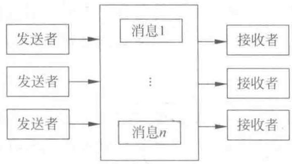
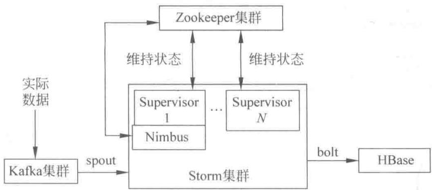

# 第1章

# 分布式实时计算系统

## 1.1 分布式的概念

Internet 是由各种不同类型、不同地区、不同领域的网络构成的互联网，然而互联网并没有集中式的控制中心，而是由大量分离且互联的节点组成的。这是一个分散式的模型。

## 1.1.1 分布式系统

分布式概念是在网络这个大前提下诞生的。传统的计算是集中式的计算，使用计算能力强大的服务器处理大量的计算任务，但这种超级计算机的建造和维护成本极高，且明显存在很大的瓶颈。与之相对，如果一套系统可以将需要海量计算能力才能处理的问题拆分成许多小块，然后将这些小块分配给同一套系统中不同的计算节点进行处理，最后可以将分开计算的结果合并得到最终结果，这种系统称为分布式系统。对这种系统来说，可以采用多种方式在不同节点之间进行数据通信和协调，而网络消息则是常用手段之一。

## 1.1.2 分布式计算

分布式系统中的计算,就是将一个复杂庞大的计算任务适当划分为一个个小任务,将这些小任务分配到不同的计算节点上,每个计算节点只需要完成自己的计算任务即可,可以有效分担海量的计算任务。每个计算节点也可以并行处理自身的任务,更加充分利用机器的CPU资源。最后想方设法将每个节点计算结果汇总,得到最终的计算结果。

分布式计算中的一个难点是节点之间如何高效通信。虽然在划分计算任务时，计算任务最好确保互不相干，这样每个节点可以独立运行。但大多数时节点之间还是需要互相通信，如获取对方的计算结果等。一般有两种解决方案：一种是利用消息队列，将节点之间的依赖变成节点之间的消息传递；第二种是利用分布式存储系统，将节点的执行结果暂时存放在数据库中，其他节点等待或从数据库中获取数据。无论哪种方式，只要符合实际需求都是可行的。

## 1.2 分布式通信

## 1.2.1 分布式通信基础

分布式系统中两个相邻机器节点之间的可靠数据传输的实现不易,因为原始的物理链路仅由传输介质和设备组成,数据在两个设备之间传输时随时可能因为外界原因而丢失或发生变化,直接使用物理链路无法确保数据在相邻节点之间的可靠传输。因此,采用在数据链路中将数据划分为一个个分组,将每个分组称为“帧”。帧是数据链路层的数据基本传输单位。这样一来,每条物理链路都可以按照分时原则传输不同数据链路的数据分组,实现物理链路的复用。然而,目标节点如何识别出帧的起始与结束位置呢?这就是所谓的帧同步问题。

常见的帧同步方法有字节计数法、字符填充的首尾定界法、比特填充的首尾定界法及违法编码法。目前常见的是比特填充的首尾定界法和违法编码法（IEEE 802 标准中采用此方法）。比特填充的首尾定界法是在帧的起始位置和结束位置插入一组固定比特位，用以界定帧的边界。既然使用了一组固定的比特位，帧内数据就要采用一定方式来避免出现界定帧边界使用的比特位模式，常常填入额外的比特位来解决这个问题。

违法编码法则需要物理层采用特定的比特编码方法。例如，曼彻斯特编码法是将1编码成“高—低”电平对，将0编码成“低—高”电平对，而“高—高”和“低—低”则是非法电平对。因此，可以使用非法电平对作为帧的分界符。

## 1.2.2 消息队列

消息队列是一种消息投递的抽象。这种概念认为模块之间互相调用可以分解成互相投递消息，而模块可以是一个进程中的两个线程，可以是同一台机器上的两个进程，可以是不同的两台机器上的服务，甚至可以是从一个集群到另一个集群，其概念非常广泛。

消息队列模型如图 1-1 所示。

  
图 1-1 消息队列模型

可以看到,发送方和接收方之间是一种“松耦合”关系,也就是说发送者并不是将消息直接发送到接收者,而是通过一个名为消息队列的服务,由消息队列帮助发送方完成消息的投递。接收者则负责主动从消息队列中获取消息,当获取到消息之后执行相应服务,并通过消息队列向发送方投递一个“回执”,表示服务执行结果。

如果是在一个大系统中的几个小系统之间通信,消息队列将是一种非常好的方式,因为消息队列可以扩展到任何范围内。在现在的分布式系统中,往往会有一个“分布式消息队列”来处理不同机器之间的消息通信。此外,消息队列也可以成为一种实现 RPC 的技术,所以消息队列适用性非常广泛。

将消息队列应用到网络通信中时,常常需要一台独立的消息队列服务器或者由一个消息队列服务器集群专门处理消息的转发。这也是一种模块化与分离式的设计,让消息队列专注于消息的快速投送,而让其他服务更加专注于实现业务功能。

## 1.2.3 Storm计算模型

Apache Storm 是目前最为流行的分布式实时处理系统之一。起初 Storm 使用的是传统的消息队列和工作线程的方式，也就是说，使用一个程序从 Twitter 上抓取消息，并将消息写入消息队列中，接着使用一组 Python 编写的 Worker 进程从消息队列中读取并处理。

通常情况下,一个 Worker 进程无法解决所有问题,这些 Worker 进程常常需要将消息写入一个新的消息队列中,并使用一组新的 Worker 进程从消息队列中读取并处理消息,可以用图 1-2 来描述这种情况。

  
图 1-2 消息传递与获取

Storm 团队发现这种模型非常不科学,因为他们将大量的时间与精力花费在确保消息队列和 Worker 进程的可用性上,而且编写的大部分逻辑都集中于从哪个发送者获取信息和怎样序列化/反序列化这些消息中的很小一部分。这是一种反常的现象。为了解决这个问题,Storm 团队开始思考一种新的计算模型,尝试解决实时的计算问题,并让开发者将更多的关注点集中在业务逻辑而非消息的传递与保障上。

Storm 计算模型如图 1-3 所示。

  
图1-3 Storm计算模型

在 Storm 中,一个实时应用的计算任务被打包作为 topology 发布,这同 Hadoop 的 MapReduce 任务相似。但是有一点不同的是,在 Hadoop 中,MapReduce 任务最终会执行完成后结束;而在 Storm 中,topology 任务一旦提交后永远不会结束,除非停止任务。计算任务 topology 是由不同的 Spouts 和 Bolts 通过数据流(Stream)连接起来的图。

Storm 中的核心抽象概念就是 Streams。Streams 是无限制的元组 (tuple) 的序列。Storm 以分布式的、可靠的方式 Spout 和 Bolt，使一个 Stream 转换到另一个 Stream。

Spout 是作为 Storm 中的消息源,用于为 topology 生产消息(数据),一般是从外部数据源(如 Message Queue、RDBMS、NoSQL、Realtime Log)不间断地读取数据并发送给

topology 消息(tuple 元组)。

Bolt 是 Storm 中的消息处理者,用于为 topology 进行消息的处理,Bolt 可以执行过滤、聚合、查询数据库等操作,而且可以一级一级地进行处理。Bolt 类接收由 Spout 或者其他上游 Bolt 类发来的 tuple,对其进行处理。

## 1.3 分布式实时计算系统架构

随着现今社会的迅速发展,互联网中的使用数据在以几何级的倍数增加。因而,对处理和存储大规模数据的能力所提出的要求也越来越高。

为了解决实时数据处理难题,需要设计实现实时计算系统。实时计算系统需要满足低延迟、高性能、分布式、可扩展、容错等特性,要保证消息不丢失、消息严格有序、消息如何分发以保证各机器负载均衡等。因此,本节从数据获取、数据处理、数据存储等多个方面来构建解决方案。

## 1.3.1 数据获取——Kafka

Kafka 是一种提供高吞吐量的分布式发布订阅消息系统, 它的特性如下。

（1）通过磁盘数据结构提供消息的持久化，这种结构对于即使数据达到 TB 级别以上的消息，存储也能够保持长时间的稳定。

（2）高吞吐特性使得 Kafka 使用普通的机器硬件也能支持 $10^{5}req/s$ 的消息。

(3) 能够通过 Kafka Cluster 和 Consumer Cluster 来 Partition(区分)消息。

（4）Kafka 的目的是提供一个发布订阅解决方案，它可以处理 Consumer 网站中的所有流动数据，例如在网页浏览、搜索以及用户的一些行为，这些动作是较为关键的因素。这些数据通常是由于吞吐量的要求而通过处理日志和日志聚合来解决。对于 Hadoop 这样的日志数据和离线计算系统，这是较好解决实时处理问题的一种方案。

## 1.3.2 数据处理——Storm

在面对如实时推荐、用户行为分析等实时性要求较高的业务时，适合离线计算的Hadoop平台上的MapReduce有些捉襟见肘。于是，Twitter推出了开源分布式容错实时计算系统Storm，填补了实时流计算的空缺。

Storm 的主要特点如下。

（1）简单的编程模型。类似于MapReduce降低了并行批处理的复杂性，Storm降低了进行实时处理的复杂性。

（2）可以使用各种编程语言。可以在 Storm 上使用各种编程语言。默认支持 Clojure、Java、Ruby 和 Python。要增加对其他语言的支持，只需实现一个简单的 Storm 通信协议即可。

(3) 容错性。Storm 会管理工作进程和节点的故障。

（4）水平扩展。计算是在多个线程、进程和服务器之间并行进行的。

(5) 可靠的消息处理。Storm 保证每个消息至少能得到一次完整处理。任务失败时，它会负责从消息源重试消息。

（6）快速。系统的设计保证了消息能得到快速的处理，使用 ZMQ 作为其底层消息队列。

（7）本地模式。Storm 有一个本地模式，可以在处理过程中完全模拟 Storm 集群。这让用户可以快速进行开发和单元测试。

Storm 集群由一个主节点和多个工作节点组成。主节点运行一个名为 Nimbus 的守护进程，用于分配代码、布置任务及故障检测。每个工作节点都运行一个名为 Supervisor 的守护进程，用于监听工作，开始并终止工作进程。

Nimbus 和 Supervisor 都能快速失败(当发生任何意外情况时进程将自己结束),而且是无状态的,这样一来它们就变得十分健壮,两者的协调工作是由 Apache 的 Zookeeper 来完成的。

由于 Storm 默认支持 Java 等语言, 即采用了 Java 优秀的动态加载技术。对于类文件只有用到时才会去加载, 如不用就不会去加载。不管是使用 new 方法来实例化某个类或是使用只有一个参数的 Class.forName() 方法, 这两种动态机制内部都隐含了“载入类+运行静态代码块”的步骤。类加载器只会加载类, 而不会初始化静态代码块, 只有当实例化这个类时, 静态代码块才会被初始化。

## 1.3.3 数据存储——HBase

HBase 是一个分布式的面向列的开源数据库, 该技术来源于 Fay Chang 所撰写的 Google 论文《Bigtable: 一个结构化数据的分布式存储系统》。就像 Bigtable 利用了 Google 文件系统(File System)所提供的分布式数据存储一样, HBase 在 Hadoop 上提供了类似于 Bigtable 的能力。HBase 是 Apache 的 Hadoop 项目的子项目。HBase 不同于一般的关系数据库, 它是一个适合于非结构化数据存储的数据库。另一个不同的是, HBase 的存储模式基于列模式而非传统的行模式。

## 1.4 系统架构

基于以上多个方面考虑,本书采用以下架构,即以 Storm 为计算处理核心,辅以 HBase、Kafka 等技术的分布式实时处理系统,如图 1-4 所示。

  
图 1-4 分布式实时处理系统

该结构采用 Kafka 生产的数据作为 Storm 的源头 spout 来消费, 以 Storm 进行数据实时处理, 通过一个 Zookeeper 集群协调 Storm 集群中 Nimbus 和 Supervisors 的状态维持,之后经过 Storm 进行 Bolt 处理后, 将数据结果保存到 HBase。

## 本章小结

本章主要从几个方面介绍了分布式的一些有关概念、Storm 计算框架的相关概念以及在实时处理方面的优势，让读者对分布式计算及 Storm 计算框架有初步的认识。

（1）简单地介绍了分布式中分布式系统与分布式计算两个重要的基本概念。

（2）详细介绍了分布式通信概念，通过消息队列与 Storm 计算模型对比，了解 Storm 计算框架进行实时计算的优势所在。

（3）详细介绍了一个分布式实时计算系统框架，从数据获取到数据处理，最终到数据存储等阶段，详细说明了分布式实时处理系统的数据处理流程。

## 习题

(1) 什么是分布式？解释分布式计算与分布式系统两个基本概念。

(2) 为什么要使用分布式？分布式通信的特点有哪些？

（3）什么是 Storm 计算模型？请详细说明并画出基本模型图。

（4）比较消息队列与 Storm 计算模型，详细说明两者的异同点。

(5) 请简单画出一个简易分布式实时处理系统图。
