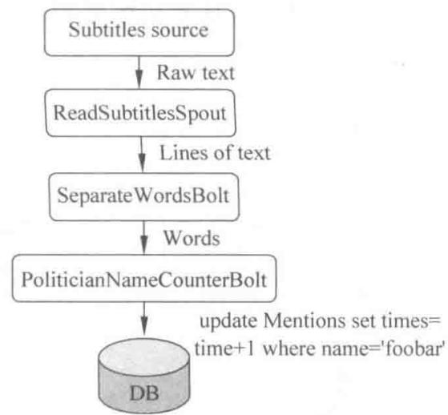
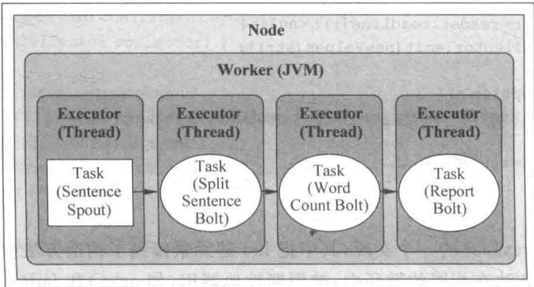
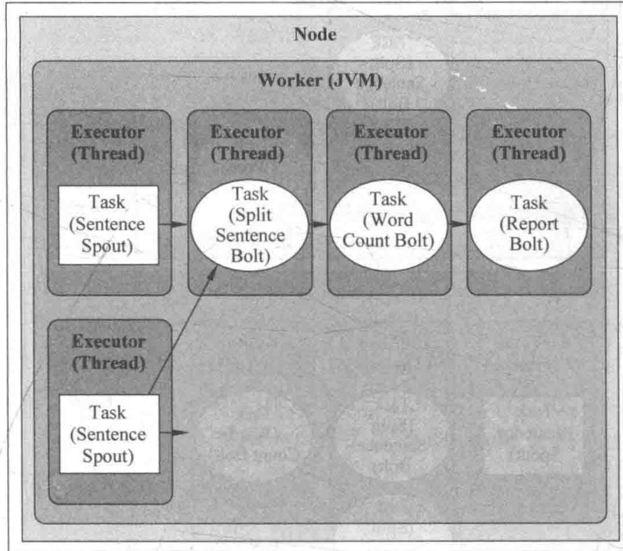
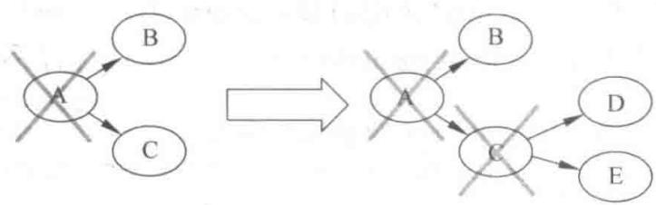

# 初识 Storm

## 10.1 什么是 Storm

## 10.1.1 Storm 能做什么

在大数据处理方面,相信大家已经对 Hadoop 耳熟能详了。Hadoop 处理的是存放在其分布式文件系统 HDFS 上的数据,Hadoop 使用磁盘作为中间交换的介质,在对海量数据进行离线分析时得心应手,但处理实时数据流却是力有未逮。

Storm 是一个开源的分布式实时计算系统, 可以简单、可靠地处理大量的数据流。Storm 有很多使用场景, 如实时分析、在线机器学习、持续计算、分布式 RPC、ETL 等。Storm 支持水平扩展, 具有高容错性, 保证每个消息都会得到处理, 而且处理速度很快(在一个小集群中, 每个节点每秒可以处理数以百万计的消息)。Storm 的部署和运维都很便捷, 更为重要的是可以使用任意编程语言来开发应用。

## 10.1.2 Storm的特性

## 1. 编程模型简单

在大数据处理方面相信大家对 Hadoop 已经耳熟能详, 基于 Google MapReduce 来实现的 Hadoop 为开发者提供了 map、reduce 原语, 使并行批处理程序变得非常简单和优美。同样, Storm 也为大数据的实时计算提供了一些简单优美的原语, 大大降低了开发并行实时处理任务的复杂性, 帮助用户快速、高效地开发应用。

在 Storm 集群中运行的 topology 主要有三个实体：工作进程、线程和任务。Storm 集群中的每台机器上都可以运行多个工作进程，每个工作进程又可创建多个线程，每个线程可以执行多个任务，任务是真正进行数据处理的实体，而 Storm 中的 Spout、Bolt 就是作为一个或者多个任务的方式执行的。因此，计算任务在多个线程、进程和服务器之间并行进行，支持灵活的水平扩展。

## 2. 高可靠性

Storm 可以保证 Spout 发出的每条消息都能被完全处理, 这直接区别于其他实时系统。Spout 发出的消息后续可能会触发产生成千上万条消息, 可以形象地理解为一棵消息树, 其中 Spout 发出的消息为树根, Storm 会跟踪这棵消息树的处理情况, 只有当这棵消息树中的所有消息都被处理了, Storm 才会认为 Spout 发出的消息已经被完全处理。如果这棵消息树中的任何一个消息处理失败, 或者整棵消息树在限定的时间内没有被完全处理, 那么

spout 发出的消息就会重发。

考虑到尽可能减少对内存的消耗,Storm 并不会跟踪消息树中的每个消息,而是采用了一些特殊的策略,它把消息树当作一个整体来跟踪,对消息树中所有消息的唯一 ID 进行异或计算,通过是否为零来判定 spout 发出的消息是否被完全处理,极大地节约了内存并简化了判定逻辑。在这种模式下,系统每发送一个消息,都会同步发送一个 ackfail,这对网络的带宽会有一定的消耗,因此如果对系统的可靠性要求不高,可通过使用不同的 emit 接口关闭该模式。

上面所说的,Storm 保证了每个消息至少被处理一次,但是对于有些计算场合,会严格要求每个消息只被处理一次,幸而 Storm 在 0.7.0 版本中引入了事务性拓扑,成功解决了这个问题。

## 3. 高容错性

如果在消息处理过程中抛出一些异常，Storm 会重新安排这个出问题的处理单元。Storm 保证一个处理单元永远运行（除非用户显式杀掉这个处理单元）。当然，如果处理单元中存储了中间状态，那么当处理单元重新被 Storm 启动时，需要应用自己处理中间状态的恢复。

## 4. 支持多种编程语言

除了用 Java 实现 spout 和 bolt 外, 还可以使用任何用户熟悉的编程语言来完成这项工作, 这一切得益于 Storm 所谓的多语言协议。多语言协议是 Storm 内部的一种特殊协议, 允许 spout 或者 bolt 使用标准输入和标准输出进行消息传递, 传递的消息为单行文本或者 json 编码的多行。

Storm 支持多语言编程, 主要是通过 ShellBolt、ShellSpout 和 ShellProcess 类来实现的。这些类都实现了 IBolt 和 ISpout 接口, 以及让 shell 通过 Java 的 ProcessBuilder 类来执行脚本或者程序的协议。可以看到, 采用这种方式, 每个 tuple 在处理时都需要进行 json 的编解码, 因此在吞吐量上会有较大影响。

## 5. 支持本地模式

Storm 有一种本地模式,也就是在进程中模拟一个 Storm 集群的所有功能,以本地模式运行 topology 与在集群上运行 topology 类似,这对我们开发和测试来说非常有用。

## 6. 高效

用 ZeroMQ 作为底层消息队列,保证消息能快速被处理。

## 7. 运维和部署简单

Storm 计算任务是以“拓扑”为基本单位,每个拓扑完成特定的业务指标,拓扑中的每个逻辑业务节点实现特定的逻辑,并通过消息相互协作。

实际部署时,仅需要根据实际情况配置逻辑节点的并发数,而不需要关心部署到集群中的哪台机器。所有的部署仅需通过命令提交一个jar包,全自动部署。停止一个拓扑,也只需通过一个命令操作。

Storm 支持动态增加节点,新增节点自动注册到集群中,但现有运行的任务不会自动负载均衡。

## 8. 图形化监控

图形界面可以监控各个拓扑的信息,包括每个处理单元的状态和处理消息的数量。

## 10.1.3 Storm分布式计算结构

Storm 的分布式计算结构如图 10-1 所示。

  
图 10-1 Storm 分布式计算结构

nimbus: 负责资源分配和任务调度。

supervisor: 负责接受 nimbus 分配的任务, 启动和停止属于自己管理的 worker 进程。
Worker: 运行具体处理组件逻辑的进程。

task: Worker 中每一个 Spout/Bolt 的线程称为一个 task。同一个 Spout/Bolt 的 task 可能会共享一个物理线程，该线程称为 executor。

Storm 架构中使用 Spout/Bolt 编程模型来对消息进行流式处理。消息流是 Storm 中对数据的基本抽象，一个消息流是对一条输入数据的封装。源源不断输入的消息流以分布式的方式被处理，Spout 组件是消息生产者，是 Storm 架构中的数据输入源头，它可以从多种异构数据源读取数据，并发射消息流。Bolt 组件负责接收 Spout 组件发射的信息流，并完成具体的处理逻辑。在复杂的业务逻辑中可以串联多个 Bolt 组件，在每个 Bolt 组件中编写各自不同的功能，从而实现整体的处理逻辑。

## 10.2 构建 topology

## 10.2.1 Storm 的基本概念

Storm 是一套分布式的、可靠的、可容错的用于处理流式数据的系统。处理工作会被委派给不同类型的组件，每个组件负责一项简单的、特定的处理任务。Storm 集群的输入流由名为 Spout 的组件负责。Spout 将数据传递给名为 Bolt 的组件，后者将以某种方式处理这些数据。例如 Bolt 以某种存储方式将这些数据持久化，或者将它们传递给另外的 Bolt。在这里可以把一个 Storm 集群比作一条由 Bolt 组件组成的链，每个 Bolt 对 Spout 暴露出来的数据做某种方式的处理。

为了说明这个概念,在这里可以举一个简单的例子。昨天晚上看新闻时,播音员们一直在谈论着政治家以及他们阵营的各种话题,在这期间播音员们一直重复着不同的名字,于是人们想知道是否每个名字被提及了相同的次数,或者提到的次数是否有偏重。在这里就可以把播音员们说的字幕认为是数据输入流,可以让 Spout 从一个文件(或者套接字,通过

HTTP, 或者一些其他方法)读取输入。当文本行到达时, Spout 将它们交给一个 Bolt, 该 Bolt 将文本行流分隔成单词。单词流被传递到另一个 Bolt, 在这个 Bolt 里, 每个单词会被与一个预先定义好的政治家名单列表作比较。每作一次比较, 第二个 Bolt 会在数据库中增加一次那个名字的计数。想查看结果时, 只要查询数据库, 该数据库在数据到达时会实时更新。所有组件的排列 (Spouts 和 Bolts) 及它们的连接被称为一个 topology (见图 10-2)。这样就可以定义整个集群中每个 Bolt 和 Spout 的并行度, 从而可以对 topology 进行无限扩展。

  
图10-2 一个简单的 topology

## 10.2.2 构建 topology

在本节中,会创建一个 storm 工程和第一个 storm topology。在开始之前,理解 Storm 的操作模式很重要。运行 Storm 有两种方式:本地模式和远程模式。

## 1) 本地模式

在本地模式中, storm topologies 运行在本地机器一个单独的 JVM 中。由于是最简单的查看所有的 topology 组件一起工作的模式, 这种方式被用来开发、测试和调试。在这种模式下, 可以调整参数, 可以看到 topology 在不同的 storm 配置环境下是怎么运行的。为了以本地模式运行 topologies, 需要下载 Storm 的开发依赖包, 其中包含开发和测试 topology 所需的所有东西。

当建立第一个 storm 工程时,很快就可以看到是怎么回事了。

在本地模式运行 topology 与在 Storm 集群中运行它是类似的。确保所有的组件线程安全是重要的, 因为当它们被部署到远程模式中时, 它们可能运行在不同的 JVM 中或者在不同的物理机器上, 这样它们之间没有直接的交流或者内存共享。

本章的所有示例都以本地模式运行。

## 2）远程模式

在远程模式中,提交 topology 到 Storm 集群,该集群由许多进程组成,通常运行在不同的机器上。远程模式不显示调试信息,这也是它被认为是生产模式的原因。然而,在一台单独的开发机器上建立 Storm 集群是可能的,并且它被认为是在部署至生产前的一个好方法,可以确保在生产环境中运行 topology 时没有任何问题。

## 10.2.3 示例：单词计数

在这个工程中,会建立一个简单的 topology 来为单词计数。可以把这个工程认为是 storm topologies 的“hello world”。然而,它是一个非常强大的 topology,因为它只需要做一些小的改动便可以扩展到几乎无限规模,甚至可以用它来做一个统计系统。例如,可以修

改这个项目来找出 Twitter 上的话题趋势。

为了建立这个 topology, 将使用一个 Spout 来负责读取单词, 第一个 Bolt 来标准化单词, 第二个 Bolt 来为单词计数, 正如可以在图 10-3 中看到的那样。

  
图10-3 单词计算流程

## 1. 创建工程

为开始这个工程,先建立一个用来存放应用的文件夹(就像对任何的 Java 应用一样),该文件夹包含工程的源代码。接着需要下载 Storm 的依赖包,一个将添加到应用类路径的 jar 包的集合。可以用两种方式中的一种做这件事。

(1) 下载依赖包, 解压, 添加到类路径。

(2) 使用 Apache Maven。

Maven 是一套软件工程管理工具,可以用来管理软件开发周期中的多个方面,从依赖到发布构建过程。在本书中会广泛地使用它。为验证是否已安装了 Maven,运行命令 mvn。如果没有,可以从 http://maven.apache.org/download.html 下载。尽管使用 storm 没有必要成为一个 Maven 下载,但是知道 Maven 是怎样工作的基础知识是有帮助的。可以找到更多信息在 Apache Maven 的网站(http://maven.apache.org/)。

为了定义工程的结构,需要建立一个 pom.xml(工程对象模型)文件,该文件描述依赖、包、源码等。将使用依赖包及 nathanmarz 建立的 Maven 库(https://github.com/nathanmarz/)。这些依赖可以在这里找到(https://github.com/nathanmarz/storm/wiki/Maven)。Storm 的 Maven 依赖包引用了在本地模式运行 Storm 所需的所有库函数。

使用这些依赖包,可以写一个包含运行 topology 的必要组件的 pom.xml 文件。

```xml
<projectxmlns="http://maven.apache.org/POM/4.0.0"
xmlns:xsi="http://www.w3.org/2001/XMLSchema-instance"
xsi:schemaLocation="http://maven.apache.org/POM/4.0.0
http://maven.apache.org/xsd/maven-4.0.0.xsd">
<modelVersion>4.0.0</modelVersion>
<groupId> storm.book</groupId>
<artifactId> Getting-Started</artifactId>
<version>0.0.1-SNAPSHOT</version>
<build>
<plugins>
<plugin>
<groupId> org.apache.maven.plugins</groupId>
<artifactId> maven-compiler-plugin</artifactId>
```

```xml
<version>2.3.2</version>
<configuration>
<source>1.6</source>
<target>1.6</target>
<compilerVersion>1.6</compilerVersion>
</configuration>
</plugin>
</plugins>
</build>
<repositories>
<!--Repository where we can found the storm dependencies-->
<repository>
<id> clojars.org</id>
<url> http://clojars.org/repo</url>
</repository>
</repositories>
<dependencies>
<!--Storm Dependency-->
<dependency>
<groupId> storm</groupId>
<artifactId> storm</artifactId>
<version>0.6.0</version>
</dependency>
</dependencies>
</project>
```

前几行指定了工程的名字和版本,然后添加一个编译器插件,该插件 Maven 告诉人们的代码应该用 Java 1.6 编译。接下来定义库(Maven 支持同一工程的多个库)。Clojars 是 Storm 依赖包所在的库,Maven 会自动下载本地模式运行 Storm 所需的所有子依赖包。

## 典型的 Maven Java 工程如图 10-4 所示。

  
图 10-4 典型的工程树

Java 下的文件夹包含源代码并且将单词文件放到 resources 文件夹中处理。mkdir -p 建立所有所需的父目录。

## 2. 建立第一个 topology

为建立第一个 topology,要创建运行单词计数的所有的类。或许示例的一些部分在目前不是很清晰,将在后边的章节中解释它们。

WordReader Spout 是实现了 IRichSpout 接口的类。WordReader 负责读文件并且将每行提供给一个 Bolt。

一个 Spout 发射一个定义的域的列表。这个架构允许有多种 Bolt 读取相同的 Spout 流，然后这些 Bolt 定义域供其他的 Bolt 消费等。

下面示例包含这个类的完整代码(在示例后分析代码的每个部分)。

```java
import java.io.BufferedReader;
import java.io.FileNotFoundException;
import java.io.FileWriter;
import java.util.Map;
import backtype.storm.spout.SpoutOutputCollector;
import backtype.storm.task.TopologyContext;
import backtype.storm.topology.IRichSpout;
import backtype.storm.topology.OutputFieldsDeclarer;
import backtype.storm.tuple.Fields;
import backtype.storm.tuple.Values;
public class WordReaderimplementsIRichSpout{
    private SpoutOutputCollector collector;
    private FileReader fileReader;
    private booleancompleted=false;
    private TopologyContext context;
    public booleanisDistributed(){returnfalse;
}
public voidack(Object msgId) {
    System.out.println("OK:"+ msgId);
}
public voidclose(){}
public voidfail(Object msgId) {
    System.out.println("FAIL:"+ msgId);
}
/**
 * The only thing that the methods will do It is emit each
 * file line
 */
public voidnextTuple() {
    /**
     * The nextuple it is called forever, so if we have beenreaded the
     * we will wait and then return
     */
    if(completed) {
        try {
            Thread.sleep(1000);
        } catch(InterruptedException) {
            //Do nothing
        }
        return;
    }
    String str;
    //Open the reader
    BufferedReader reader=newBufferedReader(fileReader);
    try{
        //Read all lines
        while((str=reader.readLine())!=null) {
            /**
         * By each line emmit a new value with the line as a their
         */
```

```java
this.collector.emit(newValues(str),str);
}
}catch(Exception e) {
    throw new RuntimeException("Errorreading tuple",e);
}finally{
    completed=true;
}
}
/**
 * We will create the file and get the collector object
 */
public voidopen(Map conf,TopologyContextcontext,
SpoutOutputCollector collector) {
    try {
        this.context=context;
        this.fileReader=newFileReader(conf.get("wordsFile").toString());
    } catch(FileNotFoundException) {
        throw new RuntimeException("Errorreading file
["+ conf.get("wordFile") + "]");
    }
    this.collector=collector;
}
/**
 * Declare the output field "word"
 */
public voiddeclareOutputFields(OutputFieldsDeclarerdeclarer) {
    declarer.declare(newFields("line"));
}
}
```

在任何 Spout 中都调用的第一个方法是 void open(Map conf, TopologyContext context, SpoutOutputCollector collector)。此方法的参数是 TopologyContext, 它包含所有的 topology 数据。conf 对象在 topology 定义时被创建。SpoutOutputCollector 可以发射将被 Bolt 处理的数据。下面的代码是 open 方法的实现。

```java
public voidopen(Map conf,TopologyContext context,
SpoutOutputCollector collector) {
    try {
        this.context=context;
        this.fileReader=newFileReader(conf.get("wordsFile").toString());
    } catch(FileNotFoundException e) {
        throw new RuntimeException("Error reading file ["+ conf.get("wordFile") + "]");
    }
    this.collector=collector;
}
```

在这个方法中,也创建了 reader,它负责读文件。接着需要实现 public void nextTuple(), 在这个方法里可以发射将被 Bolt 处理的值。在此例子中,这个方法读文件并且每行发射一个值。

```groovy
public voidnextTuple() {
    if(completed) {
        try {
            Thread.sleep(1);
        } catch(InterruptedException e) {
            //Do nothing
        }
        return;
    }
    String str;
    BufferedReader reader=newBufferedReader(fileReader);
    try{
        while((str=reader.readLine())!=null) {
            this.collector.emit(newValues(str));
        }
    }catch(Exception e) {
        throw new RuntimeException("Errorreading tuple",e);
    }finally{
        completed=true;
    }
}
```

Values 是 ArrayList 的一个实现, 其中把 list 的元素传到了构造方法中。

nextTuple()方法在相同的循环中,被周期性地调用,如 ack()和 fail()方法。当没有工作要做时,必须释放对线程的控制,这样其他的方法有机会被调用,所以 nextTuple 方法的第一行是检查处理是否完成了。如果已经完成,在返回前它会休眠至少 1ms 来降低处理器的负载。如果有工作要做,那么文件的每一行被读取为一个值并且发射。

元组(Tuple)是一个值的命名列表,它可以是任何类型的 Java 对象(只要这个对象是可序列化的)。Storm 在默认情况下可以序列化常用的类,例如 strings、bytearrays、ArrayList、HashMap 和 HashSet。

## 10.3 Storm并发机制

Storm 允许计算水平扩展到多台机器, 将计算划分为多个独立的任务在集群上并行执行。在 Storm 中, 任务只是在集群中运行的一个 Spout 的 Bolt 实例。

理解并行性是如何工作的,必须首先解释一个 Storm 集群拓扑参与执行的四个主要组件。

（1）Nodes(服务器)：这些只是配置为 Storm 集群参与执行拓扑的部分机器。Storm 集群包含一个或多个节点来完成工作。

(2) Workers(JVM 虚拟机): 这些是在一个节点上运行独立的 JVM 进程。每个节点配置一个或更多运行的 Worker。一个拓扑可以请求一个或更多的 Worker 分配给它。

(3) Executors(线程): 这些是 Worker 运行在 JVM 进程中的一个 Java 线程。多个任务可以分配给一个 Executor。除非显式重写, Storm 将分配一个任务给一个 Executor。

(4) Tasks(Spout/Bolt 实例): 任务是 Spout 和 Bolt 的实例, 在 Executor 线程中运行 nextTuple() 和 execute() 方法。

## 10.3.1 topology 并发机制

到目前为止，在单词计数的例子中，还没有显式地使用任何 Storm 的并行 API；相反，允许 Storm 使用其默认设置。在大多数情况下，除非覆盖，Storm 将默认使用最大并行性设置。

在改变拓扑结构的并行设置之前,先考虑拓扑在默认设置下是如何执行的。假设有一台机器(节点),指定一个 Worker 的拓扑,并允许 Storm 每一个任务以一个 Executor 执行,执行指定的拓扑,如图 10-5 所示。

  
图 10-5 Worker 执行流程

正如可以看到的,并行性只有线程级别。每个任务运行在一个 JVM 的一个单独的线程内。怎样才能利用手头的硬件更有效地提高并行性? 让我们开始通过增加 Worker 和 Executor 的数量来运行拓扑。

## 10.3.2 给 topology 增加 Worker

分配额外的 Worker 是增加拓扑计算能力的一种简单方法, Storm 提供了通过其 API 或纯粹配置来更改这两种方式。无论选择哪一种方法, 组件上 Spout 和 Bolt 都没有改变, 并且可以重复使用。

在以前版本的字数统计拓扑中,介绍了配置对象,在部署时传递到 submitTopology() 方法,但它基本上未使用。增加分配给一个拓扑中 Worker 的数量,只是调用 Config 对象的 setNumWorkers() 方法。

```javascript
Config config=new Config();
config.setNumWorkers(2);
```

这个分配两个 Worker 的拓扑结构并不是默认的。这将计算资源添加到拓扑中，为了有效地利用这些资源，也会想调整 Executors 的数量和拓扑每个 Executor 的 task 数量。

## 10.3.3 配置 Executor 和 task

默认情况下，在一个拓扑定义时 Storm 为每个组件创建一个单一的任务，为每个任务分配一个 Executor。Storm 的并行 API 提供了修改这种行为的方式，允许设置的每个任务的 Executor 数和每个 Executor 的 task 数量。

当定义一个流分组并行性时,Executor 的数量分配到一个给定的组件是通过修改配置完成的。为了说明这个特性,修改拓扑 SentenceSpout 并行度分配两个任务,每个任务分配自己的 Executor 线程。

builder.setSpout(SENTENCE\_SPOUT\_ID, spout, 2);

如果使用一个 Worker, 拓扑的执行如图 10-6 所示。

  
图 10-6 修改配置后的 Worker 执行流程

接下来，将设置分割句子 Bolt 为两个有四个 task 的 Executor 执行。每个 Executor 线程将被指派两个任务执行 $(4/2=2)$ 。并且还将配置字数统计 Bolt 运行四个任务，每个都有自己的执行线程。

```txt
builder.setBolt(SPLIT_BOLT_ID, splitBolt, 2).setNumTasks(4)
.shuffleGrouping(SENTENCE_SPOUT_ID);
builder.setBolt(COUNT_BOLT_ID, countBolt, 4)
.fieldsGrouping(SPLIT_BOLT_ID, newFields("word"));
```

有两个 Worker, 拓扑的执行如图 10-7 所示。

拓扑结构的并行性增加,运行更新的 WordCountTopology 类为每个单词产生更高的总数量。

```txt
---FINAL COUNTS---
a : 2726
ate : 2722
beverages : 2723
cold : 2723
cow : 2726
```

```txt
the : 2727
```

```txt
my : 5445
```

  
图 10-7 分割 Bolt 后的 Worker 执行流程

dog : 5445

don't : 5444

fleas : 5451

因为 Spout 无限发出数据, 直到 topology 被 kill, 实际的数量将取决于计算机的速度和其他什么进程运行它, 但是应该看到一个总体增加的发射和处理数量。

需要指出的是,增加 Worker 的数量并不会影响一个拓扑在本地模式下运行。一个拓扑在本地模式下运行总是运行在一个单独的 JVM 进程内,所以只有任务和 Executor 并行设置才会有影响。Storm 的本地模式提供一个近似的集群行为,它在测试一个真正的应用程序集群生产环境之前对开发是很有用的。

## 10.4 数据流分组的理解

看了前面的例子,可能会不明白为什么没有增加 ReportBolt 的并发度。答案是,这样做没有任何意义。为了理解其中的原因,需要了解 Storm 中数据流分组的概念。

数据流分组定义了一个数据流中的 tuple 如何分发给 topology 中不同 Bolt 的 task。举例说明，在并发版本的单词计数 topology 中，SplitSentenceBolt 类指派了四个 task。数据流分组决定了指定的一个 tuple 会分发到哪个 task 上。

Storm 定义了七种内置数据流分组的方式。

(1) Shuffle grouping(随机分组): 这种方式会随机分发 tuple 给 Bolt 的各个 task, 每个 bolt 实例会接收到相同数量的 tuple。

(2) Fields grouping(按字段分组): 根据指定字段的值进行分组。例如, 一个数据流根据 word 字段进行分组, 所有具有相同 word 字段值的 tuple 会路由到同一个 Bolt 的 task 中。

（3）All grouping(全复制分组): 将所有的 tuple 复制后分发给所有 Bolt task。每个订阅数据流的 task 都会接收到 tuple 的复制。

(4) Globle grouping(全局分组): 这种分组方式将所有的 tuples 路由到唯一一个 task 上。Storm 按照最小的 task ID 来选取接收数据的 task。注意, 当使用全局分组方式时, 设置 Bolt 的 task 并发度是没有意义的, 因为所有 tuple 都转发到同一个 task 上。使用全局分组时需要注意, 因为所有的 tuple 都转发到一个 JVM 实例上, 可能会引起 Storm 集群中某个 JVM 或者服务器出现性能瓶颈或崩溃。

(5) None grouping(不分组): 在功能上和随机分组相同, 是为将来预留的。

(6) Direct grouping(指向型分组): 数据源会调用 emitDirect() 方法来判断一个 tuple 应该由哪个 Storm 组件来接收。只能在声明为指向型的数据流上使用。

(7) Local or shuffle grouping(本地或随机分组): 和随机分组类似, 但是, 会将 tuple 分发给同一个 Worker 内的 Bolt task(如果 Worker 内有接收数据的 Bolt task)。其他情况下, 采用随机分组的方式。取决于 topology 的并发度, 本地或随机分组可以减少网络传输, 从而提高 topology 的性能。

除了预定义的分组方式之外,还可以通过实现 CustomStreamGrouping(自定义分组)接口来自定义分组方式。

```dart
List<Integer> chooseTasks(int taskId,list<Object> values);
}
```

prepare()方法在运行时调用,用来初始化分组信息,分组的具体实现会使用这些信息决定如何向接收 task 分发 tuple。WorkerTopologyContext 对象提供了 topology 的上下文信息,GlobalStreamId 提供了待分组数据流的属性。最有用的参数是 targetTasks,是分组所有待选 task 的标识符列表。通常,会将 targetTasks 的引用存在变量里作为 chooseTasks() 的参数。

chooseTasks()方法返回一个 tuple 发送目标 task 的标识符列表,它的两个参数是发送 tuple 的组件的 id 和 tuple 的值。

为了说明数据流分组的重要性,在 topology 中引入一个漏洞 (bug)。首先,修改 SentenceSpout 的 nextTuple() 方法,使每个句子只发送一次。

```txt
public void nextTuple() {
    If (index<sentence.length) {
        This.collector.emit(new Values(sentence[index]));
        Index++;
    }
    Utils.waitForMillis(1);
}
```

程序的输出如下。

```yaml
---FINAL COUNTS---
A : 2
Ate : 2
Beverages : 2
Cold : 2
Cow : 2
Dog : 4
Don't : 4
Fleas : 4
Has : 2
Have : 2
Homework : 2
I : 6
Like : 4
Man : 2
My : 4
The : 2
Think : 2
```

将 CountBolt 中按字段分组的方式修改为随机分组方式。

```txt
builder,setBolt(COUNT_BOLT_ID,countBolt,4)
.shuffleGrouping(SPLIT_BOLT_ID);
```

运行程序的结果如下。

```pem
---FINAL COUNTS---
```

```yaml
A : 1
Ate : 2
Beverages : 1
Cold : 1
Cow : 2
Dog : 2
Don't : 1
Fleas : 1
Has : 1
Have : 1
Homework : 1
I : 3
Like : 1
Man : 1
My : 1
The : 1
Think : 1
```

结果是错误的,因为 CountBolt 的参数是和状态相关的,它会对收到的每个单词进行计数。这个例子中,在并发状况下,计算的准确度取决于是否按照 tuple 的内容进行适当的分组。引入的 bug 只会在 CountBolt 并发实例超过一个时出现。这也是为什么一再强调“要在不同的并发度配置下测试 topology”的原因。

通常,需要避免将信息存在 Bolt 中,因为 Bolt 执行异常或者重新指派时,数据会丢失。一种解决方法是定期对存储的信息快照并放在持久性存储中,比如数据库。这样,如果 task 被重新指派就可以恢复数据。

## 10.5 消息的可靠处理

依旧以单词计数为例，topology 从一个队列中读取句子，然后将句子分解成若干个单词，再将每个单词和该单词的数量发送出去。这种情况下，从 Spout 中发送出去的 tuple 就会产生很多基于它创建的新 tuple，包括句子中单词的 tuple 和每个单词的个数的 tuple。这些消息构成了消息树，如图 10-8 所示。

  
图10-8 消息树

如果这棵 tuple 树发送完成,并且树中的每一条消息都得到了正确的处理,则表明发送 tuple 的 Spout 已经得到了“完整性处理”。对应地,如果在指定的超时时间内 tuple 树中有消息没有完成处理,就意味着 tuple 失败了。这个超时时间可以使用 Config.TOPOLOGY\_MESSAGE\_TIMEOUT\_SECS 参数在构造 topology 时进行配置,如果不配置,则默认时间为 30s。

## 10.5.1 消息被处理后会发生什么

为了理解这个问题,必须先了解一下 tuple 的生命周期。下面是定义 Spout 的接口(可以在 Javadoc 中查看更多细节信息)。

```txt
public interface ISpout extends Serializable {
    void open(Map var1, TopologyContext var2, SpoutOutputCollector var3);
    void close();
    void activate();
    void deactivate();
    void nextTuple();
    void ack(Object var1);
    void fail(Object var1);
}
```

首先,通过调用 Spout 的 nextTuple 方法,Storm 向 Spout 请求一个 tuple。Spout 会使用 open 方法中提供的 SpoutOutputCollector 向它的一个输出数据流中发送一个 tuple。在发送 tuple 时,Spout 会提供一个“消息 id”,这个 id 会在后续过程中用于识别 tuple。

使用 Storm 的可靠性机制时需要注意两件事：首先，在 tuple 树中创建新节点连接时务必通知 Storm；其次，在每个 tuple 处理结束时也必须向 Storm 发出通知。通过这两个操作，Storm 就能够检测到 tuple 树会在何时完成处理，并适时地调用 ack 或者 fail 方法。Storm 的 API 提供了一种非常精确的方式来实现这两个操作。

因此 SentenceSpout 需要做如下修改，在 nextTuple 方法中，发送 tuple 时，增加一个 msgId；如果返回确认成功，则调用 ack 方法，把执行成功的 msgId 从缓存中移除，如果超时或者异常，再调用 fail 方法进行重试。具体实现如下。

```java
public class SentenceSpout extends BaseRichSpout{
    private static final Logger logger =
        LoggerFactory.getLogger(SentenceSpout.class);
    /**
     * tuple 发射器
     */
    private SpoutOutputCollector collector;
    private static final String[] SENTENCES = {
        "hadoop yarn mapreduce spark",
        "flume hadoop hive spark",
        "oozie yarn spark storm",
        "storm yarn mapreduce error",
        "error flume storm spark"
    };
    //把已发送的 tuple 缓存到 Map 中,key 就是 msgId
```

```java
private Map<Object,Values> hasSendTuples;
//如果 tuple 在后续处理中出现异常时,我们需要采取一些措施,这里我们采用重试
//因此,把需要重试的 tuple 缓存下来,key 为 msgId
private Map<Object,Integer> hasRetries;
//设置需要重试的最大次数
private int maxRt;
/**
 * 用来声明该组件向后面组件发射的 tuple 的 key 名称依次是什么
 * @param declarer
 */
@Override
public void declareOutputFields(OutputFieldsDeclarer declarer) {
    declarer.declare(new Fields("sentence"));
}
@Override
public Map<String, Object> getComponentConfiguration() {
    //用于指定只针对本组件的一些特殊配置
    return null;
}
/**
 * Spout 组件的初始化方法
 * 创建 SentenceSpout 组件的实例对象时调用,只执行一次
 * @param conf
 * @param context
 * @param collector
 */
@Override
public void open(Map conf, TopologyContext context, SpoutOutputCollector collector)
    //用实例变量来接收 tuple 发射器
    this.collector = collector;
    this.hasSendTuples = new HashMap<>();
    this.hasRetries = new HashMap<>();
    //获取配置的最大重试次数
    Object maxRetryTimes = conf.get("MAX_RETRY_TIMES");
    maxRt = Integer.valueOf(maxRetryTimes.toString());
}
@Override
public void close() {
    //收尾工作
}
@Override
public void activate() {
}
@Override
public void deactivate() {
}
/**
 * Spout 组件的核心方法
 * 循环调用
 * (1)如何从数据源上获取数据逻辑,写在该方法中
 * (2)对获取的数据进行一些简单的处理
```

```java
*(3)封装 tuple,并且向后面的 bolt 发射 (其实只能指定 tuple 的 value 值依次是什么)
*/
@Override
public void nextTuple() {
    //随机从数组中获取一条语句 (模拟从数据源中获取数据)
    String sentence = SENTENCES[new Random().nextInt(SENTENCES.length)];
    if(sentence.contains("error")){
        logger.error("记录有问题: " + sentence);
    }else{
        //封装成 tuple
        //this.collector.emit(new Values(sentence));
        Object msgId = new Object();
        //a)启用消息可靠性保障机制: Spout 中给每个 tuple 一个 msgId 来标识
        Values tuple = new Values(sentence);
        this.collector.emit(tuple, msgId);
        //b)添加到内存缓存起来
        this.hasSendTuples.put(msgId,tuple);
    }
}
@Override
public void ack(Object msgId) {
    //表示后面的组件对 tuple 处理完,并确认成功后,调用该方法
    //从内存中将处理成功的去掉
    logger.info("Tuple:"+ msgId + ",被成功处理...");
    System.err.println("Tuple:"+ msgId + ",被成功处理...");
    if(hasSendTuples.containsKey(msgId)){
        //把成功处理的 msgId 移除
        hasSendTuples.remove(msgId);
    }
}
@Override
public void fail(Object msgId) {
    //后面组件接收 tuple 超时,后面组件没有接收到,或者明确确认失败,调用该方法
    //比如: 重试最大重试次数
    logger.info("Tuple:" + msgId + ",处理失败或者发射超时...");
    System.err.println("Tuple:" + msgId + ",处理失败或者发射超时...");
    if(!hasSendTuples.containsKey(msgId)){
        return;
    }
    int hasRetry = 0;
    if(hasRetries.containsKey(msgId)){
        hasRetry = hasRetries.get(msgId);
    }
    if(hasRetry <maxRt){
        //重试
        this.collector.emit(hasSendTuples.get(msgId),msgId);
        hasRetry ++;
        hasRetries.put(msgId,hasRetry);
    }else{
        //超过了最大重试次数则直接丢弃
        this.hasRetries.remove(msgId);
```

```txt
this.hasSendTuples.remove(msgId);
    }
}
}
```

tuple会被发送到对应的Bolt中，在这个过程中，Storm会很小心地跟踪创建的消息树。如果Storm检测到某个tuple被完整处理，Storm会根据Spout提供的msgId调用最初发送tuple的Spout任务的ack方法。对应地，Storm在检测到tuple超时之后就会调用fail方法。注意，对于一个特定的tuple，响应(ack)和失败处理(fail)都只会由最初创建这个tuple的任务执行。也就是说，即使Spout在集群中有很多个任务，某个特定的tuple也只会由创建它的那个任务，而不是其他的任务，来处理成功或失败的结果。

SplitBolt 接收到来自 SentenceSpout 发送的 tuple 后, 开始进行处理, 并且在处理完毕, 需要给 SentenceSpout 发送确认信息。主要修改 execute 方法, 并进行锚定 (anchoring)。

```java
public class SplitBolt implements IRichBolt{
    /**
     * bolt 组件中发射器
     */
    private OutputCollector collector;
    /**
     * bolt 组件的初始化方法
     *
     * @param stormConf
     * @param context
     * @param collector
     */
    @Override
    public void prepare(Map stormConf, TopologyContext context, OutputCollector collector) {
        this.collector = collector;
    }
    /**
     * 每接收到前面组件发送过来的 tuple 就调用一次
     *
     * bolt 对数据处理逻辑写在该方法中
     * 处理完后的数据封装成 tuple(value 部分),继续发送给后面的组件
     * 或者执行比如写到数据库、打印到文件等操作 (终点)
     * @param input
     */
    @Override
    public void execute(Tuple input) {
        try {
            String sentence = input.getStringByField("sentence");
            if (sentence != null && !"".equals(sentence)) {
                String[] words = sentence.split(" ");
                for (String word : words) {
                    //this.collector.emit(new Values(word));
                    //锚定 tuple,构造 tuple 的某个分组
                    this.collector.emit(input, new Values(word));
```

```java
}
}
//处理接收到的 tuple 之后,记得发送确认成功信息
this.collector.ack(input);
}catch (Exception e){
//处理失败,发送确认失败信息
this.collector.fail(input);
}
@Override
public void cleanup() {
}
@Override
public void declareOutputFields(OutputFieldsDeclarer declarer) {
declarer.declare(new Fields("word"));
}
@Override
public Map<String, Object> getComponentConfiguration() {
return null;
}
```

通过将输入 tuple 指定为 emit 方法的第一个参数, 每个单词 tuple 都被“锚定”了。这样, 如果单词 tuple 在后续处理过程中失败了, 作为这棵 tuple 树的根节点的原始 Spout tuple 就会被重新处理。相应地, 如果这样发送 tuple:

```javascript
this.collector.emit(new Values(word));
```

就称为“非锚定”。在这种情况下，下游的 tuple 处理失败不会触发原始 tuple 的任何处理操作。有时候发送这种“非锚定” tuple 也是必要的，这取决于 topology 的容错性要求。

一个输出 tuple 可以被锚定到多个输入 tuple 上, 这在流式连接或者聚合操作时很有用。显然, 一个多锚定的 tuple 失败会导致 Spout 中多个 tuple 的重新处理。多锚定操作是通过指定一个 tuple 列表而不是单一的 tuple 来实现的, 如下面的例子所示。

```txt
List<Tuple> anchors = new ArrayList<Tuple>();
anchors.add(tuple1);
anchors.add(tuple2);
this.collector.emit(anchors, new Values(1, 2, 3));
```

多锚定操作会把输出 tuple 添加到多个 tuple 树中。注意，多锚定也可能会打破树的结构从而创建一个 tuple 的有向无环图 (DAG)，如图 10-9 所示。

锚定其实可以看作将 tuple 树具象化的过程——在结束对一棵 tuple 树中一个单独 tuple 的处理时，后续以及最终的 tuple 都会在 Storm 可靠性 API 的作用下得到标定。这是通过 OutputCollector 的 ack

  
图10-9 有向无环图

和 fail 方法实现的。如果再回过头看一下 SplitSentence 的例子, 就会发现输入 tuple 是在所有的单词 tuple 发送出去之后被 ack(应答) 的。

可以使用 OutputCollector 的 fail 方法来使位于 tuple 树根节点的 Spout tuple 立即失效。例如，应用可以在建立数据库连接时抓取异常，并且在异常出现时立即让输入 tuple 失效。通过这种立即失效的方式，原始 Spout tuple 就会比等待 tuple 超时的方式响应更快。

每个待处理的 tuple 都必须显式地应答(ack)或者失效(fail)。因为 Storm 是使用内存来跟踪每个 tuple 的, 所以, 如果没有对每个 tuple 进行应答或者失效, 那么负责跟踪的任务很快就会发生内存溢出。

Bolt 处理 tuple 的一种通用模式是在 Execute 方法中读取输入 tuple、发送出基于输入 tuple 的新 tuple，然后在方法末尾对 tuple 进行应答。大部分 Bolt 都会使用这样的过程。这些 Bolt 大多属于过滤器或者简单的处理函数。Storm 有一个可以简化这种操作的简便接口，称为 BasicBolt。例如，如果使用 BasicBolt, SplitSentence 的例子可以这样写：

```java
public class SplitSentence extends BaseBasicBolt {
    public void execute (Tuple tuple, BasicOutputCollector collector) {
        try {
            String sentence = tuple.getStringByField("sentence");
            if (sentence != null && !"".equals(sentence)) {
                String[] words = sentence.split(" ");
                for (String word : words) {
                    this.collector.emit(new Values(word));
                }
            }
        }catch (Exception e){
            //处理失败,发送确认失败消息
            this.collector.fail(tuple);
        }
    }
}
```

这个实现方式比之前的方式要简单许多,而且在语义上有着完全一致的效果。发送到 BasicOutputCollector 的 tuple 会被自动锚定到输入 tuple 上,而且输入 tuple 会在 Execute 方法结束时自动应答。

相应地,执行聚合或者联结操作的 Bolt 可能需要延迟应答 tuple,因为它需要等待一批 tuple 来完成某种结果计算。聚合和联结操作一般需要对它们的输出 tuple 进行多锚定。这个过程已经超出了 IBasicBolt 的应用范围。

## 10.5.2 Storm 可靠性的实现方法

Storm 的 topology 有一些特殊的称为 acker 的任务, 这些任务负责跟踪每个 Spout 发出的 tuple 的 DAG。当一个 acker 发现一个 DAG 结束了, 它就会给创建 Spout tuple 的 Spout 任务发送一条消息, 让这个任务来应答这个消息。可以使用 Config.TOPOLOGY\_ACKERS 来配置 topology 的 acker 数量。Storm 默认会将 acker 的数量设置为 1, 如果有大量消息的处理需求, 则可能需要增加这个数量。

理解 Storm 的可靠性实现的最好方式还是通过了解 tuple 和 tuple DAG 的生命周期。当一个 tuple 在 topology 中被创建出来时——不管是在 Spout 中还是在 Bolt 中创建的——这个 tuple 都会被配置一个随机的 64 位 id。acker 就是使用这些 id 来跟踪每个 Spout tuple

的 tuple DAG 的。

Spout tuple 的 tuple 树中的每个 tuple 都知道 Spout tuple 的 id。当向 Bolt 中发送一个新 tuple 时，输入 tuple 中的所有 Spout tuple 的 id 都会被复制到新的 tuple 中。在 tuple 被 ack 时，它会通过回掉函数向合适的 acker 发送一条消息，这条消息显示了 tuple 树中发生的变化。也就是说，它会告诉 acker 这样一条消息：“在这个 tuple 树中，我的处理已经结束了，接下来这个就是被我标记的新 tuple。”

以图 10-10 为例, 如果 D tuple 和 E tuple 都是由 C tuple 创建的, 那么在 C 应答时 tuple 树就会发生变化。

  
图 10-10 应答引起的树变化

由于在 D 和 E 添加到 tuple 树中时 C 已经从树中移除了, 所以这个树并不会被过早地结束。

关于 Storm 如何跟踪 tuple 树还有更多的细节。正如上面所提到的，可以随意设置 topology 中 acker 的数量。这就会引起下面的问题：当 tuple 在 topology 中被 ack 时，它是怎么知道向哪个 acker 任务发送信息呢？

对于这个问题,Storm 实际上是使用哈希算法来将 Spout tuple 匹配到 acker 任务上。由于每个 tuple 都会包含原始的 Spout tuple id,所以它们会知道需要与哪个 acker 任务通信。

关于 Storm 的另一个问题是: acker 是如何知道它所跟踪的 Spout tuple 是由哪个 Spout 任务处理呢? 实际上, 在 Spout 任务发送新 tuple 时, 它也会给对应的 acker 发送一条消息, 告诉 acker 这个 Spout tuple 是与它的任务 id 相关联的。随后, 在 acker 观察到 tuple 树结束处理时, 它就会知道向哪个 Spout 任务发送结束消息。

acker 实际上并不会直接跟踪 tuple 树。对于一棵包含数万个 tuple 节点的树，如果直接跟踪其中的每个 tuple，显然会很快把这个 acker 的内存撑爆。因此，这里 acker 使用一个特殊的策略来实现跟踪的功能，使用这个方法对每个 Spout tuple 只需要占用固定的内存空间（大约 20 字节）。这个跟踪算法是 Storm 运行的关键，也是 Storm 的一个突破性技术。

在 acker 任务中储存了一个表,用于将 Spout tuple 的 id 和一对值相映射。其中第一个值是创建这个 tuple 的任务 id,这个 id 主要用于在后续操作中发送结束消息。第二个值是一个 64 位的数字,称为应答值(ack val)。这个应答值是整个 tuple 树的一个完整的状态表述,而且它与树的大小无关。因为这个值仅仅是这棵树中所有被创建或者被应答的 tuple 的 tuple id 进行异或运算的结果值。

当一个 acker 任务观察到应答值变为 0 时, 它就知道这个 tuple 树已经完成处理了。因为 tuple id 实际上是随机生成的 64 位数值, 所以应答值碰巧为 0 是一种极小概率的事件。理论计算得出, 在每秒应答一万次的情况下, 需要 5000 万年才会发生一次错误。即使是这样,也仅仅会是 tuple 碰巧在 topology 中失败时才会发生数据丢失的情况。

假设已经理解了这个可靠性算法,再分析一下所有失败的情形,看看这些情形下 Storm 是如何避免数据缺失的。

由于任务(线程)挂掉导致 tuple 没有被应答(ack)的情况,这时位于 tuple 树根节点的 Spout tuple 会在任务超时后得到重新处理。

acker 任务挂掉的情形, 这种情况下 acker 跟踪的所有 Spout tuple 都会由于超时被重新处理。

Spout 任务挂掉的情形, 这种情况下 Spout 任务的来源就会负责重新处理消息。例如, 对于像 Kestrel 和 RabbitMQ 这样的消息队列, 会在客户端断开连接时将所有的挂起状态的消息放回队列(关于挂起状态的概念可以参考 Storm 的容错性)。

综上所述，Storm 的可靠性机制完全具备了分布的、可伸缩的、容错的特征。

## 10.5.3 调整可靠性

由于 acker 任务是轻量级的，在拓扑中并不需要很多 acker 任务。可以通过 Storm UI 监控它们的性能(acker 任务的 id 为 \_\_acker)。如果发现观察结果存在问题，则需要增加更多的 acker 任务。

如果不关注消息的可靠性,也就是说,不关心在失败情形下发生的 tuple 丢失,那么可以通过不跟踪 tuple 树的处理来提升拓扑的性能。由于 tuple 树中的每个 tuple 都会带有一个应答消息,不追踪 tuple 树会使传输的消息的数量减半。同时,下游数据流中的 id 也会变少,这样可以降低网络带宽的消耗。

有三种方法可以移除 Storm 的可靠性机制。

第一种方法是将 Config.TOPOLOGY\_ACKERS 设置为 0，在这种情况下，Storm 会在 Spout 发送 tuple 之后立即调用 ack 方法，tuple 树叶就不会被跟踪了。

第二种方法是基于消息本身移除可靠性。可以通过在 SpoutOutputCollector. emit 方法中省略 msgId 来关闭 Spout tuple 的跟踪功能。

最后,如果不关心拓扑中的下游 tuple 是否会失败,可以在发送 tuple 时选择发送非锚定的(unanchored)tuple。由于这些 tuple 不会被标记到任何一个 Spout tuple 中,显然在它们处理失败时不会引起任何 Spout tuple 的重新处理(注意,在使用这种方法时,如果上游有 Spout 或 bolt 仍然保持可靠性机制,那么需要在 Execute 方法之初调用 OutputCollector.ack 来立即响应上游的消息,否则上游组件会误认为消息没有发送成功,导致所有的消息会被反复发送)。

## 本章小结

在本章中，在没有安装和搭建 Storm 集群的情况下，使用 Storm 的核心 API 建立了一个简单的单词计数程序，并以此程序为例介绍了 Storm 特性中的大部分内容。尽管 Storm 的本地模式已经足够强大，但是要感受 Storm 的真正威力，还需要把 Storm 部署到集群中。

第 11 章将会对如何安装和搭建 Storm 集群进行介绍,以及如何将 topology 部署到分布式环境中。

## 习题

(1) Storm 是什么, 应用场景有哪些?

(2) Storm 有什么特点?

（3）Spout 发出的消息后续可能会触发产生成千上万条消息，Storm 如何跟踪这条消息树呢？

(4) Storm 本地模式的作用是什么?
