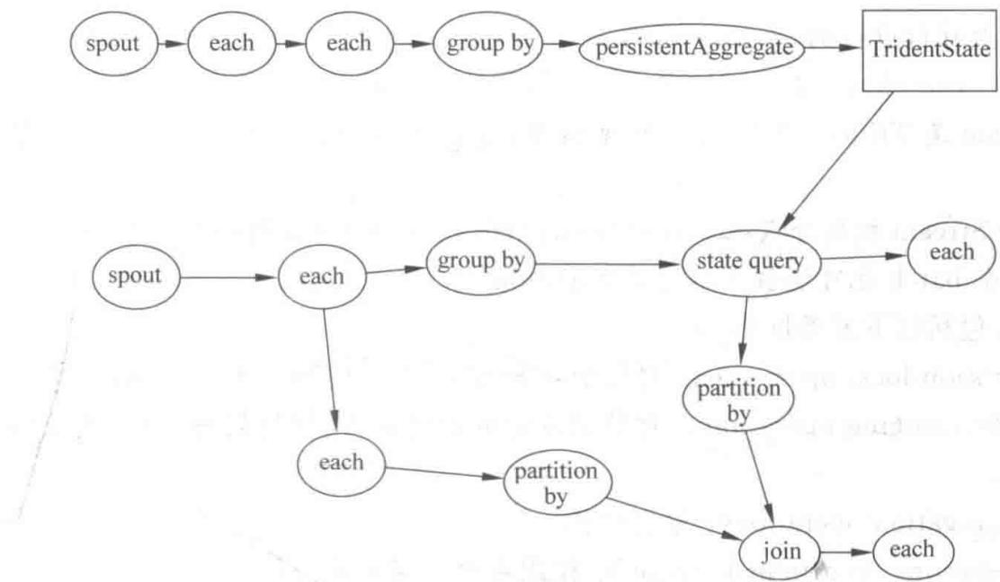
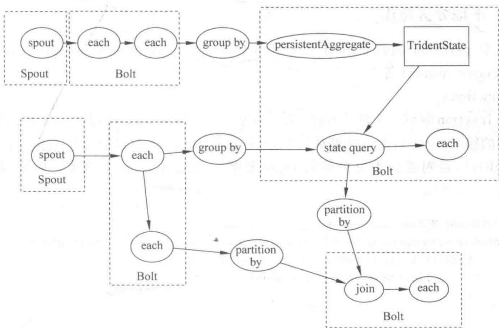

# Trident 和 Trident-ML

## 12.1 Trident topology

## 12.1.1 Trident 综述

Trident 是在 Storm 基础上,一个以实时计算为目标的高度抽象。它在提供处理大吞吐量数据能力(每秒百万次消息)的同时,也提供了低延时分布式查询和有状态流式处理的能力。如果对 Pig 和 Cascading 这种高级批处理工具很了解,那么应该很容易理解 Trident,因为它们之间很多的概念和思想都是类似的。Trident 提供了 joins、aggregations、grouping、functions 以及 filters 等能力。除此之外,Trident 还提供了一些专门的原语,从而在基于数据库或者其他存储的前提下来应付有状态的递增式处理。Trident 也提供一致性(consistent),有且仅有一次(exactly-once)等语义,使我们在使用 Trident topology 时变得容易。

以下是一个 Trident 的例子。在这个例子中，主要完成以下两个功能。

（1）从一个流式输入中读取语句并计算每个单词的个数。

（2）提供查询给定单词列表中每个单词当前总数的功能。

这里举一个例子,我们会从如下这样一个无限的输入流中读取语句作为输入。

```javascript
FixedBatchSpout spout = new FixedBatchSpout(new Fields("sentence"), 3,
    new Values("the cow jumped over the moon"),
    new Values("the man went to the store and bought some candy"),
    new Values("four score and seven years ago"),
    new Values("how many apples can you eat"));
spout.setCycle(true);
```

这个 Spout 会循环输出所列出的那些语句到 sentence stream 中, 下面的代码会以这个 Stream 作为输入并计算每个单词的个数。

```txt
TridentTopology topology = new TridentTopology();
TridentState wordCounts = topology.newStream("spout1", spout)
.each(new Fields("sentence"), new Split(), new Fields("word"))
.groupBy(new Fields("word"))
.persistentAggregate (new MemoryMapState. Factory (), new Count (), new Fields
("count"))
.parallelismHint(6);
```

在这段代码中,首先创建了一个 TridentTopology 对象,该对象提供了相应的接口去构造 Trident 计算过程。TridentTopology 类中的 newStream 方法从输入源(input source)中读取数据,并创建一个新的数据流。在这个例子中,使用了上面定义的 FixedBatchSpout 对象作为输入源。输入数据源同样可以如 Kestrel 或者 Kafka 这样的队列服务。Trident 会在 Zookeeper 中保存一小部分状态信息来追踪数据的处理情况,而在代码中我们指定的字符串 spout1 就是 Zookeeper 中用来存储状态信息的 Znode 节点。

Trident 在处理输入 stream 时会把输入转换成 batch(包含若干个 tuple) 来处理。例如, 输入的 sentence stream 可能会被拆分成如图 12-1 所示的 batch。

  
图12-1 batch的拆分

一般来说,这些小的 batch 中的 tuple 可能会在数千或者数百万这样的数量级,这完全取决于输入的吞吐量。

Trident 提供了一系列非常成熟的批处理 API 来处理这些小 batch。这些 API 与在 Pig 或者 Cascading 中看到的非常类似，可以做 groupby、join、aggregation，执行 function 和 filter 等。当然，独立处理每个小的 batch 并不是非常有趣的事情，所以 Trident 提供了功能来实现 batch 之间的聚合并可以将这些聚合的结果存储到内存、Memcached、Cassandra 或者一些其他的存储中。同时，Trident 还提供了非常好的功能来查询实时状态，这些实时状态可以被 Trident 更新。此外，Trident 还可以是一个独立的状态源。

这个例子中，Spout 输出了一个只有单一字段 sentence 的数据流。在下一行，topology 使用了 Split 函数来拆分 stream 中的每一个 tuple，Split 函数读取输入流中的 sentence 字段，并将其拆分成若干个 word tuple。每一个 sentence tuple 可能会被转换成多个 word tuple，例如，the cow jumped over the moon 会被转换成 6 个 word tuples。下面是 Split 的定义。

```java
String sentence = tuple.getString(0);
for(String word: sentence.split(" "))
    collector.emit(new Values(word));
}
}
```

它只是简单地根据空格拆分 sentence，并将拆分出的每个单词作为一个 tuple 输出。

topology 的其他部分计算单词的个数,并将计算结果保存到了持久存储中。首先,word stream 被根据 word 字段进行 group 操作,然后每一个 group 使用 Count 聚合器进行持久化聚合。persistentAggregate 方法会帮助用户把一个状态源聚合的结果存储或者更新到存储中。在这个例子中,单词的数量被保持在内存中,不过可以简单地把这些数据保存到其他的存储中,如 Memcached、Cassandra 等。如果要把结果存储到 Memcached 中,只是简单地使用下面这句话替换 persistentAggregate 就可以了,这其中的 serverLocations 是 Memcached cluster 的主机和端口号列表。

```txt
.persistentAggregate(MemcachedState.transactional(serverLocations),
new Count(),
new Fields("count"))
```

persistentAggregate 存储的数据就是所有 batch 聚合的结果。

Trident 非常好的一点就是它提供完全容错的(fully fault-tolerant)处理一次且仅一次(exactly-once)的语义。这就让用户可以很轻松地使用 Trident 来进行实时数据处理。Trident 会把状态以某种形式保持起来, 当有错误发生时, 它会根据需要来恢复这些状态。

persistentAggregate 方法会把数据流转换成一个 TridentState 对象。在这个例子中，TridentState 对象代表了所有单词的数量。会使用这个 TridentState 对象来实现在计算过程中的分布式查询。

上面的是 topology 的第一部分, topology 的第二部分实现了一个低延时的单词数量的分布式查询。这个查询以一个用空格分隔的单词列表为输入, 返回这些单词的总个数。这些查询就像普通的 RPC 调用那样被执行, 要说不同, 那就是它们在后台是并行执行的。下面是执行查询的一个例子。

```javascript
DRPCClient client = new DRPCClient("drpc.server.location", 3772);
System.out.println(client.execute("words", "cat dog the man");
//prints the JSON- encoded result, e.g.: "[[5078]]"
```

由此可见，除了在 storm cluster 上并行执行之外，这个查询看上去就是一个普通的 RPC 调用。这样的简单查询的延时通常在 10ms 左右。当然，更复杂的 DRPC 调用可能会占用更长的时间，尽管延时很大程度上取决于给计算分配了多少资源。

topology 中的分布式查询部分实现如下所示。

```scala
topology.newDRPCStream("words")
  .each(new Fields("args"), new Split(), new Fields("word"))
  .groupBy(new Fields("word"))
  .stateQuery(wordCounts, new Fields("word"), new MapGet(), new Fields("count"))
  .each(new Fields("count"), new FilterNull())
```

.aggregate(new Fields("count"), new Sum(), new Fields("sum"));

使用 TridentTopology 对象来创建 DRPC stream，并且将这个函数命名为 words。这个函数名会作为第一个参数在使用 DRPC Client 来执行查询时用到。

每个 DRPC 请求会被当作只有一个 tuple 的 batch 来处理。在处理的过程中，以这个输入的单一 tuple 来表示这个请求。这个 tuple 包含一个叫作 args 的字段，在这个字段中保存了客户端提供的查询参数。在这个例子中，这个参数是一个以空格分隔的单词列表。

首先,使用 Split 函数把传入的请求参数拆分成独立的单词,然后对 word 流进行 group by 操作,之后就可以使用 stateQuery 在上面代码中创建的 TridentState 对象上进行查询。stateQuery 接收一个 state 源(在这个例子中,就是 topolgoy 所计算的单词的个数)以及一个用于查询的函数作为输入。在这个例子中,使用了 MapGet 函数来获取每个单词出现的个数。由于 DRPC stream 使用与 TridentState 完全相同的 group 方式(按照 word 字段进行 groupby),每个单词的查询会被路由到 TridentState 对象管理和更新这个单词的分区去执行。

接下来,用 FilterNull 过滤器把从未出现过的单词给过滤掉(说明没有查询该单词),并使用 Sum 聚合器将这些 count 累加起来得到结果。最终,Trident 会自动把结果发送回等待的客户端。

Trident 在如何最大限度地保证执行 topogloy 性能方面是非常智能的。在 topology 中会自动发生两件非常有意思的事情。

（1）读取和更新状态的操作。例如，stateQuery 和 persistentAggregate 会自动地批量处理。如果当前处理的 batch 中有 20 次更新需要被同步到存储中，Trident 会自动把这些操作汇总到一起，只做一次读一次写，而不是进行 20 次读 20 次写的操作。因此可以在方便执行计算的同时，保证了非常好的性能。

(2) Trident 的聚合器已经是被优化得非常好。Trident 并不是简单地把一个 group 中所有的 tuples 都发送到同一个机器上面进行聚合, 而是在发送之前已经进行过一次部分的聚合。例如, count 聚合器会先在每个 partition 上面进行 count, 然后把每个分片 count 汇总到一起得到最终的 count。这个技术就与 MapReduce 里面的 combiner 是一个思想。

下面再来看一下 Trident 的另外一个例子。

## 12.1.2 Reach

这个例子是一个纯粹的 DRPC topology, 这个 topology 会计算一个给定 URL 的 reach 值, reach 值是该 URL 对应页面的推文能够送达 (Reach) 的用户数量, 那么就把这个数量叫作这个 URL 的 reach。要计算 reach, 需要获取转发过这个推文的所有人, 然后找到所有转发者的粉丝, 并将这些粉丝去重, 最后得到去重后的用户的数量。如果把计算 reach 的整个过程都放在一台机器上面, 就太困难了, 因为需要数千次数据库调用以及千万级别数量的 tuple。如果使用 Storm 和 Trident, 就可以把这些计算步骤在整个 cluster 中并行进行 (具体哪些步骤, 可以参考 DRPC 介绍一文, 该文介绍过 reach 值的计算方法)。

这个 topology 会读取两个 state 源：一个将该 URL 映射到所有转发该推文的用户列表，还有一个将用户映射到该用户的粉丝列表。topology 的定义如下。

```txt
TridentState urlToTweeters =
topology.newStaticState ~(getUrlToTweetersState());
TridentState tweetersToFollowers =
topology.newStaticState ~(getTweeterToFollowersState());
topology.newDRPCStream("reach")
.stateQuery(urlToTweeters, new Fields("args"), new MapGet(), new Fields("tweeters"))
.each(new Fields("tweeters"), new ExpandList(), new Fields("tweeter"))
.shuffle()
.stateQuery(tweetersToFollowers, new Fields("tweeter"), new MapGet(), new Fields
("followers"))
.parallelismHint(200)
.each(new Fields("followers"), new ExpandList(), new Fields("follower"))
.groupBy(new Fields("follower"))
.aggregate(new One(), new Fields("one"))
.parallelismHint(20)
.aggregate(new Count(), new Fields("reach"));
```

这个 topology 使用 newStaticState 方法创建了 TridentState 对象来代表一个外部数据库。使用这个 TridentState 对象，可以在这个 topology 上面进行动态查询。和所有的 state 源一样，在这些数据库上面的查找会自动被批量执行，从而最大限度地提升效率。

这个 topology 的定义是非常简单的,它仅是一个批处理的任务。

首先,查询 urlToTweeters 数据库来得到转发过这个 URL 的用户列表。这个查询会返回一个 tweeter 列表,因此使用 ExpandList 函数把其中的每一个 tweeter 转换成一个 tuple。

接下来,我们获取每个 tweeter 的 follower。可以使用 shuffle 把要处理的 tweeter 均匀地分配到 topology 运行的每一个 Worker 中并发去处理,然后查询 tweetersToFollowers 数据库,从而得到每个转发者的粉丝。可以看到,我们为 topology 的这部分分配了很大的并行度,因为这部分是整个 topology 中最耗资源的。

随后,对这些粉丝进行去重和计数。这分为如下两步:①通过 follower 字段对流进行分组,并对每个组执行 One 聚合器。One 聚合器对每个分组简单地发送一个 tuple,该 tuple 仅包含一个数字 1。②将这些 1 加到一起,得到去重后的粉丝集中的粉丝数。One 聚合器的定义如下。

```java
public class One implements CombinerAggregator<Integer> {
    public Integer init(TridentTuple tuple) {
        return 1;
    }
    public Integer combine(Integer val1, Integer val2) {
        return 1;
    }
    public Integer zero() {
        return 1;
    }
}
```

这是一个汇总聚合器(combiner aggregator)，它会在传送结果到其他 Worker 汇总之前进行局部汇总,从而使性能最优。同样,Sum 被定义成一个汇总聚合器,在 topology 的最后部分进行全局求和是高效的。

接下来一起来看看 Trident 的一些细节。

## 12.1.3 字段和元组

Trident 的数据模型是 TridentTuple。在一个 topology 中，tuple 是在一系列的处理操作(operation)中增量生成的。operation 一般以一组字段作为输入并输出一组功能字段(function files)。Operation 的输入字段经常是输入 tuple 的一个子集，而功能字段则是 operation 的输出。

看下面这个例子。假定有一个叫作“stream”的 stream，它包含“x”“y”“z”三个字段。为了运行一个读取“y”作为输入的过滤器 MyFilter，可以这样写：

```java
stream.each(new Fields("y"),new MyFilter())

MyFilter 的实现如下:

public class MyFilter extends BaseFilter {
    public boolean isKeep(TridentTuple tuple) {
        return tuple.getInteger(0)<10;
    }
}
```

这会保留所有“y”字段小于10的tuples。传给MyFilter的TridentTuple参数将只包含字段“y”。需要注意的是，当选择输入字段时，Trident只发送tuple的一个子集，这个操作是非常高效的。

让我们一起看一下功能字段(function field)是怎样工作的。假定有如下这个函数：

```java
public class AddAndMultiply extends BaseFunction {
    public void execute(TridentTuple tuple, TridentCollector collector) {
        int i1 = tuple.getInteger(0);
        int i2 = tuple.getInteger(1);
        collector.emit(new Values(i1 + i2, i1* i2));
    }
}
```

这个函数接收两个数作为输入并输出两个新的值：这两个数的和与乘积。假定有一个stream，其中包含“x”“y”和“z”三个字段。可以这样使用这个函数：

```javascript
stream.each(new Fields("x","y"),new AddAndMultiply(), new Fields("added",
"multiplied"));
```

输出的功能字段被添加到输入 tuple 后面, 这个时候, 每个 tuple 中将会有 5 个字段“x”“y”“z”“added”“multiplied”, “added”和“multiplied”对应于 AddAndMultiply 输出的第一和第二个字段。

另外,可以使用聚合器来将输出字段替换输入 tuple。如果有一个 stream 包含字段 “val1”“val2”,可以这样做:

```scala
stream.aggregate(new Fields("val2"),new Sum(), new Fields("sum"))
```

输出流将会仅包含一个 tuple, 该 tuple 有一个 sum 字段, 该 sum 字段就是一批 tuple 中 val2 字段的累积和。但是若对 groupby 之后的流进行该聚合操作, 则输出 tuple 中包含分组字段和聚合器输出的字段, 例如

```txt
stream.groupby(new Fields("val1"))
.aggregate(new Fields("val2"), new Sum(), new Fields("sum"))
```

这个例子中的输出包含 val1 字段和 sum 字段。

## 12.1.4 状态

在实时计算领域,怎样管理状态并轻松应对错误和重试是个主要问题。消除错误是不可能的,当一个节点死掉,或者一些其他的问题出现时,这些 batch 需要被重新处理。问题是,怎样做状态更新来保证每一个消息被处理且只被处理一次?

这是一个很棘手的问题,可以用接下来的例子进一步说明。假定做一个 stream 的计数聚合,并且想要存储运行时的 count 到一个数据库中。如果只是存储这个 count 到数据库中,并且想要进行一次更新,是没有办法知道同样的状态是不是以前已经被 update 过了。这次更新可能在之前就尝试过,并且已经成功地更新到数据库中,不过在后续的步骤中失败了。还有可能是在上次更新数据库的过程中失败了,这些都不知道。

Trident 通过做下面两件事情来解决这个问题。

（1）每一个 batch 被赋予一个唯一标识 id“transaction id”。如果一个 batch 被重试，它将会拥有和之前同样的 transaction id。

（2）状态更新是按照 batch 的顺序进行的（强顺序）。也就是说，batch 3 的状态更新必须等到 batch 2 的状态更新成功之后才可以进行。

有了这两个原则, 就可以达到有且只有一次更新的目标。此时, 不是只将 count 存到数据库中, 而是将 transaction id 和 count 作为原子值存到数据库中。当更新一个 count 时, 需要比较数据库中 transaction id 和当前 batch 的 transaction id。如果相同, 就跳过这次更新; 如果不同, 就更新这个 count。

当然,不需要在 topology 中手动处理这些逻辑,这些逻辑已经被封装在 State 的抽象中并自动进行。State object 也不需要自己去实现 transaction id 的跟踪操作。如果想了解更多的关于如何实现一个 State 以及在容错过程中的一些取舍问题,可以参照这篇文章。

一个 State 可以采用任何策略来存储状态, 它可以存储到一个外部的数据库, 也可以在内存中保持状态并备份到 HDFS 中。State 并不需要永久地保持状态。例如, 有一个内存版的 State 实现, 它保存最近 X 个小时的数据并丢弃旧的数据。可以把 Memcached integration 作为例子来看看 State 的实现。

## 12.1.5 Trident topology 的执行

Trident 的 topology 会被编译成尽可能高效的 Storm topology。只有在需要对数据进行重新分配(repartition)时(如 groupby 或者 shuffle)，才会把 tuple 通过 network 发送出去。如果有一个 Trident topology 如图 12-2 所示，它将会被编译成如图 12-3 所示的 Storm topology。

  
图 12-2 Trident topology

  
图 12-3 Storm topology

可以看出，Trident 使实时计算更加优雅。使用 Trident 的 API 来完成大吞吐量的流式计算、状态维护、低延时查询等功能，不但可以使 Trident 获取最大性能，还可以以更自然的一种方式进行实时计算。

## 12.2 Trident 接口

## 12.2.1 综述

Stream 是 Trident 中的核心数据模型, 它被当作一系列的 batch 来处理。在 Storm 集群的节点之间, 一个 stream 被划分成很多 partition(分区), 对流的操作(operation) 是在每

个 partition 上并行进行的。

## 注意：

① Stream 是 Trident 中的核心数据模型,有些地方说是 TridentTuple,没有标准的说法。

② 一个 Stream 被划分成很多 partition, partition 是 Stream 的一个子集, 里面可能有多个 batch, 一个 batch 也可能位于不同的 partition 上。

Trident 包括以下五类操作。

(1) Partition-local operations: 对每个 partition 的局部操作, 不产生网络传输。

(2) Repartitioning operations: 对数据流的重新划分(仅仅是划分,但不改变内容),产生网络传输。

(3) Aggregation operations: 聚合操作。

(4) Operations on grouped streams: 作用在分组流上的操作。

(5) Merge、Join 操作。

## 12.2.2 本地分区操作

对每个 partition 的局部操作包括 function、filter、partitionAggregate、stateQuery、partitionPersist、project 等。

## 1. functions

一个 function 收到一个输入 tuple 后可以输出 0 或多个 tuple, 输出 tuple 的字段被追加到接收到的输入 tuple 后面。如果对某个 tuple 执行 function 后没有输出 tuple, 则该 tuple 被过滤 (filter), 否则就会为每个输出 tuple 复制一份输入 tuple 的副本。假设有如下的 function:

```java
public class MyFunction extends BaseFunction {
    public void execute(TridentTuple tuple, TridentCollector collector) {
        for(int i= 0; i<tuple.getInteger(0); i++) {
            collector.emit(new Values(i));
        }
    }
}
```

假设有个 mystream 的流(Stream)，该流中有如下 tuple(tuple 的字段为 ["a", "b", "c"] )：

```csv
[1,2,3]
[4,1,6]
[3,0,8]
```

运行下面的代码：

```javascript
mystream.each(new Fields("b"),new MyFunction(), new Fields("d"))
```

则输出 tuple 中的字段为 ["a", "b", "c", "d"], 如下所示:

```csv
[1,2,3,0]
[1,2,3,1]
[4,1,6,0]
```

## 2. filters

filter 收到一个输入 tuple 后可以决定是否留着这个 tuple, 看下面的 filter。

```java
public class MyFilter extends BaseFunction {
    public boolean isKeep(TridentTuple tuple) {
        return tuple.getInteger(0) == 1 && tuple.getInteger(1) == 2;
    }
}
```

假设有如下这些 tuple(包含的字段为["a","b","c"])：

```csv
[1,2,3]
[2,1,1]
[2,3,4]
```

运行下面的代码：

```javascript
mystream.each(new Fields("b","a"),new MyFilter())
```

则得到的输出 tuple 为:

```txt
[2,1,1]
```

```txt
3. partitionAggregate
```

partitionAggregate 对每个 partition 执行一个 function 操作(实际上是聚合操作),但它不同于上面的 functions 操作,partitionAggregate 的输出 tuple 将会取代收到的输入 tuple,如下面的例子。

```txt
mystream.partitionAggregate(new
Fields("b"),
new
Sum(), new
Fields("sum"))
```

假设输入流包括字段["a","b"],并有下面的 partitions:

```toml
Partition 0:
["a", 1]
["b", 2]
Partition 1:
["a", 3]
["c", 8]
Partition 2:
["e", 1]
["d", 9]
["d", 10]
```

则这段代码的输出流包含如下 tuple, 且只有一个 sum 的字段。

```txt
Partition 0:
[3]
Partition 1:
```

```ini
[11]
Partition 2:
[20]
```

上面代码中的 new Sum()实际上是一个聚合器(aggregator)，定义一个聚合器有三种不同的接口：CombinerAggregator、ReducerAggregator 和 Aggregator。

下面是 CombinerAggregator 接口。

```java
public interface CombinerAggregator extends Serializable {
    T init(TridentTuple tuple);
    T combine(T val1, T val2);
    T zero();
}
```

一个 CombinerAggregator 仅输出一个 tuple(该 tuple 也只有一个字段)。每收到一个输入 tuple, CombinerAggregator 就会执行 init() 方法(该方法返回一个初始值), 并且用 combine() 方法汇总这些值, 直到剩下一个值为止(聚合值)。如果 partition 中没有 tuple, CombinerAggregator 会发送 zero() 的返回值。下面是聚合器 Count 的实现。

```java
public class Count implements CombinerAggregator {
    public Long init(TridentTuple tuple) {
        return 1L;
    }
    public Long combine(Long val1, Long val2) {
        return val1 + val2;
    }
    public Long zero() {
        return 0L;
    }
}
```

当使用 aggregate() 方法代替 partitionAggregate() 方法时, 就能看到 CombinerAggregation 带来的好处。这种情况下, Trident 会自动优化计算, 先做局部聚合操作, 然后再通过网络传输 tuple 进行全局聚合。

ReducerAggregator 接口如下：

```java
public interface ReducerAggregator extends Serializable {
    T init();
    T reduce(T curr, TridentTuple tuple);
}
```

ReducerAggregator 使用 init() 方法产生一个初始值, 对于每个输入 tuple, 依次迭代这个初始值, 最终产生一个单值输出 tuple。下面示例说明如何将 Count 定义为 ReducerAggregator。

```java
public class Count implements ReducerAggregator {
    public Long init() {
        return 0L;
    }
```

```swift
public Long reduce(Long curr, TridentTuple tuple) {
        return curr + 1;
    }
}
```

通用的聚合接口是 Aggregator, 如下所示:

```dart
public interface Aggregator extends Operation {
    T init(Object batchId, TridentCollector collector);
    void aggregate(T state, TridentTuple tuple, TridentCollector collector);
    void complete(T state, TridentCollector collector);
}
```

Aggregator 可以输出任意数量的 tuple, 且这些 tuple 的字段可以有多个。执行过程中的任何时候都可以输出 tuple(三个方法的参数中都有 collector)。Aggregator 的执行方式如下。

（1）处理每个 batch 之前调用一次 init() 方法，该方法的返回值是一个对象，代表 aggregation 的状态，并且会传递给下面的 aggregate() 和 complete() 方法。

（2）每收到一个该 batch 中的输入 tuple 就会调用一次 aggregate，该方法中可以更新状态（第一点中 init() 方法的返回值）。

(3) 当该 batch partition 中的所有 tuple 都被 aggregate() 方法处理完之后调用 complete 方法。

注意：理解 batch、partition 之间的区别将会更好地理解上面的几个方法。

下面的代码将 Count 作为 Aggregator 实现。

1. $\zeta_{i}$ , $\zeta_{j}$

```java
public class CountAgg extends BaseAggregator {
    static class CountState {
        long count = 0;
    }
    public CountState init(Object batchId, TridentCollector collector) {
        return new CountState();
    }
    public void aggregate (CountState state, TridentTuple tuple, TridentCollector collector) {
        state.count+= 1;
    }
    public void complete (CountState state, TridentCollector collector) {
        collector.emit(new Values(state.count));
    }
}
```

有时需要同时执行多个聚合操作，这可以使用链式操作完成。

```scala
mystream.chainedAgg()
    .partitionAggregate(new Count(), new Fields("count"))
    .partitionAggregate(new Fields("b"), new Sum(), new Fields("sum"))
    .chainEnd()
```

这段代码将会对每个 partition 执行 Count 和 Sum 聚合器，并输出一个 tuple(字段为

```txt
["count","sum"])
4. project
```

经 Stream 中的 project 方法处理后的 tuple 仅保持指定字段(相当于过滤字段)。例如，mystream 中的字段为 ["a", "b", "c", "d"], 执行下面代码：

```txt
mystream.project(new Fields("b","d"))
```

则输出流将仅包含["b","d"]字段。

## 12.2.3 重新分区操作

Repartition 操作可以改变 tuple 在各个 task 上的划分。Repartition 也可以改变 Partition 的数量。Repartition 需要网络传输。下面都是 Repartition 操作。

(1) shuffle: 随机将 tuple 均匀地分发到目标 partition 里。

(2) broadcast: 每个 tuple 被复制到所有的目标 partition 里, 在 DRPC 中有用, 可以在每个 partition 上使用 stateQuery。

(3) partitionBy: 对每个 tuple 选择 partition 的方法是(该 tuple 指定字段的 hash 值) mod (目标 partition 的个数), 该方法确保指定字段相同的 tuple 能够被发送到同一个 partition。但同一个 partition 里可能有字段不同的 tuple。

(4) global: 所有的 tuple 都被发送到同一个 partition。

(5) batchGlobal: 确保同一个 batch 中的 tuple 被发送到相同的 partition 中。

(6) partition: 该方法接受一个自定义分区的 function。

## 12.2.4 群聚操作

Trident 中有 aggregate() 和 persistentAggregate() 方法对流进行聚合操作。aggregate() 在每个 batch 上独立地执行，persistemAggregate() 对所有 batch 中的所有 tuple 进行聚合，并将结果存入 state 源中。

aggregate()对流做全局聚合,当使用 ReduceAggregator 或者 Aggregator 聚合器时,流先被重新划分成一个大分区(仅有一个 partition),然后对这个 partition 做聚合操作。另外,当使用 CombinerAggregator 时,Trident 首先对每个 partition 局部聚合,然后将所有这些 partition 重新划分到一个 partition 中,完成全局聚合。相比而言,CombinerAggregator 更高效,推荐使用。

下面的例子使用 aggregate() 对一个 batch 操作, 得到一个全局的 count。

```txt
mystream.aggregate(new Count(),new Fields("count"))
```

同在partitionAggregate中一样，aggregate中的聚合器也可以使用链式用法。但是，如果将一个CombinerAggregator链到一个非CombinerAggregator后面，Trident就不能做局部聚合优化。

## 12.2.5 流分组操作

groupBy 操作先对流中的指定字段做 partitionBy 操作, 让指定字段相同的 tuple 能被发送到同一个 partition 里, 然后在每个 partition 里根据指定字段值对该分区里的 tuple 进行分组。图 12-4 演示了 groupBy 操作的过程。

  
图12-4 groupBy操作过程

如果在一个 grouped stream 上做聚合操作, 聚合操作将会在每个分组 (group) 内进行, 而不是在整个 batch 上。GroupStream 类中也有 persistentAggregate 方法, 该方法聚合的结果将会存储在一个 key 值为分组字段 (即 groupBy 中指定的字段) 的 MapState 中, 这些还是在 Trident state 一文中讲解。

和普通的 stream 一样, groupstream 上的聚合操作也可以使用链式语法。

## 12.2.6 合并和连接

最后一部分内容是关于将几个 stream 汇总到一起, 最简单的汇总方法是将它们合并成一个 stream, 这个可以通过 TridentTopology 中的 merge 方法完成, 代码如下:

```javascript
topology.merge(stream1,stream2,stream3);
```

Trident 指定新的合并之后的流中的字段为 stream1 中的字段。

另一种汇总方法是使用 join(连接,类似于 sql 中的连接操作)。下面代码在 stream1(["key","val1","val2"])和 stream2[, "val1"]两个流之间做连接操作。

```javascript
topology.join(stream1, new Fields("key"), stream2, new Fields("x"), new Fields
("key","a","b","c"));
```

上面这个连接操作使用 key 和 x 字段作为连接字段。由于输入流中有重叠的字段名（如上面的 val1 字段在 stream1 和 stream2 中都有），Trident 要求指定输出新流中的所有字段。输出流中的 tuple 要包含下面这些字段。

（1）连接字段列表：如本例中的输出流中的 key 字段对应 stream1 中的 key 和 stream2 中的 x。

（2）来自所有输入流中的非连接字段列表，按照传入 join 方法中的输入流的顺序，如本例中的 a 和 b 对应于 stream1 中的 val1 和 val2，c 对应 stream2 中的 val1。

## 12.3 Trident 状态

Trident 在读写有状态的数据源方面有着一流的抽象封装。状态既可以保留在 topology 的内部，如内存和 HDFS，也可以放到外部存储中，如 Memcached 或者 Cassandra。这些都是使用同一套 Trident API。

Trident 以一种容错的方式来管理状态,以致当用户在更新状态时不需要考虑错误以及重试的情况。这种保证每个消息被处理有且只有一次的原理会让用户放心地使用 Trident 的 topology。

在进行状态更新时,会有不同的容错级别。在讨论之前,先通过一个例子来说明如何达到有且只有一次处理的必要的技巧。假设做一个关于某 stream 的计数聚合器,想要把运行中的计数存放到一个数据库中。如果在数据库中存了一个值表示这个计数,每次处理一个 tuple 之后,就将数据库存储的计数加 1。

当错误发生时，tuple会被重播。这就带来了一个问题：当状态更新时，用户完全不知道是不是在之前已经成功处理过这个 tuple。也许之前从来没处理过这个 tuple，这样就应该把 count 加 1。另外一种可能就是之前是成功处理过这个 tuple，但是在其他的步骤处理这个 tuple 时失败了（如 ack 丢失），在这种情况下，就不应该将 count 加 1。再者，用户曾经接收过这个 tuple，但是上次处理这个 tuple 时，更新数据库失败了，这种情况也应该更新数据库。

如果只是简单地存计数到数据库,用户完全不知道这个 tuple 之前是否已经被处理过,所以需要更多的信息来做正确的决定。Trident 提供了下面的语义来实现有且只有一次被处理的目标。

(1) Tuples 被分成小的集合(一组 tuple 被称为一个 batch)进行批量处理。

(2) 每一批 tuples 被给定一个唯一 ID 作为事务 ID (txid)。当这一批 tuple 被重播时，txid 不变。

（3）批与批之间的状态更新是严格顺序的。例如，第三批 tuple 的状态的更新必须等到第二批 tuple 的状态更新成功之后才可以进行。

有了这些定义,用户的状态实现可以检测当前这批 tuple 是否以前处理过,并根据不同的情况进行不同的处理,这个处理取决于输入 Spout。有三种不同类型的可以容错的 Spout: non-transactional、transactional 和 opaque transactional。对应也有三种容错的状态:non-transactional,transactional 和 opaque transactional。下面来看看每一种 Spout 类型能够支持什么样的容错类型。

## 12.3.1 事务 spouts

Trident 是以小批量(batch)的形式在处理 tuple, 并且每一批都会分配一个唯一的 transaction id。不同 Spout 的特性不同, 一个 transactional spout 会有如下这些特性。

(1) 有着同样 txid 的 batch 一定是一样的。当重播一个 txid 对应的 batch 时, 一定会重播和之前对应 txid 的 batch 中同样的 tuples。

(2) 各个 batch 之间是没有交集的, 每个 tuple 只能属于一个 batch。

(3) 每一个 tuple 都属于一个 batch, 无一例外。

这是一类非常容易理解的 Spout, tuple 流被划分为固定的 batch 并且永不改变。(trident-kafka 有一个 transactional spout 的实现。)

有人也许会问：为什么我们不总是使用 transactional spout？这很容易理解。一个原因是，不是所有的地方都需要容错。举例来说，Transactional Trident Kafka Spout 工作的方式是一个 batch 包含的 tuple 来自某个 kafka topic 中的所有 partition。一旦这个 batch 被发出，在任何时候如果这个 batch 被重新发出，它必须包含原来所有的 tuple 以满足 transactional spout 的语义。现在假定一个 batch 被 Transactional Trident Kafka Spout 所发出，这个 batch 没有被成功处理，并且同时 kafka 的一个节点也关闭了，就无法像之前一样重播一个完全一样的 batch（因为 kafka 的节点关闭，该 Topic 的一部分 partition 可能会无法使用），整个处理会被中断。

这也就是“opaque transactional” spouts(不透明事务 Spout)存在的原因,它们对丢失源节点这种情况是容错的,仍然能够帮用户达到有且只有一次处理的语义。后面会对这种 Spout 有所介绍。

在讨论“opaque transactional” spout 之前,先来看看怎样为 transactional spout 设计一个具有 exactly-once 语义的 State 实现。这个 State 的类型是“transactional state”,并且它利用了任何一个 txid 总是对应同样的 tuple 序列这个语义。

假设有一个用来计算单词出现次数的 topology, 想要将单词的出现次数以 key/value 对的形式存储到数据库中。key 就是单词, value 就是这个单词出现的次数。用户已经看到只是存储一个数量是不足以知道是否已经处理过一个 batch 的。可以通过将 value 和 txid 一起存储到数据库中。这样, 当更新这个 count 之前, 可以先去比较数据库中存储的 txid 和现在要存储的 txid。如果一样, 就跳过什么都不做, 因为这个 value 之前已经被处理过了。如果不一样, 就执行存储。这个逻辑可以工作的前提就是 txid 永不改变, 并且 Trident 保证状态的更新是在 batch 之间严格顺序进行的。

考虑下面这个例子的运行逻辑,假设用户在处理一个 txid 为 3 的包含下面 tuple 的 batch:

```ini
["man"]
["man"]
["dog"]
```

假设数据库中当前保存了下面这样的 key/value 对：

```txt
man => [count=3, txid=1]
dog => [count=4, txid=3]
apple => [count=10, txid=2]
```

单词 man 对应的 txid 是 1。因为当前的 txid 是 3，可以确定用户还没有为这个 batch 中的 tuple 更新过这个单词的数量，所以可以放心地给 count 加 2 并更新 txid 为 3。与此同时，单词 dog 的 txid 和当前的 txid 是相同的，因此可以跳过这次更新。此时数据库中的数据如下：

```txt
man => [count=5, txid=3]
dog => [count=4, txid=3]
apple => [count=10, txid=2]
```

接下来我们再来看看 opaque transactional spout, 以及怎样去为这种 spout 设计相应的 state。

## 12.3.2 透明事务 spouts

正如之前说过的，opaque transactional spout 并不能确保一个 txid 所对应的 batch 的一致性。一个 opaque transactional spout 有如下特性：每个 tuple 只在一个 batch 中被成功处理。然而，一个 tuple 在一个 batch 中被处理失败后，有可能在另外一个 batch 中被成功处理。

OpaqueTridentKafkaSpout 是一个拥有这种特性的 Spout，并且它是容错的，即使 Kafka 的节点丢失。当 OpaqueTridentKafkaSpout 发送一个 batch 时，它会从上个 batch 成功结束发送的位置开始发送一个 tuple 序列，确保永远没有任何一个 tuple 会被跳过或者被放在多个 batch 中被多次成功处理的情况。

使用 opaque transactional spout, 再使用和 transactional spout 相同的处理方式, 判断数据库中存放的 txid 和当前 txid 做对比已经不好用了。因为在 state 的更新过程中, batch 可能已经变了。

用户只能在数据库中存储更多的信息。除了 value 和 txid，还需要存储之前的数值在数据库中。让我们还是用上面的例子来说明这个逻辑。假定当前 batch 中对应的 count 是 2，并且需要进行一次状态更新。当前数据库中存储的信息如下：

```txt
{ value = 4, prevValue = 1, txid = 2 }
```

如果当前的 txid 是 3，和数据库中的 txid 不同，那么就将 value 中的值设置到 prevValue 中，根据当前的 count 增加 value 的值并更新 txid。更新后的数据库信息如下：

```txt
{ value = 6, prevValue = 4, txid = 3 }
```

现在再假定当前 txid 是 2，和数据库中存放的 txid 相同。这就说明数据库里面 value 中的值包含之前一个和当前 txid 相同的 batch 更新。但是上一个 batch 和当前这个 batch 可能已经完全不同了，以至于需要无视它。在这种情况下，需要在 prevValue 的基础上加上当前 count 的值并将结果存放到 value 中。数据库中的信息如下：

```txt
{ value = 3, prevValue = 1, txid = 2 }
```

因为 Trident 保证了 batch 之间的强顺序性,因此这种方法是有效的。一旦 Trident 去处理一个新的 batch,它就不会重新回到之前的任何一个 batch,并且由于 opaque transactional spout 确保在各个 batch 之间没有共同成员,每个 tuple 只会在一个 batch 中被成功处理,可以安全地在之前的值上进行更新。

## 12.3.3 非事务 spouts

Non-transactional Spout(非事务 Spout)不确保每个 batch 中 tuple 的规则(是否重叠), 如果 tuple 被处理失败不重发则该 tuple 最多被处理一次, 如果 tuple 在不同的 batch 中被多次成功处理, 它也可能会至少处理一次。无论怎样, 这种 Spout 是不可能实现有且只有一次被成功处理的语义。

## 12.3.4 Spout 和 State 总结

图 12-5 展示了哪些 Spout 和 State 的组合能够实现有且只有一次被成功处理的语义。

  
图12-5 Spout和State结合实现一次处理

Opaque transactional state 有着最为强大的容错性,但是这是以存储更多的信息作为代价的。Transactional states 需要存储较少的状态信息,但是仅能和 transactional spouts 协同工作。non-transactional state 所需要存储的信息最少,但是却不能实现有且只有一次被成功处理的语义。State 和 Spout 类型的选择其实是一种在容错性和存储消耗之间的权衡,用户的应用需要决定哪种组合更适合用户。

## 12.3.5 State 应用接口

已经看到,实现有且只有一次被执行的语义的复杂性。Trident 这样做的好处是把所有涉及容错的逻辑都放在了 State 里面,作为一个用户,并不需要自己去处理复杂的 txid,存储多余的信息到数据库中,或者任何其他类似的事情。只需要写如下这样简单的代码。

```javascript
TridentTopology topology = new TridentTopology();
TridentState wordCounts = topology.newStream("spout1", spout)
.each(new Fields("sentence"), new Split(), new Fields("word"))
.groupBy(new Fields("word"))
.persistentAggregate (MemcachedState.opaque(serverLocations), new Count(), new Fields("count"))
.parallelismHint(6);
```

所有管理 opaque transactional state 所需的逻辑都在 MemcachedState.opaque 方法的调用中被涵盖了,除此之外,数据库的更新会自动以 batch 的形式来进行,以避免多次访问数据库。State 的基本接口只包含下面两个方法。

```txt
public interface State {
    void beginCommit(Long txid); //can be null for things like partitionPersist
//occurring off a DRPC stream
    void commit(Long txid);
}
```

当一个 State 更新开始时,以及当一个 State 更新结束时都会被告知,并且会告知该次的 txid。Trident 并没有对 State 的工作方式有任何的假定。

假定已经搭了一套数据库来存储用户位置信息，并且想要在 Trident 中访问它，则在 State 的实现中应该有用户信息的 set、get 方法。

```groovy
public class LocationDB implements State {
    public void beginCommit(Long txid) {
    }
    public void commit(Long txid) {
    }
    public void setLocation(long userId, String location) {
        //code to access database and set location
    }
    public String getLocation(long userId) {
        //code to get location from database
    }
}
```

还需要提供给 Trident 一个 StateFactory 在 Trident 的 task 中创建 State 对象。LocationDB 的 StateFactory 可能如下所示。

```java
public class LocationDBFactory implements StateFactory {
    public State makeState(Map conf, int partitionIndex, int numPartitions) {
        return new LocationDB();
    }
}
```

Trident 提供了一个 QueryFunction 接口,用来实现 Trident 中在一个 state source 上查询的功能,同时还提供了一个 StateUpdater 来实现 Trident 中更新 state source 的功能。例如,写一个查询地址的操作,这个操作会查询 LocationDB 来找到用户的地址。下面以怎样在 topology 中使用该功能开始,假定这个 topology 会接收一个用户 id 作为输入数据流。

```javascript
TridentTopology topology = new TridentTopology();
TridentState locations = topology.newStaticState(new LocationDBFactory());
topology.newStream("myspout", spout)
.stateQuery (locations, new Fields ("userid"), new QueryLocation (), new Fields
("location"));
```

下面是 QueryLocation 的实现方式。

```java
public class QueryLocation extends BaseQueryFunction<LocationDB, String> {
    public List<String> batchRetrieve(LocationDB state, List<TridentTuple> inputs) {
        List<String> ret = new ArrayList();
        for(TridentTuple input: inputs) {
            ret.add(state.getLocation(input.getLong(0)));
        }
        return ret;
    }
    public void execute(TridentTuple tuple, String location, TridentCollector collector) {
        collector.emit(new Values(location));
    }
}
```

QueryFunction 的执行分为两部分：首先 Trident 收集了一个 batch 的 read 操作并把它们统一交给 batchRetrieve。在这个例子中，batchRetrieve 会接收到多个用户 id。batchRetrieve 应该返还一个大小和输入 tuple 数量相同的 result 列表。result 列表中的第一个元素对应第一个输入 tuple 的结果，result 列表中的第二个元素对应第二个输入 tuple 的结果，以此类推。

可以看到,这段代码并没有像 Trident 那样很好地利用 batch 的优势,而是为每个输入 tuple 去查询了一次 LocationDB。一种更好地操作 LocationDB 方式应该如下:

```txt
public class LocationDB implements State {
    public void beginCommit(Long txid) {
    }
    public void commit(Long txid) {
    }
    public void setLocationsBulk(List<Long> userIds, List<String> locations) {
        //set locations in bulk
    }
    public List<String> bulkGetLocations(List<Long> userIds) {
        //get locations in bulk
    }
}
```

接着,可以这样改写上面的 QueryLocation。

```java
public class QueryLocation extends BaseQueryFunction<LocationDB, String> {
    public List<String> batchRetrieve(LocationDB state, List<TridentTuple> inputs) {
        List<Long> userIds = new ArrayList<Long>();
        for(TridentTuple input: inputs) {
            userIds.add(input.getLong(0));
        }
        return state.bulkGetLocations(userIds);
    }

    public void execute(TridentTuple tuple, String location, TridentCollector collector) {
        collector.emit(new Values(location));
    }
}
```

通过有效减少访问数据库的次数,这段代码比上一个实现会高效得多。

如果要更新 State, 就需要使用 StateUpdater 接口。下面是一个 StateUpdater 的例子, 用来将新的地址信息更新到 LocationDB 中。

```java
public class LocationUpdater extends BaseStateUpdater<LocationDB> {
    public void updateState (LocationDB state, List<TridentTuple> tuples, TridentCollector collector) {
        List<Long> ids = new ArrayList<Long>();
        List<String> locations = new ArrayList<String>();
        for(TridentTuple t: tuples) {
            ids.add(t.getLong(0));
            locations.add(t.getString(1));
        }
        state.setLocationsBulk(ids, locations);
    }
}
```

下面列出了应该如何在 Trident topology 中使用上面声明的 LocationUpdater。

```matlab
TridentTopology topology = new TridentTopology();
TridentState locations = topology.newStream("locations", locationsSpout)
.partitionPersist(new LocationDBFactory(), new Fields("userid", "location"), new
LocationUpdater());
```

partitionPersist 操作会更新一个 State, 其内部是将 State 和一批更新的 tuple 交给 StateUpdater, 由 StateUpdater 完成相应的更新操作。

在这段代码中,只是简单地从输入的 tuple 中提取出 userid 和对应的 location,一起更新到 State 中。

partitionPersist 会返回一个 TridentState 对象来表示被 Trident topology 更新过的 location db, 然后就可以使用 State 在 topology 的任何地方进行查询操作。同时可以看到我们传输一个 TridentCollector 给 StateUpdaters, collector 发送的 tuple 就会去往一个新的 stream。在这个例子中, 并没有去往一个新的 stream 的需要, 但是如果在做一些事情, 比如更新数据库中的某个 count, 可以发送 (emit) 更新的 count 到这个新的 stream, 然后可以通过调用 TridentState # newValuesStream 方法来访问这个新的 Stream 进行其他的处理。

## 12.3.6 MapState 的更新

Trident 有另外一种更新 State 的方法叫作 persistentAggregate。这在之前的 word count 例子中应该已经见过了,如下所示:

```javascript
TridentTopology topology = new TridentTopology();
TridentState wordCounts = topology.newStream("spout1", spout)
.each(new Fields("sentence"), new Split(), new Fields("word"))
.groupBy(new Fields("word"))
.persistent Aggregate (new MemoryMapState. Factory (), new Count (), new Fields
("count"));
```

persistentAggregate 是在 partitionPersist 上的另外一层抽象, 它知道怎么去使用一个 Trident 聚合器来更新 State。在这个例子中, 因为这是一个 groupedstream, Trident 会期待用户提供的 State 实现了 MapState 接口。用来进行 group 的字段会以 key 的形式存在于 State 中, 聚合后的结果会以 value 的形式存储在 State 中。MapState 接口看上去如下所示。

```txt
public interface MapState<T> extends State {
    List<T> multiGet(List<List<Object>> keys);
    List<T> multiUpdate(List<List<Object>> keys, List<ValueUpdater> updaters);
    void multiPut(List<List<Object>> keys, List<T> vals);
}
```

在一个非 groupedstream 上面进行聚合时, Trident 会期待 State 实现 Snapshottable 接口。

```java
public interface Snapshottable<T> extends State {
    T get();
    T update(ValueUpdater updater);
    void se(T o);
}
```

MemoryMapState 和 MemcachedState 分别实现了上面的两个接口。

## 12.3.7 执行MapState

在 Trident 中实现 MapState 是非常简单的, 它几乎帮人们做了所有的事情。OpaqueMap、TransactionalMap 和 NonTransactionalMap 类实现了所有相关的逻辑, 包括容错的逻辑。只需要将一个 IBackingMap 的实现提供给这些类就可以了。IBackingMap 接口如下所示。

```txt
public interface IBackingMap<T> {
    List<T> multiGet(List<List<Object>> keys);
    void multiPut(List<List<Object>> keys, List<T> vals);
}
```

OpaqueMap 会用 OpaqueValue 的 value 来调用 multiPut() 方法, TransactionalMaps 会提供 TransactionalValue 中的 value, 而 NonTransactionalMaps 只是简单地把从 topology 获取的 object 传递给 multiPut。

Trident 还提供了一种 CachedMap 类进行自动的 LRU cache。

另外, Trident 提供了 SnapshottableMap 类将一个 MapState 转换成一个 Snapshottable 对象。

大家可以看看 MemcachedState 的实现, 从而学习怎样将这些工具组合在一起形成一个高性能的 MapState 实现。MemcachedState 允许用户选择使用 opaque transactional, transactional, 还是 non-transactional 语义。

## 12.4 Trident-ML: 基于 storm 的实时在线机器学习库

Trident-ML 是一个实时在线机器学习库, 它运行通过可伸缩的在线学习算法创建的实时预测特征。这个库基于 Storm, 其包含的算法设计用于有限的内存和有限的计算时间的

场景,但是不适用于分布式计算。

Trident-ML 目前支持线性分类(Perceptron, Passive-Aggressive, Winnow, AROW)、线性回归(Perceptron, Passive-Aggressive)、聚类(KMeans)、特征缩放(standardization, normalization)、文本特征提取、流统计(mean, variance)、经过训练的 Twitter 情绪分类器等。

## 1. 创建实例

Trident-ML 的处理对象是由 Instance 或者 TextInstance 这些无限集合实现的无限数据流。创建预测工具的第一步就是创建实例。Trident-ML 提供 Trident 函数将 Trident 元组(tuples)转换为实例。

(1) 利用 InstanceCreator 创建实例 (Instance)。

```javascript
TridentTopology topology = newTridentTopology();
toppology
  //发射带有两个随机特征（即 x0 和 x1）的元组以及一个相关联的布尔标签（即 label）
.newStream("randomFeatures", newRandomFeaturesSpout())
  //将 trident tuple 转换为 instance
.each(newFields("label","x0", "x1"), new InstanceCreator<Boolean>(), newFields
("instance"));
```

(2) 利用TextInstanceCreator创建TextInstance。

```javascript
TridentTopology topology = newTridentTopology();
toppology
  //发射带有文本和相关联的标签的元组
.newStream("reuters", newReutersBatchSpout())
  //将 trident tuple 转换为 text instance
.each(newFields("label", "text"), new TextInstanceCreator<Integer>(), newFields("instance"));
```

## 2. 有监督分类

Trident-ML 含有几种不同的算法来做有监督分类。

PerceptronClassifier 实现了一个在基于平均核基础上的感知器的二元分类器。

WinnowClassifier 实现了 Winnow 算法。它可以很好地适用于高维数据，并且当很多维度不相关时，性能优于感知器。

BWinnowClassifier 实现了平衡 Winnow 算法, 即原始 Winnow 算法的一个扩展。

AROWClassifier 是自适应权重规范化(Adaptive Regularization of Weights)的一个简单有效的实现,它具有的属性——大量训练(large margin training)、置信度加权(confidence weighting),可以训练不可分数据。

PAClassifier 实现了 Passive-Aggressive binary classifier, 后者是一个基于裕量 (margin) 的学习算法。

MultiClassPAClassifier 是 Passive-Aggressive 算法的一个变种, 可以实现多类的分类。这些分类器利用 ClassifierUpdater 从一个标注过的 Instance 数据流进行学习。另一个未标注实例的数据流可以利用 ClassifyQuery 进行分类。

以下示例学习得到NAND()函数，分类来自DRPC流的实例。

```javascript
TridentTopology topology = newTridentTopology();
//从标注实例创建感知器状态
TridentState perceptronModel = topology
  //发射带有标注过的增强 NAND 特征的元组
//即{label= true, features= [1.0 0.0 1.0]} 或者 {label= false, features= [1.0 1.0 1.0]}
  .newStream("nandsamples", newNANDSpout())
  //更新感知器
  .partitionPersist(newMemoryMapState.Factory(),newFields("instance"),
    new ClassifierUpdater<Boolean> ("perceptron", newPerceptronClassifier()));
//分类来自 DRPC 流的实例
toppology.newDRPCStream("predict", localDRPC)
  //将 DRPC ARGS 转换为无标注实例
  .each(newFields("args"), newDRPCArgsToInstance(), newFields("instance"))
  //利用感知器状态进行分类
  .stateQuery(perceptronModel,newFields("instance"),newClassifyQuery<Boolean>
("perceptron"), newFields("prediction"));
```

Trident-ML 提供 KLDClassifier, 它实现了基于 Kullback-Leibler 距离的文本分类器。这里是利用 Reuters 数据集创建新闻分类器的代码。

```javascript
TridentTopology topology = newTridentTopology();
//从标注实例创建 KLD 分类器状态
TridentState classifiersState = topology
    //发射带有文本和相关联的标签 (即 topic) 的元组
    .newStream("reuters", newReutersBatchSpout())
    //将 trident tuple 转换为文本实例 (instance)
    .each(newFields("label", "text"), new TextInstanceCreator<Integer>() , newFields("instance"))
    //更新分类器
    .partitionPersist ( newMemoryMapState. Factory ( ), newFields ( " instance " ), newTextClassifierUpdater("newsClassifier", newKLDClassifier(9)));
//分类数据
toppology.newDRPCStream("classify", localDRPC)
    //将 DRPC args 转换为文本实例 (instance)
    .each(newFields ("args"), new TextInstanceCreator<Integer> (false), newFields("instance"))
    //通过文本实例查询分类器
    . stateQuery ( classifierState, newFields ( " instance " ), newClassifyTextQuery("newsClassifier"), newFields("prediction"));
```

## 3. 无监督分类

KMeans 是广为人知的 k-means algorithm 算法的实现, 它用来将一些实例划分为不同的群组。利用 ClusterUpdater 或者 ClusterQuery 分别更新群组或者查询聚类器。

```javascript
TridentTopology topology = newTridentTopology();
//训练数据流
TridentState kmeansState = topology
//发射元组。它有一个实例,这个实例有一个作为标签的整数和三个 double 型的特征 (x0, x1, x2)
```

```javascript
.newStream("samples", newRandomFeaturesForClusteringSpout())
//将 trident 元组 (tuple)转换为实例 (instance)
  .each (newFields ( " label"," x0"," x1"," x2"),newInstanceCreator < Integer > ( ), newFields("instance"))
  //更新将样本划分为三类 kmeans 算法
  .partitionPersist ( newMemoryMapState. Factory ( ), newFields ( " instance " ), newClusterUpdater("kmeans", newKMeans(3)));
//对数据流进行聚类
toppology.newDRPCStream("predict", localDRPC)
  //将 DRPC args 转换为 instance
  .each(newFields("args"), newDRPCArgsToInstance(), newFields("instance"))
  //查询 kmeans 来分类实例
  .stateQuery (kmeansState, newFields ( " instance " ), newClusterQuery ( " kmeans" ), newFields("prediction"));
```

## 4. 流统计

流统计,例如平均值、标准差和计数,可以很容易通过 Trident-ML 来计算。这些统计值存储在 StreamStatistics 对象中。统计值的更新和查询分别利用 StreamStatisticsUpdater 和 StreamStatisticsQuery 来执行。

```javascript
TridentTopology topology = newTridentTopology();
//更新流统计值
TridentState streamStatisticsState = topology
    //发射带有随机特征的元组
    .newStream("randomFeatures", newRandomFeaturesSpout());
    //将 trident 元组 (tuple)转换为实例 (instance)
    .each(newFields("x0", "x1"), newInstanceCreator(), newFields("instance"));
    //更新流统计值
    .partitionPersist(newMemoryMapState.Factory(), newFields("instance"), newStreamStatisticsUpdater("randomFeaturesStream", StreamStatistics.fixed()));
    //查询流统计值 (通过 DRPC)
toppology.newDRPCStream("queryStats", localDRPC)
    //查询流统计值
    .stateQuery (streamStatisticsState, newStreamStatisticsQuery ("randomFeaturesStream"), newFields("streamStats"));
```

需要注意的是, Trident-ML 可以滑动窗的形式支持概念漂移。可以使用 StreamStatistics # adaptive(maxSize)而不是 StreamStatistics # fixed()来构造带有长度为 maxSize 的窗口的 StreamStatistics 实现。

## 5. 预处理数据

数据预处理是数据挖掘中很重要的一步。

Trident-ML 可以提供 Trident() 函数将原始特征转换为适于机器学习的描述。Normalizer 将实例缩放到单位尺度。

```javascript
TridentTopology topology = newTridentTopology();
//发射带有两个随机特征（即 x0 和 x1）以及一个相关联的布尔标签（即 label）的元组
```

```javascript
.newStream("randomFeatures", newRandomFeaturesSpout())
//将 trident 元组 (tuple)转换为实例 (instance)
.each(newFields("label", "x0", "x1"), new InstanceCreator<Boolean%), newFields
("instance"))
//将特征缩放到单位尺度
.each(newFields("instance"), new Normalizer(), newFields("scaledInstance"));
```

StandardScaler 将原始特征转换为标准正态分布的数据(零均值,单位方差的高斯分布)。它采用 Stream Statistics 减去均值并且缩小方差倍。

```txt
TridentTopology topology = newTridentTopology();
toppology
  //发射带有两个随机特征 (即 x0 和 x1) 以及一个相关联的布尔标签 (即 label) 的元组
  .newStream("randomFeatures", newRandomFeaturesSpout())
  //将 trident 元组转换为实例 (instance)
  .each(newFields("label", "x0", "x1"), new InstanceCreator<Boolean>(), newFields
("instance"))
  //更新流统计值
  .partitionPersist(newMemoryMapState.Factory(), newFields("instance"), newStream
StatisticsUpdater("streamStats", newStreamStatistics()), newFields ("instance",
"streamStats")).newValuesStream()
```

```javascript
//利用原始流的统计数据来标准化流数据
  .each (newFields ( " instance"," streamStats"), newStandardScaler ( ), newFields("scaledInstance"));
```

## 6. 预先训练的分类器

Trident-ML 含有预先训练的 twitter 情绪分类器, 它建立于由 Niek Sanders 开发的 Twitter 情绪语料库的一个子集上, 拥有多类的 PA 分类器, 可以将 Twitter 上的消息分类为积极或者消极。

这个分类器以一个 trident() 函数的形式实现, 可以很容易地用于 trident topology。

```javascript
TridentTopology topology = newTridentTopology();
//分类数据流
toppology.newDRPCStream("classify", localDRPC)
//查询分类器
  .each(newFields("args"), newTwitterSentimentClassifier(), newFields("sentiment"));
```

(1) Maven 集成。Trident-ML 发布于 Clojars（一个 Maven 库）。

要在自己的项目中使用 Trident-ML, 需要将如下内容添加到用户的 pom.xml 中。

```txt
... xml
clojars.org
http://clojars.org/repo
com.github.pmerienne
trident- ml
0.0.4
...
```

（2）Trident-ML 不支持分布式学习。Storm 允许 Trident-ML 以分布式来处理一批元组（数据集会在几个节点上计算）。这意味着 Trident-ML 可以对负载进行水平伸缩。为了能够实时添加，Storm 禁止状态更新，而模型学习就是通过状态更新完成的。这就是为什么学习过程不是分布式的。缺乏这样的并行性不是一个真正的瓶颈，因为增量式算法很快，也很简单。

Trident-ML 不会实现分布式算法, 这是由它的设计决定的。因此无法实现分布式学习, 但是依然可以划分用户的数据进行预处理或者以一种分布式的方式充实用户的数据。

## 本章小结

在本章中,主要对 Storm 中更高级的抽象 Trident 进行了介绍。首先,通过一个简单的示例介绍对 Trident 的功能、Reach 字段和元组进行简单介绍。其次,对 Trident 的应用接口的使用进行举例介绍。再次,对 Trident spout 事务和状态进行介绍。最后,介绍了 Trident-ML,一个基于 Storm 的实时在线机器学习库。

第 13 章将对 Storm 的一大开发组件 DRPC 进行介绍。

## 习题

(1) Trident 对 Storm 提供了什么能力?

(2) 为什么 Trident 在如何最大限度地保证执行 topology 性能方面是非常智能的？

(3) Storm 如何保证每个消息都被处理一次?

(4) 怎么在 Storm 上面做统计个数之类的事情？

(5) 如何实现 Transactional Topologies?

(6) 与每次只处理一个 tuple 的简单方案相比, 一个更好的方案是什么?
