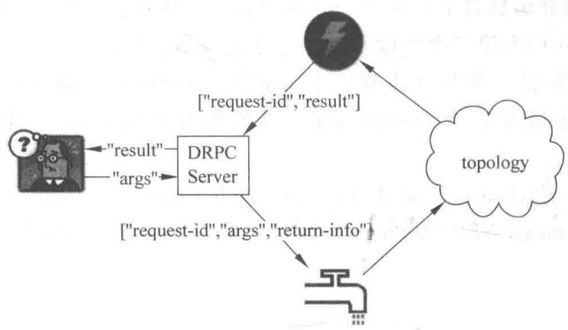

# DRPC 模式

$\therefore {S}_{\Delta ACD} = {S}_{\Delta BCD} + {S}_{\Delta CDE}$

## 13.1 DRPC 概述

Storm 里面引入 DRPC 主要是利用 Storm 的实时计算能力并行化 CPU 密集型 (CPU intensive) 的计算任务。DRPC 的 Storm topology 以函数的参数流作为输入, 而把这些函数调用的返回值作为 topology 的输出流。

DRPC 其实不能算是 Storm 本身的一个特性, 它是通过组合 Storm 的原语 stream、spout、bolt 和 topology 而成为一种模式(pattern)。

Distributed RPC 是由一个“DPRC 服务器”协调(Storm 自带了一个实现)。DRPC 服务器协调：①接收一个 RPC 请求，②发送请求到 Storm topology，③从 Storm topology 接收结果，④把结果发回给等待的客户端。从客户端的角度来看，调用一个 DRPC 和一个普通的 RPC 调用没有任何区别。例如，下面是客户端如何调用 DRPC 计算 reach 功能(function)的结果，如图 13-1 所示。

```sql
DRPCClient
  client = new
DRPCClient("drpc- host",
3772);
String
  result = client.execute("reach",
"http://twitter.com");
```

DRPC 的工作流程如图 13-1 所示。

  
图 13-1 DRPC 工作流程

客户端给 DRPC 服务器发送要执行的函数(function)的名字,以及这个函数的参数。实现了这个函数的 topology 使用 DRPCSpout 从 DRPC 服务器接收函数调用流,每个函数调用被 DRPC 服务器标记了一个唯一的 id。这个 topology 然后计算结果,在 topology 的最后,一个叫作 ReturnResults 的 Bolt 会连接到 DRPC 服务器,并且把这个调用的结果发送给 DRPC 服务器(通过唯一的 id 标识)。DRPC 服务器用唯一 id 与等待的客户端匹配,唤醒这个客户端并且把结果发送给它。

## 13.2 DRPC自动化组件

Storm 自带了一个称作 LinearDRPCTopologyBuilder 的 topology builder, 它把实现 DRPC 的几乎所有步骤都自动化。

(1) 设置 Spout。

(2) 把结果返回给 DRPC 服务器。

(3) 给 Bolt 提供有限聚合元组 tuples 的能力。

下面是一个在输入参数后面添加一个“!”的 DRPC topology 实现的例子。

```java
public static class exclaimBolt extends BaseBasicBolt {
    public void execute(Tuple tuple, BasicOutputCollector collector) {
        String input = tuple.getString(1);
        collector.emit(new Values(tuple.getValue(0), input + "!");
    }
    public void declareOutputFields(OutputFieldsDeclarer declarer) {
        declarer.declare(new Fields("id","result"));
    }
}
public static void main(String[] args) throws Exception {
    LinearDRPCTopologyBuilder builder = new LinearDRPCTopologyBuilder("exclamation");
    builder.addBolt(new ExclaimBolt(),3);
    //...
}
```

可以看出,我们需要做的事情非常少。创建 LinearDRPCTopologyBuilder 时,需要告诉它要实现的 DRPC 函数(DRPC function)的名字。一个 DRPC 服务器可以协调很多函数,函数与函数之间靠函数名字来区分。声明的第一个 Bolt 会接收一个两维 tuple,tuple 的第一个字段是 request-id,第二个字段是这个请求的参数。LinearDRPCTopologyBuilder 同时要求 topology 的最后一个 Bolt 发送一个形如[id,result]的二维 tuple: 第一个 field 是 request-id,第二个 field 是这个函数的结果。最后所有中间 tuple 的第一个 field 必须是 request-id。

在这个例子里,ExclaimBolt 简单地在输入 tuple 的第二个 field 后面再添加一个“!”,其余的事情都由 LinearDRPCTopologyBuilder 完成: 连接到 DRPC 服务器,并且把结果发回。

## 13.3 本地模式 DRPC

DRPC 可以本地模式运行,下面就是以本地模式运行上面例子的代码。

```javascript
LocalDRPC drpc = new LocalDRPC();
LocalCluster cluster = new LocalCluster();
cluster.submitTopology("drpc- demo", conf, builder.createLocalTopology(drpc));
System.out.println("Results for 'hello':" + drpc.execute("exclamation", "hello"));
cluster.shutdown();
drpc.shutdown();
```

首先要创建一个 LocalDRPC 对象, 这个对象在进程内模拟一个 DRPC 服务器(类似于 LocalCluster 在进程内模拟一个 Storm 集群), 然后创建 LocalCluster 对象, 在本地模式运行 topology。LinearTopologyBuilder 有单独的方法来创建本地的 topology 和远程的 topology。在本地模式下, LocalDRPC 对象不和任何端口绑定, 所以 topology 对象需要知道和谁交互, 这就是为什么 createLocalTopology 方法接受一个 LocalDRPC 对象作为输入的原因。

把 topology 启动之后, 就可以通过调用 LocalDRPC 对象的 execute 来调用 RPC 方法了。

## 13.4 远程模式 DRPC

在一个真实集群上面 DRPC 也是非常简单的,有三个步骤。

(1) 启动 DRPC 服务器。

(2) 配置 DRPC 服务器的地址。

(3) 提交 DRPC topology 到 Storm 集群里面。

可以通过 bin/storm drpc 命令先启动 DRPC 服务器。接着，需要让 Storm 集群知道 DRPC 服务器的地址。DRPCSpout 需要这个地址，从而可以从 DRPC 服务器接收函数调用。这个可以配置在 storm.yaml 或者通过代码的方式配置在 topology 里。通过 storm.yaml 配置如下。

```yaml
drpc.servers:
  - "drpc1.foo.com"
  - "drpc2.foo.com"
```

最后,通过 StormSubmitter 对象来提交 DRPC topology(这个跟用户提交其他 topology 没有区别)。如果要以远程的方式运行上面的例子,用下面的代码。

```javascript
StormSubmitter.submitTopology("exclamation- drpc",
conf, builder.createRemoteTopology());
```

用 createRemoteTopology 方法来创建运行在真实集群上的 DRPC topology。

## 13.5 一个更复杂的例子

以上的 DRPC 例子只是为了介绍 DRPC 概念的一个简单例子。下面看一个复杂的确实需要 Storm 的并行计算能力的例子，这个例子计算 Twitter 上面一个 URL 的 reach 值。一个 URL 的 reach 值是该 URL 对应的推文能到达(reach)的用户数量，要计算一个 URL 的 reach 值，需要做几个事情。

（1）获取所有推文中包含这个 URL 的人(转发过该 URL 的人)。

(2) 获取这些人的粉丝。

(3) 把这些粉丝去重。

(4) 获取这些去重之后的粉丝个数(即 reach 值)。

一个简单的 reach 计算可能会涉及成千上万个数据库的调用，并且可能涉及千万数量级的粉丝用户。这个确实可以说是 CPU intensive 的计算，但在 Storm 上面来实现这个是非常简单的。在单台机器上，一个 reach 计算可能需要花费几分钟，而在一个 Storm 集群里，即使是最难的 URL，也只需要几秒。

reach topology 的例子可以在 storm-starter 上找到, reach topology 的定义如下:

```java
LinearDRPCTopologyBuilder builder = new LinearDRPCTopologyBuilder("reach");
builder.addBolt(new GetTweeters(), 3);
builder.addBolt(new GetFollowers(), 12)
    .shuffleGrouping();
builder.addBolt(new PartialUniquer(), 6)
    .fieldsGrouping(new Fields("id", "follower"));
builder.addBolt(new CountAggregator(), 2)
    .fieldsGrouping(new Fields("id"));
```

这个 topology 分四步执行。

(1) GetTwitters 获取转发该推文的所有用户, 它接收输入流 [id, url], 它输出 [id, twitter]。每个 URL tuple 会对应很多 twitter tuple。

(2) GetFollowers 获取这些转发者 (twitter) 的粉丝, 它接收输入流 [id, twitter], 输出 [id, follower]。当然, 当某人关注的多个人都转发了同一条推文时, follower tuple 会存在重复, 这就需要下一步的去重。

(3) PartialUniquer 通过粉丝的 id 来分类粉丝, 使相同的粉丝会被引导到同一个 task。因此, 不同的 task 接收到的粉丝是不同的, 从而起到去重的作用。它的输出流 [id, count], 即输出这个 task 上统计的粉丝个数。

(4) 最后, CountAggregator 接收到所有的局部数量, 把它们加起来就算出了 reach 值。接下来看一下 PartialUniquer 的实现。

```java
public class PartialUniquer extends BaseBatchBolt {
    BatchOutputCollector _collector;
    Object _id;
    Set<String> _followers = new HashSet<String>();
    @Override
```

```java
public void prepare(Map conf, TopologyContext context, BatchOutputCollector,
collector, Object id) {
    _collector = collector;
    _id = id;
}
@Override
public void execute(Tuple tuple) {
    _followers.add(tuple.getString(1));
}
@Override
public void finishBatch() {
    _collector.emit(new Values(_id, _followers.size()));
}
@Override
public void declareOutputFields(OutputFieldsDeclarer declarer) {
    declarer.declare(new Fields("id", "partial- count"));
}
}
```

当 PartialUniquer 在 Execute 方法里面接收到一个粉丝 tuple 时, 它把这个 tuple 添加到当前 request-id 对应的 Set 里(利用 Set 元素不重复的特点进行去重)。

PartialUniquer 继承了 BaseBatchBolt 类。对于每个 request-id，创建一个相应 batch bolt 的实例，并且 Storm 会在合适时清理这些实例。batch bolt 提供了 finishBatch 方法，该方法将在 batch 中的所有 tuple 被处理完之后调用。PartialUniquer 仅发送一个 tuple，包含当前 request-id 在 task 上的粉丝数量。

## 本章小结

在本章中,通过介绍 DRPC 的自动化组件 LinearDRPCTopologyBuilder、本地模式以及远程模式的 DRPC 对 Storm 中的 DRPC 进行了介绍。

第 14 章将通过两个具体的工程实例对 Storm 进行进一步的介绍。

## 习题

（1）什么是DRPC，DRPC的作用是什么？DRPC分为几部分，服务端由几部分组成？

(2) DRPC 的工作流是怎样的?

(3) 函数与函数之间靠什么来区分?

(4) LinearDRPCTopologyBuilder 的工作原理是什么?
