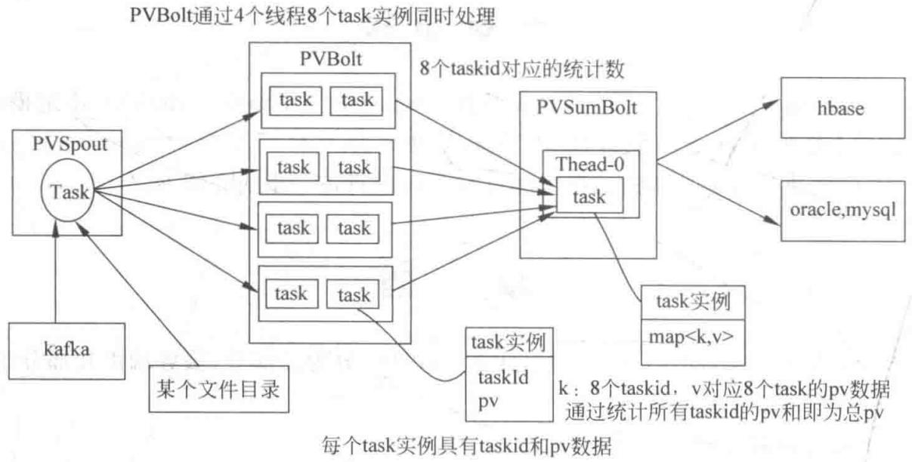
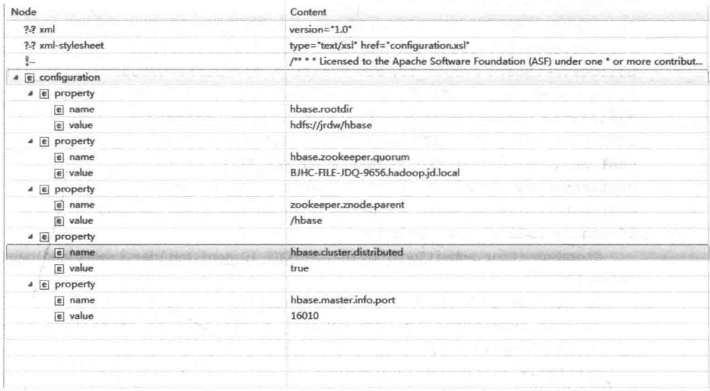
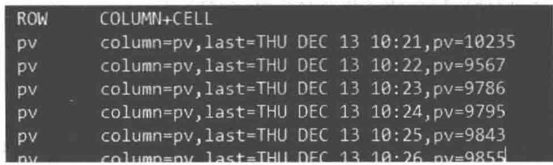

# 第14章

## Storm 实战

## 14.1 网站页面浏览量计算

## 14.1.1 背景介绍

对网站的运营者来说,网站页面浏览量的统计是必不可少的内容。无论是对网页质量的改进,还是对公司的战略部署都有着一定的参考价值。若要使用 Storm 对网站的页面浏览量进行统计,需要从两个方面进行考虑:①性能问题;②线程安全问题。日志是发生在网站服务器上的所有事件的记录,包括用户访问时间和用户访问 URL 等。对一些大型网站来说,用户的访问量是巨大的,因此要对访问日志进行分析,就必须用到大数据技术。

## 14.1.2 体系结构

程序的拓扑关系如图 14-1 所示。

  
图14-1 程序框架

## 14.1.3 项目相关介绍

该项目主要通过 Storm 拓扑来完成对京东网站的页面浏览量的计算,该项目用到了 Storm 和 HBase 相关技术,其中 hbase-site.xml 的内容如图 14-2 所示。

  
图14-2 hbase-site.xml层级

## 14.1.4 Storm编码实现

## 1. 编写 topology

```java
package com.storm;
import backtype.storm.Config;
import backtype.storm.LocalCluster;
import backtype.storm.StormSubmitter;
import backtype.storm.generated.AlreadyAliveException;
import backtype.storm.generated.InvalidTopologyException;
import backtype.storm.topology.TopologyBuilder;
import backtype.storm.utils.Utils;
import storm.kafka.KafkaSpout;
import storm.kafka.SpoutConfig;
import storm.kafka.ZkHosts;
import java.util.HashMap;
import java.util.Map;
import java.util.UUID;
public class PVTopology {
    public final static String SPOUT_ID = KafkaSpout.class.getSimpleName();
    public final static String PVBOLT_ID = PVBolt.class.getSimpleName();
    public final static String PVTOPOLOGY_ID = PVTopology.class.getSimpleName();
    public final static String PVSUMBOLT_ID = PVSumBolt.class.getSimpleName();
    public static void main(String[] args) throws AlreadyAliveException,
InvalidTopologyException {
        TopologyBuilder builder = new TopologyBuilder();
        String brokerZkStr = "172.19.176.49:2181,172.19.176.50:2181,172.19.176.51:
2181,172.19.176.52:2181,172.19.176.53:2181/kafka";
        String zkRoot = "/kafka";
        ZkHosts zkHosts = new ZkHosts(brokerZkStr);
        String topic = "flow_normalized_json";
```

```java
String id = UUID.randomUUID().toString();
SpoutConfig spoutconf = new SpoutConfig(zkHosts, topic, zkRoot, id);
builder.setSpout(SPOUT_ID, new KafkaSpout(spoutconf), 1);
builder.setBolt(PVBOLT_ID, new PVBolt(), 4).shuffleGrouping(SPOUT_ID);
builder.setBolt(PVSUMBOLT_ID, new PVSumBolt(), 1).shuffleGrouping(PVBOLT_ID);
Map<String,Object> conf = new HashMap<String,Object>();
conf.put(Config.TOPOLOGY_RECEIVER_BUFFER_SIZE, 8);
conf.put(Config.TOPOLOGY_TRANSFER_BUFFER_SIZE, 32);
conf.put(Config.TOPOLOGY_EXECUTOR_RECEIVE_BUFFER_SIZE, 16384);
conf.put(Config.TOPOLOGY_EXECUTOR_SEND_BUFFER_SIZE, 16384);
if(args!= null && args.length> 0){
    StormSubmitter.submitTopology(PVTOPOLOGY_ID,conf,builder.createTopology());
}else {
    LocalCluster cluster= new LocalCluster();
    cluster.submitTopology(PVTOPOLOGY_ID,conf,builder.createTopology());
    Utils.sleep(10000);
    cluster.killTopology(PVTOPOLOGY_ID);
    cluster.shutdown();
}
}
```

## 2. 编写 bolt

```java
package com.storm;
import backtype.storm.Config;
import backtype.storm.LocalCluster;
import backtype.storm.StormSubmitter;
import backtype.storm.generated.AlreadyAliveException;
import backtype.storm.generated.InvalidTopologyException;
import backtype.storm.topology.TopologyBuilder;
import backtype.storm.utils.Utils;
import storm.kafka.KafkaSpout;
import storm.kafka.SpoutConfig;
import storm.kafka.ZkHosts;
import java.util.HashMap;
import java.util.Map;
import java.util.UUID;
public class PVTopology {
    public final static String SPOUT_ID = KafkaSpout.class.getSimpleName();
    public final static String PVBOLT_ID = PVBolt.class.getSimpleName();
    public final static String PVTOPOLOGY_ID = PVTopology.class.getSimpleName();
    public final static String PVSUMBOLT_ID = PVSumBolt.class.getSimpleName();
    public static void main(String[] args) throws AlreadyAliveException,
InvalidTopologyException {
        TopologyBuilder builder = new TopologyBuilder();
        String brokerZkStr = "172.19.176.49:2181,172.19.176.50:2181,172.19.176.51:
2181,172.19.176.52:2181,172.19.176.53:2181/kafka";
        String zkRoot = "/kafka";
        ZkHosts zkHosts = new ZkHosts(brokerZkStr);
        String topic = "flow_normalized_json";
        String id = UUID.randomUUID().toString();
```

```txt
SpoutConfig spoutconf = new SpoutConfig(zkHosts, topic, zkRoot, id);
builder.setSpout(SPOUT_ID, new KafkaSpout(spoutconf), 1);
builder.setBolt( PVBOLT_ID, new PVBolt(), 4).shuffleGrouping(SPOUT_ID);
builder.setBolt( PVSUMBOLT_ID, new PVSumBolt(), 1).shuffleGrouping(PVBOLT_ID);
Map<String,Object> conf = new HashMap<String,Object>();
conf.put(Config. TOPOLOGY_RECEIVER_BUFFER_SIZE , 8);
conf.put(Config.TOPOLOGY_TRANSFER_BUFFER_SIZE, 32);
conf.put(Config.TOPOLOGY_EXECUTOR_RECEIVE_BUFFER_SIZE, 16384);
conf.put(Config.TOPOLOGY_EXECUTOR_SEND_BUFFER_SIZE, 16384);
if(args!= null && args.length> 0){
    StormSubmitter.submitTopology(PVTOPOLOGY_ID,conf,builder.createTopology());
}else {
    LocalCluster cluster= new LocalCluster();
    cluster.submitTopology(PVTOPOLOGY_ID,conf,builder.createTopology());
    Utils.sleep(10000);
    cluster.killTopology(PVTOPOLOGY_ID);
    cluster.shutdown();
}
}
```

## 3. 构建 Spout

```java
package com.storm;
import backtype.storm.task.OutputCollector;
import backtype.storm.task.TopologyContext;
import backtype.storm.topology.OutputFieldsDeclarer;
import backtype.storm.topology.base.BaseRichBolt;
import backtype.storm.tuple.Tuple;
import com.storm.util.HBaseDAO;
import org.apache.commons.lang.StringUtils;
import org.slf4j.Logger;
import org.slf4jheitFactory;
import javax.xml.crypto.Data;
import java.util.Date;
import java.util.HashMap;
import java.util.Map;
public class PVSumBolt extends BaseRichBolt {
    private static final long serialVersionUID = 1L;
    private OutputCollector collector;
    private Map<Integer,Long> map = new HashMap<Integer,Long>();
    private static Logger LOG= LoggerFactory.getLogger(PVBolt.class);
    @Override
    public void prepare(Map map, TopologyContext topologyContext, OutputCollector outputCollector) {
        this.collector = outputCollector;
        this.last = System.currentTimeMillis()/(1000* 60);
    }
    private long pv;
    private long last;
```

```java
@Override
    public void execute(Tuple tuple) {
        try {
            String bid= tuple.getStringByField("bid");
            if (StringUtils.isNotBlank(bid)) {
                pv++;
            }
            if (System.currentTimeMillis()(1000* 60)!= last) {
                last = System.currentTimeMillis()(1000* 60);
                    HBaseDAO.put ("storm", Long.toString(last),"info","pv", Long.toString(pv));
                pv= 0;
            }else {
                //do nothing
            }
            this.collector.ack(tuple);
        }catch(Exception e) {
            //e.printStackTrace();
            LOG.error(e.getMessage(),e);
            this.collector.fail(tuple);
        }
    }
    @Override
    public void declareOutputFields(OutputFieldsDeclarer outputFieldsDeclarer) {
    }
}
```

## 4. HBase 操作

## 1) HBaseDAO

```java
package com.storm.util;
import org.apache.hadoop.hbase.client.* ;
import org.apache.hadoop.hbase.filter.CompareFilter;
import org.apache.hadoop.hbase.filter.Filter;
import org.apache.hadoop.hbase.filterowedStringComparator;
import org.apache.hadoop.hbase.filter.RowFilter;
import org.apache.hadoop.hbase.util.Bytes;
import org.slf4j.Logger;
import org.slf4jheitFactory;
import java.io.IOException;
public class HBaseDAO {
    private static Logger LOG= LoggerFactory.getLogger(HBaseDAO.class);
    private static HBaseUtils hBaseUtils= new HBaseUtils("172.22.96.56",2181,"/hbase");
    public static void put(String tablename, String row, String columnFamily,
String column, String data) {
        HTable table = hBaseUtils.getTable(tablename);
        Put put = new Put(Bytes.toBytes(row));
        put.addColumn(Bytes.toBytes(columnFamily), Bytes.toBytes(column),
Bytes.toBytes(data));
        try {
```

```java
table.put(put);
table.close();
} catch (IOException e) {
LOG.error(e.getMessage(),e);
}
}
public static Result get(String tablename, String row) throws Exception {
HTable table = hBaseUtils.getTable(tablename);
Get get = new Get(Bytes.toBytes(row));
Result result = table.get(get);
table.close();
return result;
}
public static ResultScanner scan(String tablename) throws Exception {
HTable table = hBaseUtils.getTable(tablename);
Scan s = new Scan();
ResultScanner rs = table.getScanner(s);
return rs;
}
public static ResultScanner containKeys(String tablename,String rowkey) throws IOException, IllegalArgumentException, InstantiationException {
HTable table = hBaseUtils.getTable(tablename);
Scan scan= new Scan();
Filter filter= new RowFilter(CompareFilter.CompareOp.EQUAL,new高等院校Rowkey));
scan.setFilter(filter);
return table.getScanner(scan);
}
}
```

## 2) HBaseUtils

```java
package com.storm.util;
import org.apache.commons.lang.exception.ExceptionUtils;
import org.apache.hadoop.conf.Configuration;
import org.apache.hadoop.hbase.HBaseConfiguration;
import org.apache.hadoop.hbase.TableName;
import org.apache.hadoop.hbase.client.* ;
import org.slf4j.Logger;
import org.slf4jheitFactory;
import java.io.IOException;
public class HBaseUtils {
    private Logger LOG = LoggerFactory.getLogger(HBaseUtils.class);
    private Configuration configuration;
    private Connection connection;
    public HBaseUtils(){
        this.configuration = HBaseConfiguration.create();
    }
    public HBaseUtils(String zkServers, int zkPort, String zkRoot) {
        this.configuration = HBaseConfiguration.create();
```

```xml
this.configuration.set("hbase.zookeeper.quorum", zkServers);
this.configuration.set("hbase.zookeeper.property.clientPort", zkPort + "");
this.configuration.set("zookeeper.znode.parent", zkRoot);
}
public synchronized Connection getHConnection()
    throws IOException {
    if (connection == null) {
        connection = ConnectionFactory.createConnection(configuration);
//          connection = HConnectionManager.createConnection(configuration);
    }
    return connection;
}
public HTable getTable(String tableName) {
    HTable table = null;
    try {
        if (null == connection) {
            connection = getHConnection();
        }
        table = (HTable) connection.getTable(TableName.valueOf党委书记));
    } catch (IOException e) {
        LOG.error(ExceptionUtils.getFullStackTrace(e));
    }
    if (null == table) {
        throw new RuntimeException("" can not connect HBase: exception accurs when getting table from hconnection " + tableName);
    }
    return table;
}
}

5. 项目配置文件 pom.xml
<?xml version="1.0" encoding="UTF- 8"? >
<project xmlns="http://maven.apache.org/POM/4.0.0"
       xmlns:xsi="http://www.w3.org/2001/XMLSchema-instance"
       xsi:schemaLocation="http://maven.apache.org/POM/4.0.0 http://maven.apache.org/xsd/maven-4.0.0.xsd">
    <modelVersion> 4.0.0</modelVersion>
    <groupId> jd</groupId>
    <artifactId> bdp</artifactId>
    <version> 1.0-SNAPSHOT</version>
    <!--打全包括件-->
    <build>
        <plugins>
            <plugin>
                <artifactId> maven-assembly-plugin</artifactId>
                <configuration>
                    <appendAssemblyId> false</appendAssemblyId>
                    <descriptorRefs>
                        <descriptorRef> jar-with-dependencies</descriptorRef>
                    </descriptorRefs>
```

```xml
<archive>
    <manifest>
        <mainClass> </mainClass>
    </manifest>
</archive>
</configuration>
<executions>
    <execution>
        <id> make-assembly</id>
        <phase> package</phase>
        <goals>
            <goal> assembly</goal>
        </goals>
    </execution>
</executions>
</plugin>
<plugin>
    <groupId> org.apache.maven.plugins</groupId>
    <artifactId> maven-compiler-plugin</artifactId>
    <configuration>
        <source>1.7</source>
        <target>1.7</target>
    </configuration>
</plugin>
</plugins>
</build>
<!--https://mvnrepository.com/artifact/org.apache.storm/storm-core-->
<dependencies>
<dependency>
    <groupId> jdk.tools</groupId>
    <artifactId> jdk.tools</artifactId>
    <version>1.7</version>
    <scope> system</scope>
    <systemPath>\${JAVA_HOME}/lib/tools.jar</systemPath>
</dependency>
<dependency>
    <groupId> org.apache.storm</groupId>
    <artifactId> storm-core</artifactId>
    <version>0.9.4</version>
    <scope> provided</scope>
</dependency>
<!--https://mvnrepository.com/artifact/org.apache.storm/storm-kafka-->
<dependency>
    <groupId> org.apache.storm</groupId>
    <artifactId> storm-kafka</artifactId>
    <version>0.9.4</version>
</dependency>
<!--JSON 数据格式-->
<dependency>
    <groupId> com.alibaba</groupId>
    <artifactId> fastjson</artifactId>
```

```xml
<version>1.2.7</version>
</dependency>
<dependency>
    <groupId> org.apache.kafka</groupId>
    <artifactId> kafka_3.9.2</artifactId>
    <version> 0.8.1.1</version>
    <exclusions>
        <exclusion>
            <groupId> org.apache.zookeeper</groupId>
            <artifactId> zookeeper</artifactId>
        </exclusion>
        <exclusion>
            <groupId> log4j</groupId>
            <artifactId> log4j</artifactId>
        </exclusion>
    </exclusions>
</dependency>
<!--https://mvnrepository.com/artifact/org.apache.hbase/hbase-client-->
<dependency>
    <groupId> org.apache.hbase</groupId>
    <artifactId> hbase-client</artifactId>
    <version>1.1.2</version>
    <exclusions>
        <exclusion>
            <groupId> org.apache.zookeeper</groupId>
            <artifactId> zookeeper</artifactId>
        </exclusion>
        <exclusion>
            <groupId> log4j</groupId>
            <artifactId> log4j</artifactId>
        </exclusion>
        <exclusion>
            <groupId> org.slf4j</groupId>
            <artifactId> slf4j-log4j12</artifactId>
        </exclusion>
    </exclusions>
</dependency>
</dependencies>
</project>
```

## 14.1.5 运行 topology

采用 Storm jar 的方式将 topology 提交到集群中。

```txt
storm jar ./wkj/bdp.jar
    com.storm.PVTopology pv-topology
```

输出结果如图 14-3 所示。

  
图14-3 输出结果

## 14.2 网站用户访问量计算

## 14.2.1 背景介绍

本节主要是在 14.1 节的基础上所做的改进, 让最终结果中每个用户只输出一次用户访问记录, 从而得到用户的访问量。

## 14.2.2 Storm代码实现

## 1. 构建 topology

```java
package com.storm;
import backtype.storm.Config;
import backtype.storm.LocalCluster;
import backtype.storm.StormSubmitter;
import backtype.storm.generated.AlreadyAliveException;
import backtype.storm.generated.InvalidTopologyException;
import backtype.storm.topology.TopologyBuilder;
import backtype.storm.utils.Utils;
import org.slf4j.Logger;
import org.slf4jheitFactory;
import storm.kafka.KafkaSpout;
import storm.kafka.SpoutConfig;
import storm.kafka.ZkHosts;
import java.util.HashMap;
import java.util.Map;
import java.util.UUID;
/**
 *Created by konglu on 2016/7/29.
 */
public class UVTopology {
    private static String SPOUT_ID = KafkaSpout.class.getSimpleName();
    private static String PVBOLT_ID = PVBolt.class.getSimpleName();
    private static String UVBOLT_ID = UVBolt.class.getSimpleName();
    private static String UVTOPOLOGY_ID = UVTopology.class.getSimpleName();
    private static Logger LOG = LoggerFactory.getLogger(UVTopology.class);
    private static String UVSUMBOLT_ID = UVSumBolt.class.getSimpleName();
    public static void main(String ... args) {
        TopologyBuilder builder = new TopologyBuilder();
        String brokerZkStr = "172.19.176.49:2181,172.19.176.50:2181,172.19.176.51:
```

```txt
2181,172.19.176.52:2181,172.19.176.53:2181/kafka";
String zkRoot = "/kafka";
ZkHosts zkHosts = new ZkHosts(brokerZkStr);
String topic = "flow_normalized_json";
String id = UUID.randomUUID().toString();
SpoutConfig spoutconf = new SpoutConfig(zkHosts, topic, zkRoot, id);
builder.setSpout(SPOUT_ID, new KafkaSpout(spoutconf), 1);
builder.setBolt(PVBOLT_ID,new PVBolt(),16).shuffleGrouping(SPOUT_ID);
builder.setBolt(UVBOLT_ID,new UVBolt(),1).shuffleGrouping(PVBOLT_ID);
//builder.setBolt(UVSUMBOLT_ID,new UVSumBolt(),1).shuffleGrouping(UVBOLT_ID);
Config conf = new Config();
conf.setMaxSpoutPending(1000);
conf.setStatsSampleRate(1.0);
conf.setNumAckers(3);
if(args!= null && args.length> 0) {
    try {
        StormSubmitter.submitTopology (UVTPOLOGY _ ID, conf, builder.createTopology());
    } catch (AlreadyAliveException e) {
        LOG.error(e.getMessage(),e);
    } catch (InvalidTopologyException e) {
        LOG.error(e.getMessage(),e);
    }
}else {
    LocalCluster cluster= new LocalCluster();
    cluster.submitTopology(UVTPOLOGY_ID, conf, builder.createTopology());
    Utils.sleep(10000);
    cluster.killTopology(UVTPOLOGY_ID);
    cluster.shutdown();
}
}
```

## 2. 构建 Bolt

```java
package com.storm;
import backtype.storm.task.OutputCollector;
import backtype.storm.task.TopologyContext;
import backtype.storm.topology.OutputFieldsDeclarer;
import backtype.storm.topology.base.BaseRichBolt;
import backtype.storm.tuple.Fields;
import backtype.storm.tuple.Tuple;
import backtype.storm.tuple.Values;
import backtype.storm.utils.RotateMap;
import com.storm.util.HBaseDAO;
import org.apache.commons.lang.StringUtils;
import org.apache.hadoop.hbase.Cell;
import org.apache.hadoop.hbase.client.Result;
import org.apache.hadoop.hbase.util.Bytes;
import org.slf4j.Logger;
import org.slf4jheitFactory;
import java.util.HashMap;
```

```java
import java.util.Map;
public class UVBolt extends BaseRichBolt {
    private static final long serialVersionUID = 11;
    private OutputCollector collector = null;
    private TopologyContext context = null;
    private static Logger LOG = LoggerFactory.getLogger(UVBolt.class);
    private long last = System.currentTimeMillis()/(1000* 60);
    private long uv = 0;
    private Map<String,Long> map = new HashMap<String, Long>();
    private Map<String,Long> map_tmp = new HashMap<String, Long>();
    private byte[] cf = Bytes.toBytes("info");
    private byte[] col = Bytes.toBytes("time");
    private RotatingMap<String, Long> rmap;
    @Override
    public void prepare(Map stormConf, TopologyContext context, OutputCollector col
        this.collector = collector;
        this.collector = collector;
        this.rmap = new RotatingMap<String, Long> (2);
    }
    @Override
    public void execute(Tuple input) {
        String bid = input.getStringByField("bid");
        long ts = input.getLongByField("ts");
        if(StringUtils.isNotBlank(bid)) {
            if (map.containsKey(bid)) {
                long tmp = map.get(bid)/(1000* 60);
                if(tmp == last) {
                    //do nothing
                }else {
                    uv++;
                }
                map.put(bid,ts);
            } else if (map_tmp.containsKey(bid)) {
                long tmp = map_tmp.get(bid)/(1000* 60);
                if(tmp == last) {
                    //do nothing
                }else {
                    uv++;
                }
                map_tmp.put(bid,ts);
            }else {
                map.put(bid,ts);
                try {
                    Result rs = HBaseDAO.get("storm_bid",bid);
                    if(rs == null) {
                        uv++;
                    }else {
                        Cell cell = rs.getColumnLatestCell(cf,col);
                        if(cell == null) {
                            uv++;
```

```java
}else {
byte[] time_bytes = cell.getValueArray();
long time = Bytes.toLong(time_bytes)/(1000*60);
if(time == last){
//do nothing
}else {
uv++;
}
}
}
} catch (Exception e) {
//e.printStackTrace();
LOG.error(e.getMessage(),e);
this.collector.fail(input);
}
}
HBaseDAO.put("storm_bid", bid, "info", "time", Long.toString(ts));
if (map.size()>100000) {
Map tmp = map_tmp;
map_tmp = map;
tmp.clear();
map = tmp;
}
this.collector.emit(new Values(uv));
}
this.collector.ack(input);
if(!(System.currentTimeMillis()/(1000*60) == last)){
last = System.currentTimeMillis()/(1000*60);
HBaseDAO.put("storm", Long.toString(last),"info","uv", Long.toString(uv));
uv = 0;
}
}
@Override
public void declareOutputFields(OutputFieldsDeclarer declarer) {
}
}
```

## 3. 构建 Spout

```java
package com.storm;
import backtype.storm.topology.BasicOutputCollector;
import backtype.storm.topology.OutputFieldsDeclarer;
import backtype.storm.topology.base.BaseBasicBolt;
import backtype.storm.tuple.Tuple;
import com.storm.util.HBaseDAO;
public class UVSumBolt extends BaseBasicBolt{
    private long last=System.currentTimeMillis()(1000* 60);
    private long uv=0;
    @Override
    public void execute(Tuple input, BasicOutputCollector collector) {
        uv+=(Long)input.getValueByField("uv");
```

```java
if(!(System.currentTimeMillis()/(1000* 60)==last)){
    last=System.currentTimeMillis()(1000* 60);
    HBaseDAO.put("storm", Long.toString(last), "info", "uv", Long.toString(uv));
    uv=0;
}
}
@Override
public void declareOutputFields(OutputFieldsDeclarer declarer) {
}
}
```

## 14.2.3 运行 topology

采用 Storm jar 的方式将 topology 提交到集群中。

```txt
storm jar ./wkj/bdp.jar
    com.storm.UVTopology uv-topology
```

输出结果如图 14-4 所示。

  
图14-4 输出结果

## 本章小结

本章通过统计网站的 pv 和 uv 两个 Storm 工程实例, 加深对 Storm 的理解。在了解 Storm 工程的“庐山真面目”后, 可以尝试更多的 Storm 项目构建。

## 习题

（1）按照本章介绍，尝试在本机上实现网站 pv 的项目构建。

(2) 按照本章介绍, 尝试在本机上实现网站 uv 的项目构建。

## 参考文献

[1] 吉奥兹. Storm 分布式实时计算模式 [M]. 北京：机械工业出版社，2015.

[2] 安德森. Storm 实时数据处理 [M]. 北京：机械工业出版社，2015.

[3] 马延辉, 陈书美. Storm 企业级应用: 实战、运维和调优 [M]. 北京: 机械工业出版社, 2015.

[4] 赵必厦, 程丽明. 从零开始学 Storm[M]. 北京: 清华大学出版社, 2016.

[5] 乔治. HBase 权威指南 [M]. 北京：人民邮电出版社，2013.

[6] 蒋燚峰. HBase 管理指南[M]. 北京：人民邮电出版社，2013.

[7] 马延辉, 孟鑫. HBase 企业应用开发实战 [M]. 北京: 机械工业出版社, 2014.

[8] 荣凯拉, 里德. Zookeeper 分布式过程协同技术详解 [M]. 北京: 机械工业出版社, 2016.

[9] 徐郡明. Apache Kafka 源码剖析 [M]. 北京：电子工业出版社，2017.

Document generated by Anna's Archive around 2023-2024 as part of the DuXiu collection (https://annas-blog.org/duxiu-exclusive.html).

Images have been losslessly embedded. Information about the original file can be found in PDF attachments. Some stats (more in the PDF attachments):