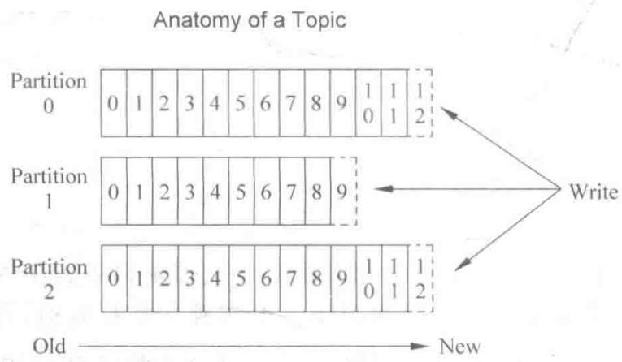
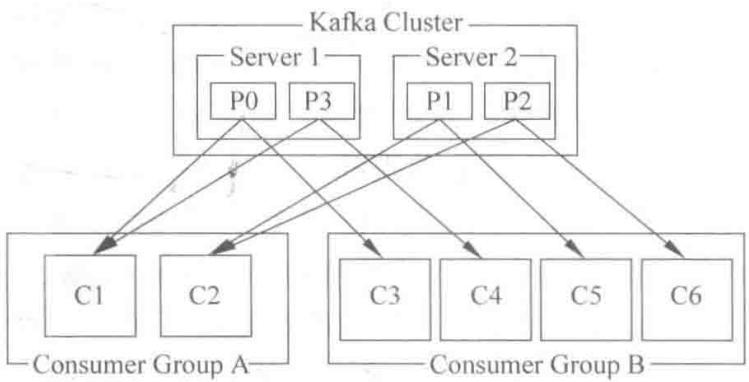

# 第2章

# 初识 Kafka

## 2.1 什么是 Kafka

## 2.1.1 Kafka 概述

Kafka 是一个高吞吐的分布式消息系统, 最初是由 LinkedIn 开发, 用作 LinkedIn 的活动流 (activity stream) 和运营数据处理管道 (pipeline) 的基础。现在它已被多家不同类型的公司作为多种类型的数据管道 (data pipeline) 和消息系统使用。现在 Kafka 则是 Apache 的项目之一, 被 Apache 托管。

企业集成的基本特点是把企业中现存的本不相干的各种应用进行集成。例如，一个企业可能想把财务系统和仓管系统进行集成，减少部门间结算和流通的成本和时间，并能更好地支持上层决策。但这两个系统是由不同的厂家做的，不能修改。另外，企业集成是一个持续渐进的过程，需求变化非常频繁。这就要求MQ系统要非常灵活，可定制性非常高。常见的MQ系统通常可以通过复杂的XML配置或插件开发进行定制，以适应不同企业的业务流程的需要。它们大多数都能通过配置不同程度的支持EIP中定义的一些模式，但设计目标并没有很重视扩展性和性能，因为通常企业级应用的数据流和规模都不会非常大。即使有的比较大，使用高配置的服务器或做一个简单几个节点的集群就可以满足了。

大规模的 Service 是指面向公众的向 Facebook、Google、LinkedIn 和 taobao 这样级别或有可能成长到这个级别的应用。相对企业集成来讲，这些应用的业务流程相对比较稳定。子系统间集成的业务复杂度也相对较低，因为子系统通常也是经过精心选择和设计的并能做一定的调整，所以对 MQ 系统的可定制性及定制的复杂性要求并不高。但由于数据量会非常巨大，不是几台 Server 能满足的，可能需要几十台甚至几百台，且对性能要求较高以降低成本，所以 MQ 系统需要有很好的扩展性。而 Kafka 是一个满足 SaaS 要求的 MQ 系统，它可通过降低 MQ 系统的复杂度来提高性能和扩展性。

## 2.1.2 使用场景

Kafka 消息处理包括以下场景。

（1）消息处理。Kafka 可以用来替代传统的消息系统。与传统的消息系统相比，Kafka 有更好的吞吐量、分隔、复制、负载均衡和容错能力。

（2）网页动态跟踪。最初的 Kafka 就是以管道的方式使用发布订阅的，构建一个用户的活动跟踪系统的管道。

（3）运营数据监控。用来作为监控系统运营的数据管道。

（4）日志聚合。将不同系统、不同平台的日志聚合到一起做集中处理，很多场景用来作为一个日志聚合的解决方案。

（5）流处理。通过对原始数据的聚合、富有化、转化、包装成新的数据，再次发布成消息供以后使用。

## 2.1.3 Kafka 基本特性

## 1. 可靠性(一致性)

MQ 要实现从 producer(数据生产者)到 consumer(数据使用者)之间可靠地传送和分发消息。传统的 MQ 系统通常都是通过 broker(代理)和 consumer 间的 ack(确认)机制实现的，并在 broker 保存消息分发的状态。即使这样，一致性也是很难保证的（当然 Kafka 也支持 ack 机制）。Kafka 的做法是由 consumer 自己保存状态，也不要任何确认。这样虽然 consumer 负担更重，但其实更灵活了。因为不管 consumer 上任何原因导致需要重新处理消息，都可以再次从 broker 获得。

Kafka 的 producer 有一种异步发送的操作, 这是为提高性能提供的。producer 先将消息放在内存中, 就返回。这样调用者(应用程序)不需要等网络传输结束就可以继续了。内存中的消息会在后台批量地发送到 broker。由于消息会在内存中停留一段时间, 这段时间是有消息丢失的风险的, 所以使用该操作时需要仔细评估这一点。

## 2. 高可用性

Kafka 可以将 Log(记录) 文件复制到其他 topic 的分隔点(可以看成 Server)。当一个 Server 在集群中 fails(失败), 可以允许自动 failover(切换) 到其他复制的 Server, 所以消息可以继续存在于这种情况下。

## 3. 扩展性

Kafka 使用 Zookeeper 来实现动态的集群扩展, 不需要更改客户端 (producer 和 consumer) 的配置。broker 会在 Zookeeper 注册并保持相关的元数据 (topic、partition 信息等) 更新, 而客户端会在 Zookeeper 上注册相关的 watcher (监控)。一旦 Zookeeper 发生变化, 客户端能及时感知并做出相应调整。这样就保证了添加或去除 broker 时, 各 broker 间仍能自动实现负载均衡。

## 4. 负载均衡

负载均衡可以分为两个部分：producer 发消息的负载均衡和 consumer 读消息的负载均衡。

producer 有一个到当前所有 broker 的连接池, 当一个消息需要发送时, 需要决定发送到哪个 broker(即 partition)。这是由 partition 实现的, partition 是由应用程序实现的。应用程序可以实现任意的分区机制。要实现均衡的负载均衡同时考虑到消息顺序的问题(只有一个 partition/broker 上的消息能保证按顺序投递), partition 的实现并不容易。

consumer 读取消息时,除了考虑当前的 broker 情况外,还要考虑其他 consumer 的情况,才能决定从哪个 partition 读取消息。

## 2.1.4 性能

性能是 Kafka 设计重点考虑的因素,应使用多种方法来保证稳定的 I/O 性能。

Kafka 使用磁盘文件保存收到的消息。它使用一种类似于 WAL(Write Ahead Log) 的机制来实现对磁盘的顺序读写,然后再定时地将消息批量写入磁盘。消息的读取基本也是顺序的,这符合MQ的顺序读取和追加写特性。

另外，Kafka 通过批量消息传输来减少网络传输，并使用 Java 中的发送文件和零复制机制来减少从读取文件到发送消息间内存数据复制和内核用户态切换的次数。

根据 Kafka 的性能测试报告, 其性能基本达到了 I/O 的复杂度。

## 2.1.5 总结

Kafka 和其他绝大多数消息系统相比,有如下几个设计决策的区别。

(1) Kafka 将持久化消息作为通常的使用情况进行考虑。

(2) 系统设计的主要约束是吞吐量而不是功能。

（3）Kafka 将数据是否被使用的状态信息作为数据使用者(consumer)的一部分保存，而不是保存在服务器上。

（4）Kafka 是一种显式的分布式系统。数据生产者 (producer)、代理 (broker) 和数据使用者 (consumer) 分散于多台机器上。

## 2.1.6 Kafka 在 LinkedIn 中的应用

图 2-1 所示是在 LinkedIn 中部署各系统形成的拓扑结构。

  
图 2-1 LinkedIn 中各系统的拓扑关系

需要注意的是,一个单独的 Kafka 集群系统用于处理来自各种不同来源的所有活动数据。它同时为在线和离线的数据使用者提供了一个单独的数据管道,在线活动和异步处理之间形成一个缓冲区层。还可以使用 Kafka 把所有数据复制(replicate)到另外一个不同的数据中心去做离线处理。

不让一个单独的 Kafka 集群系统跨越多个数据中心,而是让 Kafka 支持多数据中心的数据流拓扑结构,要通过在集群之间进行镜像或同步来实现。这个功能非常简单,镜像集群只是作为源集群的数据使用者的角色运行。这意味着,一个单独的集群就能够将来自多个数据中心的数据集中到一个位置。图 2-2 所示是可用于支持批量加载(batch loads)的多数据中心拓扑结构的一个例子。

  
图 2-2 多数据中心拓扑结构

注意：图 2-2 中上面部分的两个集群之间不存在通信连接，两者可能大小不同，具有不同数量的节点。下面部分的单独的集群可以镜像任意数量的源集群。

## 2.2 Topics 和 logs

首先深入了解一下 Kafka 提供的 high-level 的抽象——Topic。

Topic 可以看成不同消息的类别或者信息流, 不同的消息通过不同的 Topic 进行分类或者汇总, 然后 producer 将不同分类的消息发送到不同的 Topic。对于每一个 Topic, Kafka 集群维护一个分区的日志, 如图 2-3 所示。

  
图 2-3 Topic 的分布解析

由图 2-3 可以看出, 每个 partition 中的消息序列都是有序的, 并且不可更改, 这些分区可以在尾部不停地追加消息。同一分区中的不同消息都会分配一个唯一的数字进行标识, 这个数字被称为 offset, 用于进行消息的区分。每一条消息都是由若干个字节构成。

Kafka 集群可以保存所有发布的消息,无论消息是否被消费,保存时间都是可配置的。例如,如果日志保存时间设置为两天,则从日志保存之时开始,两天之内都是可消费的,然而两天之后消息会被抛弃，以释放空间。因此，Kafka 可以高效持久地保存大量数据。

事实上,每个消费者所需要保存的元数据只有一个 offset(偏移值),即记录日志中当前consume的位置。offset 是由 consumer 所控制的。通常情况下,offset 会随着 consumer 阅读消息而线性地递增,好像 offset 只能被动跟随 consumer 阅读变化。但实际上,offset 完全是由 consumer 控制的,consumer 可以从任何它喜欢的位置 consume 消息。例如,consumer 可以将 offset 重新设置为先前的值并重新 consume 数据。

这些特征共同说明，Kafka consumer 可以很廉价地进行操作。在不必影响集群和其他 consumer 的情况下，consumer 可以很自由地来去。例如，可以使用 Kafka 提供的命令行工具去追踪任何 Topic 的内容，而不必改变当前 consumer 所使用的 Topic 内容。

日志服务器中存在 partition 有若干目的：①多个分区的共存可以使日志规模超过单独 Server 的尺寸。需要注意的是，每一个单独的分区必须符合所在 Server 的尺寸，即同一个 Topic 的同一个 partition 的数据只能在同一台 Server 上存储，也就是说同一个 Topic 下的同一个 partition 的数据不能同时存放于两台 Server 上，但是同一个 Topic 可以包含很多 partition。这样就使同一个 Topic 可以包含任意数量的数据，理论上可以通过增加 Server 的数目来增加 partition 的数目。②多个 partition 的存在，可以作为数据并行处理的单位，而不是以 bit 为单位（既可以由多个 consumer 使用不同的 partition，也可以由不同的 consumer 使用同一个 partition，因为 offset 是由 consumer 控制的）。

## 2.3 分布式——consumers 和 producers

每个分区在 Kafka 集群的若干服务中都有副本, 这些持有副本的服务可以共同处理数据和请求, 副本数量是可以配置的。副本使 Kafka 具备了容错能力。

每个分区都由一个服务器作为 leader(领导者)，零个或若干个服务器作为 followers(跟随者)。leader 负责处理消息的读和写，followers 则去复制 leader。如果 leader 离线了，followers 中的一台则会自动成为 leader。集群中的每个服务都会同时扮演两个角色：作为它所持有的一部分分区的 leader，同时作为其他分区的 followers，这样集群就会具有较好的负载均衡。

producer 将消息发布到它指定的 Topic 中，并负责决定发布到哪个分区。通常简单地由负载均衡机制随机选择分区，但也可以通过特定的分区函数选择分区。使用得更多的是第二种。发布消息通常有两种模式：队列模式(queuing)和发布—订阅模式(publish-subscribe)。

队列模式中，consumers 可以同时从服务端读取消息，每个消息只被其中一个 consumer 读到。发布一订阅模式中，消息被广播到所有的 consumer 中。consumers 可以加入一个 consumer 组，共同竞争一个 Topic，Topic 中的消息将被分发到组中的一个成员中。同一组中的 consumer 可以在不同的程序中，也可以在不同的机器上。如果所有的 consumer 都在一个组中，这就成了传统的队列模式，在各 consumer 中实现负载均衡；如果所有的 consumer 都在不同的组中，这就成了发布一订阅模式，所有的消息都被分发到所有的 consumer 中。更常见的是，每个 Topic 都有若干数量的 consumer 组，每个组都是一个逻辑上的“订阅者”。为了容错和更好的稳定性，每个组由若干 consumer 组成。这就是一个发布一订阅模式，只不过订阅者是单个的组，而不是单个 consumer。

由两个机器组成的集群拥有 4 个分区(P0～P3)、2 个 consumer 组，A 组有两个 consumer 而 B 组有 4 个，如图 2-4 所示。

  
图 2-4 两个机器组成的集群

传统的队列在服务器上保存有序的消息,如果多个 consumers 同时从这个服务器消费消息,服务器就会以消息存储的顺序向 consumer 分发消息。虽然服务器按顺序发布消息,但是消息是被异步分发到各 consumer 上,所以当消息到达时可能已经失去了原来的顺序,这意味着并发消费将导致顺序错乱。为了避免故障,这样的消息系统通常使用“专用 consumer”的概念,其实就是只允许一个消费者消费消息,当然这就意味着失去了并发性。

在这方面 Kafka 做得更好,通过分区的概念,Kafka 可以在多个 consumer 组并发的情况下提供较好的有序性和负载均衡。将每个分区只分发给一个 consumer 组,这样一个分区只被这个组的一个 consumer 消费,就可以顺序地消费这个分区的消息。因为有多个分区,依然可以在多个 consumer 组之间进行负载均衡。注意,consumer 组的数量不能多于分区的数量,也就是有多少分区就允许多少并发消费。

Kafka 只能保证一个分区之内消息的有序性，在不同的分区之间是不可以的，这已经可以满足大部分应用的需求。如果需要 Topic 中所有消息有序，那只能让这个 Topic 只有一个分区，当然也就只有一个 consumer 消费它。

## 本章小结

本章学习了 Kafka 的相关特性, 包括 Topics 和 Logs, 以及分布式系统中的 producers 和 consumers。本章的知识点如下。

(1) Kafka 的相关特性、应用场景以及特点。其重要性不言而喻，在宏观上对 Kafka 有了一定的了解。

(2) Topics 和 Logs。首先要对消息队列有所了解,明白消息队列中 Topic 的分布和解析是有序的。

（3）consumer 和 producer。对于生产者和消费者，要熟知它们的消息处理方式。最后要了解的是，相对于其他的消息系统，Kafka 可以很好地保证有序性。

## 习题

(1) Kafka 有何特性?

(2) Kafka 有哪些组件？请做简要介绍。
