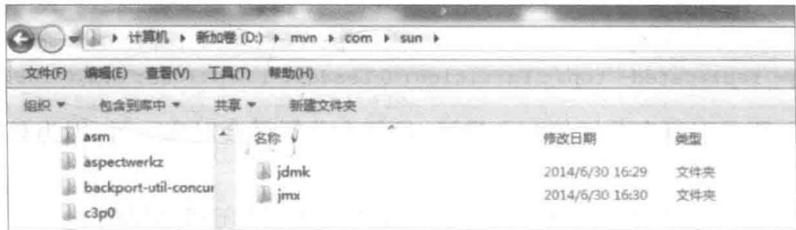

# Kafka 环境搭建

## 3.1 服务器搭建

Kafka 服务器的搭建可按以下步骤进行。

(1) 下载 Kafka。下载最新的版本并解压。

```batch
> tar -xzf kafka_2.9.2-0.8.1.1.tgz
> cd kafka_2.9.2-0.8.1.1
```

(2) 启动服务。Kafka 用到了 Zookeeper, 所以首先应启动 Zookeeper。下面启用一个单实例的 Zookeeper 服务。可以在命令的结尾加 & 符号, 这样就可以启动服务后离开控制台。

```txt
> bin/zookeeper-server-start.sh config/zookeeper.properties &
[2013-04-22 15:01:37,495] INFO Reading configuration from:config/zookeeper.properties
(org.apache.zookeeper.server.quorum.QuorumPeerConfig)
...
```

现在启动 Kafka:

> bin/kafka-server-start.sh config/server.properties
[2013-04-22 15:01:47,028] INFO Verifying properties (kafka.utils.VerifiableProperties)
[2013-04-22 15:01:47,051] INFO Property socket.send.buffer.bytes is overridden to
1048576 (kafka.utils.VerifiableProperties)
...

（3）创建 Topic。创建一个叫作 test 的 Topic，它只有一个分区，一个副本。

```shell
> bin/kafka-topics.sh --create --zookeeper localhost:2181 --replication- factor
1 --partitions 1 --topic test
```

可以通过 list 命令查看创建的 Topic。

```txt
> bin/kafka-topics.sh --list --zookeeper localhost:2181
test
```

除了手动创建 Topic, 还可以配置 broker 来自动创建 Topic。

（4）发送消息。Kafka 使用一个简单的命令行 producer，从文件或者标准输入中读取消息并发送到服务端。默认每条命令将发送一条消息。

```txt
大数据实时计算与应用
```

运行 producer，并在控制台输入一些消息，这些消息将被发送到服务端。

```txt
> bin/kafka-console-producer.sh --broker-list localhost:9092 --topic test
This is a message This is another message
```

按 Ctrl+C 组合键可以退出发送。

(5) 启动 consumer。Kafka 有一个命令行 consumer, 可以读取消息并输出到标准输出。

```shell
> bin/kafka-console-consumer.sh --zookeeper localhost:2181 --topic test --from-beginning
This is a message
This is another message
```

在一个终端运行 consumer 命令行，在另一个终端运行 producer 命令行，就可以在一个终端输入消息，在另一个终端读取消息。

这两个命令都有自己的可选参数，可以在运行时不加任何参数就看到帮助信息。

（6）搭建一个具有多个 broker 的集群。刚才只是启动了单个 broker，现在启动由 3 个 broker 组成的集群，这些 broker 节点都是在本机上。

首先为每个节点编写配置文件。

```txt
> cp config/server.properties config/server-1.properties
> cp config/server.properties config/server-2.properties
```

在复制出的新文件中添加以下参数。

```txt
config/server-1.properties:
    broker.id=1
    port=9093
    log.dir=/tmp/kafka-logs-1
config/server-2.properties:
    broker.id=2
    port=9094
    log.dir=/tmp/kafka-logs-2
```

broker.id 在集群中唯一标注一个节点,因为在同一个机器上,所以必须制定不同的端口和日志文件,避免数据被覆盖。

刚才已经启动 Zookeeper 和一个节点, 现在启动另外两个节点。

```txt
> bin/kafka-server-start.sh config/server-1.properties &
...
> bin/kafka-server-start.sh config/server-2.properties &
...
```

创建一个拥有3个副本的Topic。

```shell
> bin/kafka- topics.sh --create --zookeeper localhost:2181 --replication-factor
3 --partitions 1 --topic my-replicated-topic
```

现在已经搭建了一个集群,怎么知道每个节点的信息呢?运行 describe topics 命令就可以了。

```txt
> bin/kafka-topics.sh --describe --zookeeper localhost:2181 --topic my-replicated-topic
Topic:myreplicatedtopic PartitionCount:1 ReplicationFactor:3 Configs:
Topic: my- replicated- topic Partition: 0 Leader: 1 Replicas: 1,2,0 Isr: 1,2,0
```

其中，第一行是对所有分区的一个描述，且每个分区都会对应一行，因为只有一个分区，所以下面只加了一行。

Leader: 负责处理消息的读和写, Leader 是从所有节点随机选择的。

Replicas: 列出了所有的副本节点,不管节点是否在服务中。

Isr: 是正在服务中的节点。

在本例中，节点1是作为Leader运行。向Topic发送消息。

```shell
> bin/kafka-console-producer.sh --broker-list localhost:9092 --topic my-replicated-topic
...
my test message lmy test message 2^C

消费这些消息：

> bin/kafka-console-consumer.sh --zookeeper localhost:2181 --from-beginning --
topic my-replicated-topic
...
my test message 1
my test message 2
```

## 3.2 开发环境搭建

搭建好了 Kafka 的服务器, 可以使用 Kafka 的命令行工具创建 Topic, 发送和接收消息。下面介绍搭建 Kafka 的开发环境。

## 1. 添加依赖

搭建开发环境需要引入 Kafka 的 jar 包,一种方式是将 Kafka 安装包中 lib 目录下的 jar 包加入项目的 classpath 中;另一种方式是使用 maven 管理 jar 包依赖。

创建好maven项目后，在pom.xml中添加以下依赖。

```xml
<dependency>
    <groupId> org.apache.kafka</groupId>
    <artifactId> kafka_2.10</artifactId>
    <version> 0.8.0</version>
</dependency>
```

添加依赖后会发现有两个 jar 包的依赖找不到。下载这两个 jar 包，解压后有两种选择：第一种是使用 mvn 的 install 命令将 jar 包安装到本地仓库；另一种是直接将解压后的文件夹复制到 mvn 本地仓库的 com 文件夹下，如 d:\mvn。完成后目录结构如图 3-1 所示。

## 2. 配置程序

首先是一个充当配置文件作用的接口,配置了 Kafka 的各种连接参数。

  
图3-1 目录结构

```java
package com.sohu.kafkaademon;
public interface KafkaProperties
{
    final static String zkConnect = "10.22.10.139:2181";
    final static String groupId = "group1";
    final static String topic = "topic1";
    final static String kafkaServerURL = "10.22.10.139";
    final static int kafkaServerPort = 9092;
    final static int kafkaProducerBufferSize = 64 * 1024;
    final static int connectionTimeOut = 200Q0;
    final static int reconnectInterval = 10000;
    final static String topic2 = "topic2";
    final static String topic3 = "topic3";
    final static String clientId = "SimpleConsumerDemoClient";
}
Producer
package com.sohu.kafkaademon;
import java.util.Properties;
import kafka.producer.KeyedMessage;
import kafka.producer.ProducerConfig;
/**
*@author leicui bourne_cui@163.com
*/
public class KafkaProducer extends Thread
{
    private final kafka.javaapi.producer.Producer<Integer, String> producer;
    private final String topic;
    private final Properties props = new Properties();
    public KafkaProducer(String topic)
    {
        props.put("serializer.class", "kafka.serializer.StringEncoder");
        props.put("metadata.broker.list", "10.22.10.139:9092");
        producer = new kafka.javaapi.producer.Producer<Integer, String> (new ProducerConfig(props));
        this.topic = topic;
    }
    @Override
    public void run() {
        int messageNo = 1;
        while (true)
```

```cs
{
    String messageStr = new String("Message_" + messageNo);
    System.out.println("Send:" + messageStr);
    producer.send(new KeyedMessage<Integer, String> (topic, messageStr));
    messageNo++;
    try {
        sleep(3000);
    } catch (InterruptedException e) {
        //TODO Auto-generated catch block
        e.printStackTrace();
    }
}
}
```

```java
Consumer
package com.sohu.kafkademon;
import java.util.HashMap;
import java.util.List;
import java.util.Map;
import java.util.Properties;
import kafka.consumer.ConsumerConfig;
import kafka.consumer.ConsumerIterator;
import kafka.consumer.KafkaStream;
import kafka.javaapi.consumer.ConsumerConnector;
/**
*@author leicui bourne_cui@163.com
*/
public class KafkaConsumer extends Thread
{
    private final ConsumerConnector consumer;
    private final String topic;
    public KafkaConsumer(String topic)
    {
        consumer = kafka.consumer.Consumer.createJavaConsumerConnector(
createConsumerConfig());
        this.topic = topic;
    }
    private static ConsumerConfig createConsumerConfig()
    {
        Properties props = new Properties();
        props.put("zookeeper.connect", KafkaProperties.zkConnect);
        props.put("group.id", KafkaProperties.groupId);
        props.put("zookeeper.session.timeout.ms", "40000");
        props.put("zookeeper.sync.time.ms", "200");
        props.put("auto.commit.interval.ms", "1000");
        return new ConsumerConfig(props);
    }
    @Override
    public void run() {
        Map<String, Integer> topicCountMap = new HashMap<String, Integer>();
    }
}
```

```groovy
topicCountMap.put(topic, new Integer(1));
Map<String, List<KafkaStreamrophy[], byte>>> consumerMap = consumer.
createMessageStreams(topicCountMap);
KafkaStream< byte[], byte[]> stream = consumerMap.get(topic).get(0);
ConsumerIterator< byte[], byte[]> it = stream.iterator();
while (it.hasNext()) {
    System.out.println("receive: " + new String(it.next().message()));
    try {
        sleep(3000);
    } catch (InterruptedException e) {
        e.printStackTrace();
    }
}
}
```

## 3. 简单的发送/接收

运行以下程序,可以进行简单的发送/接收消息。

```java
package com.sohu.kafkademon;
/**
*@author leicui bourne_cui@163.com
*/
public class KafkaConsumerProducerDemo
{
    public static void main(String[] args)
    {
        KafkaProducer producerThread = new KafkaProducer(KafkaProperties.topic);
        producerThread.start();
        KafkaConsumer consumerThread = new KafkaConsumer(KafkaProperties.topic);
        consumerThread.start();
    }
}
```

## 4. 高级别的 consumer

以下是比较负载的发送/接收的程序。

```java
package com.sohu.kafkaademon;
import java.util.HashMap;
import java.util.List;
import java.util.Map;
import java.util.Properties;
import kafka.consumer.ConsumerConfig;
import kafka.consumer.ConsumerIterator;
import kafka.consumer.KafkaStream;
import kafka.javaapi.consumer.ConsumerConnector;
/**
*@author leicui bourne_cui@163.com
*/
public class KafkaConsumer extends Thread
{
```

```groovy
private final ConsumerConnector consumer;
private final String topic;
public KafkaConsumer(String topic)
{
    consumer = kafka.consumer.Consumer.createJavaConsumerConnector(
createConsumerConfig());
    this.topic = topic;
}
private static ConsumerConfig createConsumerConfig()
{
    Properties props = new Properties();
    props.put("zookeeper.connect", KafkaProperties.zkConnect);
    props.put("group.id", KafkaProperties.groupId);
    props.put("zookeeper.session.timeout.ms", "40000");
    props.put("zookeeper.sync.time.ms", "200");
    props.put("auto.commit.interval.ms", "1000");
    return new ConsumerConfig(props);
}
@Override
public void run() {
    Map<String, Integer> topicCountMap = new HashMap<String, Integer>();
    topicCountMap.put(topic, new Integer(1));
    Map<String, List<KafkaStream Bhte[], byte[]>>> consumerMap = consumer.
createMessageStreams(topicCountMap);
    KafkaStream Bhte[], byte[]> stream = consumerMap.get(topic).get(0);
    ConsumerIterator Bhte[], byte[]> it = stream.iterator();
    while (it.hasNext()) {
        System.out.println("receive: " + new String(it.next().message()));
        try {
            sleep(3000);
        } catch (InterruptedException e) {
            e.printStackTrace();
        }
    }
}
```

## 本章小结

通过本章的学习,对 Kafka 的搭建有了一定的了解,知道了如何搭建 Kafka 系统以及对一些问题的处理方式。

第 4 章将对 Kafka 的结构进行介绍。

## 习题

请试着按照本章的方法在本机上搭建 Kafka 集群。
