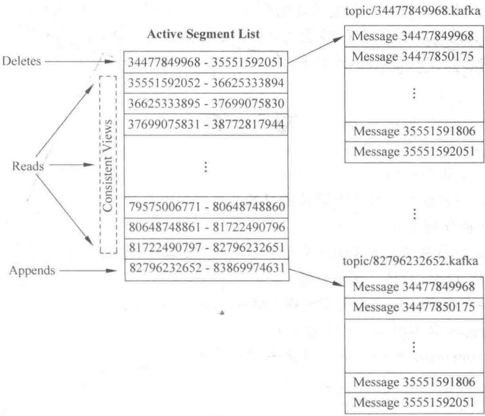

# 第4章

# Kafka 消息传送

## 4.1 消息传输的事务定义

之前讨论了 consumer 和 producer 是怎么工作的, 现在来讨论数据传输。数据传输的事务定义通常有以下三种级别。

最多一次：消息不会被重复发送，最多被传输一次，但也有可能一次不传输。

最少一次：消息不会被漏发送，最少被传输一次，但也有可能被重复传输。

精确的一次(Exactly once): 不会漏传输也不会重复传输, 每个消息都被传输一次而且仅仅被传输一次, 这是大家所期望的。

大多数消息系统声称可以做到“精确的一次”，但是仔细阅读这些文档可以看到里面存在误导，例如没有说明当 consumer 或 producer 失败时怎么样，或者当有多个 consumer 并行时怎么样，或写入硬盘的数据丢失时又会怎么样。Kafka 的做法要先进一些。当发布消息时，Kafka 有一个 committed 的概念，一旦消息被提交了，只要消息被写入的分区所在的副本 broker 是活动的，数据就不会丢失。关于副本的活动的概念，下节会讨论，现在假设 broker 是不会离线(down)的。

如果 producer 发布消息时发生了网络错误,但又不确定是在提交之前发生的还是提交之后发生的,这种情况虽然不常见,但是必须考虑进去。现在的 Kafka 版本还没有解决这个问题,将来的版本正在努力尝试解决。

并不是所有的情况都需要“精确的一次”这样高的级别，Kafka 允许 producer 灵活地指定级别。如 producer 可以指定必须等待消息被提交的通知，或者完全异步发送消息而不等待任何通知，或者仅仅等待 leader 声明它拿到了消息(followers 没有必要)。

现在从 consumer 方面考虑这个问题, 所有的副本都有相同的日志文件和相同的 offset, consumer 维护自己消费的消息的 offset, 如果 consumer 不会崩溃, 则可以在内存中保存这个值, 当然谁也不能保证这一点。如果 consumer 崩溃了, 会有另外一个 consumer 接着消费消息, 它需要从一个合适的 offset 继续处理。这种情况下可以有以下选择。

consumer 可以先读取消息,然后将 offset 写入日志文件中,再处理消息。这存在一种可能,在存储 offset 后还没处理消息就崩溃 (crash) 了,新的 consumer 继续从这个 offset 开始处理,那么就会有些消息永远不会被处理,这就是上面说的“最多一次”。

consumer 可以先读取消息,处理消息,最后记录 offset,但如果在记录 offset 之前就崩溃了,新的 consumer 会重复消费一些消息,这就是上面说的“最少一次”。

“精确的一次”可以通过将提交分为两个阶段来解决。保存 offset 后提交一次，消息处理成功之后再提交一次。但是还有更简单的做法，将消息的 offset 和消息被处理后的结果保存在一起。例如，用 Hadoop ETL 处理消息时，将处理后的结果和 offset 同时保存在 HDFS 中，这样就能保证消息和 offset 同时被处理了。

## 4.2 性能优化

Kafka 在提高效率方面做了很大努力。Kafka 的一个主要使用场景是处理网站活动日志，吞吐量是非常大的，每个页面都会产生很多次写操作。读方面，假设每个消息只被消费一次，读的量也是很大的，Kafka 尽量使读的操作更轻量化。

之前已经讨论了磁盘的性能问题,线性读写的情况下影响磁盘性能问题大约有两个方面:太多琐碎的I/O操作和太多的字节复制。I/O问题可能发生在客户端和服务端之间,也可能发生在服务端内部的持久化的操作中。

## 4.2.1 消息集

为了避免这些问题，Kafka 建立了消息集(message set)的概念，将消息组织到一起，作为处理的单位。以消息集为单位处理消息，比以单个消息为单位处理会提升不少性能。producer 把消息集一块发送给服务端，而不是一条条地发送；服务端把消息集一次性追加到日志文件中，这样减少了琐碎的 I/O 操作。consumer 也可以一次性请求一个消息集。

另外一个性能优化是在字节复制方面。在低负载的情况下这不是问题，但是在高负载的情况下它的影响还是很大的。为了避免这个问题，Kafka 使用了标准的二进制消息格式，这个格式可以在 producer、broker 和 producer 之间共享而无须做任何改动。

zero copy

broker 维护的消息日志仅仅是一些目录文件,消息集以固定的格式写入日志文件中。这个格式是 producer 和 consumer 共享的,使 Kafka 可以一个很重要的点进行优化:消息在网络上的传递。现代的 UNIX 操作系统提供了高性能的将数据从页面缓存发送到 Socket 的系统函数,Linux 中的这个函数是 sendfile()。

为了更好地理解函数 sendfile() 的好处, 先来看一般将数据从文件发送到 Socket 的数据流向。

(1) 操作系统把数据从文件复制到内核中的页缓存。

（2）应用程序从页缓存把数据复制到自己的内存缓存。

(3) 应用程序将数据写入内核中的 Socket 缓存。

（4）操作系统把数据从 Socket 缓存中复制到网卡接口缓存，从这里发送到网络。

这显然是低效率的,有 4 次复制和两次系统调用。函数 sendfile() 直接将数据从页面缓存发送到网卡接口缓存,避免了重复复制,大大优化了性能。

在一个多 consumers 的场景里, 数据仅仅被复制到页面缓存一次而不是每次消费消息时都重复地进行复制, 使消息以近乎网络带宽的速率发送出去。这样在磁盘层面几乎看不到任何的读操作, 因为数据都是从页面缓存直接发送到网络。

## 4.2.2 数据压缩

很多时候,性能的瓶颈并非 CPU 或者硬盘,而是网络带宽,对于需要在数据中心之间传送大量数据的应用更是如此。用户可以在没有 Kafka 支持的情况下各自压缩自己的消息,但是这将导致较低的压缩率,因为相比于将消息单独压缩,将大量文件压缩在一起才能起到最好的压缩效果。

Kafka 采用了端到端的压缩。因为有“消息集”的概念，客户端的消息可以一起被压缩后发送到服务端，并以压缩后的格式写入日志文件，以压缩的格式发送到 consumer，消息从 producer 发出到 consumer 收到都是压缩的，只有在 consumer 使用时才被解压缩，所以叫作端到端的压缩。

## 4.3 生产者和消费者

## 4.3.1 Kafka 生产者的消息发送

producer 直接将数据发送到 broker 的 Leader(主节点), 不需要在多个节点间进行分发。为了帮助 producer 做到这一点, 所有的 Kafka 节点都可以及时地告知: 哪些节点是活动的, Topic 目标分区的 leader 在哪儿。这样 producer 就可以直接将消息发送到目的地。

客户端控制消息将被分发到哪个分区？可以通过负载均衡随机地选择，或者使用分区函数。Kafka 允许用户实现分区函数，指定分区的 key(关键字)，将消息 hash 到不同的分区上（当然有需要也可以覆盖这个分区函数自己实现逻辑）。例如，如果指定的 key 是 user id，那么同一个用户发送的消息都被发送到同一个分区上。经过分区之后，consumer 就可以有目的地消费某个分区的消息。

批量发送可以有效地提高发送效率。Kafka producer 的异步发送模式允许进行批量发送，先将消息缓存在内存，然后一次请求批量发送出去。这个策略可以配置，可以指定缓存的消息达到某个量时就发送出去，或者缓存了固定的时间后就发送出去（如 100 条消息就发送，或者每 5s 发送一次）。这种策略将大大减少服务端的 I/O 次数。

既然缓存是在 producer 端进行的,那么当 producer 崩溃时,这些消息就会丢失。Kafka 0.8.1 的异步发送模式还不支持回调,不能在发送出错时进行处理。Kafka 0.9 可能会增加这样的回调函数。

## 4.3.2 Kafka consumer

Kafka consumer 消费消息时, 向 broker 发出 fetch 请求去消费特定分区的消息。consumer 指定消息在日志中的偏移量 (offset), 就可以消费从这个位置开始的消息。customer 拥有 offset 的控制权, 可以向后回滚去重新消费之前的消息, 这是很有意义的。

Kafka 最初考虑的问题是, customer 应该从 brokers 拉取消息还是 brokers 将消息推送到 consumer, 也就是 pull 还是 push。这方面, Kafka 遵循了一种大部分消息系统共同的传统设计: producer 将消息推送到 broker, consumer 从 broker 拉取消息。

一些消息系统(如 Scribe 和 Apache Flume)采用了 push 模式, 将消息推送到下游的 consumer。这样做有好处, 也有坏处。由 broker 决定消息推送的速率, 对于不同消费速率的 consumer 就不太好处理了。消息系统致力于让 consumer 以最大的速率消费消息, 不幸的是, push 模式下, 当 broker 推送的速率远大于 consumer 消费的速率时, consumer 恐怕就要崩溃了。最终, Kafka 还是选取了传统的 pull 模式。

pull 模式的另外一个好处是 consumer 可以自主决定是否批量地从 broker 拉取数据。push 模式必须在不知道下游 consumer 消费能力和消费策略的情况下决定是立即推送每条消息，还是缓存之后批量推送。如果为了避免 consumer 崩溃而采用较低的推送速率，可能导致一次只推送较少的消息而造成浪费。在 pull 模式下，consumer 可以根据自己的消费能力决定这些策略。

pull 模式有个缺点,如果 broker 没有可供消费的消息,将导致 consumer 不断地在循环中轮询,直到新消息到达。为了避免这一点,Kafka 有个参数,可以让 consumer 阻塞知道新消息到达。当然,也可以阻塞知道消息的数量,使其达到某个特定的量再批量发送。

同样，对消费消息状态的记录也是很重要的。

大部分消息系统在 broker 端的维护消息中有被消费的记录：一个消息被分发到 consumer 后，broker 马上进行标记或者等待 customer 的通知后进行标记。这样可以在消息被消费后立即删除以减少空间的占用。

这样会不会有什么问题呢？如果一条消息发送出去之后立即被标记为消费过的，一旦consumer处理消息失败（如程序崩溃），消息就丢失了。为了解决这个问题，很多消息系统提供了另外一个功能：当消息被发送出去之后仅仅被标记为已发送状态，当接到consumer已经消费成功地通知后才标记为已被消费的状态。这虽然解决了消息丢失的问题，但产生了新问题。首先，如果consumer处理消息成功了，但是向broker发送响应时失败了，这条消息将被消费两次。第二个问题是，broker必须维护每条消息的状态，并且每次都要先锁住消息，然后更改状态，再释放锁。这样麻烦又来了，且不说要维护大量的状态数据，如消息发送出去但没有收到消费成功的通知，这条消息将一直处于被锁定的状态。Kafka采用了不同的策略。Topic被分成若干分区，每个分区在同一时间只被一个consumer消费。这意味着每个分区被消费的消息在日志中的位置仅仅是一个简单的整数offset。这样很容易标记每个分区的消费状态，仅仅需要一个整数而已。这样消费状态的跟踪变得简单了。

这带来了另外一个好处，consumer可以把offset调成一个过去的值，去重新消费过去的消息。这对传统的消息系统来说看起来有些不可思议，但确实是非常有用的，谁规定了一条消息只能被消费一次呢？consumer发现解析数据的程序有bug，修改bug后再来解析一次消息，看起来是很合理的。

高级的数据持久化允许 consumer 每个隔一段时间批量地将数据加载到线下系统中，例如 Hadoop 或者数据仓库。这种情况下，Hadoop 可以将加载任务分拆，拆成每个 broker、Topic 或每个分区加载一个任务。Hadoop 具有任务管理功能，当一个任务失败了可以重启，而不用担心数据被重新加载，只要从上次加载的位置开始。

## 4.4 主从同步

Kafka 允许 Topic 的分区拥有若干副本, 这个数量是可以配置的, 可以为每个 Topic 配置副本的数量。Kafka 会自动在每个副本上备份数据, 所以当一个节点损坏时数据依然是可用的。

Kafka 的副本功能不是必需的,可以配置只有一个副本,这样相当于只有一份数据。创建副本的单位是 Topic 的分区,每个分区都有一个 Leader 和零或多个 Followers。所有的读写操作都由 Leader 处理,一般分区的数量都比 broker 的数量多得多,各分区的 Leader 均匀地分布在 brokers 中。所有的 Followers 都复制 Leader 的日志,日志中的消息与顺序都与 Leader 中的一致。Followers 像普通的 consumer 一样从 Leader 那里拉取消息,并保存在自己的日志文件中。

许多分布式的消息系统会自动地处理失败的请求,它们对一个节点是否活着(alive)有着清晰的定义。Kafka 判断一个节点是否活着有两个条件:节点必须可以维护和 Zookeeper 的连接,Zookeeper 通过心跳机制检查每个节点的连接。如果节点是 Follower,它必须能及时地同步 Leader 的写操作,延时不能太久。

准确地说,符合以上条件的节点应该是同步中的(in sync),而不是模糊地说是“活着的”或“失败的”。Leader会追踪所有“同步中”的节点,一旦一个离线(down)了,或是卡住了,或是延时太久,Leader就会把它移除。至于延时多久可以认为是“太久”,由参数 replica.lag.max.messages 决定;怎样可以认为是卡住了,由参数 replica.lag.time.max.ms 决定。

只有当消息被所有的副本加入日志中时,才是 committed(被提交)。只有 committed 的消息才会发送给 consumer,这样就不用担心一旦 Leader down 消息会丢失。producer 也可以选择是否等待消息被提交的通知,这是由参数 request.required.acks 决定的。Kafka 保证只要有一个“同步中”的节点,committed 的消息就不会丢失。

Kafka 的核心是日志文件, 日志文件在集群中的同步是分布式数据系统基础的要素。

如果 Leader 永远不会 down, 就不需要 Followers 了。一旦 Leader down, 需要在 Followers 中选择一个新的 Leader, 但是 followers 本身有可能延时太久或者 crash, 所以必须选择高质量的 Follower 作为 Leader。必须保证, 一旦一个消息被提交了, 但是 Leader down, 新选出的 Leader 必须可以提供这条消息。大部分的分布式系统采用了多数投票法则选择新的 Leader。对于多数投票法则, 就是根据所有副本节点的状况动态地选择最适合的作为 Leader。Kafka 并不使用这种方法。

Kafka 动态维护了一个同步状态的副本的集合(a set of in-sync replicas, ISR), 在这个集合中的节点都是和 Leader 保持高度一致的, 任何一条消息必须被这个集合中的每个节点读取并追加到日志中, 才会通知外部这个消息已经被提交了。因此, 这个集合中的任何一个节点随时可以被选为 Leader。ISR 在 Zookeeper 中维护。ISR 中有 $f + 1$ 个节点, 可以允许在 $f$ 个节点 down 的情况下不会丢失消息, 并正常提供服务。ISR 的成员是动态的, 如果一个节点被淘汰了, 当它重新达到“同步中”的状态时, 它可以重新加入 ISR。这种 Leader 的选择方式是非常快速的, 适合 Kafka 的应用场景。

一个最坏的想法：如果所有节点都 down 怎么办？Kafka 对数据不会丢失的保证，是基

于至少一个节点是存活的，一旦所有节点都 down，这就不能保证了。

实际应用中,当所有的副本都 down 时,必须及时做出反应,可以有以下两种选择。

(1) 等待 ISR 中的任何一个节点恢复并担任 Leader。

(2) 选择所有节点中(不只是 ISR)第一个恢复的节点作为 Leader。

这是一个在可用性和连续性之间的权衡。如果等待ISR中的节点恢复，一旦ISR中的节点活不起来或者数据都死了，那集群就永远恢复不了。如果等待ISR意外的节点恢复，这个节点的数据就会被作为线上数据，有可能和真实的数据有所出入，因为有些数据可能还没同步到。Kafka目前选择了第二种策略，在未来的版本中将使这个策略的选择可配置，以便根据场景灵活地选择。

这种窘境不只 Kafka 会遇到, 几乎所有的分布式数据系统都会遇到。

以上仅仅以一个 Topic 分区为例子进行了讨论,实际上一个 Kafka 将会管理成千上万的 Topic 分区。Kafka 尽量使所有分区均匀地分布到集群所有的节点上,而不是集中在某些节点上,另外主从关系也尽量均衡,这样每个节点都会担任一定比例的分区的 Leader。

优化 leader 的选择过程也是很重要的, 它决定了系统发生故障时的空窗期有多久。Kafka 选择一个节点作为 controller(控制器), 当发现有节点 down 时, 它负责在游泳分区的所有节点中选择新的 Leader, 使 Kafka 可以批量、高效地管理所有分区节点的主从关系。如果 controller down, 活着的节点中的一个会被切换为新的 controller。

## 4.5 客户端 API

## 4.5.1 Kafka producer API

procuder API 有两种：kafka.producer.SyncProducer 和 kafka.producer.async.AsyncProducer。它们都实现了同一个接口。

```java
class Producer {
    /* 将消息发送到指定分区 */
    publicvoid send(kafka.javaapi.producer.ProducerData<K,V>producerData);
    /* 批量发送一批消息 */
    publicvoid send(java.util.List<kafka.javaapi.producer.ProducerData<K,V>>
producerData);
    /* 关闭 producer */
    publicvoid close();
}
```

producer API 提供了以下功能。

（1）可以将多个消息缓存到本地队列中，然后异步地批量发送到 broker，通过参数 producer.type=async 做到。缓存的大小可以通过一些参数指定：queue.time 和 batch.size。一个后台线程（kafka.producer.async.ProducerSendThread）从队列中取出数据，并让 kafka.producer.EventHandler 将消息发送到 broker，也可以通过参数 event.handler 定制 handler，在 producer 端处理数据的不同阶段注册处理器，如可以对这一过程进行日志追踪，或进行一些监控。只需实现 kafka.producer.async.CallbackHandler 接口，并在 callback.

handler 中配置。

(2) 自己编写 Encoder 来序列化消息, 只需实现下面这个接口。默认的 Encoder 是 kafka.serializer.DefaultEncoder。

```typescript
interface Encoder<T> {
    public Message toMessage(T data);
```

（3）提供了基于 Zookeeper 的 broker 自动感知能力，可以通过参数 zk.connect 实现。如果不使用 Zookeeper，也可以使用 broker.list 参数指定一个静态的 brokers 列表。这样消息将被随机地发送到一个 broker 上，一旦选中的 broker 失败了，消息发送也就失败了。

(4) 通过分区函数的 kafka.producer.Partitioner 类对消息分区。

```txt
interface Partitioner<T> {
    int partition(T key, int numPartitions);
}
```

（5）分区函数有两个参数：key 和可用的分区数量。从分区列表中选择一个分区，并返回 id。默认的分区策略是 hash(key)%numPartitions，如果 key 是 null，就随机地选择一个。可以通过参数 partitioner.class 定制分区函数。

## 4.5.2 Kafka consumer API

consumer API 有低级别和高级别两个级别。

低级别的和一个指定的 broker 保持连接，并在接收完消息后关闭连接。这个级别是无状态的，每次读取消息都带着 offset。

高级别的 API 隐藏了和 brokers 连接的细节，在不必关心服务端架构的情况下和服务端通信，还可以自己维护消费状态，并通过一些条件指定订阅特定的 Topic，如白名单、黑名单或者正则表达式。

## 1. 低级别的 API

```java
class SimpleConsumer {
    /* 向一个 broker 发送读取请求并得到消息集 */
    public ByteBufferMessageSet fetch(FetchRequest request);
    /* 向一个 broker 发送读取请求并得到一个响应集 */
    public MultiFetchResponse multifetch(List<FetchRequest> fetches);
    /**
     * 得到指定时间之前的 offsets
     * 返回值是 offsets 列表,以倒序排序
     * @param time: 时间,毫秒
     * 如果指定为 OffsetRequest\$.MODULE\$.LATIEST_TIME(), 得到最新的 offset
     * 如果指定为 OffsetRequest\$.MODULE\$.EARLIEST_TIME(), 得到最初的 offset
     */
    publiclong[] getOffsetsBefore (String topic, int partition, long time, int maxNumOffsets);
}
```

低级别的 API 是高级别 API 实现的基础,也是为了一些对维持消费状态有特殊需求的

场景,如 Hadoop consumer 这样的离线 consumer。

## 2. 高级别的 API

```java
/* 创建连接 */
ConsumerConnector connector = Consumer.create(consumerConfig);
interface ConsumerConnector {
    /**
     * 这个方法可以得到一个流的列表,每个流都是 MessageAndMetadata 的迭代,通过
     * MessageAndMetadata 可以拿到消息和其他的元数据(目前之后 topic)
     * Input: a map of <topic, #streams>
     * Output: a map of <topic, list of message streams>
     */
    public Map<String, List<KafkaStream>> createMessageStreams(Map<String, TopicCountMap);
    /**
     * 也可以得到一个流的列表,它包含符合 TopicFilter 的消息的迭代
     * 一个 TopicFilter 是一个封装了白名单或黑名单的正则表达式
     */
    public List<KafkaStream> createMessageStreamsByFilter(
TopicFilter topicFilter, int numStreams);
    /* 提交目前消费到的 offset */
    public commitOffsets()
    /* 关闭连接 */
    public shutdown()
}
```

这个 API 围绕由 KafkaStream 实现的迭代器展开, 每个流代表一系列从一个或多个分区和多个 broker 上汇聚来的消息, 每个流由一个线程处理, 所以客户端可以在创建时通过参数指定想要几个流。一个流是多个分区、多个 broker 的合并, 但是每个分区的消息只会流向一个流。

每调用一次 createMessageStreams 都会将 consumer 注册到 Topic 上, 这样 consumer 和 brokers 之间的负载均衡就会得到调整。API 鼓励每次调用创建更多的 Topic 流以减少这种调整。createMessageStreamByFilter 方法注册监听可以感知新的符合 filter 的 Topic。

## 4.6 消息和日志

消息由一个固定长度的头部和可变长度的字节数组组成。头部包含一个版本号和CRC32校验码。

```txt
/**
 * 具有 N 字节的消息的格式如下
 *
 * 如果版本号是 0
 *
 * 1.1 字节的 magic 标记
 *
 * 2.4 字节的 CRC32 校验码
 *
```

## 实时计算与应用

\* 3.N-5字节的具体信息

\* 如果版本号是 1

\* 1.1字节的 magic 标记

\* 2.1 字节的参数允许标注一些附加的信息比如是否压缩了,解码类型等

\* 3.4 字节的 CRC32 校验码

\* 4.N-6字节的具体信息

一个叫作 my\_topic 的日志且有两个分区的 Topic, 它的日志由两个文件夹组成: my\_topic\_0 和 my\_topic\_1。每个文件夹里放着具体的数据文件, 每个数据文件都是一系列的日志实体, 每个日志实体有一个 4 字节标注消息的长度整数 N, 后边跟着 N 字节的消息。每个消息都可以由一个 64 位的整数 offset 标注, offset 标注了这条消息在发送到这个分区的消息流中的起始位置。每个日志文件的名称都是这个文件第一条日志的 offset, 所以第一个日志文件的名字就是 00000000000. kafka。相邻的两个文件名字的差别就是一个数字 S, S 的最大值就是配置文件中指定的日志文件的最大容量。

消息的格式由一个统一的接口维护,所以消息可以在 producer、broker 和 consumer 之间无缝地传递。存储在硬盘上的消息格式如下所示。

(1) 消息长度: $4B(value=1+4+n)$ ;

(2) 版本号：1B；

(3) CRC 校验码：4B；

(4) 具体的消息：nB。

写操作消息被不断地追加到最后一个日志的末尾，当日志的大小达到一个指定的值时会产生一个新的文件，如图4-1所示。对于写操作有两个参数：一个规定了消息的数量，达到这个值时必须将数据刷新到硬盘上；另一个规定了刷新到硬盘的时间间隔，对数据的持久性作保证，在系统崩溃时只会丢失一定数量的消息或者一个时间段的消息。

读操作需要两个参数：64 位的 offset 和最大读取量。最大读取量通常比单个消息的大小要大，但在一些个别消息比较大的情况下，最大读取量会小于单个消息的大小。这种情况下，读操作会不断重试，每次重试都会将读取量加倍，直到读取到一个完整的消息。可以配置单个消息的最大值，这样服务器会拒绝大小超过这个值的消息。也可以给客户端指定一个尝试读取的最大上限，避免为了读到一个完整的消息而无限次地重试。

在实际执行读取操纵时,首先需要定位数据所在的日志文件,然后根据 offset 计算出在这个日志中的 offset(前面的 offset 是整个分区的 offset),再从这个 offset 的位置进行读取。定位操作是由二分查找法完成的,Kafka 在内存中为每个文件维护了 offset 的范围。

下面是发送给 consumer 的结果的格式。

MessageSetSend (fetch result)

total length : 4 bytes

error code : 2 bytes

message 1 : x bytes

message n : x bytes

MultiMessageSetSend (multiFetch result)

total length : 4 bytes

error code : 2 bytes

messageSetSend 1

messageSetSend n

Segment Files  
  
图 4-1 日志文件示意图

日志管理器允许定制删除策略。目前的策略是删除修改时间在 N 天之前的日志（按时间删除）；也可以使用另外一个策略：保留最后的 NGB 数据的策略（按大小删除）。为了避免在删除时阻塞读操作，采用了 copy-on-write 形式的实现，删除操作进行时，读取操作的二分查找功能实际是在一个静态的快照副本上进行的，这类似于 Java 的 CopyOnWriteArrayList。

日志文件有一个可配置的参数 $M$ ，缓存超过这个数量的消息将被强行刷新到硬盘。一个日志矫正线程将循环检查最新的日志文件中的消息，确认每个消息都是合法的。合法的标准为：所有文件的大小和最大的offset小于日志文件的大小，并且消息的CRC32校验码与存储在消息实体中的校验码一致。如果某个offset发现不合法的消息，从这个offset到下一个合法的offset之间的内容将被移除。

有两种情况必须考虑。

(1) 当发生崩溃时有些数据块未能写入。

(2) 写入了一些空白数据块。

第二种情况的原因是,对于每个文件,操作系统都有一个 inode(inode 是指在许多“类 UNIX 文件系统”中的一种数据结构。每个 inode 保存了文件系统中的一个文件系统对象,包括文件、目录、大小、设备文件、socket、管道等),但无法保证更新 inode 和写入数据的顺序。当 inode 保存的大小信息被更新了,但写入数据时发生了崩溃,就产生了空白数据块。CRC 校验码可以检查这些块并移除,当然因为崩溃而未写。

## 本章小结

本章从生产者和消费者间信息传递的角度出发，对 Kafka 系统的机制进行介绍。主要包括 Kafka 消息的传送事务定义、性能优化以及主从同步。最后介绍了 Kafka 生产者、消费者 API 以及消息和日志的概念，并对 Kafka 系统做了全面的介绍。

## 习题

(1) Kafka 有哪些角色?

(2) partition 的作用是什么？设计的目的及根本原因是什么？

(3) offset 的作用是什么?

（4）消息系统有哪两类？Kafka中几乎不允许对消息进行“随机读写”的原因是什么？

(5) 什么是 Topic 消息广播和单播？

(6) Kafka 的元数据和 Topic 是否都存储在 Zookeeper 中?

(7) Zookeeper 在 Kafka 中的作用是什么?

(8) 集群 consumer 和 producer 的状态信息是如何保存的？
