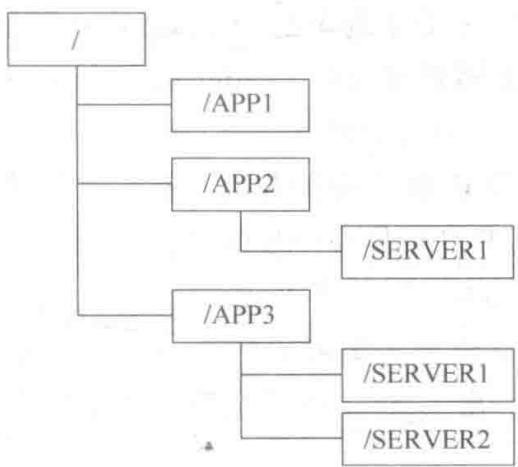
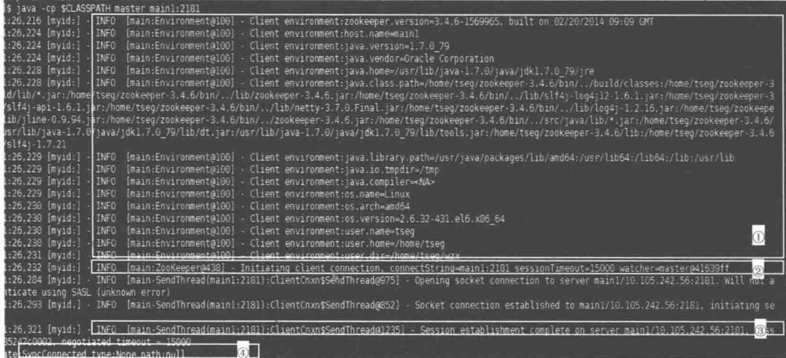
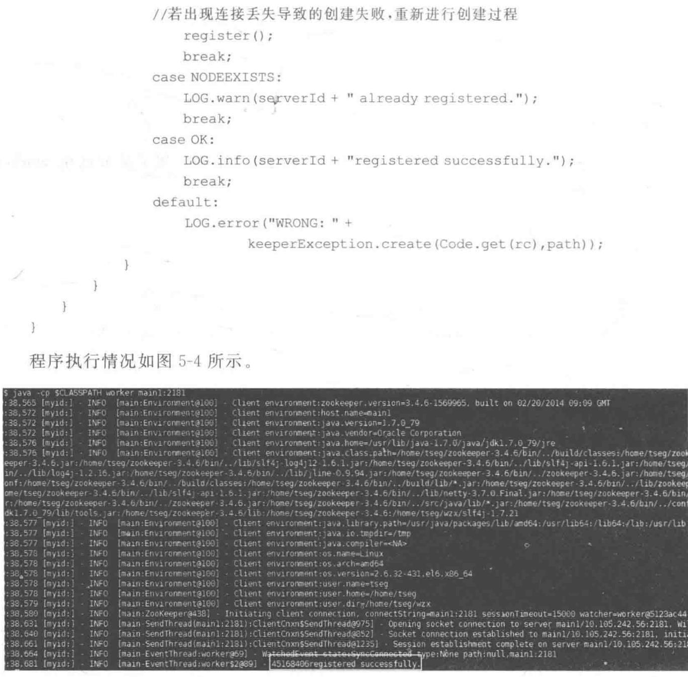
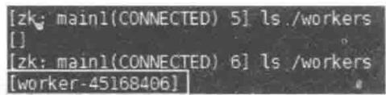
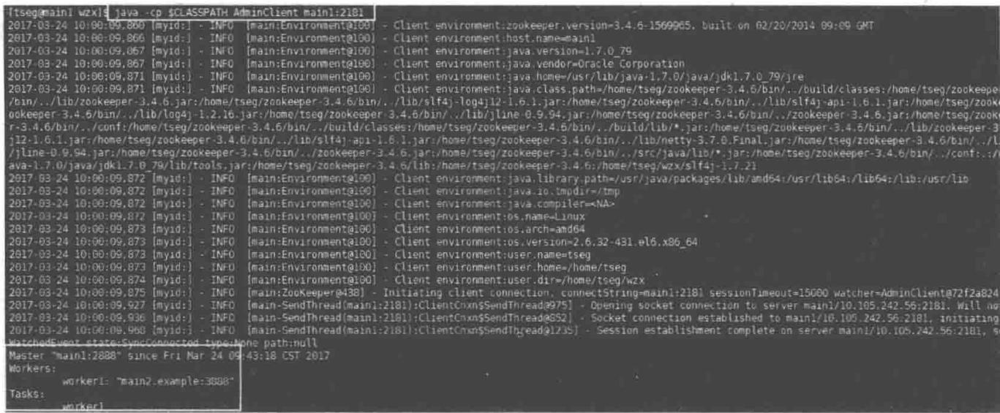
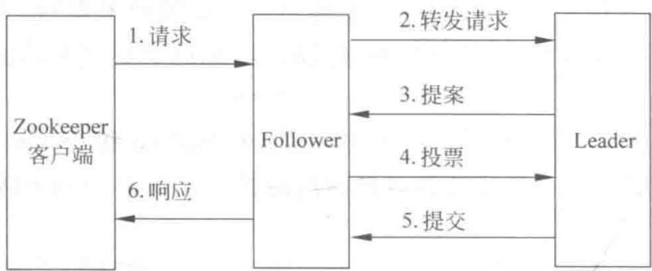

# 第5章

# Zookeeper 开发

## 5.1 Zookeeper 的来源

随着信息化水平的不断提高,企业级系统变得越来越庞大,性能急剧下降,客户抱怨频频。拆分系统是目前可选择的解决系统可伸缩性和性能问题的唯一行之有效的方法,但是拆分系统同时也带来了系统的复杂性——各子系统不是孤立存在的,它们彼此之间需要协作和交互,这就是常说的分布式系统。各个子系统就像动物园里的动物,为了使各个子系统能正常为用户提供统一的服务,必须用一种机制来进行协调,这就是 Zookeeper。

Zookeeper 是一个为分布式应用提供一致性服务的软件, 它是开源的 Hadoop 项目中的一个子项目, 并且是根据 Google 发表的 The Chubby lock service for loosely-coupled distributed systems 论文来实现的, 其中比较重要的是一致性算法。

## 1. Zookeeper 分布式协调系统

Zookeeper 是为分布式应用程序提供高性能协调服务的工具集合,也是 Google 的一个 Chubby 开源实现,是 Hadoop 的分布式协调服务。它包含一个简单的原语集,分布式应用程序可以基于它实现配置维护、命名服务、分布式同步、组服务等。Zookeeper 可以用于保证在 ZK 集群之间的数据的事务一致性。其中,Zookeeper 提供通用的分布式锁服务,用协调分布式应用。

Zookeeper 作为 Hadoop 项目中的一个子项目, 是 Hadoop 集群管理的一个必不可少的模块, 它主要用于解决分布式应用中经常遇到的数据管理问题, 如集群管理、统一命名服务、分布式配置管理、分布式消息队列、分布式锁、分布式协调等。同时, Zookeeper 也应用于 Storm 中, 它负责 Storm 集群中的 nimbus 与 supervisor 的状态维护。

Zookeeper 提供了一套很好的分布式集群管理的机制, 即这种基于层次型的目录树的数据结构, 并对树中的节点进行有效管理, 从而可以设计出多种多样的分布式的数据管理模型。

Zookeeper 是一种高性能、可扩展的服务。Zookeeper 的读写速度非常快，并且读的速度要比写的速度更快。另外，在进行读操作时，Zookeeper 依然能够为旧的数据提供服务。这些都是由 Zookeeper 所提供的一致性保证，它具有如下特点。

（1）顺序一致性：客户端的更新顺序与它们被发送的顺序相一致。

（2）原子性：更新操作要么成功，要么失败，没有第三种结果。

（3）单系统镜像：无论客户端连接到哪一个服务器，客户端将看到相同的 Zookeeper

视图。

（4）可靠性：一旦一个更新操作被应用，那么在客户端再次更新它之前，它的值将不会改变。这个保证将会产生下面两种结果。

① 如果客户端成功地获得了正确的返回代码,那么说明更新已经成功;如果不能够获得返回代码(由于通信错误、超时等),那么客户端将不知道更新操作是否生效。

② 当从故障恢复时，任何客户端能够看到的执行成功的更新操作将不会被回滚。

（5）实时性：在特定的一段时间内，客户端看到的系统需要被保证是实时的（在十几秒时间里）。在此时间段内，任何系统的改变将被客户端看到，或者被客户端侦测到。

## 2. 分布式协作的难点

## 1）缺乏全局时钟

在单机系统中,程序以这个单机本身的时钟为准,控制时序比较容易。在分布式系统中,每个节点都有自己的时钟,在通过相互发送信息进行协调时,如果仍然依赖时序,就会相对难处理。

很多时候使用时钟要区分两个动作的顺序,而不是一定要知道准确的时间,所以可以把这个工作交给一个单独的集群来完成,通过这个集群来区分多个动作的顺序。

在单机系统中,多线程和多进程中使用的锁,到了分布式环境中也需要有相应的办法来处理。

## 2）面对故障独立性

对单机系统来说,如不使用多进程方式,基本上不会遇到独立的故障。如果是机器问题、OS问题或者程序自身的问题,结果通常是程序整体不能用了,不会出现一些模块不可用,另一些模块可用的情况。

在分布式环境中,由于分布式系统由多个节点组成,全部坏掉的概率很小,但是会经常出现一部分节点/模块有问题,另一部分正常运行。这种现象叫作故障独立性,必须找到解决故障独立性的办法。

## 3）处理单点故障

在整个分布式系统中,如果某个功能只有某台单机在支撑,那么这个节点称为单点,其发生的故障称为单点故障,也就是SPoF(Single Points of Failure)。必须在分布式系统中尽量避免出现单点,尽量保证所有的功能都是由集群完成的。如果不能把单机实现为集群,那么应做好以下三点。

(1) 尽量保证功能都是由集群完成的。

(2) 给这个单点做好备份, 尽量做到自动恢复, 减少恢复需要的时间。

(3) 缩小单点故障的影响范围(例如, 将原来的一个数据库拆为两个数据库, 单个问题就不会影响全部)。

在分布式计算领域有一个非常著名的 FLP(Fischer, Lynch, Patterson)定律：假设有一个分布式的配置信息发生了改变，这个配置信息仅仅只有一个比特，一旦所有运行中的进程对配置位的值达成一致，应用中的进程就可以启动。这个定律证明了在异步通信的分布式系统中，进程崩溃，所有进程可能无法在这个比特位的配置达成一致。此外，还有类似的 CAP(Consistency, Availability, Partition-tolerance)定律：当设计一个分布式系统时，往往希望这三种属性全部满足，但没有系统可以同时满足三种属性。

因此，Zookeeper 的设计应尽可能满足一致性和可用性。当然，在发生网络分区时 Zookeeper 只提供了只读能力。

## 5.2 Zookeeper 基础

## 5.2.1 基本概念

很多用于协作的原语常常在应用之间共享,例如分布式锁机制组成了一个重要的原语,同时暴露出 create、acquire 和 release 三个 API。然而,这种设计存在重大缺陷,这种方式实现原语的服务使应用丧失了灵活性。

因此，Zookeeper 并不直接暴露原语，取而代之，它暴露了由一小部分调用方法组成的类似文件系统的 API，以便允许应用实现自己的原语。通常使用菜谱(recipes)来表示这些原语的实现。菜谱包括 Zookeeper 操作和维护一个小型的数据节点，这些节点被称为 znode。Zookeeper 数据模型采用类似于文件系统的层级树状结构进行管理，其结构如图 5-1 所示。

  
图 5-1 层级树状结构

在 Zookeeper 中的每个节点 (znode) 有一个唯一的路径标识, 如/SERVER2 节点的标识就为 /APP3/SERVER2。

## 1. znode 类型

新建 znode 时,需要指定该节点的类型,不同类型决定了 znode 节点的行为方式。其类型分为持久(persistent)节点和临时(ephemeral)节点。

持久的 znode 只能通过调用 delete 来进行删除。临时的 znode 与之相反，当创建该节点的客户端崩溃或关闭与 Zookeeper 的连接时，整个节点就会被删除。通过 -e 参数创建临时节点。Zookeeper 的客户端和服务器通信采用长连接方式，每个客户端和服务器通过心跳来保持连接，这个连接状态称为 session。如果 znode 是临时节点，这个 session 失效，znode 也就删除了。

znode 除了有持久节点和临时节点外, 还有一种有序 (sequential) 节点状态。当创建 znode 时, 用户可以请求在 Zookeeper 的路径结尾添加一个递增的计数。这个计数对此节点的父节点来说是唯一的, 它的格式为 “%10d” (10 位数字, 没有数值的数位用 0 补充, 例如

0000000001)。当计数值大于 $2^{32}-1$ 时，计数器将溢出。

## 2. 通知机制

Zookeeper 通常以远程服务的方式被访问。如果每次访问 znode 时, 客户端都需要获得节点中的内容, 这样代价太大了。

为了替换客户端的轮询，Zookeeper 选择了基于通知的机制：客户端向 Zookeeper 注册需要接收通知的 znode，通过对 znode 设置监视点 (watch) 来接收通知。监视点是一个单词触发的操作，即监视点会触发一个通知。为了接收多个通知，客户端必须在每次通知后设置一个新的监视点。

通知机制阻止了客户端所观察的更新顺序,虽然使 Zookeeper 的状态变化传递给客户端较慢,但是保障了客户端以全局的顺序来观察 Zookeeper 的状态,对于 Zookeeper 有着极为重要的意义。

znode 中还有一个极为重要的版本号属性。对节点的每一个操作，都会使这个节点的版本号增加。每个节点维护着三个版本号，分别是 Version(节点数据版本号)、Cversion(子节点版本号)和 Aversion(节点所拥有的 ACL 版本号)。

## 3. Leader 选举

Zookeeper 需要在所有的服务器中选举出一个 Leader, 然后让这个 Leader 来负责管理集群。此时, 集群中的其他服务器则成为此 Leader 的 Follower。当 Leader 有故障时, 需要 Zookeeper 能够快速地在 Follower 中选举出下一个 Leader。这就是 Zookeeper 的 Leader 机制。

在 Zookeeper 中,为了避免从众效应的发生,采取此种方法:每一个 Follower 都对 Follower 集群中对应的比自己节点序号小一号的节点(也就是所有序号比自己小的节点中序号最大的节点)设置一个 watch。只有当 Follower 所设置的 watch 被触发时,它才进行 Leader 选举操作,一般情况下它将成为集群中的下一个 Leader。很明显,此 Leader 选举操作的速度是很快的。因为,每一次 Leader 选举几乎只涉及单个 Follower 的操作。

## 5.2.2 Zookeeper 架构

Zookeeper 服务器端运行于两种模式：独立模式（standalone）和仲裁模式（quorum）。独立模式与其术语所描述的类仅有一个单独的服务器，Zookeeper 状态无法复制。在仲裁模式下，则有一组的 Zookeeper 服务器，称为 Zookeeper 集合，它们可以进行状态复制，并且同时响应，都服务于客户端的请求，如图 5-2 所示。

  
图 5-2 Zookeeper 架构总览

Zookeeper本质上是一个分布式的小文件存储系统。原本是Apache Hadoop的一个组件，现在被拆分为一个Hadoop的独立子项目，在HBase(Hadoop的另外一个被拆分出来的子项目，用于分布式环境下的超大数据量的DBMS)中也用到了Zookeeper集群。

Hadoop 使用 Zookeeper 的事件处理确保整个集群只有一个 NameNode 存储配置信息等。

HBase 使用 Zookeeper 的事件处理确保整个集群只有一个 HMaster, 察觉 HRegionServer 联机和宕机, 存储访问控制列表等。

Zookeeper 的执行能力更是毋庸置疑。雅虎将 Zookeeper 用在雅虎消息代理的协调和故障恢复服务中。雅虎消息代理是一个高度可扩展的发布—订阅系统，管理着成千上万台联机程序和信息控制系统，其吞吐量标准已经达到大约每秒 10000 个基于写操作的工作量。而对读操作的工作量来说，其吞吐量标准要高几倍。

## 5.3 Zookeeper的API

Zookeeper 的 API 围绕 Zookeeper 的句柄而构建, 每个 API 调用都需要传递这个句柄。这个句柄代表与 Zookeeper 之间的一个会话。

## 5.3.1 建立会话

每一个会话一旦它的连接被破坏,将会转移到其他的 Zookeeper 服务。只要会话保持通畅,句柄才会持续有效,Zookeeper 客户端类库会保持连接。如果句柄关闭了,那么 Zookeeper 客户端的类库会告诉 Zookeeper 服务端终止会话;如果 Zookeeper 了解到客户端已经死掉,它将会验证会话;如果以后客户端想再次恢复这个会话,将会通过这个句柄来验证一个会话的有效性。

创建 Zookeeper 的构造函数如下。

Zookeeper(String connectString,int sessionTimeout,Watcher watcher)

其中的参数描述如表 5-1 所示。

表 5-1 参数描述

<table><tr><td>参数</td><td>描述</td></tr><tr><td>connectString</td><td>包含 Zookeeper 服务端的主机名和端口号</td></tr><tr><td>sessionTimeout</td><td>会话的超时时间,以毫秒为单位</td></tr><tr><td>watcher</td><td>用于接收会话事件的对象。这个对象需要使用者自己创建,而且因为 watch 是一个接口,需要使用者实现该接口。客户端需要用监视器观察 Zookeeper 的会话状态。当客户端建立连接或者失去连接时,就会创建该事件,该事件也能够监视 Zookeeper 数据的改变。最后如果会话过期,该事件也可以通过客户端监听到</td></tr></table>

下例实现了一个简单输出事件的 watcher。

```java
import java.io.IOException;
import org.apache.zookeeper.WatchedEvent;
import org.apache.zookeeper.Watcher;
import org.apache.zookeeper.ZooKeeper;

//ClassName: master
//实现一个 maste 的 watcher
public class master implements Watcher {
    ZooKeeper zk;
    String hostPort;
    master(String hostPort) {
        this.hostPort = hostPort;①
    }
    void startZk() throws IOException {
        zk = new ZooKeeper(hostPort, 15000, this);②
    }
    public void process(WatchedEvent event) {
        System.out.println(event);③
    }
    void stopZk() throws Exception {
        zk.close();
    }
    public static void main(String[] args) throws Exception {
        master m = new master("main1:2181");
        m.startZk();
        Thread.sleep(60000);④
        m.stopZk();
    }
}
```

其中，①处：该实例因未实例化 Zookeeper 对象，保存 hostPort 留待后用；②处：使用 master 对象构造 Zookeeper 对象；③处：此处为操作部分，该实例将收到的事件进行简单输出；④处：在程序退出前休眠一段时间，以便看到事件发生。

## 结果如图 5-3 所示。

其中，①处：描述了 Zookeeper 客户端的实现和环境；②处：初始化一个客户端到 Zookeeper 服务器的连接；③处：展示连接建立后，此连接中包括主机、端口和超时时间在内的信息；④处：程序中实现的 Watcher.process(WatchedEvent e) 函数输出的 WatchEvent 对象。

## 5.3.2 管理权

在建立会话后,程序需要获取管理权来进行下一步操作。为了确保同一时间只有一个主节点进程处于活动状态,就得采用 Zookeeper 集群首选举算法,即所有潜在的主节点进程都尝试创建/master 节点,但只允许一个成功,使这个成功的进程成为主节点。

  
图 5-3 代码执行情况

为了实现这个算法,首先在程序中添加以下代码。

```java
String serverId = Integer.toHexString(random.nextInt());
void runForMaster() {
    zk.create("/master",
    serverId.getBytes(),
    OPEN_ACL_UNSAFE,
    CreateMode.EPHEMERAL,
    masterCreateCallback,
    null);
}
```

其中的参数描述如表 5-2 所示。

表 5-2 参数描述

<table><tr><td>参数</td><td>描述</td></tr><tr><td>/master</td><td>创建的节点名。若节点已经存在,则报错</td></tr><tr><td>ServerId.getBytes()</td><td>数据字段,只存储字节数组类型的数据</td></tr><tr><td>OPEN_ACL_UNSAFE</td><td>表示ACL策略类型为开放ACL策略</td></tr><tr><td>CreateMode.EPHEMERAL</td><td>节点类型为临时节点</td></tr><tr><td>masterCreateCallback</td><td>回调方法的对象</td></tr><tr><td>null</td><td>用户指定的上下文信息。若无,则为 null</td></tr></table>

因为应用程序常常由异步变化通知所驱动,异步调用不会阻塞应用程序,其他事务可以继续执行。以异步方式构建系统更加便捷,故本节采用异步方式来构建,实现方法如下。

```java
String serverId = Integer.toString(Random.nextLong());
static boolean isLeader;
static StringCallback msterCreateCallback = new StringCallback() {
    void processResult(int rc,String path,object ctx,String name) {
```

```aidl
//rc 参数中包含 create 请求的结果,若不为 0 则为 KeeperException 异常
switch(Code.get(rc)){
    case CONNECTIONLOSS:          //连接丢失异常
        checkMaster();
        return;
    case OK:                //该进程成为 Leader
        isLeader = true;
        break;
    //该进程未成为 Leader
    default:
        isLeader = false;
}
System.out.println("The leader is " + (isLeader ? "" : "not " + "me.")),
}
void runForMaster(){
    zk.create("/master",serverId.getBytes(),OPEN_ACL_UNSAFE,
CreateMode.EPHEMERAL,masterCreateCallback,null);
}

DataCallback masterCheckCallback = new DataCallback(){
    void processResult(int rc,String patM,Object ctx,byte[] data,
Stat stat){
        switch(Code.get(rc)){
            case CONNECTIONLOSS:
                checkMaster();
            return;
            case NONODE:
                runForMaster();
                return;
        }
    }
}

boolean checkMaster(){
    zk.getData("/master",false,masterCheckCallback,null);
    //getData 读取 znode 节点的元数据信息
    //"/master": znode 节点路径
    //false: 是否监听后续数据变更,false 为否
    //masterCheckCallback: 回调方法对象
    //null: stat 对象,null 表示无 stat 对象
}

public static void main(String args[]) throws Exception{
    master m = new master(args[0]);
    m.startZK();
    m.runForMaster();
    if(isLeader){
        System.out.println("Leader is me.");
        Thread.sleep(60000);
    }else{
        System.out.println("Leader already exists.")
```

```txt
}
        m.stopZK();
    }
}
```

## 5.3.3 节点注册

创建主节点后,需要配置从节点,以配合主节点使用。下例实现了从节点在/workers 下创建临时 znode 节点。

```java
import java.util.*;
import org.apache.zookeeper.* ;
import org.slf4j.*;

public class worker implements Watcher{
    private static final Logger LOG = LoggerFactory.getLogger(worker.class);
    ZooKeeper zk;
    String hostPort;
    String serverId = Integer.toHexString(random.nextInt());
    worker(String hostPort) {
        this.hostPort = hostPort;
    }

    void startZk() throws IOException {
        zk = new ZooKeeper(hostPort, 15000, this);
    }

    public void process(WatchedEvent event) {
        LOG.info(event.toString + "," + hostPort);
    }

    void register() {
        zk.create("/workers/worker-" + serverID,
            "Idle".getBytes(), //将节点状态信息存入从节点中
            Ids.OPEN_ACL_UNSAFE,
            CreateMode.EPHEMERAL,workerCreateCallback,null);
    }

    public static void main(String[] args) throws Exception {
        worker wk = new worker("args[0]");
        wk.startZk();
        wk.register();
        Thread.sleep(60000);
    }

   �StringCallback workerCreateCallback = new StringCallback(){
        void processResult(int rc,String path,Object ctx,byte[] data,
Stat stat){
            switch(Code.get(rc)){
                case CONNECTIONLOSS:
```

  
图 5-4 代码执行情况

结果如图 5-5 所示, 前一行是执行程序之前, 后一行是执行程序之后。

  
图5-5 代码执行结果

## 5.3.4 任务队列化

完成上述功能后,还有极为重要的一个任务:为 Client 应用程序队列化新任务,方便节点执行这些任务。下例采用有序节点来实现任务的队列化。

```java
import java.io.IOException;
import org.apache.zookeeper.* ;
public class Client implements Watcher{
```

```java
Zookeeper zk;
String hostPort;
Client(String hostPort) {
    this.hostPort = hostPort;
}
void startZk() throws IOException {
    zk = new ZooKeeper(hostPort, 15000, this);
}
public void process(WatchedEvent event) {
    System.out.println(event);
}
String queueCommand(String command) throws KeeperException{
    while(true){
        try{
            String name = zk.create("/tasks/task-"serverId,
command.getBytes(),OPEN_ACL_UNSAFE,CreateMode.SEQUENTIAL);
            return name;
            break;
        } catch (NodeExistsException e){
            throw new Exception(name + " already appears to be running.");
        } catch (ConnectionLossException e){
        }
    }
}
public static void main(String args[]) throws Exception{
    Client ct = new Client(args[0]);
    ct.startZK();
    String name = c.queueCommand(args[1]);
    System.out.println("Created "+ name);
}
}
```

一个管理客户端可以更快、更简单地管理系统，查看状态。下例通过 getData 等方法简单地实现对系统运行状态的查看。

```java
import java.io.IOException;
import org.apache.zookeeper.* ;
public class AdminClient implements Watcher{
    ZooKeeper zk;
    String hostPort;
    AdminClient(String hostPort) {
        this.hostPort = hostPort;
    }
    void startZk() throws IOException {
        zk = new ZooKeeper(hostPort, 15000, this);
    }
    public void process(WatchedEvent event) { System.out.println(e); }
    void listState() throws KeeperException{
```

```txt
try{
    Stat stat = new Stat();
    byte masterData[] = zk.getData("/master",false,stat);
    Date startDate = new Date(stat.getCtime());
    System.out.println("Master "+ new String(masterData)+
" since "+ startDate);
} catch (NoNodeException e){
    System.out.println("No Master");
}
System.out.println("Workers:");
for(String w: zk.getChildren("workers",false)){
    byte Data[] = zk.getData("/workers/" + w,false,null);
    String state = new String(data);
    System.out.println("\t "+ w+ ": "+ state);
}
System.out.println("Tasks:");
for(String t: zk.getChildren("/assign",false)){
    System.out.println("\t "+ t);
}
}
public static void main(String args[]) throws Exception{
    AdminClient ac = new AdminClient(args[0]);
    ac.startZK();
    ac.listState();
}
public static void main(String args[]) throws Exception{
    Client ct = new Client(args[0]);
    ct.startZK();
    String name = c.queueCommand(args[1]);
    System.out.println("Created "+ name);
}
```

  
图 5-6 代码执行情况

前者为执行命令前的服务器状态信息；后者为执行命令后显示的服务器状态信息，包含有主节点(Master)信息、从节点(Workers)和任务队列(Tasks)。

## 5.4 状态变化处理

在应用程序中,需要知道 Zookeeper 集合的状态,这种情况并不少见。Zookeeper 采取通知客户端感兴趣的具体事件的方式来避免轮询的调优和轮询流量。此外,Zookeeper 提供了处理变化的重要机制——监视点(watch)。通过监视点,客户端可以对指定的 znode 节点注册一个通知请求,在发生变化时就会收到一个单次的通知。

## 1. 单次触发器

一个监视点(watch)表示一个与之关联的 znode 节点和事件类型组成的单次触发器。当一个 watch 被一个事件触发时,就会产生一个通知,即注册了监视点的客户端收到的事件报告消息。

当应用程序注册了一个监视点来接收通知后，匹配该监视点条件的第一个事件会触发监视点的通知，并且最多只触发一次。

客户端设置的每个监视点与会话关联,如果会话过期,等待中的监视点就会被删除。在注册监视点时,服务端要检查已监视的 znode 节点在注册前、后监视点是否发生了变化,若已经发生变化,将会通知客户端,否则在新服务端上注册监视点。

单次触发会发生事件丢失情况,但这并不会对系统造成极大影响。因为任何接收通知与注册新监视点之间的变化情况,均可以通过读取 Zookeeper 的状态信息来获得。

## 2. 设置监视点

Zookeeper 的 API 中的所有读操作：getData、getChildren 和 exists 都可以选择在读取的 znode 节点上设置监视点。使用监视点机制的前提是实现 Watcher 接口类，并实现其中的 process 方法。

public void process(WatchedEvent event);

其中，WatchedEvent 包含 Zookeeper 会话状态、事件类型，以及事件类型不为 none 时的 znode 路径等信息。

监视点有两种类型：数据监视点和子节点监视点。创建、删除或设置 znode 节点的数据都会触发数据监视点，即 getData 和 exists 操作可以设置数据的监视点。但仅有 getChildren 操作能设置子节点监视点，且只有在 znode 子节点创建或删除时才被触发。

监视点的一个极其重要问题是,一旦设置监视点就无法移除。若要移除一个监视点,目前 Zookeeper 仅提供了两种方法。

(1) 触发该监视点；

(2) 使其会话关闭或过期。

## 3. 监视点代替显式缓存管理

从应用的角度来看,客户端都是通过访问 Zookeeper 来获取给定 znode 节点的数据、一个 znode 节点的子节点列表或其他相关的 Zookeeper 状态。但是这种方式并不实用,更为高效的方式为客户端本地缓存数据,并在需要时使用这些数据。一旦这些数据发生变化,

Zookeeper 通知客户端, 客户端更新缓存的数据。

Zookeeper 客户端通过注册监视点来接收通知信息,因而监视点使客户端在本地缓存一个版本的数据,并在数据发生变化时接收到通知来进行更新。

## 4. 监视点的羊群效应和可扩展性

应用中有一个问题需注意：当变化产生时，Zookeeper 会触发一个特定的 znode 节点，以变化相关的所有监视点。例如，10000 个客户端以 exists 操作监视这个 znode 节点，那么当 znode 节点创建后就会发送 10000 个通知，即被监视的 znode 节点的一个变化会产生一个尖峰的通知，该尖峰可能会带来许多影响——在尖峰时刻提交的操作产生延迟等。因此，应该尽量避免大量客户端在一个特定节点上设置监视点，理想状态是一个节点只设置一个监视点。

另一方面需要注意,服务端一侧通过监视点产生的状态变化。设置一个监视点需要在服务端上创建一个 watch 对象,而根据 YouKit 的分析工具得到的分析结果显示,设置一个监视点会使服务端的监视点管理器的内存消耗大约 250\~300 字节,设置非常多的监视点意味着监视点管理器会消耗大量的服务器内存。因此,开发者必须时刻注意设置的监视点数量。

## 5.5 故障处理

Zookeeper 系统处理客户端写请求的一个流程如图 5-7 所示。

  
图 5-7 Zookeeper 处理客户端请求流程

流程中任何一环发生错误,都可能导致 Zookeeper 系统出现故障。Zookeeper 产生的故障可分为三类: 客户端节点故障、Follower 服务器节点故障和 Leader 服务器节点故障。

## 1. 客户端节点故障

若 Zookeeper 客户端节点发生故障,客户端正处于空闲状态,则按照 session 失效处理。复杂的情况是,客户端节点发生故障时,客户端正在等待 Zookeeper 服务器端的请求响应。下面将对 Zookeeper 客户端节点发生故障的时机进行详细的分类讨论。

Zookeeper 如何知道客户端还存不存在呢？Zookeeper 是使用 session 来解决这个问题的，这也是为什么在客户端创建 Zookeeper 实例时需要传入一个 sessionout 参数。当客户端与 Follower 连接时，实际上是成功创建了一个 session, Follower 和 Leader 都保存了这个 session 信息（实际上 session 的建立也是需要 Leader 同意的）。一方面，客户端会定期向 Follower 发送 Ping 包来告诉这个 Follower 客户端还在运行；另一方面，Leader 会定期向 Follower 发送 ping 包，一是检测它的 Follower 是否至少有超过一半还在运行，二是

Follower 返回它们各自正在服务的客户端(未超时的 session)来告诉 Leader 哪些客户端还在运行,这样 Leader 就可以删除那些客户端已经不存在的 ephemeral 类型的节点。当正在工作的客户端节点发生故障时,Zookeeper 系统如何来处理呢?

（1）Follower 在转发请求阶段若没有发现客户端已经发生了故障，则会将请求转发给 Leader，否则将丢弃该客户端的请求包。

（2）Leader 在提案阶段还没有发现客户端已经发生了故障，那么后面的投票和提交阶段会顺利执行。

（3）到响应阶段，若此时 Follower 已经发现了该客户端发生故障，则它不会向客户端发送响应包，而直接从 FinalRequestProcessor 处理器中返回；若此时 Follower 还没有发现该客户端发生故障，则 FinalRequestProcessor 会将响应包交给对应的 NIOServerCnxn，而 NIOServerCnxn 在发送该响应包时，会抛出异常，但没有对该异常做任何处理。

（4）Leader 在提案阶段发现了客户端已经发生了故障，那么后面的投票和提交阶段仍然会顺利执行，只不过此时的操作类型是 OpCode.error，然后直接从 FinalRequest-Processor 处理器中返回，而不会发生响应阶段。

## 2. Follower 服务器节点故障

这里主要对 Zookeeper 中的 Follower 节点发生故障时的处理机制进行详细的讨论。当某一个 Follower 或 Observer 发生故障时，与之直接相连的 Zookeeper 客户端不可能再从 Follower 或 Observer 收到正在处理的请求的响应包。因此，它会丢弃正在处理的请求，并通知客户，而 Zookeeper 客户端则会重新选择一个 Follower 或 Observer，并与之建立联系为客户端服务，这个过程对用户是透明的。

(1) 若 Follower 在处理转发阶段之前发生故障, 则处理情况如上所述, 只涉及 Zookeeper 客户端。

(2) 若 Follower 在处理转发阶段之后发生故障, 则 Leader 最迟会在执行提案阶段发现 Follower 发生了故障。尽管 Follower 收不到 Leader 发送的提案, Leader 也不会收到 Follower 的投票, 但只要当前还有超过半数的 Follower 存活, 就不会影响 Leader 的处理。

（3）如果某一个 Follower 失效，则 Leader 不能得到该 Follower 管理的 session 信息，之后 Leader 可能会误认为与该 Follower 相连的若干 Zookeeper 客户端失效。这种情况的处理同 Zookeeper 客户端发生故障是一样的。

从上述处理可以看出,单个 Follower 节点的失效对整个 Zookeeper 服务集群很难产生致命的影响,单个 Follower 在任何时刻的失效,系统仍然会比较稳定地继续运行。

## 3. Leader 服务器节点发生故障

前面分别讨论了在 Zookeeper 客户端节点、Follower 节点发生故障的情况下，Zookeeper 是如何处理的。最后，再讨论一下 Leader 节点发生故障的情况下，Zookeeper 的处理机制。

（1）若 Leader 节点在非响应阶段之前发生了故障，则 Follower 的转发阶段不会执行成功，但该请求包会被添加到 Follower 的 pendingSyncs 集合中。同时，Follower 发现 Leader 已经失效，退出 Follower 角色，并关闭与之相连的客户端。随后，Follower 会参加 Leader 的选举，而在选举的过程中，该节点不会再接受任何客户端的连接。

（2）若 Leader 节点在响应阶段之前发生了故障，则采取方法(1)的方式处理 Follower 节点，在处理的同时也会继续执行响应阶段的操作。

## 5.6 Zookeeper 集群管理

## 5.6.1 集群配置

首先在各机器上安装 Zookeeper，从官网下载所需版本的 Zookeeper 安装包。

接着在所要使用的机器上部署 Server, 机器至少要三台及以上。

这里要在三台机器上部署 4 个 Server，分别在三台机器上建立文件夹。

```txt
server1(server2,server3,server4)
```

在每个文件夹里面解压一个 Zookeeper 的安装包，并且创建 data、logs 等日志数据文件夹 Data、dataLog、logs 和 zookeeper-3.x.x。

进入 data 目录, 创建一个 myid 的文件, 往里面写入一个代表本机标记号的数字。例如, server1 可以对应写入 1, server2 对应 myid 文件写入 2, server3 对应 myid 文件写入 3, 只需要各机的 myid 中标记号不重复即可。

进入 zookeeper-3.x.x/conf 目录, 其中会有 3 个文件: configuration.xml、log4j.properties 和 zoo\_sample.cfg。接着在这个目录下创建一个 zoo.cfg 的配置文件, 也可以把 zoo\_sample.cfg 文件改成 zoo.cfg, 配置的内容如下。

```ini
tickTime= 2000
initLimit= 10
syncLimit= 5
# xxx 代表此机器的用户名
dataDir= /home/xxx/server1/data
dataLogDir= /home/xxx/server1/dataLog
clientPort= 2181
# yyyy 代表集群中对应的各机器的 ip, server.x 代表该机器的 myid
server.1= yyyy:2888:3888
server.2= yyyy:2888:3888
server.3= yyyy:2888:3888
server.4= yyyy:2888:3888
```

需要注意的是，server.X 这个数字就是对应 data/myid 中的数字。在 4 个 Server 的 myid 文件中分别写入了 1、2、3、4，那么每个 Server 中的 zoo.cfg 都配 server.1、server.2、server.3 和 server.4 就可以了。后面连着两个端口，其中第一个端口用于做集群成员的信息交换，第二个端口是在 Leader 发生故障时专门用于选举 Leader 所用。

进入 zookeeper-3.x.x/bin 目录，以 ./zkServer.sh start 启动 Server。只要 4 台机器中的 3 台可用，就可以选出 Leader，并对外提供服务，如图 5-8 所示。

可以采用命令：telnet 机器 IP 端口号来连接 Server。再输入 stat，可获取当前 Server 的状态信息，如图 5-9 所示。

  
图 5-8 启动 Server

  
图 5-9 获取 Server 运行状态

## 5.6.2 集群管理

应用集群时,每一台机器都需要知道集群中(或依赖的其他某个集群)哪些机器是活着的,并且在集群中机器出现宕机、网络断链等故障时能够不在人工介入的情况下迅速通知每一台机器。

Zookeeper 同样很容易实现这个功能,例如在 Zookeeper 服务器端有一个 znode 叫 /APP1SERVERS,那么集群中每一个机器启动时都去这个节点下创建一个 EPHEMERAL 类型的节点。例如,server1 创建 /APP1SERVERS/SERVER1(可以使用 IP,保证不重复),server2 创建 /APP1SERVERS/SERVER2,然后 SERVER1 和 SERVER2 都 watch(监视)/APP1SERVERS 这个父节点,也就是说这个父节点下数据或者子节点变化都会通知对该节点进行 watch 的客户端。因为 EPHEMERAL 类型节点有一个很重要的特性,就是客户端和服务器端连接中断或者 session 过期都会使节点消失,那么在某一台机器发生故障或者断开连接时,其对应的节点就会消失,然后集群中所有对 /APP1SERVERS 进行 watch 的客户端都会收到通知,最后取得最新列表。

另外有一个应用场景是集群选 Master。一旦 Master 发生故障就能够马上从 slave 中选出一个 Master，实现步骤和前者一样，只是机器在启动时在 APP1SERVERS 创建的节点类型变为 EPHEMERAL\_SEQUENTIAL 类型，这样每个节点都会自动被编号。

默认规定编号最小的为 Master, 当对/APP1SERVERS 节点做监控时, 得到服务器列表, 只要所有集群机器逻辑认为最小编号节点为 Master, 那么 Master 就被选出, 而这个 Master 宕机时, 相应的 znode 会消失, 接着新的服务器列表被推送到客户端, 然后每个节点逻辑认为最小编号节点为 Master, 如此操作就实现了动态 Master 选举。

# 本章小结

本章讲解了 Zookeeper 相关的基础知识和开发知识, 让读者了解 Zookeeper 的来源、性质及基本概念、Zookeeper 开发的应用方法及实现方式、Zookeeper 集群的配置及管理方法。

（1）详细介绍了 Zookeeper 及其来源，说明了 Zookeeper 与其他项目的关联及 Zookeeper 的重要作用，并且介绍了其特点。

(2) 介绍了分布式协作所存在的三大难点, 以及 FLP 定律和 CAP 定律, 也讲述了 Zookeeper 所解决的困难及实现的取舍。

（3）从 Zookeeper 的 znode 类型、通知机制、Leader 选择方法等方面介绍 Zookeeper 的基本概念。

（4）讲述了 Zookeeper 的两种运行模式、架构及其应用场景。

（5）详细介绍了 Zookeeper 可调用的多种 API 用法，包含会话建立、管理权获取、节点注册、任务队列化等。

(6) 讲述了 Zookeeper 状态变化处理的重要机制——监视点，并分析了监视点机制较显式缓存的优势。此外，还介绍了应用中监视点的羊群效应和可扩展性。

(7) 从 3 个方面详细讲述了 Zookeeper 各部分的故障处理机制。

（8）详细讲解了 Zookeeper 集群建立的全部配置过程，并介绍了查询当前 Server 的方法。

(9) 介绍了 Zookeeper 集群管理的需求和方法, 同时解释了动态选举的过程。

## 习题

(1) 下列方法中，( )不是设置监视点的方法。
A. getData    B. getChildren    C. register    D. exists

(2) 以下属性中不是 znode 中的版本号的是()。
A. Version    B. Zversion    C. Cversion    D. Aversion

(3) 以下项目中没有应用 Zookeeper 的是()。
A. Hadoop    B. HBase    C. FLP    D. Storm

(4) Zookeeper 集群中最少( )台机器可以推举出一个 Leader?
A. 2 B. 3 C. 4 D. 5

(5) 为什么说 Zookeeper 是一种高性能、可扩展的服务？

(6) 什么是单点故障？并给出解决方案。

(7) znode 的节点类型有哪些？请详细叙述。

(8) 什么是 Zookeeper 的通知机制？请详细叙述。

(9) 监视点的羊群效应是什么？

(10) 显式缓存管理为什么被取代?

（11）监视点有哪两种类型？分别如何设置，如何移除监视点？

(12) 群首选举是什么, 如何实现这个过程?

（13）为什么配置文件 zoo.cfg 中的每个 Server 都有两个端口值？

(14) 如何知道 Zookeeper 集群中哪些机器依旧在运行?
