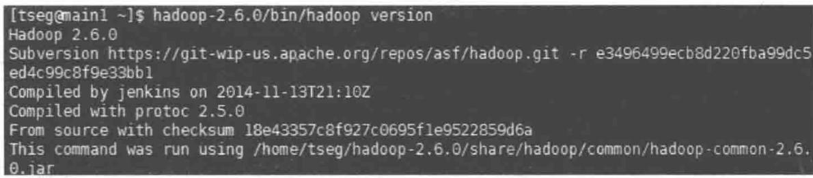
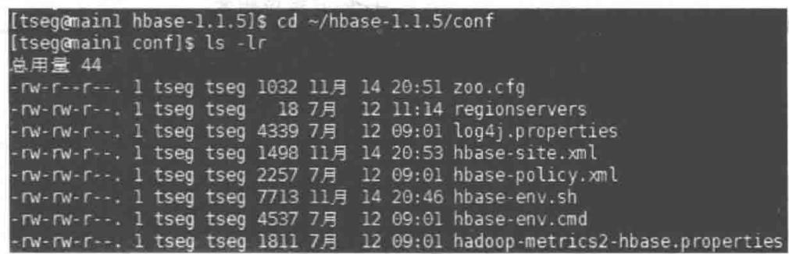

# 第6章

# 初识 HBase

## 6.1 什么是 HBase

## 6.1.1 大数据的背景

据国际数据公司 IDC 报道,2015 年产生和复制的数据量超过 $2 \times 10^{13}$ GB,相当于世界上所有海滩沙粒总数的 20 倍,大型强子对撞机每年积累的新数据量为 15PB 左右,沃尔玛公司每天通过 6000 多个商店向全球客户销售超过 2.67 亿件商品,这些庞大的数据量提醒我们,互联网已经进入了“大数据”时代。

以往对数据存储的管理,大家一般都采取 RDBMS(关系数据库系统),关系数据库系统的管理模型追求的是高度一致性和正确性。面向超大数据的分析需求时,其采取纵向扩展系统方式,即通过增加或者更换 CPU、内存、硬盘以扩展单个节点的能力,然而这种方式终将会遇到瓶颈。因此,为了解决关系数据库系统所面临的难题,满足实际项目的需求,NoSQL(非关系型数据库系统)就此诞生。

面对超大规模的数据分析处理,因为超大规模的查询需要进行大范围的数据记录扫描或全表扫描,RDBMS在一台服务器上做查询工作的响应时间会远远超过用户可接受的合理响应时间。更糟糕的是,RDBMS的等待和死锁的出现频率,与事务和并发的增加并不是线性关系,准确地说,与并发数目的平方以及事务规模的3次方甚至5次方相关。在相同情况下,NoSQL采取反范式化数据模型来避免等待,并且可以通过降低锁粒度的方式来尽量避免死锁,数据增长时,无须重新分区迁移数据并内嵌水平扩展性的方法。最后,面对容错和数据可用性问题,采用提高扩展性的机制。显而易见,如今的“大数据”时代,使用NoSQL数据库才是符合时代潮流。

2003 年,在意识到 RDBMS 在大规模数据处理中的缺点后,Google 的工程师们开始考虑大规模数据处理的其他切入点。如摒弃 RDBMS 的特点,进行增、查、改、删等操作采用简单 API 实现,再加一个扫描函数,大范围或全表范围上迭代扫描。最终经过不懈努力,在 2006 年实现了 BigTable 这一成果。经过之后的发展、补充、完善,BigTable 成了如今的典型 NoSQL 数据库 HBase。

## 6.1.2 HBase 架构

HBase 的基本组件包含 Client、Master、Region Server 等，具体架构图如图 6-1 所示。

  
图6-1 HBase框架

## 图 6-1 中各组件的功能如下。

Client: 包含访问 HBase 的接口, 并维护 cache 来加快对 HBase 的访问, 如 region 的位置信息。

Master: 为 Region Server 分配 region, 负责 Region Server 的负载均衡, 发现失效的 Region Server 并重新分配其上的 region, 管理用户对 table 的增删改查操作。

Region Server: Region Server 维护 region, 处理对这些 region 的 I/O 请求; 负责切分在运行过程中变得过大的 region。

Zookeeper: 通过选举,保证任何时候集群中只有一个 Master,Master 与 Region Servers 启动时会向 Zookeeper 注册。存储所有 region 的寻址入口,实时监控 Region Server 的上线和下线信息,并实时通知给 Master。存储 HBase 的 schema 和 table 元数据。默认情况下,HBase 管理 Zookeeper,Zookeeper 的引入使 Master 不再是单点故障。

一个基本的流程如图 6-2 所示。客户端首先联系 Zookeeper 子集群(quorum,一个由 Zookeeper 节点组成的单独集群)查找行键。上述过程是通过 Zookeeper 获取含有 ROOT\_ 的 region 服务器名(主机名)来完成的。通过含有 ROOT 的 region 服务器可以查询到含有. META. 表中对应的 region 服务器名,其中包含请求的行键信息。这两处的主要内容都被缓存下来,并且都只查询一次。最终,通过查询. META. 服务器来获取客户端查询的行键数据所在 region 的服务器名。一旦知道了数据的实际位置,即 region 的位置,HBase 会缓存这次查询的信息,同时直接联系管理实际数据的 HRegion Server。HRegion Server 负责打开 region,并创建对应的 HRegion,region 被打开后,它会为每个表的 HColumnFamily 创建一个 Store 实例,这些列簇是用户之前创建表时定义的。每个 Store 实例包含一个或多个 StoreFile 实例,它们是实际数据存储文件 HFile 的轻量级封装。每个 Store 还有其对应的一个 MemStore,一个 HRegion Server 分享了一个 Hlog 实例。

  
图 6-2 Zookeeper 集群基本流程

## 6.1.3 HBase 存储 API

HBase 的存储 API 提供了建表、删表、增加列簇和删除列簇的操作,同时还提供了修改表和列簇元数据等功能。部分存储 API 见表 6-1。

表 6-1 部分存储 API

<table><tr><td>返回值</td><td>函数</td><td>描述</td></tr><tr><td rowspan="4">void</td><td>addColumn(String tableName, HColumnDescriptor column)</td><td>向一个已经存在的表中添加列簇</td></tr><tr><td>createTable(HTableDescriptor desc)</td><td>创建一个新表</td></tr><tr><td>deleteTable(byte[] tableName)</td><td>删除一个已存在的表</td></tr><tr><td>addFamily(HColumnDescriptor)</td><td>添加一个列簇</td></tr><tr><td>HColumnDescriptor</td><td>removeFamily(byte[] column)</td><td>移除一个列簇</td></tr><tr><td>byte[]</td><td>getName()</td><td>获取表名</td></tr><tr><td>byte[]</td><td>getValue(byte[] key)</td><td>获取属性的值</td></tr><tr><td>void</td><td>setValue(String key,String value)</td><td>设置属性的值</td></tr><tr><td>void</td><td>put(Put put)</td><td>向表中添加值</td></tr></table>

在这些基本功能的基础上,还有一些更高级的特性。由于单元格的值可以当作计数器使用,并且能够支持原子更新。这个计数器能够在一个操作中完成读和修改,因此尽管是分布式的系统架构,客户端仍然可以利用此特性实现全局的强一致的连续的计数器。

## 6.2 HBase 部署

## 6.2.1 HBase 配置及安装

## 1. 必备条件

在进行 HBase 安装之前,需要确定是否具备以下 3 个必备条件。

（1）Linux 操作系统或类 UNIX 系统。支持 HBase 集群的操作系统有 CentOS、Fedora、Debian、Ubuntu、Solaris、Red Hat Enterprise Linux 等。这些操作系统都可以满足使用需求，区别就在于系统是开源免费还是闭源收费。用户可以自行选择适合自己的操作系统。

（2）Java 版本。HBase 需要 Java 才能运行。一些 HBase 与 JDK 的版本的对应关系如表 6-2 所示。

表 6-2 HBase 与 JDK 对应版本

<table><tr><td>HBase Version</td><td>JDK 6</td><td>JDK 7</td><td>JDK 8</td></tr><tr><td>1.2.x</td><td>不支持</td><td>不支持</td><td>支持</td></tr><tr><td>1.1.x</td><td>不支持</td><td>支持</td><td>支持</td></tr><tr><td>1.0.x</td><td>不支持</td><td>支持</td><td>支持</td></tr><tr><td>0.98.x</td><td>支持</td><td>支持</td><td>支持</td></tr><tr><td>0.96.x</td><td>支持</td><td>支持</td><td>不支持</td></tr><tr><td>0.94.x</td><td>支持</td><td>支持</td><td>不支持</td></tr></table>

用户可以在命令行中输入 java-version 来查看已经安装的 JDK 版本信息, 如图 6-3 所示。

  
图 6-3 查看 JDK 版本

其中，1.8.0\_101为JDK的版本号，即为JDK8。

（3）Hadoop 版本。由于 HBase 与 Hadoop 之间的远程过程调用是依靠 RPC 协议的，RPC 协议是版本化的，需要调用方与被调用方相互匹配，出现细微差异就会导致通信错误。因此，HBase 只能依赖于特定的 Hadoop 版本。一些 HBase 与 Hadoop 的版本对应关系如表 6-3 所示。

表 6-3 HBase 与 Hadoop 对应版本

<table><tr><td rowspan="2">Hadoop</td><td colspan="5">HBase</td></tr><tr><td>0.94.x</td><td>0.98.x</td><td>1.0.x</td><td>1.1.x</td><td>1.2.x</td></tr><tr><td>1.0.x</td><td>x</td><td>x</td><td>x</td><td>x</td><td>x</td></tr><tr><td>1.1.x</td><td>s</td><td>x</td><td>x</td><td>x</td><td>x</td></tr><tr><td>2.0.x</td><td>s</td><td>x</td><td>x</td><td>x</td><td>x</td></tr><tr><td>2.1.x</td><td>x</td><td>x</td><td>x</td><td>x</td><td>x</td></tr><tr><td>2.2.x</td><td>x</td><td>s</td><td>x</td><td>x</td><td>x</td></tr><tr><td>2.3.x</td><td>x</td><td>s</td><td>x</td><td>x</td><td>x</td></tr><tr><td>2.4.x</td><td>x</td><td>s</td><td>s</td><td>s</td><td>s</td></tr><tr><td>2.5.x</td><td>x</td><td>s</td><td>s</td><td>s</td><td>s</td></tr><tr><td>2.6.x</td><td>x</td><td>x</td><td>x</td><td>s</td><td>s</td></tr><tr><td>2.7.0</td><td>x</td><td>x</td><td>x</td><td>x</td><td>s</td></tr></table>

用户可以通过输入“hadoop 路径”/bin/hadoop version 来查看已经安装的 Hadoop 版本信息,如图 6-4 所示。

  
图6-4 Hadoop版本

其中，Hadoop 2.6.0 为 Hadoop 的版本号，即 2.6.0 版本。

## 2. 安装配置

确认上述几个必备条件满足后,就可以着手进行 HBase 的安装配置。这里介绍最实用的 HBase 完全分布式模式的安装配置。

（1）首先从 Apache HBase 的发布网站(http://www.apache.org/dyn/closer.cgi/hbase/)下载所需要版本的 HBase，并将内容解压到合适的目录中。

\$ cd hbase 文件所在路径

\$ tar -zxf hbase-x.y.z.tar.gz -C \~/ 将内容解压到当前用户目录下

（2）接着进入 HBase 安装目录中的 conf 目录，对其中的 hbase-site.xml、hbase-env.sh 几个文件进行编辑，如图 6-5 所示。

显示当前目录下的所有文件

  
图6-5 文件配置

接着用 vim 命令打开相应文件, 进行编辑。

① 对于 hbase-site.xml 文件：

```xml
<configuration>
  <property>
    <name> hbase.rootdir</name>
    <value> hdfs://main1:9010/hbase</value>
  </property>
  <property>
    <name> hbase.cluster.distributed</name>
    <value> true</value>
  </property>
  <property>
    <name> hbase.zookeeper.quorum</name>
    <value> main1,main2,main3,main4</value>
  </property>
  <property>
    <name> hbase.zookeeper.property.dataDir</name>
    <value>/home/tseg/zookeeper_data/data</value>
  </property>
</configuration>
```

要注意 hbase.rootdir 参数, 这个参数的前面部分必须与 Hadoop 集群里的 core-site.xml 文件里 fs.default.name 保持一致。由于 HBase 不识别机器的 IP, value 中填写机器的 hostname 即可。hbase.zookeeper.quorum 个数必须为奇数, 这样才能选举出 Leader。hbase.zookeeper.property.dataDir 为数据存储路径, 可由用户自行决定。

② 对于 hbase-env.sh 文件：

```shell
export JAVA_HOME=/home/tseg/java/jdk1.7.0_79
export HBASE_HOME=/home/tseg/hbase-1.1.5
export HADOOP_HOME=/home/tseg/hadoop-2.6.0
export PATH=$PATH:/home/tseg/hbase-1.1.5/bin
export HBASE_MANAGES_ZK=true
```

在文件中加上环境变量,将其中的路径改为用户相应的路径。

③ 对于 regionservers 文件：

```txt
main1
main2
main3
main4
```

在文件中加入所有的 DataNode 节点的主机名称。

（3）把 hadoop 中的 hdfs-site.xml 文件复制到 HBase 的 conf 文件夹下。

```txt
$ cp ~/hadoop-2.6.0/etc/hadoop/hdfs-site.xml ~/hbase-1.1.5/conf/
```

（4）把配置好的 HBase 用 scp 命令复制到其他节点。

```txt
$ scp ~/hbase-1.1.5  tseg@main2:/home/tseg/
$ scp ~/hbase-1.1.5  tseg@main3:/home/tseg/
```

```scss
$ scp ~/hbase-1.1.5 tseg@main4:/home/tseg/
```

(5) Zookeeper 安装, 可参照第 5 章。

## 6.2.2 运行模式

HBase 运行模式有两种：单机模式和分布式模式。无论启动什么模式，都必须编辑 HBase 安装目录中 conf 目录下的 hase-env.sh 文件，以指定运行 HBase 的 Java 安装目录。

## 1. 单机模式

单机模式是默认模式,一切事务都运行在单个 Java 进程中,并且所有的文件默认情况下都将存储在 /tmp 路径下。如果数据存储在默认路径下,服务器一旦重启,测试数据就会丢失。数据一旦被操作系统删除,将无法恢复。在单机模式中,HBase 并不使用 HDFS,仅使用本地文件系统。Zookeeper 程序与 HBase 程序运行在同一个 JVM 进程中,Zookeeper 绑定到客户端的常用端口上,以便客户端可以与 HBase 进行通信。以单机模式运行只需下载解压相应的 HBase 版本,配置好 hase-env.sh 及 hbase-site.xml 文件即可启动运行。

## 2. 分布式模式

分布式模式可以进一步细分成伪分布式模式(pseudo distributed)——所有守护进程都运行在单个节点上，以及完全分布式模式(fully-distributed)——进程运行在物理服务器集群中。

伪分布式模式是在一台主机上运行所有进程的模式,需要事先启动 Hadoop。启动 Hadoop 后,配置 hbase-site.xml 文件为以下内容,其他与单机模式相同,再启动即可。

```xml
<configuration>
    <property>
        <name> hbase.rootdir</name>
        <value> hdfs://localhost:9000/hbase</value>
    </property>
    <property>
        <name> dfs.replication</name>
        <value> 1</value>
    </property>
</configuration>
```

完全分布式模式是用户在多台主机中进行完全分布式操作，配置参照前一小节的安装配置。

## 6.2.3 集群操作

确认服务器已经安装好，并配置好了操作系统与文件系统，配置文件中集群所需要的属性，用户可以启动集群进行操作。

（1）运行 Hadoop 安装目录下的 bin/start-dfs.sh(bin/stop-dfs.sh) 来启动(关闭) hadoop 集群, 用 jps 命令查看 namenode 和 datanode 的服务是否正常启动(关闭)。

(2) 运行 HBase 安装目录下的 bin/start-hbase.sh(bin/stop-hbase.sh) 来启动 (关闭) HBase 集群: 通过 jps 查看 HMaster、HRegionServer 和 HQuorumPeer 的服务是否正常启动 (关闭)。

（3）通过 HBase 的命令行管理界面看看是否正常，如图 6-6 所示。

输入 help 并按 Enter 键能够得到所有 shell 命令和选项, 浏览帮助文档可以看到每个具体的命令参数的用法(变量、命令参数), 特别注意怎样引用表名、行键、列名等。通过命令行模式可以实现创建表、新增和更新数据，以及删除表等操作。

  
图 6-6 HBase 命令行界面的帮助信息

可以通过 Web 页面 http://main1:60010/master-status 来管理查看 HBase 数据库。其中，main1 为 Master 运行的主机名，如图 6-7 所示。

  
图6-7 查看HBase

集群启动后,用户不仅可以通过页面检查 region 服务器是否已经正常注册到 Master,并以期望的主机名显示在页面中(客户端能够连接)。在此页面中,显示了各 region 服务器当前的状态,以及各种当前任务和以往任务等。

## 本章小结

本章详细介绍了 HBase 的背景、架构、配置安装、运行模式及集群操作，让读者对 HBase 各方面知识有基础认知。

（1）通过 RDBMS 的局限及大数据下的时代需求，介绍了 HBase 项目的重要性及时代意义。

(2) 详细介绍了 HBase 的整体架构及其中每个组成部分的作用。

(3) 简单介绍了 HBase 部分存储功能。

(4) 详细介绍了 Java 版本、Hadoop 版本及操作系统等 HBase 安装前的必备条件, 并且讲解了 HBase 从初始到最终配置完成的每一个步骤, 对关键步骤详细说明了注意事项。

（5）讲解了 HBase 单机模式和分布式模式两种运行模式的概念，并介绍了如何配置不同运行模式。

（6）详细介绍了 HBase 集群的开启及关闭操作命令，讲解了如何使用命令行管理界面及 Web 页面查看 HBase 集群情况。

## 习题

(1) 以下( )是 HBase 组件。
A. Spark    B. Hadoop    C. Zookeeper    D. Hive

(2) 以下（）操作系统不支持 HBase 集群。
A. CentOS    B. Windows    C. Ubuntu    D. Fedora

(3) 描述 RDBMS 与 NoSQL(非关系型数据库系统)的相同处与不同处。

(4) 画出 HBase 的流程图, 并说明。

(5) HBase 两种运行模式是什么？请分别说明。

(6) HBase 集群操作有哪些, 分别是什么功能?
