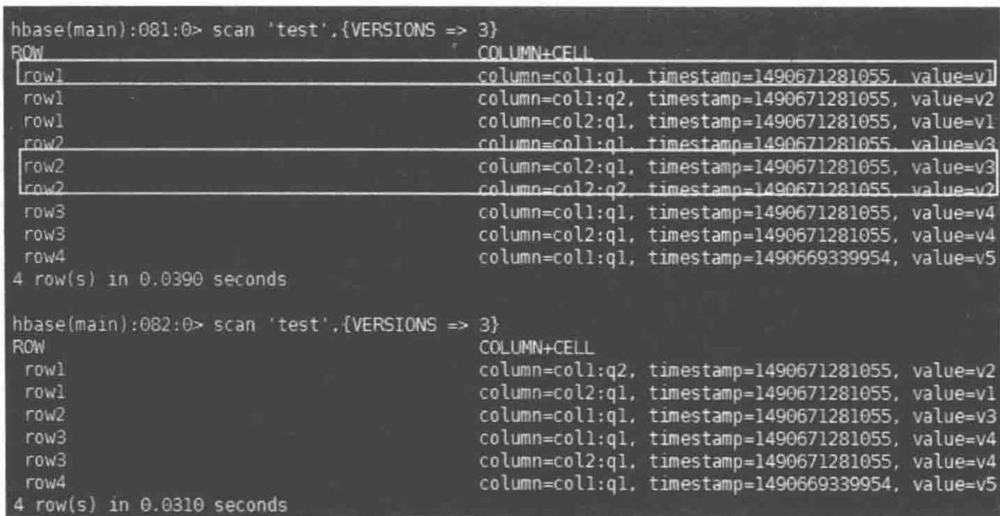

# HBase 基础操作

HBase 的主要客户端接口是由 org.apache.hadoop.hbase.client 包中的 HTable 类提供的, 用户可以完成向 HBase 存储和检索数据, 以及删除无效数据之类的操作。

## 7.1 CRUD 操作

数据库的基本操作通常被称为 CRUD(Create, Read, Update, Delete)，具体指增、查、改、删。HBase 中有与之相对应的一组操作，这些方法都由 HTable 类提供，下面将依次介绍。

## 7.1.1 Put 操作

Put 类中主要含有一个 KeyValue 对象数组, KeyValue 对象是 HBase 底层存储的一个重要类, 代表数据在底层存储时的状态。KeyValue 对象代表 HBase 表中的一个数据单元, 包含行值 (row)、列簇 (family)、列 (column)、时间戳 (timestamp) 和值 (value) 等信息, 并以这些信息确定表中的唯一一个数据单元。当插入一条数据时, 其实就是 KeyValue 进行序列化, 然后传递 HBase 集群, 集群再根据 KeyValue 的值进行相应的操作。

Put 类提供的方法如表 7-1 所示。

表 7-1 Put 类提供的方法

<table><tr><td>方法</td><td>描述</td></tr><tr><td>Put(byte[] row)/Put(byte[] row,RowLock lock)</td><td>构建 Put 实例,设定行键/构建 Put 实例,设定行键,定义行锁</td></tr><tr><td>add(byte[] family,byte[] qualifier,byte[] value)/add(byte[] family,byte[] qualifier,long ts,byte[] value)/addColumn(byte[] family,byte[] qualifier,long ts,byte[] value)</td><td>向 Put 实例中特定地添加列簇、列、值/向 Put 实例中特定地添加列簇、列、时间戳、值/向 Put 实例中特定地添加列簇、列、时间戳、值</td></tr><tr><td>getTimeStamp()</td><td>返回 Put 实例的时间戳,默认值为 Long.MAX_VALUE</td></tr><tr><td>has(byte[] family,byte[] qualifier)/has(byte[] family,byte[] qualifier,byte[] value)</td><td>检查是否存在指定单元格/检查,是否存在包含 value 值的指定单元格</td></tr><tr><td>setWriteToWAL(boolean write)</td><td>开启或关闭服务器端数据预写日志(Write-Ahead-Log)</td></tr><tr><td>getRow()</td><td>返回创建 Put 实例时指定的行键</td></tr><tr><td>numFamilies()</td><td>返回所有 KeyValue 实例中的列簇数量</td></tr><tr><td>isEmpty()</td><td>查询 Put 中是否含有任何 KeyValue 实例</td></tr><tr><td>Size()</td><td>返回 Put 中所含 KeyValue 实例的数量</td></tr></table>

HBase 客户端拥有多重方式进行数据插入,通过调整不同的属性从而实现不同插入方式。

## 1. void put(Put p) throws IOException

该方法向表中添加一行数据。在此过程中会发送一次 RPC 操作进行请求，并将 Put 中的数据序列化以后传送给相应的服务器进行数据插入。

2. boolean checkAndPut(byte[] row, byte[] family, byte[] qualifier, byte[] value, Put p) throws IOException

该方法提供了一种原子性操作,即该操作如果失败,则操作中的所有更改都失效。该函数在多个客户端对同一个数据进行修改时将会提供较高的效率。

## void put(List < Put < plist ) throws IOException

该方法在批量插入中生成一个 List 容器, 然后将多行数据全部转载到该容器中, 然后通过客户端的代码一次将多行数据进行提交。

## 4. void flushCommits() throws IOException

该方法实现了缓冲区的刷写功能。因为每一次 Put 操作都要执行一次 RPC 操作，RPC 操作的时间开销在处理大量数据时会成为一个极大负担。为了解决这个问题，HBase 提供了写缓冲区。缓冲区大小可由客户端自行设置，用户提交的 Put 操作将由缓冲区负责收集。接着在缓冲区溢出或主动调用刷写功能时，缓冲区调用 RPC 操作一次性将所有 Put 操作送往服务器。

## 【代码实例1】

```java
import org.apache.hadoop.conf.Configuration;
import org.apache.hadoop.hbase.HBaseConfiguration;
import org.apache.hadoop.hbase.client.Get;
import org.apache.hadoop.hbase.client.HTable;
import org.apache.hadoop.hbase.client.Put;
import org.apache.hadoop.hbase.client.Result;
import org.apache.hadoop.hbase.util.Bytes;
import java.io.IOException;
import java.util.ArrayList;
import java.util.List;

public class test_hbase {
    public static void main(String[] args) throws IOException
    {
```

```txt
Configuration conf = HBaseConfiguration.create();
conf.set("hbase.zookeeper.quorum", "main1");①
HTable table = new HTable(conf,"test");②
table.setAutoFlush(false);③
Put put = new Put(Bytes.toBytes("row1"));④
put.add(Bytes.toBytes("col1"),Bytes.toBytes("q1"),Bytes.toBytes("v1"));⑤
put.add(Bytes.toBytes("col1"),Bytes.toBytes("q2"),Bytes.toBytes("v2"));
List<Put> puts = new ArrayList<Put>();⑥
Put put1 = new Put(Bytes.toBytes("row2"));
put1.add(Bytes.toBytes("col1"),Bytes.toBytes("q1"),Bytes.toBytes("v3"));
puts.add(put1);⑦
Put put2 = new Put(Bytes.toBytes("row3"));
put2.add(Bytes.toBytes("col1"),Bytes.toBytes("q1"),Bytes.toBytes("v4"));
puts.add(put2);
Put put3 = new Put(Bytes.toBytes("row4"));
put3.add(Bytes.toBytes("col1"),Bytes.toBytes("q1"),Bytes.toBytes("v5"));
table.put(put);
table.put(puts);⑧
Get get = new Get(Bytes.toBytes("row1"));
Result res1 = table.get(get);
System.out.println("Result:"+ res1);⑨
table.flushCommits();⑩
Result res2 = table.get(get);
System.out.println("Result:"+ res2);⑪
boolean res3 = table.checkAndPut(Bytes.toBytes("row1"),Bytes.toBytes("col1"),
Bytes.toBytes("q1"),null,put);
table.flushCommits();
System.out.println("Put applied:"+ res3);⑫
boolean res4 = table.checkAndPut(Bytes.toBytes("row4"),Bytes.toBytes("col1"),
Bytes.toBytes("q1"),null,put3);
table.flushCommits();
System.out.println("Put applied:"+ res4);⑬
}
}
```

其中，①创建配置；②实例化一个客户端；③将自动刷写设置为 false，启用客户端写缓冲区；④指定一行创建 Put 实例；⑤向 Put 中添加一个名为 col: q1 的列；⑥创建一个 Put 实例列表；⑦将一个 Put 实例添加到列表中；⑧前一行将 Put 实例存入 HBase 表中，此行将列表中的所有实例添加到 HBase 表中；⑨加载先前存储的行，因为未在表中找到，结果会打印出 Result: keyvalues=NONE，如图 7-1 所示；⑩强制刷写缓冲区，产生一个 RPC 请求，将之前的 Put 操作执行；⑪同样加载先前存储的行，因前一步数据已经被持久化，故可以读取到，打印出行信息；⑫检查指定列是否存在于 HBase 表中来决定是否执行 Put 操作。此处指定列已存在，未能成功执行且输出 false；⑬此处因指定在表中列不存在，故成功执行 Put 操作且输出 true，如图 7-2 所示。

  
图 7-1 执行前后存储结果

```batch
"C:\Program Files\Java\jdk1.7.0_80\bin\java" ...
log4j:WARN No appenders could be found for logger (org.apache.hadoop.metrics2.lib MutableMetricsFactory).
log4j:WARN Please initialize the log4j system properly.
log4j:WARN See http://logging.apache.org/log4j/1.2/faq.html#noconfig for more info.
Result keyvalues=NONE
Result keyvalues={row1/coll:q1/1490584955184/Put/vlen=2/seqid=0, row1/coll:q2/1490584955184/Put/vlen=2/seqid=0}
Put applied:false
Put applied:true

Process finished with exut code 0
```  
图7-2 运行结果

## 7.1.2 Get 操作

用户使用 Get 类查询时,从 HBase 获取的查询结果中每一行数据会作为一个 Result 对象,数据将存入对应 Result 实例中。用户需要获取一行数据时读取该行数据所在的 Result 对象。该对象内部封装了一个 KeyValue 对象数组。

Get 类提供的方法见表 7-2。

表 7-2 Get 类提供的方法

<table><tr><td>方法</td><td>描述</td></tr><tr><td>Get(byte[] row)/Get(byte[] row,RowLock lock)</td><td>构建 Get 实例,设置行键/构建 Get 实例,并设置行键,定义行锁</td></tr><tr><td>addFamily(byte[] family)/addColumn (byte[] family,byte[] qualifier)</td><td>指定 Get 请求时返回的指定列簇/指定 Get 请求时返回的指定列</td></tr><tr><td>setTimeStamp(long timestamp)</td><td>指定时间戳</td></tr><tr><td>setTimeRange(long startTime,long maxTime)</td><td>指定时间戳的范围</td></tr><tr><td>setMaxVersion(int version)/setMaxVersion()</td><td>指定返回确切版本数的数据/指定返回所有版本的数据</td></tr><tr><td>Guam()</td><td>返回创建 Get 实例时指定的行键</td></tr><tr><td>hasFamilies()</td><td>检查列簇或列是否存在于当前的 Get 实例中</td></tr></table>

HBase 客户端拥有多重方式进行数据查询,通过调整不同的属性从而实现不同查询方式。

Get 操作是通过 row 参数来指定所要获取的行。虽然一次 Get 操作只能取一行数据，但不会限制在一行中取多少列或者多少单元格。每次 RPC 请求只发送一个 Get 对象中的数据。

## 2. Result[] get(List<Get>gets) throws IOException

多行获取实质就是用户需要创建一个列表 List<Get>，并把之前准备好的 Get 实例添加到其中，然后对 List<Get> 实例进行迭代，从而发送多次数据请求（即多个 RPC 请求与数据操作，一次请求包含一次 RPC 请求和一次数据传输）。

## 3. Result getRowOrBefore(byte[] row, bytel family) throws IOException

getRowOrBefore 方法会查找行键 family, 若存在行 row 则将指定的列簇结果返回; 若不存在行 row 则返回已排好序的表中具有行键 family 的最后一条结果。若找不到任何包含行键 family 的结果则返回 null。

## 【代码实例2】

```java
import org.apache.hadoop.conf.Configuration;
import org.apache.hadoop.hbase.HBaseConfiguration;
import org.apache.hadoop.hbase.KeyValue;
import org.apache.hadoop.hbase.client.Get;
import org.apache.hadoop.hbase.client.HTable;
import org.apache.hadoop.hbase.client.Put;
import org.apache.hadoop.hbase.client.Result;
import org.apache.hadoop.hbase.util.Bytes;
import java.io.IOException;
import java.util.List;
public class test_hbase {
    private static byte[] c1 = Bytes.toBytes("coll");
    private static byte[] q1 = Bytes.toBytes("q1");
    private static byte[] q2 = Bytes.toBytes("q2");
    private static byte[] row1 = Bytes.toBytes("row1");
    private static byte[] row2 = Bytes.toBytes("row2");
    private static byte[] row3 = Bytes.toBytes("row3");①
    public static void main(String[] args) throws IOException {
        Configuration conf = HBaseConfiguration.create();
        conf.set("hbase.zookeeper.quorum", "main1");
        HTable table = new HTable(conf,"test");
        Get get = new Get(row1);
        get.addColumn(c1,q1);②
        Result res1 = table.get(get);
        byte[] val1 = res1.getValue(c1,q1);
        System.out.println("value: " + Bytes.toString(val1));③
        Get get1 = new Get(row1);
        get.addColumn(Bytes.toBytes("NotExist"),q1);
        Result res2 = table.get(get1);
        byte[] val2 = res2.getValue(Bytes.toBytes("NotExist"),q1);
        System.out.println("value: " + Bytes.toString(val2));④
        List<Get> gets = new ArrayList<Get>();⑤
        Get get2 = new Get(row1);
        get.addColumn(c1,q2);
```

```txt
gets.add(get2);⑥
Get get3 = new Get(row2);
get.addColumn(c1,q1);
gets.add(get3);
Get get4 = new Get(row3);
get.addColumn(c1,q1);
gets.add(get4);
Result[] res3 = table.get(gets);
for(Result res:res3){
    for(KeyValue kv : res.raw()){
        System.out.println("Row: " + Bytes.toString(kv.getRow()) + ";Value " +
Bytes.toString(kv.getValue()));
    }
}⑦
Result res4 = table.getRowOrBefore(row1,c1);
System.out.println("Found: " + Bytes.toString(res4.getRow()));⑧
Result res5 = table.getRowOrBefore(Bytes.toBytes("noexist"),c1);
System.out.println("Found: " + res5);⑨
}
}
```

其中，①预先准备共用频率高的字节数组；②指定行键创建一个Get实例并添加列；③从HBase表中获取指定列的行数据，并打印输出；④从HBase表中以Get()方法获取不存在的行数据，结果打印出null；⑤创建一个Get实例列表；⑥将一个Get实例添加到列表中；⑦遍历结果，打印读取的所有结果；⑧从HBase表中以getRowOrBefore方法获取指定列名中每一行数据值，并打印输出；⑨从HBase表中以getRowOrBefore方法获取不存在的行数据，结果打印出null，如图7-3所示。

```batch
"C:\Program Files\Java\jdk1.7.0_80\bin\java" ...
log4j:WARN No appenders could be found for logger (org.apache.hadoop.metrics2.lib.MutableMetricsFactory
log4j:WARN Please initialize the log4j system properly.
log4j:WARN See http://logging.apache.org/log4j/1.2/faq.html#noconfig for more info.
value: v1
value: null
Row: row1;Value v1
Row: row1;Value v2
Row: row2;Value v3
Row: row3;Value v4
Found: row1
Found: null
```  
图7-3 Get结果

## 7.1.3 Delete 操作

Delete 类与 Put 类的功能相逆,但结构相似。Delete 类也含有一个 KeyValue 对象数组,且操作都是对此数组进行。

Delete 类提供的方法如表 7-3 所示。

表 7-3 Delete 类提供的方法

<table><tr><td>方法</td><td>描述</td></tr><tr><td>Delete(byte[] row)/Delete(byte[] row,long timestamp,RowLock lock)</td><td>构建 Delete 实例,设置行键/构建 Delete 实例,并设置行键,添加时间戳,定义行锁</td></tr><tr><td>DeleteFamily(byte[] family)/DeleteColumn(byte[] family,byte[] qualifier)</td><td>指定 Delete 操作时删除的指定列簇/指定 Delete 操作时删除的指定列</td></tr><tr><td>getTimeStamp(long timestamp)</td><td>检索 Delete 实例时间戳</td></tr><tr><td>Guam()</td><td>返回创建 Delete 实例时指定的行键</td></tr><tr><td>hasFamilies()</td><td>检查列簇或列是否存在于当前的 Delete 实例中</td></tr><tr><td>isEmpty()</td><td>查询 Delete 中是否含有任何用户所指定想要删除的列或列簇</td></tr></table>

HBase 客户端同样提供了多种 Delete 删除方法, 包含单行删除、多行删除等。HBase 中的一次 Delete 操作不会立刻将 HBase 存储的相应数据删除, 只会在相应的 KeyValue 存储单元上打上删除标记。等到下一次 region 合并、分裂等操作时才会将所有的数据进行移除。

## 1. void delete(Delete d) throws IOException

通过新建 Delete 实例,接着以上面所提供的方法将不同参数设定到实例中,用来指定对某一行的某一个列簇、某一个列、某一个列中具体版本的数据进行删除。

## 2. void delete(List<Delete>ds) throws IOException

列表删除与之前的列表获取相似,先创建一个列表 List<Delete>,并把之前准备好的 Delete 实例添加到其中,然后通过客户端的代码一次将多行数据进行删除。

```txt
3. boolean checkAndDelete(byte[] row, byte[] family, byte[] qualifier, byte[] value, Delete d) throws IOException
```

checkAndDelete 方法与之前的 checkAndPut 方法相似, 同是原子性操作, 即如果检查不到特定单元格, 则不执行删除操作, 并返回 false; 如果检查成功, 则会执行删除操作, 并返回 true。

## 【代码实例3】

```java
private static byte[] c1 = Bytes.toBytes("col1");
private static byte[] c2 = Bytes.toBytes("col2");
private static byte[] q1 = Bytes.toBytes("q1");
private static byte[] q2 = Bytes.toBytes("q2");
private static byte[] q3 = Bytes.toBytes("q3");
private static byte[] row1 = Bytes.toBytes("row1");
private static byte[] row2 = Bytes.toBytes("row2");
private static byte[] row3 = Bytes.toBytes("row3");①
public void hbase_delete() throws IOException{
    Configuration conf = HBaseConfiguration.create();
    conf.set("hbase.zookeeper.quorum", "main1");
    HTable table = new HTable(conf, "test");
    Delete delete = new Delete(row1);
    delete.deleteColumns(c1,q1);②
```

```txt
List<Delete> deletes = new ArrayList<Delete>();
Delete delete1 = new Delete(row2);
delete1.deleteFamily(c2);④
deletes.add(delete);
deletes.add(delete1);⑤
Delete delete2 = new Delete(row2);
delete2.deleteColumn(c2,q1);
boolean res1 = table.checkAndDelete(row2,c2,q1,null,delete2);⑥
System.out.println("Delete: " + res1);
table.delete(deletes);⑦
boolean res2 = table.checkAndDelete(row2,c2,q1,null,delete2);
System.out.println("Delete: " + res2);⑧
table.close();
```

其中，①预先准备共用频率高的字节数组；②创建针对特定行的 Delete 实例并指定删除列的全部版本；③创建一个 Delete 实例列表；④创建针对特定行的 Delete 实例并指定删除的整个列簇，包括所有的列和版本；⑤将 Delete 实例添加到列表中；⑥通过 checkAndDelete 检查指定列是否不存在，若检查成功，则执行删除操作，并返回 true；否则，不执行删除操作，并返回 false，此处显示为 false；⑦从 HBase 表中删除数据；⑧因为此处指定列已被删除，所以 checkAndDelete 显示为 true，如图 7-4 和图 7-5 所示。

```batch
"C:\Program Files\Java\jdk1.7.0_80\bin\java"
log4j:WARN No appenders could be found for logger (org.apache.hadoop.metrics2.lib.MutableMetricsFactory).
log4j:WARN Please initialize the log4j system properly.
log4j:WARN See http://logging.apache.org/log4j/1.2/faq.html#noconfig for more info.
Delete: false
Delete: true
```  
图7-4 Delete程序执行结果

  
\*所删除数据在图中已框出。

图 7-5 Delete 程序运行前后数据

## 7.2 批处理操作

之前一些基于列表的操作,如 delete(List<Delete>ds)或者 get(List<Get>gs),都是基于批处理操作 batch 方法实现的。

HBase 客户端提供了如下批量处理操作

```kotlin
Void batch(List<Row> actions,Object[] results)
        throws IOException,InterruptedException
Object,[] batch(List<Row> actions)
        throws IOException,InterruptedException
```

其中，Row 是 Put、Get 和 Delete 类的父类。使用前者用户可以访问部分结果，而使用后者则不可以。

HBase 的 batch 操作中不可以将针对同一行的 Put 和 Delete 操作放在同一个批量处理请求中，batch 中操作的处理顺序不同，可能会产生不一样的结果。当用户使用 batch() 功能时，Put 实例不会被客户端写入缓冲区缓冲。batch 请求是同步的，会把操作直接发送到服务器端，这个过程没有什么延迟或其他中断操作。

batch 操作的返回结果如表 7-4 所示。

表 7-4 batch 操作的返回结果

<table><tr><td>结果</td><td>描述</td></tr><tr><td>null</td><td>连接远程服务器失败</td></tr><tr><td>EmptyResult</td><td>Put 或 Delete 操作成功</td></tr><tr><td>Result</td><td>Get 操作成功。若没有查询的行或列,则返回空的 Result</td></tr><tr><td>Throwable</td><td>服务器端产生异常</td></tr></table>

## 【代码实例4】

```java
private static byte[] c1 = Bytes.toBytes("col1");
private static byte[] c2 = Bytes.toBytes("col2");
private static byte[] q1 = Bytes.toBytes("q1");
private static byte[] q2 = Bytes.toBytes("q2");
private static byte[] q3 = Bytes.toBytes("q3");
private static byte[] row1 = Bytes.toBytes("row1");
private static byte[] row2 = Bytes.toBytes("row2");
private static byte[] row3 = Bytes.toBytes("row3");①
public void hbase_batch() throws IOException{
    Configuration conf = HBaseConfiguration.create();
    conf.set("hbase.zookeeper.quorum", "main1");
    HTable table = new HTable(conf, "test");
    List<Row> batch = new ArrayList<Row>();②
    Put put = new Put(row2);
    put.add(c2,q1,Bytes.toBytes("v6"));
    batch.add(put);③
    Get get = new Get(row1);
    get.addColumn(c1,q2);
    batch.add(get);④
    Delete delete = new Delete(row3);
```

```txt
delete.addColumn(c1,q1);
batch.add(delete);⑤
Get get1 = new Get(row1);
get1.addFamily(Bytes.toBytes("NoExist"));
batch.add(get1);⑥
Object[] res = new Object[batch.size());⑦
try{
    table.batch(batch,res);
} catch (Exception event){
    System.out.println("Event: " + event);⑧
}
for(int i = 0;i < res.length;i++)
    System.out.println("res " + i + ": " + res[i]);⑨
table.close();
```

其中，①预先准备共用频率高的字节数组；②创建一个可以存放所有操作的列表；③向列表中添加一个Put实例，对应结果res 0；④向列表中添加一个Get实例，对应结果res 1；⑤向列表中添加一个Delete实例，对应结果res 2；⑥向列表中添加一个查找不存在数据的Put实例，对应结果res 3；⑦创建存储结果的数组；⑧输出捕获的异常；⑨输出整个batch操作所获取的结果，如图7-6和图7-7所示。

```txt
res 0: keyvalues=NONE
res 1: keyvalues={row1/coll;q2/1490671281055/Put/vlen=2/seqid=0}
res 2: keyvalues=NONE
res 3: org.apache.hadoop.hbase.regionserver.NoSuchColumnFamilyException: org.apache.hadoop.hbase.regionserver.NoSuchColumnF
at org.apache.hadoop.hbase.regionserver.HRegion.checkFamily(HRegion.java 73.1)
at org.apache.hadoop.hbase.regionserver.HRegion.get(HRegion.java 6531)
at org.apache.hadoop.hbase.regionserver.RSRpcServices.doNonAtomicRegionMutation(RSRpcServices.java 582)
at org.apache.hadoop.hbase.regionserver.RSRpcServices.multi(RSRpcServices.java 2050)
at org.apache.hadoop.hbase.protobuf.generated.ClientProtos$ClientService$2.callBlockingMethod(ClientProtos.java 32393)
at org.apache.hadoop.hbase.ipc.RpcServer.call(RpcServer.java 2127)
at org.apache.hadoop.hbase.ipc.CallRunner.run(CallRunner.java 107)
at org.apache.hadoop.hbase.ipc.RpcExecutor.consumerLoop(RpcExecutor.java 133)
at org.apache.hadoop.hbase.ipc.RpcExecutor$1.run(RpcExecutor.java 108)
at java.lang.Thread.run(Thread.java 745)
```  
图 7-6 batch 程序运行结果

  
\*前一个框是删除数据，后一个框是插入数据。

图 7-7 程序运行前后数据

## 7.3 行锁

服务器在串行方式的执行中,每一个操作都必须保证是原子性的。HBase 利用行锁来保证这一特性。在使用行锁时需要十分谨慎,因为两个客户端很可能同时被对方锁住,而且只有对方能解开锁,形成一个死锁。

HBase 客户端提供了以下 API 对单行数据的多次操作进行加锁。

```txt
RowLock lockRow(byte[] row) throws IOException
void unlockRow(RowLock r) throws IOException
```

前者需要将一个行键作为参数,生成一个 RowLock 实例。若不要锁,则需要使用 unlockRow 操作来解锁。锁必须针对整行,并且指定其行键,一旦它获得锁定权就能防止其他并发修改。

## 【代码实例5】

```java
static class UnlockPut implements Runnable {①
    public void run() {
        try {
            Configuration conf = HBaseConfiguration.create();
            conf.set("hbase.zookeeper.quorum", "main1");
            HTable table = new HTable(conf, "test");
            Put put = new Put(row1);
            put.add(c1, q1, Bytes.toBytes("v1"));
            long time = System.currentTimeMillis();
            System.out.println("Thread trying to put same row now...");
            table.put(put);②
            System.out.println("Wait time: " + (System.currentTimeMillis()- time) + "ms");
        } catch (IOException event) {
            System.err.println("Thread error: " + event);
        }
    }
}

public static void main(String[] args) throws IOException {
    Configuration conf = HBaseConfiguration.create();
    conf.set("hbase.zookeeper.quorum", "main1");
    HTable table = new HTable(conf, "test");
    System.out.println("Taking out lock...");
    RowLock lock = table.lockRow(row1);③
    System.out.println("Lock ID: " + lock.getLockId());
    Thread thread = new Thread(new UnlockPut());④
    thread.start();
    try{
        System.out.println("Sleeping 5secs in main...");
        Thread.sleep(5000);⑤
    }catch (InterruptedException event) {
```

```txt
//ignore
}

try{
    Put put1 = new Put(row1,lock);⑥
    put1.add(c1,q1,Bytes.toBytes("v1"));
    table.put(put1);
    Put put2 = new Put(row1,lock);⑦
    put1.add(c1,q1,Bytes.toBytes("v2"));
    table.put(put2);
}catch (Exception event){
    System.out.println("Event: " + event);
}finally {
    System.out.println("Releasing lock...");
    table.unlockRow(lock);⑧
}
}
```

其中，① 使用一个异步线程更新同一行，不显式加锁；② Put 调用被阻塞，直到锁被释放；③ 给整行加锁；④ 启动会阻塞的异步线程；⑤ 休眠以阻塞其他写入操作；⑥ 在拥有锁使用权的情况下创建 Put；⑦ 在拥有锁使用权的情况下创建另一个 Put；⑧ 释放锁，让阻塞线程继续执行，如图 7-8 所示。

```txt
"C:\Program Files\Java\jdk1.7.0_80\bin\java" ...
Taking out lock...
Lock Id...
Sleeping 5secs in main...
Thread trying to put same row now...
Releasing lock...
Wait time: 5013ms
```  
图 7-8 程序执行结果

一个客户端想要对另一客户端加锁的数据进行修改时,必须等待直到锁被释放或锁的时间超时。

默认的锁超时时间是一分钟,但可以在 Hbase-site.xml 文件中添加以下配置项来修改这个默认值,时间以毫秒为单位。

```xml
<property>
    <name> hbase.regionserver.lease.period </name>
    <value> 120000 </value>
</property>
```

## 7.4 扫描

Put、Delete 与 Get 都只能进行单行操作。为了能够快速对整张表进行扫描以获取想要的结果，HBase 客户端提供了一个 Scan 的 API 来实现。

Scan 实例的创建有显式和隐式两种, 如表 7-5 所示。

表 7-5 Scan 实例的两种模式

<table><tr><td>隐式</td><td>显式</td></tr><tr><td></td><td>Scan(byte[] startRow, Filter filter)</td></tr><tr><td>ResultScanner getScanner(byte[] family) throws IOException</td><td>Scan(byte[] startRow)</td></tr><tr><td>ResultScanner getScanner(byte[] family, byte[] qualifier) throws IOException</td><td>Scan(byte[] startRow, byte[] stopRow)</td></tr></table>

采用显式方法创建 Scan 实例时, 用户可以通过 startRow 参数来指定扫描读取 HBase 表的起始行键, 而不需指定行键。扫描的区间包含起始行, 而没有终止行。若提供的参数没有精确匹配, 扫描会匹配相等或大于给定的起始行的行键。隐式创建方式即调用一次列表扫描方法, ResultScanner 对象会在扫描请求发送前隐式地创建一个 Scan 对象。

创建 Scan 实例后, 用户可以通过表 7-6 中 HBase 提供的相关 API 向实例中添加限制条件。

表 7-6 HBase 提供的相关 API

<table><tr><td>方法</td><td>描述</td></tr><tr><td>addFamily(byte[] family)/addColumn (byte[] family,byte[] qualifier)</td><td>指定 Scan 操作时读取的指定列簇/指定 Scan 操作时读取的指定列</td></tr><tr><td>setTimeStamp(long timestamp)</td><td>设置时间戳</td></tr><tr><td>setTimeRange(long minStamp,long maxStamp)/getTimeRange()</td><td>设置时间戳/查询设定的时间戳范围</td></tr><tr><td>setStartRow(byte[] startRow)/setStopRow (byte[] stopRow)</td><td>设置起始行/设置终止行</td></tr><tr><td>getStartRow()/getStopRow()</td><td>查询 Scan 实例创建时设定的起始行/终止行</td></tr><tr><td>setMaxVersions()/setMaxVersions(int maxVersions)</td><td>设置扫描返回的版本号</td></tr><tr><td>setFilter(Filter filter)</td><td>设置过滤器</td></tr><tr><td>numFamilies()</td><td>获取 Scan 实例中的列簇和列的数量</td></tr></table>

扫描操作将每一行数据封装成一个 Result 实例,并将所有的 Result 实例放入一个迭代器中。通过调用 close 方法可以告知服务器扫描已经结束,让其释放扫描资源。HBase 特别提供了以下两个 next 方法方便用户遍历,每一个 next 返回一个单独的 Result 实例,表示为下一个可用的行。

## 【代码实例6】

```java
public void hbase_scan()throws IOException {
    Configuration conf = HBaseConfiguration.create();
    conf.set("hbase.zookeeper.quorum", "main1");
    HTable table = new HTable(conf, "test");
    System.out.println("Scanning table # 1...");
    Scan scan1 = new Scan();①
    ResultScanner scanner1 = table.getScanner(scan1);②
    for(Result res : scanner1){
        System.out.println(res);③
    }
    scanner1.close();④
    System.out.println("Scanning table # 2...");
    Scan scan2 = new Scan();
    scan2.addFamily(c1);⑤
    ResultScanner scanner2 = table.getScanner(scan2);
    for(Result res : scanner2){
        System.out.println(res);
    }
    scanner2.close();
    System.out.println("Scanning table # 3...");
    Scan scan3 = new Scan();
    scan3.addColumn(c1,q1).addColumn(c2,q1).
        setStartRow(row1).setStopRow(row3);⑥
    ResultScanner scanner3 = table.getScanner(scan3);
    for(Result res : scanner3){
        System.out.println(res);
    }
    scanner3.close();
}
```

其中，①创建一个空的 Scan 实例；②取得一个扫描器迭代访问所有的行；③打印行内容；④关闭扫描器释放远程资源；⑤只添加一个列簇，可以禁止获取非 coll 的数据；⑥使用 builder 模式将详细限制条件添加到 Scan 实例，如图 7-9 所示。

```txt
log4j:WARN No appenders could be found for logger (org.apache.hadoop.metrics2.lib.MutableMetricsFactory)
log4j:WARN Please initialize the log4j system properly.
log4j:WARN See http://logging.apache.org/log4j/1.2/faq.html#noconfig for more info.
Scanning table #1...
keyvalues={row1/col1:q2/1490671281055/Put/vlen=2/seqid=0, row1/col2:q1/1490671281055/Put/vlen=2/seqid=0}
keyvalues={row2/col1:q1/1490671281055/Put/vlen=2/seqid=0, row2/col2:q1/1490683282570/Put/vlen=2/seqid=0}
keyvalues={row3/col2:q1/1490671281055/Put/vlen=2/seqid=0}
keyvalues={row4/col1:q1/1490669339954/Put/vlen=2/seqid=0}
Scanning table #2...
keyvalues={row1/col1:q2/1490671281055/Put/vlen=2/seqid=0}
keyvalues={row2/col1:q1/1490671281055/Put/vlen=2/seqid=0}
keyvalues={row4/col1:q1/1490669339954/Put/vlen=2/seqid=0}
Scanning table #3...
keyvalues={row1/col2:q1/1490671281055/Put/vlen=2/seqid=0}
keyvalues={row2/col1:q1/1490671281055/Put/vlen=2/seqid=0, row2/col2:q1/1490683282570/Put/vlen=2/ seqid=0}
```  
图 7-9 Scan 程序执行结果

## 7.5 其他操作

## 7.5.1 HTable 方法

客户端 API 是由 HTable 的实例提供的, 用户可以用它来操作 HBase 表, 方法见表 7-7。

表 7-7 HTable 实例的方法

<table><tr><td>方法</td><td>描述</td></tr><tr><td>void close()</td><td>使用 HTable 实例之后,需要调用一次 close,这个方法会刷写所有客户端缓冲的写操作</td></tr><tr><td>byte[] getTableName()</td><td>获取表名称</td></tr><tr><td>Configuration getConfiguration()</td><td>允许访问 HTable 实例中使用的配置</td></tr><tr><td>static boolean isTableEnabled(table)</td><td>检查表在 Zookeeper 中是否被标识为启用</td></tr><tr><td>byte[][] getStartKeys()</td><td>获取表中所有 region 的起始行键</td></tr><tr><td>byte[][] getEndKeys()</td><td>获取表中所有 region 的终止行键</td></tr><tr><td>PairgetStartEndKeys()</td><td>获取二维字节数组形式的表所有 region 起始、终止行键</td></tr><tr><td>HRegionLocation getRegionLocation()/MapgetRegionsInfo()</td><td>获取某一行数据的具体位置信息所在的 region 信息</td></tr><tr><td>void clearRegionCache()</td><td>清空缓存的 region 位置信息</td></tr></table>

## 7.5.2 Bytes 方法

Bytes 提供了将 Java 的各种原生数据类型互相转化等方法, 而且 Bytes 的所有操作都不需要创建一个新的实例, 如表 7-8 所示。

表 7-8 Bytes 方法

<table><tr><td>方法</td><td>描述</td></tr><tr><td>toStringBinary()</td><td>把不能打印的信息转换为人工可读的十六进制数</td></tr><tr><td>compareTo()/equals()</td><td>对两个byte[]进行比较。前者返回一个比较结果,后者返回一个布尔值,表示两个数组是否相等</td></tr><tr><td>add()</td><td>把两个字节数组连接在一起形成一个新的数组</td></tr><tr><td>head()/tail()</td><td>获取字节数组头部/尾部数据</td></tr><tr><td>binarySearch()</td><td>在给定的字节数组中二分查找一个目标值</td></tr><tr><td>incrementBytes()</td><td>将一个long类型数据转化成字节数组,并与long类型数据相加后返回一个字节数组</td></tr></table>

## 本章小结

本章主要介绍了 HBase 的基础操作,由浅入深地让读者逐步了解掌握 HBase 的基础操作实现。

（1）详细介绍了CRUD操作中各操作的操作原理及提供的方法，通过实例具体讲述了如何实现对HBase表的CRUD操作。

（2）详细介绍了批处理操作的操作原理及提供的方法，通过具体实例与 CRUD 实例的比较显示两者的差异。

（3）详细介绍了行锁的操作原理、出现原因及提供的方法，通过具体实例讲述了如何实现对 HBase 表的建锁、解锁及行锁产生的作用。

（4）详细介绍了扫描的操作原理、两种创建类型及提供的方法，通过具体实例讲述了如何实现对 HBase 表不同方式的扫描。

（5）简单介绍了 HBase 提供的 HTable 和 Bytes 方法。

## 习题

(1) 以下方法中，( )不是 CRUD 操作。
A. Put    B. Get    C. Delete    D. Lock

(2) 以下( )不是 KeyValue 对象中包含的信息。
A. row    B. family    C. column    D. table

(3) 什么是 HBase 的写缓冲区, 为什么使用写缓冲区?

(4) HBase 如何进行 Delete 操作?

（5）为什么在使用行锁时要十分谨慎？如何对一行加行锁？

(6) Scan 实例的创建有哪几种, 如何创建它们?
