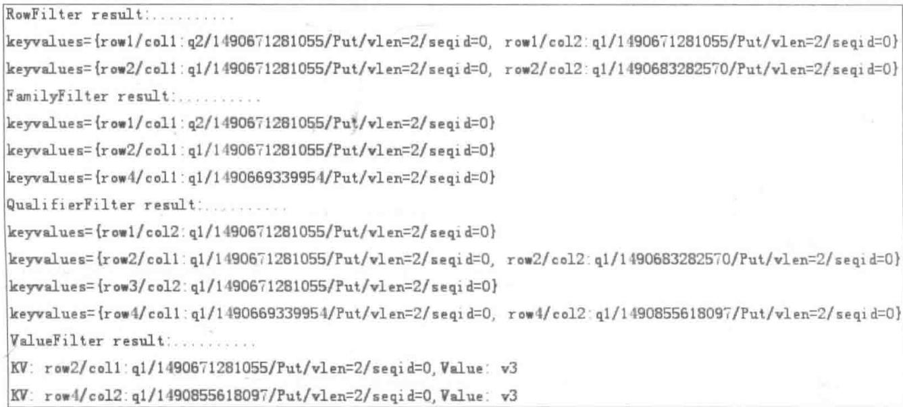

# HBase 高阶特性

## 8.1 过滤器

HBase 过滤器是一套为完成一些较高级的需求所提供的 API 接口。从过滤器的名称可以看出，过滤器就是对从数据库获取的数据进行过滤，将符合条件的数据返回客户端，从而减少 region 服务器向客户端发送的数据量，减少无用数据传输，提高效率。

## 8.1.1 什么是过滤器

过滤器主要由过滤器本身、比较器和比较运算符组成。一般来说，实现一个过滤器需要在过滤器中规定比较运算符与比较器。但是也有例外，如扩展类过滤器还拥有其他参数。

过滤器的作用与 SQL 语句中的 where 语句很相似, 在 where 语句中一般使用比较符号, 而在过滤器中不能使用常规的比较操作符, 而为其特别定义了一套比较运算符。

比较运算符全部被封装在一个名为 Compare() 的枚举类中, 因此在使用时一般通过这个类去引用其中的比较运算符, 比较运算符如表 8-1 所示。

表 8-1 过滤器中的比较运算符

<table><tr><td>操作</td><td>描述</td></tr><tr><td>LESS</td><td>匹配小于设定的值</td></tr><tr><td>LESS_OR_EQUAL</td><td>小于或者等于预设定的值</td></tr><tr><td>EQUAL</td><td>等于预设定的值</td></tr><tr><td>NOT_EQUAL</td><td>不等于预设定的值</td></tr><tr><td>GREATER_OR_EQUAL</td><td>大于或者等于预设定的值</td></tr><tr><td>GREATER</td><td>大于预设定的值</td></tr><tr><td>NO_OP</td><td>排除一切值</td></tr></table>

比较器是规定如何进行比较的一套类文件,不同的比较器规定了在比较时使用规则是不相同的,因此会因为使用不同的比较器而使比较结果出现较大的差异。通常使用的比较器如表8-2所示。

表 8-2 常用的比较器

<table><tr><td>比较器</td><td>描述</td></tr><tr><td>BinaryComparator</td><td>小于或者等于预设定的值</td></tr><tr><td>BinaryPrefixComparator</td><td>等于预设定的值</td></tr><tr><td>NullComparator</td><td>不等于预设定的值</td></tr><tr><td>BitComparator</td><td>大于或者等于预设定的值</td></tr><tr><td>RegexStringComparator</td><td>大于预设定的值</td></tr><tr><td>SubstringComparator</td><td>排除一切值</td></tr></table>

过滤器能通过配置 Get 和 Scan 对象进行使用, 通过函数设置相应的过滤器。在发送 Get 或者 Scan 请求以后, 其对象会经过序列化被传送到相应的 region 服务器中, 这时过滤器对象也会被序列化后传入相应的 region 服务器中, 从而在 region 服务器端起到过滤数据的作用。

## 8.1.2 比较过滤器

HBase 提供了一种专门用于比较的过滤器,如表 8-3 所示。通过比较运算符与比较类来实现用户的需求,即比较过滤器 CompareFilter(CompareOp valueCompareOp, WriteByte valueCompare)。

表 8-3 HBase 提供的比较过滤器

<table><tr><td>过滤器</td><td>描述</td></tr><tr><td>行过滤器(RowFilter)</td><td>基于行键来过滤数据</td></tr><tr><td>列簇过滤器(FamilyFilter)</td><td>基于列簇来过滤数据</td></tr><tr><td>列名过滤器(QualifierFilter)</td><td>基于列名来过滤数据</td></tr><tr><td>值过滤器(ValueFilter)</td><td>基于数值来过滤数据</td></tr><tr><td>参考列过滤器(DependentColumnFilter)</td><td>允许用户指定一个参考列或引用列,并使用参考列控制其他列的过滤</td></tr></table>

## 【代码实例1】

```java
public void hbase_compareFilter() throws IOException {
    Configuration conf = HBaseConfiguration.create();
    conf.set("hbase.zookeeper.quorum", "main1");
    HTable table = new HTable(conf, "test");
    System.out.println("RowFilter result:...");
    Scan scan1 = new Scan();①
    Filter filter1 = new RowFilter(CompareFilter.CompareOp.LESS_OR_EQUAL,
new BinaryComparator(row2));②
    scan1.setFilter(filter1);③
    ResultScanner scanner1 = table.getScanner(scan1);
    for(Result res : scanner1){ System.out.println(res); }④
    scanner1.close();
    System.out.println("FamilyFilter result:...");
```

```txt
Scan scan2 = new Scan();
Filter filter2 = new FamilyFilter(CompareFilter.CompareOp.LESS,
new BinaryComparator(c2));⑤
scan2.setFilter(filter2);
ResultScanner scanner2 = table.getScanner(scan2);
for(Result res : scanner2){ System.out.println(res); }
scanner2.close();
System.out.println("QualifierFilter result:...");
Scan scan3 = new Scan();
Filter filter3 = new QualifierFilter(CompareFilter.CompareOp.LESS_OR_EQUAL,
new BinaryComparator(q1));⑥
scan3.setFilter(filter3);
ResultScanner scanner3 = table.getScanner(scan3);
for(Result res : scanner3){ System.out.println(res); }
scanner3.close();
System.out.println("ValueFilter result:...");
Scan scan4 = new Scan();
Filter filter4 = new ValueFilter(CompareFilter.CompareOp.EQUAL,
new SubstringComparator("3"));⑦
scan4.setFilter(filter4);
ResultScanner scanner4 = table.getScanner(scan4);
for(Result res : scanner4){
    for(KeyValue kv : res.raw()){⑧
        System.out.println("KV: " + kv + ",Value: " + Bytes.toString(kv.getValue
()));
    }
}
scanner4.close();
}
```

其中，①创建 Scan 实例并指定；②创建一个行过滤器，指定比较运算符（小于或等于）及比较器（行键 row2）；③将过滤器加入 Scan 实例；④对 HBase 表进行扫描操作，并打印出过滤后的结果；⑤创建一个列簇过滤器，指定比较运算符（小于）及比较器（列簇 col2）；⑥创建一个列名过滤器，指定比较运算符（小于或等于）及比较器（列名 q1）；⑦创建一个值过滤器，指定比较运算符（小于）及比较器（数值子串含 3）；⑧将获得的结果的存储信息及数值输出，如图 8-1 和图 8-2 所示。

```python
hbase(main):130:0> scan 'test'
ROW
    COLUMN+CELL
    row1
    column=col1:q2, timestamp=1490671281055, value=v2
    row1
    column=col2:q1, timestamp=1490671281055, value=v1
    row2
    column=col1:q1, timestamp=1490671281055, value=v3
    row2
    column=col2:q1, timestamp=1490683282570, value=v6
    row3
    column=col2:q1, timestamp=1490671281055, value=v4
    row4
    column=col1:q1, timestamp=1490669339954, value=v5
    row4
    column=col2:q1, timestamp=1490855618097, value=v3
4 row(s) in 0.0240 seconds
```  
图8-1 存储数据

  
图8-2 程序执行结果

## 8.1.3 专用过滤器

HBase 提供的专用过滤器直接继承自 FilterBase, 其中一些过滤器只做行筛选, 因此只适合于扫描操作。对于 Get 操作, 这些过滤器限制得更苛刻, 包含整行, 或者什么都不包括, 如表 8-4 所示。

表 8-4 HBase 提供的专用过滤器

<table><tr><td>过滤器</td><td>描述</td></tr><tr><td>单列值过滤器(SingleColumnValueFilter)</td><td>基于参考列来过滤数据,只保留包含参考列的行</td></tr><tr><td>单列排除过滤器(SingleColumnValueExcludeFilter)</td><td>与前者相似,只过滤包含参考列的行</td></tr><tr><td>前缀过滤器(PrefixFilter)</td><td>基于所传入前缀值来过滤数据</td></tr><tr><td>分页过滤器(PageFilter)</td><td>基于分页数将结果数据按行分页</td></tr><tr><td>行键过滤器(KeyOnlyFilter)</td><td>允许用户只获取结果中 KeyValue 实例的键,不需要返回实际的数据</td></tr><tr><td>首次行键过滤器(FirstKeyOnlyFilter)</td><td>满足用户访问一行中的第一列需求</td></tr><tr><td>包含结束的过滤器(InclusiveStopFilter)</td><td>将扫描的起始行到终止行的数据全部包含到结果中</td></tr><tr><td>时间戳过滤器(TimestampsFilter)</td><td>用户可以对扫描结果的版本细粒度做控制</td></tr><tr><td>列计数过滤器(ColumnCountGetFilter)</td><td>限制每行取回的最大列数</td></tr><tr><td>列分页过滤器(ColumnPaginationFilter)</td><td>基于分页数将结果数据按列分页</td></tr><tr><td>随机行过滤器(RandomRowFilter)</td><td>基于设定的 chance 值来决定结果中的一行是否被过滤</td></tr></table>

## 【代码实例2】

public void hbase\_SpecailCompareFilter() throws IOException {
    Configuration conf = HBaseConfiguration.create();
    conf.set("hbase.zookeeper.quorum", "main1");
    HTable table = new HTable(conf, "test");

```javascript
System.out.println("---------------------------SingleColumnValueFilter
result:----------");
Scan scan1 = new Scan();
SingleColumnValueExcludeFilter filter1 = new SingleColumnValueExcludeFilter(c2,
ql,CompareFilter.CompareOp.LESS_OR_EQUAL,new SubstringComparator("3"));
filter1.setFilterIfMissing(true);①
scan1.setFilter(filter1);
ResultScanner scanner1 = table.getScanner(scan1);
for(Result res : scanner1){②
    for(KeyValue kv : res.raw()) {
        System.out.println("KV: " + kv + ",Value: " + System.out.println("-----------------
-------- PrefixFilter result:----------");
        Scan scan2 = new Scan();
        Filter filter2 = new PrefixFilter(row2);③
        scan2.setFilter(filter2);
        ResultScanner scanner2 = table.getScanner(scan2);
        for(Result res : scanner2) {
            for(KeyValue kv : res.raw()) {
                System.out.println("KV: " + kv + ",Value: " + Bytes.toString(kv.getValue
())); 
            }
        }
        scanner2.close();
    }
    System.out.println("---------------------------PageFilter result:----------");
    Filter filter3 = new PageFilter(3);④
    int totalRows = 0;
    byte[] lastRow = null;
    int page = 1;

    while(true) {⑤
        Scan scan3 = new Scan();
        scan3.setFilter(filter3);
        if(lastRow != null) {
            byte[] startRow = Bytes.add(lastRow,cl);
            System.out.println("Page " + page+++ "...");
            scan3.setStartRow(startRow);
        }
        ResultScanner scanner3 = table.getScanner(scan3);
        int localRows = 0;
        Result res;
        while((res = scanner3.next())!= null)
        {⑥
            System.out.println(localRows+++ ": " + res);
            totalRows++;
            lastRow = res.getRow();
        }
        scanner3.close();
        if(localRows == 0) break;
    }
    System.out.println("total rows: " + totalRows + ";total pages: " + (page - 1));
    System.out.println("---------------------------InclusiveStopFilter result:----------");
    Scan scan4 = new Scan();
    Filter filter4 = new InclusiveStopFilter(row3);
```

```txt
scan4.setStartRow(row2);
scan4.setFilter(filter4);⑦
ResultScanner scanner4 = table.getScanner(scan4);
for(Result res : scanner4){
    System.out.println(res);
}
scanner4.close();
}
}
```

其中，①创建一个单列值过滤器，过滤列簇col2列名为ql的数据；②对HBase表进行扫描操作，并打印出过滤后的结果；③创建一个前缀过滤器，过滤前缀为row2的数据；④创建一个分页过滤器，将数据过滤为每3条处于同1页；⑤迭代重置扫描起始行来扫描全表数据；⑥将每次扫描的1页数据输出；⑦创建包含结束的过滤器，从row2扫描到row3，如图8-3和图8-4所示。

```python
hbase(main):131:0> scan 'test'
ROW
    column=col1:q2, timestamp=1490671281055, value=v2
    column=col2:q1, timestamp=1490671281055, value=v1
    column=col1:q1, timestamp=1490671281055, value=v3
    column=col2:q1, timestamp=1490683282570, value=v6
    column=col2:q1, timestamp=1490671281055, value=v4
    column=col1:q1, timestamp=1490669339954, value=v5
    column=col2:q1, timestamp=1490855618097, value=v3
4 row(s) in 0.0330 seconds
```  
图 8-3 原始存储数据

```txt
log4j:WARN No appenders could be found for logger (org.apache.hadoop.metrics2.lib.MutableMetricsFactory).
log4j:WARN Please initialize the log4j system properly.
log4j:WARN See http://logging.apache.org/log4j/1.2/faq.html#noconfig for more info.
---------------------------SingleColumnValueFilter result:---------------------------------------------------------
KV: row1/col1:q2/1490671281055/Put/vlen=2/seqid=0,Value: v2
KV: row2/col1:q1/1490671281055/Put/vlen=2/seqid=0,Value: v3
KV: row4/col1:q1/1490669339954/Put/vlen=2/seqid=0,Value: v5
---------------------------PrefixFilter result:---------------------------------------------------------
KV: row2/col1:q1/1490671281055/Put/vlen=2/seqid=0,Value: v3
KV: row2/col2:q1/1490683282570/Put/vlen=2/seqid=0,Value: v6
---------------------------PageFilter result:---------------------------------------------------------
0: keyvalues={row1/col1:q2/1490671281055/Put/vlen=2/seqid=0, row1/col2:q1/1490671281055/Put/vlen=2/seqid=0}
1: keyvalues={row2/col1:q1/1490671281055/Put/vlen=2/seqid=0, row2/col2:q1/1490683282570/Put/vlen=2/seqid=0}
2: keyvalues={row3/col2:q1/1490671281055/Put/vlen=2/seqid=0}
Page 1......
0: keyvalues={row4/col1:q1/1490669339954/Put/vlen=2/seqid=0, row4/col2:q1/1490855618097/Put/vlen=2/seqid=0}
Page 2......
total rows: 4;total pages: 2
---------------------------InclusiveStopFilter result:---------------------------------------------------------
keyvalues={row2/col1:q1/1490671281055/Put/vlen=2/seqid=0, row2/col2:q1/1490683282570/Put/vlen=2/seqid=0}
keyvalues={row3/col2:q1/1490671281055/Put/vlen=2/seqid=0}
```  
图 8-4 程序执行结果

## 8.1.4 附加过滤器

HBase 提供的过滤器已经十分强大了,但有时仍无法满足要求。附加过滤器正好提供了相应的补充特殊功能,额外的控制不依赖于过滤器自身,却可以应用在其他过滤器中,见表 8-5。

表 8-5 附加过滤器

<table><tr><td>过滤器</td><td>描述</td></tr><tr><td>跳转过滤器(SkipFilter)</td><td>允许用户在遇到一个需要过滤的 KeyValue 实例时,可以过滤整行数据</td></tr><tr><td>全匹配过滤器(WhileMatchFilter)</td><td>遇到一条数据被过滤时,它会放弃后面的扫描</td></tr></table>

## 【代码实例3】

```txt
public void hbase_AditionCompareFilter()throws IOException {
    Configuration conf = HBaseConfiguration.create();
    conf.set("hbase.zookeeper.quorum", "main1");
    HTable table = new HTable(conf, "test");
    System.out.println("------------SkipFilter result:------------");
    Scan scan1 = new Scan();
    Filter filter1 = new ValueFilter(CompareFilter.CompareOp.NOT_EQUAL,
new BinaryComparator(v1));①
    scan1.setFilter(filter1);
    ResultScanner scanner1 = table.getScanner(scan1);
    for(Result res : scanner1){
        for(KeyValue kv : res.raw()){
            System.out.println("KV: " + kv + ",Value: " + Bytes.toString(kv.getValue
()));
        }
    }
    scanner1.close();
    System.out.println("......Skip......");
    Filter filter2 = new SkipFilter(filter1);②
    scan1.setFilter(filter2);
    ResultScanner scanner2 = table.getScanner(scan1);
    for(Result res : scanner2){
        for(KeyValue kv : res.raw()){
            System.out.println("KV: " + kv + ",Value: " +
Bytes.toString(kv.getValue()));
        }
    }
    scanner2.close();
    System.out.println("------------ WhileMatchFilter result:------------");
    Scan scan2 = new Scan();
    Filter filter3 = new RowFilter(CompareFilter.CompareOp.NOT_EQUAL,
new BinaryComparator(row2));③
    scan2.setFilter(filter3);
```

```javascript
ResultScanner scanner3 = table.getScanner(scan2);
for(Result res : scanner3){
    for(KeyValue kv : res.raw()){
        System.out.println("KV: " + kv + ",Value: " + Bytes.toString(kv.getValue
()));
    }
}
scanner3.close();
System.out.println("......WhileMatch......");
Filter filter4 = new WhileMatchFilter(filter3);④
scan2.setFilter(filter4);
ResultScanner scanner4 = table.getScanner(scan2);
for(Result res : scanner4){
    for(KeyValue kv : res.raw()){
        System.out.println("KV: " + kv + ",Value: " + Bytes.toString(kv.getValue
()));
    }
}
scanner4.close();
}
```

其中，①创建一个值过滤器，找出数值是v1的数据，并输出，如图8-5所示；②添加一个跳转过滤器到扫描中，过滤包含空行的数据；③创建一个行过滤器，过滤前缀为row2的数据；④创建一个全匹配过滤器，过滤出前缀为row2的数据所在行之前的所有行数据，如图8-6所示。

```python
hbase(main):139:0> scan 'test'
ROW
    column=col1:q2, timestamp=1490671281055, value=v2
    column=col2:q1, timestamp=1490671281055, value=v1
    column=col1:q1, timestamp=1490671281055, value=v3
    column=col2:q1, timestamp=1490683282570, value=v6
    column=col2:q2, timestamp=1490865539026, value=v1
    column=col2:q1, timestamp=1490671281055, value=v4
    column=col1:q1, timestamp=1490669339954, value=v5
4 row(s) in 0.0300 seconds
```  
图8-5 原始存储数据

到目前为止，HBase 提供了各式各样的过滤器给用户使用。实际应用中，用户通常需要多个过滤器来共同限制返回结果。为了满足这个需求，HBase 特意提供了 FilterList 来实现功能。

用户可以使用以下构造器创建相应实例，如表 8-6 所示。

表 8-6 FilterList 过滤器

<table><tr><td>方法</td><td>描述</td></tr><tr><td>FilterList(ListrowFilters)</td><td>rowFilters: 列表形式</td></tr><tr><td>FilterList(Operator operator)</td><td>operator: 组合结果</td></tr><tr><td>FilterList(Operator operator, ListrowFilters)</td><td>参数意义同上</td></tr></table>

```batch
"C:\Program Files\Java\jdk1.7.0_80\bin\java"...
log4j:WARN No appenders could be found for logger (org.apache.hadoop.metrics2.lib.MutableMetricsFactory).
log4j:WARN Please initialize the log4j system properly.
log4j:WARN See http://logging.apache.org/log4j/1.2/faq.html#noconfig for more info.
-------------------SkipFilter result:---------------------------------------------------
KV: row1/col1:q2/1490671281055/Put/vlen=2/seqid=0,Value: v2
KV: row2/col1:q1/1490671281055/Put/vlen=2/seqid=0,Value: v3
KV: row2/col2:q1/1490683282570/Put/vlen=2/seqid=0,Value: v6
KV: row3/col2:q1/1490671281055/Put/vlen=2/seqid=0,Value: v4
KV: row4/col1:q1/1490669339954/Put/vlen=2/seqid=0,Value: v5
.... Skip .....
KV: row3/col2:q1/1490671281055/Put/vlen=2/seqid=0,Value: v4
KV: row4/col1:q1/1490669339954/Put/vlen=2/seqid=0,Value: v5
----------------------WhileMatchFilter result:---------------------------------------------------
KV: row1/col1:q2/1490671281055/Put/vlen=2/seqid=0,Value: v2
KV: row1/col2:q1/1490671281055/Put/vlen=2/seqid=0,Value: v1
KV: row3/col2:q1/1490671281055/Put/vlen=2/seqid=0,Value: v4
KV: row4/col1:q1/1490669339954/Put/vlen=2/seqid=0,Value: v5
.... WhileMatch .....
KV: row1/col1:q2/1490671281055/Put/vlen=2/seqid=0,Value: v2
KV: row1/col2:q1/1490671281055/Put/vlen=2/seqid=0,Value: v1
```  
图 8-6 程序执行结果

其中，operator 有 MUST\_PASS\_ALL(默认值) 和 MUST\_PASS\_ONE 两种赋值。前者为当所有过滤器都包含某值时，才会不忽略该值；后者为当一个过滤器允许某值时，该值就会被包含在结果中。

在成功创建 FilterList 实例后，HBase 还提供了下面的方法来添加过滤器。

```vba
Void addFilter(Filter filter)
```

用户可以随意地向已经存在的 FilterList 实例添加 Filter 实例，并且通过控制 List 中过滤器的顺序来进一步精确控制过滤器的执行顺序。

## 【代码实例4】

```java
public void hbase_FilterList()throws IOException {
    Configuration conf = HBaseConfiguration.create();
    conf.set("hbase.zookeeper.quorum", "main1");
    HTable table = new HTable(conf, "test");
    List<Filter> filters = new ArrayList<Filter>();
    Filter filter1 = new RowFilter(CompareFilter.CompareOp.GREATER_OR_EQUAL,
new BinaryComparator(row2));
    filters.add(filter1);
    Filter filter2 = new RowFilter(CompareFilter.CompareOp.LESS_OR_EQUAL,
new BinaryComparator(row3));
    filters.add(filter2);
    Filter filter3 = new QualifierFilter(CompareFilter.CompareOp.EQUAL,
new VertexStringComparator("q1"));
    filters.add(filter3);
    FilterList filterList1 = new FilterList(filters);⑤
```

```txt
System.out.println("------------ FilterList1 result:------------");
Scan scan = new Scan();
scan.setFilter(filterList1);
ResultScanner scanner1 = table.getScanner(scan);
for(Result res : scanner1){⑥
    for(KeyValue kv : res.raw()){
        System.out.println("KV: " + kv + ",Value: " + Bytes.toString(kv.getValue,
生物医药());
    }
}
scanner1.close();
System.out.println("------------ FilterList2 result:------------");
FilterList filterList2 = new FilterList(FilterList.Operator.MUST_PASS_ONE,
filters);⑦
scan.setFilter(filterList2);
ResultScanner scanner2 = table.getScanner(scan);
for(Result res : scanner2){⑧
    for(KeyValue kv : res.raw()){
        System.out.println("KV: " + kv + ",Value: " + Bytes.toString(kv.getValue,
生物医药());
    }
}
scanner2.close();
}
```

其中，①创建列表存储 Filter 实例；②创建一个行过滤器，过滤的行键大于 row2 的数据，并将实例添加到列表中；③创建一个行过滤器，过滤的行键小于 row3 的数据，并将实例添加到列表中；④创建一个列名过滤器，过滤的列名为 q1 的数据，并将实例添加到列表中；⑤创建一个过滤器列表，将上述过滤器操作添加；⑥对 HBase 表进行过滤器列表中的所有操作，将满足所有列表的数据输出；⑦创建一个过滤器列表，将上述过滤器操作添加，并指定操作符为 MUST\_PASS\_ONE；⑧对 HBase 表进行过滤器列表中的所有操作，将满足任一列表的数据输出，如图 8-7 和图 8-8 所示。

```txt
log4j:WARN No appenders could be found for logger (org.apache.hadoop.metrics2.lib.MutableMetricsFactory)
log4j:WARN Please initialize the log4j system properly.
log4j:WARN See http://logging.apache.org/log4j/1.2/faq.html#noconfig for more info.
-------------------FilterList1 result:---------------------------------------------------
KV: row2/col1:q1/1490671281055/Put/vlen=2/seqid=0,Value: v3
KV: row2/col2:q1/1490683282570/Put/vlen=2/seqid=0,Value: v6
KV: row3/col2:q1/1490671281055/Put/vlen=2/seqid=0,Value: v4
-------------------FilterList2 result:---------------------------------------------------
KV: row1/col1:q2/1490671281055/Put/vlen=2/seqid=0,Value: v2
KV: row1/col2:q1/1490671281055/Put/vlen=2/seqid=0,Value: v1
KV: row2/col1:q1/1490671281055/Put/vlen=2/seqid=0,Value: v3
KV: row2/col2:q1/1490683282570/Put/vlen=2/seqid=0,Value: v6
KV: row2/col2:q2/1490865539026/Put/vlen=2/seqid=0,Value: v1
KV: row3/col2:q1/1490671281055/Put/vlen=2/seqid=0,Value: v4
KV: row4/col1:q1/1490669339954/Put/vlen=2/seqid=0,Value: v5
```  
图 8-7 程序执行结果

  
图 8-8 原始存储数据

## 8.2 计数器

许多收集统计信息的应用都有点击流或在线广告意见,这些应用需要被收集到日志文件中用作后续的分析。用户可以使用计数器做实时统计,从而放弃延时较高的批量处理操作。

## 8.2.1 什么是计数器

在 HBase 中如果使用某一行的值借用 Put 操作来实现计数器功能,为了保证原子性操作,必然会导致一个客户端对计数器所在行的资源占有。在大量进行计数器操作时,则会占有大量资源,并且一旦某一客户端崩溃,将会使其他客户端进入长时间等待。于是,HBase 定义了一个计数器来满足用户需求,既避免了资源占有问题,也保证其原子性。

在 HBase 中, HBase 将某一列作为计数器来使用, 因此创建计数器与创建行是相同的。创建计数器时不需要特定的创建流程, 因为 HBase 的列具有动态添加的特性, 使计数器与列具有相同的特性——动态添加, 即在第一次使用时计数器(实质为列)隐藏地进行了创建, 且初始值为 0。

计数器增加值是增加一个 long 值, 其增加的值也有负有正, 不同的数据进行增加时有不同的效果, 如表 8-7 所示。

表 8-7 计数量增加值

<table><tr><td>增加值</td><td>描述</td></tr><tr><td>大于0</td><td>增加计数器的值</td></tr><tr><td>等于0</td><td>不更改计数器的值,并得到当前值</td></tr><tr><td>小于0</td><td>减少计数器的值</td></tr></table>

需要注意的是,计数器数值增加是一个 long 类型的整数变化,而不是一个字符串,有时增减一个字符串会发现结果值会突然增大很多。

HBase shell 环境也提供了计数器的操作,其命令结构为

## 8.2.2 单计数器及多计数器

单计数器即增加操作只能操作一个计数器，用户需要自己设定列，采用以下增加方法。

```kotlin
incrementColumnValue(byte[] row,byte[] family, byte[] qualifier,long amount)
incrementColumnValue(byte[] row,byte[] family, byte[] qualifier,long amount,boolean
writeToWAL)
```

其中，row、family、qualifier 为列坐标，amount 为增加值。

如果 HTable 直接对计数器进行增加, 可能只能增加一行; 如果对一行中的多个计数器进行增加, 则需要多次发送 RPC 请求。HBase 针对此种需求, 特地提供了对一行中的多个计数器进行增加的 API。

```txt
Result increment (Increment increment)
```

其中，increment 实例可以由以下方法构造，如表 8-8 所示。

表 8-8 创建 increment 实例的方法

<table><tr><td>方法</td><td>描述</td></tr><tr><td>Increment()</td><td>创建一个空的计数器实例</td></tr><tr><td>Increment(byte[] row)</td><td>row:行键</td></tr><tr><td>Increment(byte[] row,RowLock rowlock)</td><td>row:行键,rowlock:锁</td></tr></table>

此外，还提供了其他的 increment 实例方法，如表 8-9 所示。

表 8-9 创建 increment 实例的其他方法

<table><tr><td>方法</td><td>描述</td></tr><tr><td>addColumn(byte[] family,byte[] qualifier,long amount)</td><td>向实例中增加列</td></tr><tr><td>setTimeRange(long minStamp,long maxStamp)</td><td>设定计数器的时间范围</td></tr><tr><td>Guam()</td><td>返回实例的行键值</td></tr><tr><td>GuamLock()</td><td>返回实例中的 RowLock 实例</td></tr><tr><td>TimeRange()</td><td>返回实例的时间范围</td></tr><tr><td>numFamilies()</td><td>实例中 FamilyMap 大小</td></tr><tr><td>numColumns()</td><td>返回实例中将被处理的列数</td></tr><tr><td>hasFamilies()</td><td>检查是否有列或列簇存在于实例中</td></tr><tr><td>familySet()/getFamilyMap()</td><td>使用户可以访问 addColumn 方法添加的列。FamilyMap 中键为列簇名,对应值为列簇下列的列表</td></tr></table>

## 【代码实例5】

```java
public void hbase_Count()throws IOException {
    Configuration conf = HBaseConfiguration.create();
    conf.set("hbase.zookeeper.quorum", "main1");
    HTable table = new HTable(conf, "counter");
    long cnt1 = table.incrementColumnValue(Bytes.toBytes("2017"),
Bytes.toBytes("month"),Bytes.toBytes("1"),1);①
```

```txt
long cnt2 = table.incrementColumnValue(Bytes.toBytes("2017"),
Bytes.toBytes("month"),Bytes.toBytes("1"),1);
long current = table.incrementColumnValue(Bytes.toBytes("2017"),
Bytes.toBytes("month"),Bytes.toBytes("1"),0);②
long cnt3 = table.incrementColumnValue(Bytes.toBytes("2017"),
Bytes.toBytes("month"),Bytes.toBytes("1"),- 1);③
System.out.println("cnt1: " + cnt1 + " cnt2: " + cnt2 + " current: " + current +
" cnt3: " + cnt3);④
Increment incl = new Increment(Bytes.toBytes("2017"));⑤
inc1.addColumn(Bytes.toBytes("month"),Bytes.toBytes("1"),1);
inc1.addColumn(Bytes.toBytes("month"),Bytes.toBytes("2"),1);
inc1.addColumn(Bytes.toBytes("month"),Bytes.toBytes("1"),5);
inc1.addColumn(Bytes.toBytes("month"),Bytes.toBytes("2"),3);⑥
Result res1 = table.increment(incl);
for(KeyValue kv : res1.raw()){
    System.out.println("KV: " + kv + ",Value: " + Bytes.toLong(kv.getValue()));
}
Increment inc2 = new Increment(Bytes.toBytes("2017"));
inc2.addColumn(Bytes.toBytes("month"),Bytes.toBytes("1"),0);
inc2.addColumn(Bytes.toBytes("month"),Bytes.toBytes("2"),1);
inc2.addColumn(Bytes.toBytes("month"),Bytes.toBytes("1"),5);
inc2.addColumn(Bytes.toBytes("month"),Bytes.toBytes("2"),- 4);⑦
Result res2 = table.increment(inc2);
for(KeyValue kv : res2.raw()){
    System.out.println("KV: " + kv + ",Value: " + Bytes.toLong(kv.getValue()));
}
}
```

其中，①创建一个计数器，若存在则自增1；②创建一个计数器，若存在则读取该计数器当前值，不做自增操作；③创建一个计数器，若存在则自减1；④输出上述操作结果；⑤创建一个多计数器实例；⑥向多计数器实例中添加实际的计数器操作，对不同计数器使用不同增加值，并输出结果；⑦向多计数器实例中添加实际的计数器操作，计数器使用正、负及零增加值，并输出结果，如图8-9所示。

```txt
log4j:WARN No appenders could be found for logger (org.apache.hadoop.metrics2.lib.HubableMetricsFactory)
log4j:WARN Please initialize the log4j system properly.
log4j:WARN See http://logging.apache.org/log4j/1.2/faq.html#noconfig for more info.
cnt1: 12 cnt2: 13 current: 13 cnt3: 12
----------------------Increment1 result:---------------------------------------------------------
KV: 2017/month:1/1490924220061/Put/vlen=8/seqid=0,Value: 13
KV: 2017/month:1/1490924220061/Put/vlen=8/seqid=0,Value: 17
KV: 2017/month:2/1490924220061/Put/vlen=8/seqid=0,Value: 0
KV: 2017/month:2/1490924220061/Put/vlen=8/seqid=0,Value: 2
----------------------Increment2 result:---------------------------------------------------------
KV: 2017/month:1/1490924220071/Put/vlen=8/seqid=0,Value: 17
KV: 2017/month:1/1490924220071/Put/vlen=8/seqid=0,Value: 22
KV: 2017/month:2/1490924220071/Put/vlen=8/seqid=0,Value: 3
KV: 2017/month:2/1490924220071/Put/vlen=8/seqid=0,Value: -2
```  
图 8-9 程序执行结果

## 8.3 协处理器

HBase 中还有一些特性甚至可以让用户把一部分计算也移动到数据存放端, 即协处理器。

## 8.3.1 什么是协处理器

HBase 作为列存储的数据库, 很多关于统计的函数没有直接快速地计算, 因此 HBase 提供了协处理器的功能, 协处理提供了用户在 region 服务器端插入自己的代码, 从而实现特定功能的权利。通过用户自写的协处理器, 可以完成创建二级索引、行数量的统计等功能。

协处理器主要分为两类：观察者模式(obverser)和终端模式(endpoint)，这两种协处理器都源于 Coprocessor 类，从而实现协处理器框架。

（1）观察者模式：该模式提供了一个触发器，用户通过集成相应的类(BaseRegion-Obverser等)，重写其中想要实现的方法，然后将协处理器加载到表中，这时表就会通过协处理器“监听”用户预先设置的动作。一旦该动作被执行，用户所写的钩子函数就被触发，然后实现相应的功能。因为HBase无法直接创建二级索引，但是可以通过在观察者模式中，在每次插入一条数据项时通过自定义功能实现二级索引。

（2）终端模式：该模式类似于关系型数据库中的存储过程，用户可以通过 RPC 请求触发终端的代码，从而实现某些功能。例如，可以在终端实现某些表行的统计。

此外，协处理器也存在执行顺序上的权限问题，可在 Coprocessor. Priority 函数中定义协处理器的级别为 SYSTEM、USER。

（1）SYSTEM 为系统级别的协处理器权限，要大于用户级别的协处理器，因此在执行协处理器的过程中，系统级协处理器优先执行，而用户级的协处理器滞后执行。

（2）相同级别的协处理器都带有一个序号，以辨别同级别协处理器的执行顺序。

## 8.3.2 协处理器 API 应用

## 1. 协处理器的加载方式

协处理器的加载有两种方式：从配置中加载或从表描述中加载。

## 1) 从配置中加载

用户可以通过在 hbase-site.xml 文件中配置协处理器类的位置来添加协处理器类。在配置文件中配置项的顺序很重要，因为在配置项中的顺序是协处理器加载的顺序，也是协处理器执行的顺序，通过配置加载的协处理器在每一张表都会被应用上。在该配置文件中有几个配置选项，可以规定协处理器监听的位置，如表 8-10 所示。

表 8-10 配置选项

<table><tr><td>方法</td><td>描述</td></tr><tr><td>hbase.coprocessor.master.classes</td><td>master 处理,在一些 master 级别的操作,如创建表、删除表时会触发该处理器</td></tr><tr><td>hbase.coprocessor.region.classes</td><td>region 处理,在 region 级别的操作,例如插入、删除、获取数据的操作时可以触发这些函数</td></tr><tr><td>hbase.coprocessor.wal.classes</td><td>wal 日志文件处理,在 wal 操作过程中的协处理器触发函数</td></tr></table>

## 2）从表描述中加载

该功能是在表的描述中为其添加一个协处理器的描述,从而将协处理器的代码传递到region端,但是该种方法只能为特定的某一张表添加用户定义的协处理器。

用户可以通过 HTableDescriptor.setValue()方法添加协处理器。其中,key 值必须以 COPROCESSOR 开头,通过 \$ + 数字规定该协处理器的序号; value 值由三部分组成,每一部分又进行分割。第一部分为类的路径,第二部分为协处理器所在的类,第三部分为协处理器的等级。

所有的协处理器都继承自同一个类 Coprecessor, 因此所有的协处理器都具有相同的属性。

start(CoprocessorEnviroment env)

stop(CoprocessorEnviroment env)

在协处理器的生成周期中，start函数启动协处理器，stop函数则停止协处理器功能。

## 2. 协处理器的状态

在协处理器中定义了一个协处理器的所有状态，并且所有的状态都封装在一个枚举类 Coprocessor.State 中，如表 8-11 所示。

表 8-11 状态封装类

<table><tr><td>方法</td><td>描述</td></tr><tr><td>UNINSTALLED</td><td>协处理器的最初状态,没有环境,也没有被初始化</td></tr><tr><td>INSTALLED</td><td>实例装载了它的环境参数</td></tr><tr><td>STARTING</td><td>协处理器开始工作,也就是 start()函数将要被调用</td></tr><tr><td>ACTIVE</td><td>start()函数已经被调用</td></tr><tr><td>STOPPING</td><td>stop()函数将要被调用之前的状态</td></tr><tr><td>STOPPED</td><td>stop()函数被调用</td></tr></table>

观察者模式的实现是协处理器的重要一环。该模式主要分为三种类型：region 级别的观察者模式、wal 级别的观察者模式以及 master 级别的观察者模式，如表 8-12 所示。

表 8-12 三个级别的观察者模式

<table><tr><td>region级别</td><td>提供一些针对region级别操作(put、get、delete等)的函数,用户可以用这种处理器处理数据修改事件</td></tr><tr><td>wal级别</td><td>提供一些针对wal级别操作的函数</td></tr><tr><td>master级别</td><td>提供一些针对master级别操作(createtable、disabletable、droptable等)的函数</td></tr></table>

实现 region 级别的观察者时需要继承一个基本类 BaseRegiobObverser, 该类中已经包含所有的 region 级别的函数, 用户只需要进行重写。

所有提供的函数都是以 preDo()/postDo() 成对存在,例如 prePut()/postPut() 函数就是成对存在。preDo() 系列的函数表明在执行 Do 所执行的动作之前执行函数。postDo() 系列函数表明在执行了 Do 之后执行函数。在实现时,允许只实现 preDo() 或 postDo()。

## 【代码实例6】

```java
public class RegionObserverExample extends BaseRegionObserver{
    public static final byte[] FIXED_ROW = Bytes.toBytes("@ GETTIME@@ ");
    public void preGet(final ObserverContext<RegionCoprocessorEnvironment> e,
final Get get,final List<KeyValue> res) throws IOException{
        if (Bytes.equals(get.getRow(),FIXED_ROW)) {①
           的价值 kv = new的价值(get.getRow(),FIXED_ROW,FIXED_ROW,
Bytes.toBytes(System.currentTimeMillis()));
            res.add(kv);②
            e.bypass();③
        }
    }
}
```

其中，①检查请求的行键是否匹配；②创建一个特殊的 KeyValue 实例，只包含服务器的当前时间；③一个特殊的 KeyValue 被添加，之后的操作都会被跳过。

完成该操作需要把编译过的 JAR 包添加到 hbase-env.sh 的 HBASE\_CLASSPATH 中,部署完成之后需要重启 HBase 使配置生效。

master 级别的观察者模式与 region 级别的模式相同,但其“监听”的对象变成了 master 级别的操作,也就是相当于 SQL 语句中的 DDL 语句。主要包括对表的一些操作对象和 region 级别的操作函数。

HBase 中也提供了一个 BaseMasterObverser 对象, 该对象中也封装了所有的 DDL 操作的函数。用户只需要继承该对象, 并重写相应的方法, 就可实现相应的功能。其实现流程与 region 级别的流程一样。

## 本章小结

本章详细介绍了 HBase 为完成一些较高级的需求所提供的高阶特性,主要有以下几个方面。

（1）详细介绍了过滤器的组成结构及其作用，接着通过实例详细说明了比较过滤器、专用过滤器等多种过滤的具体用法。

（2）首先讲解了计数器的概念、作用及其简单操作构建，接着通过实例详细介绍了单计数器与多计数器的具体用法。

（3）详细介绍了协处理器的功能、分类、权限及加载等概念。接着通过实例讲解了协处理器的具体实现过程。

## 习题

(1) 以下（）不是 HBase 的比较运算符。
A. LESS B. LESS\_OR\_EQUAL
C. GREATER\_OR\_LESS D. EQUAL

(2) 以下( )不是 HBase 的过滤器。
A. 比较过滤器 B. 专用过滤器 C. 附加过滤器 D. 判断过滤器

(3) 计数器的增加值的类型是( )。
A. long    B. int    C. char    D. short

(4) 以下( )不属于观察者模式的类型。
A. region    B. WAL    C. observer    D. master

(5) 怎么设置过滤器？并给出你的理由。

(6) 什么是协处理器？分为哪些类型？请详细说明。

(7) 协处理器的加载方式有哪几种？请详细说明。
