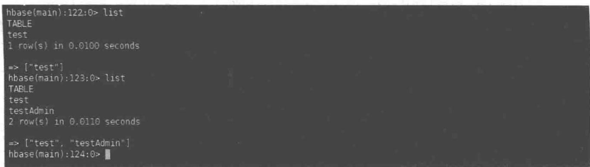

# 管理 HBase

## 9.1 HBase 数据描述

在 HBase 中建表涉及表结构以及列簇结构的定义,这些定义关系到表和列簇内的数据如何存储以及何时存储。

## 9.1.1 表

在 HBase 中数据最终会存储在一张表或多张表中, 使用表的主要原因是控制表中的所有列, 以达到共享表内的某些特性的目的。

表描述符的构造函数如下。

```txt
HTableDescriptor(String name);
HTableDescriptor(byte[] name);
HTableDescriptor(HTableDescriptor desc);
```

用户可以通过表名或已有的表描述符来创建表。表名通常以 Java String 类型或 byte[] 形式进行表示。表名会作为存储系统中存储路径的一部分来使用，因此必须符合文件名规范。与 RDBMS 模型不同，HBase 列式存储格式允许用户存储大量的信息到相同的表中。

## 9.1.2 列簇

列簇是表中非常重要的一部分,用户可以通过以下方法来指定在表中将要使用的列簇,如表 9-1 所示。

表 9-1 列簇访问方法

<table><tr><td>方法</td><td>描述</td></tr><tr><td>void addFamily(HColumnDescriptor family)</td><td>添加列簇</td></tr><tr><td>boolean hasFamily(byte[] c)</td><td>检查列簇c是否存在</td></tr><tr><td>HColumnDescriptor[] getColumnFamilies()</td><td>获取所有已经存在列簇</td></tr><tr><td>HColumnDescriptor getFamily(byte[] c)</td><td>获取列簇c的列簇描述符</td></tr><tr><td>ColumnDescriptor removeFamily(byte[] c)</td><td>移除列簇c</td></tr></table>

列簇定义了所有列的共享信息,并且可以通过客户端创建任意数量的列。若想定位到某一具体列,需要列簇名与列名合并在一起。

```txt
family(列簇名): qualifier(列名)
```

注意：列簇名与列名之间需要以“：”分隔，其中列簇名字必须是可见字符，列名可以由任意二进制字符组成。

HBase 提供了以下构造函数来创建列簇。

```csv
HColumn1Descriptor (byte[] familyName, int maxVersions, String compression, boolean
inMemory, boolean blockCacheEnabled, int blocksize, int timeToLive, String bloomFilter, int
scope);
HColumn1Descriptor (String familyName);
HColumn1Descriptor (byte[] familyName);
HColumn1Descriptor (HColumn1Descriptor desc);
HColumn1Descriptor (byte[] familyName, int maxVersions, String compression, boolean
inMemory, boo; Lean blockCacheEnabled, int timeToLive, String bloomFilter);
```

除了构造函数,用户还可以用以下方法设置参数,但列簇名只能通过构造函数设置,如表9-2所示。

表 9-2 设置参数的方法

<table><tr><td>方法</td><td>描述</td></tr><tr><td>Byte[] getName()/String getNameAsString()</td><td>获取列簇名字,返回</td></tr><tr><td>Int getMaxVersions()</td><td>获取列簇所能保留的最大版本数</td></tr><tr><td>void setMaxVersions(int maxVersion)</td><td>设置列簇保留的最大版本数</td></tr><tr><td>synchronized int getBlocksize()</td><td>获取列簇存储块的大小</td></tr><tr><td>void setBlocksize(int s)</td><td>设置列簇存储块的大小</td></tr><tr><td>boolean isBlockCacheEnable()</td><td>知晓该列簇是否允许使用缓存块</td></tr><tr><td>void setBlockCacheEnable(boolean blockCacheEnable)</td><td>设置允许(不允许)使用缓存块</td></tr><tr><td>Int getTimeToTive()</td><td>获取数据的生存时间</td></tr><tr><td>void setTimeToLive(int timeToLive)</td><td>设置数据的生存时间</td></tr><tr><td>boolean isInMemory()</td><td>获取 in-memory 的属性值</td></tr><tr><td>void setInMemory(boolean inMemory)</td><td>设置 in-memory 的属性值</td></tr><tr><td>Int getScope()</td><td>知晓能否跨集群同步</td></tr><tr><td>void setScope(int scope)</td><td>跨集群同步开启或关闭</td></tr><tr><td>Static byte[] isLegalFamilyName(byte[] b)</td><td>检测是否存在列簇 b</td></tr></table>

## 9.1.3 属性

除了添加、设置与列簇有关的属性，HBase 同样提供了许多方法来设置表的其他属性，如表 9-3 所示。

表 9-3 设置属性的方法

<table><tr><td>方法</td><td>描述</td></tr><tr><td>byte[] getName()</td><td rowspan="3">获取列簇名字</td></tr><tr><td>String getNameAsString()</td></tr><tr><td>void setName(byte[] name)</td></tr><tr><td>Long getMaxFileSize()</td><td>获取表中 region 设置的大小</td></tr><tr><td>void setMaxFileSize(long maxFileSize)</td><td>设置表中 region 的大小</td></tr><tr><td>boolean isReadOnly()</td><td>获取只读参数的属性值</td></tr><tr><td>void setReadOnly(boolean readOnly)</td><td>设置只读参数的值</td></tr><tr><td>long getMemStoreFlushsize()</td><td>获取写缓冲区的大小</td></tr><tr><td>void setMemStoreFlushsize(long memStoreFlushsize)</td><td>设置写缓冲区的大小</td></tr><tr><td>synchronized boolean isDeferredLogFlush()</td><td>获取延时日志刷写的开启状态</td></tr><tr><td>void setDeferredLogFlush(boolean isDeferredLogFlush)</td><td>开启或关闭延时日志刷写</td></tr></table>

## 9.2 表管理 API

## 9.2.1 基础操作

客户端提供了 HBaseAdmin 类来实现建表、创建列簇、检查表是否存在、修改表结构等功能。

进行其他表操作的前提是首先实例化 HBaseAdmin 类, 其构造函数为

```txt
HBaseAdmin (Configuration conf)
```

考虑到安全和效率,具有管理功能的 API 实例应该在使用后进行销毁,HBaseAdmin 类实例也不例外。为此,HBaseAdmin 类实现了一个 Abortable 接口的方法。

```txt
void abort(String why,Throwable e)
```

除了这两个方法，HBaseAdmin 类还有以下接口，如表 9-4 所示。

表 9-4 HBaseAdmin 类提供的接口

<table><tr><td>方法</td><td>描述</td></tr><tr><td>HMasterInterface getMaster()throws MasterNotRunningException,ZooKeeperConnectionException</td><td>获取 master 远程对象</td></tr><tr><td>boolean isMasterRunning()</td><td>检查 master 运行状态</td></tr><tr><td>HConnection getConnection()</td><td>获取连接实例</td></tr><tr><td>Configuration getConfiguration()</td><td>访问 HBaseAdmin 的配置实例</td></tr><tr><td>close()</td><td>关闭 HBaseAdmin 实例</td></tr></table>

实现 HBaseAdmin 实例后,用户就可以着手进行表的各类操作。其中,首要的就是建表。HBase 提供的建表方法如下。

```go
void createTable(HTableDescriptor desc)
void createTable (HTableDescriptor desc, byte[] startKey, byte[] endKey, int numRegions)
```

```txt
void createTable(HTableDescriptor desc, byte[][] splitKeys)
void createTableAsync(HTableDescriptor desc, byte[][] splitKeys)
```

第一个方法相对简单,只创建一个表,这个表没有任何 region。后两个函数是创建表同时分配好指定数量的 region。

完成建表后，用户就可以对该表进行一系列操作，如表9-5所示。

表 9-5 表操作的方法

<table><tr><td>方法</td><td>描述</td></tr><tr><td>boolean tableExists(String table)</td><td rowspan="2">检查表 table 是否存在</td></tr><tr><td>boolean tableExists(byte[] table)</td></tr><tr><td>HTableDescriptor[] listTables()</td><td>获取所有的已创建表</td></tr><tr><td>HTableDescriptor getTableDescriptor(byte[] table)</td><td>获取表 table 的表描述符</td></tr></table>

对于一个创建好的表,用户还可以对其状态进行操作,如启用、禁用及检查等。对表的状态改变与用户对表的操作有关。一个启用状态下的表,用户是无法对其进行删除或修改其表结构,如表9-6所示。

表 9-6 表状态操作方法

<table><tr><td>方法</td><td>描述</td></tr><tr><td>void disableTable(String table)</td><td rowspan="4">禁用表 table</td></tr><tr><td>void disableTable(byte[] table)</td></tr><tr><td>void disableTableAsync(String table)</td></tr><tr><td>void disableTableAsync(byte[] table)</td></tr><tr><td>void enableTable(String table)</td><td rowspan="4">启用表 table</td></tr><tr><td>void enableTable(byte[] table)</td></tr><tr><td>void enableTableAsync(String table)</td></tr><tr><td>void enableTableAsync(byte[] table)</td></tr><tr><td>void isTableEnable(String table)</td><td rowspan="2">检查表 table 是否被启用</td></tr><tr><td>void isTableEnable(byte[] table)</td></tr><tr><td>void isTableDisabled(String table)</td><td rowspan="2">检查表 table 是否被禁用</td></tr><tr><td>void isTableDisabled(byte[] table)</td></tr><tr><td>void isTableAvailable(String table)</td><td rowspan="2">检查表 table 是否存在</td></tr><tr><td>void isTableAvailable(byte[] table)</td></tr></table>

明确已经存在表的状态,并将其设置为禁用状态后,用户就可以对其进行删除及修改表结构操作。HBase 提供的方法如表 9-7 所示。

表 9-7 修改、删除表的方法

<table><tr><td>方法</td><td>描述</td></tr><tr><td>void deleteTable(String table)</td><td rowspan="2">删除表 table</td></tr><tr><td>void deleteTable(byte[] table)</td></tr><tr><td>void modifyTable(byte[] table, HTableDescriptor des)</td><td>按 des 中结构修改表 table</td></tr></table>

modifyTable 方法中,需要先实例化一个 HTableDescriptor 实例,再对此实例进行结构修改。同样,HBase 也提供了 HTableDescriptor 实例修改的方法,如表 9-8 所示。

表 9-8 HTableDescriptor 实例的方法

<table><tr><td>方法</td><td>描述</td></tr><tr><td>void addColumn(byte[] table, HColumnDescriptor des)</td><td rowspan="2">HTableDescriptor 实例增加一个列簇</td></tr><tr><td>void addColumn(String table, HColumnDescriptor des)</td></tr><tr><td>void deleteColumn(byte[] table, byte[] column)</td><td rowspan="2">HTableDescriptor 实例删除一个列簇</td></tr><tr><td>void deleteColumn(String table, String column)</td></tr><tr><td>void modifyColumn(byte[] table, HColumnDescriptor des)</td><td rowspan="2">HTableDescriptor 实例修改一个列簇</td></tr><tr><td>void modifyColumn(String table, HColumnDescriptor des)</td></tr></table>

## 【代码实例1】

```javascript
public void hbase_admin()throws IOException {
    Configuration conf = HBaseConfiguration.create();
    conf.set("hbase.zookeeper.quorum", "main1");
    HBaseAdmin admin = new HBaseAdmin(conf);
    HTableDescriptor desc = new HTableDescriptor(tad);①
    HColumnDescriptor coldesc = new HColumnDescriptor(c1);
    desc.addFamily(coldesc);②
    boolean avail = admin.tableExists(tad);③
    System.out.println("Table available: " + avail);
    admin.createTable(desc);④
    boolean availab = admin.tableExists(tad);
    System.out.println("Table available: " + availab);⑤
    HTableDescriptor[] tdesc = admin.listTables();
    for(HTableDescriptor td : tdesc){⑥
        System.out.println(td);
    }
    HTableDescriptor td = admin.getTableDescriptor(tad);
    System.out.println(td);⑦
    try{⑧
        admin.deleteTable(tad);
    } catch (IOException event) {
        System.err.println("Delete Error: " + event.getMessage());
    }
    admin.disableTable(tad);⑨
    boolean isDb = admin.isTableDisabled(tad);⑩
    boolean isAl = admin.isTableAvailable(tad);⑪
    System.out.println("Disable: " + isDb + ";Available: " + isAl);
    admin.deleteTable(tad);⑫
    boolean isAl2 = admin.isTableAvailable(tad);
```

```java
System.out.println("Available: " + isA12);
admin.createTable(desc);
boolean isEb = admin.isTableEnabled(tad);
System.out.println("Enabled: " + isEb);
HColumnDescriptor coldesc2 = new HColumnDescriptor(c2);
td.addFamily(coldesc2);
td.setMaxFileSize(1024 * 1024 * 1204L);
admin.disableTable(tad);
admin.modifyTable(tad, td);
admin.enableTable(tad);
HTableDescriptor td3 = admin.getTableDescriptor(tad);
System.out.println("Is equals: " + td.equals(td3));
System.out.println("New schema: " + td3);⑰
```

其中，①创建表描述符；②添加列簇描述符到表描述符中；③检查表是否存在，若不存在输出 false，如图 9-1 所示；④使用 createTable() 方法建表；⑤再次检查表是否存在，因为表已经建好，故输出 true；⑥获取所有表的描述符并输出其中信息；⑦获取表 tad 的表描述符并输出；⑧尝试删除一个被启用的表，捕获异常信息并输出；⑨将表 tad 的状态设置为禁用；⑩检查表是否被禁用；⑪检查表是否存在；⑫将表 tad 删除；⑬重新检查表是否存在，并将信息输出，如图 9-2 所示；⑭检查表是否被启用；⑮对表结构增加列簇，并修改最大文件限制属性；⑯先禁用表，再修改表，最后启用表；⑰检查表结构是否已经被修改成功。

```yaml
"C:\Program Files\Java\jdk1.7.0_80\bin\java"...
log4j:WARN No appenders could be found for logger (org.apache.hadoop.metrics2.lib.MutableMetricsFactory).
log4j:WARN Please initialize the log4j system properly.
log4j:WARN See http://logging.apache.org/log4j/1.2/faq.html#noconfig for more info.
Table available: false
Table available: true
'test', {NAME => 'col1', DATA_BLOCK_ENCODING => 'NONE', BLOOMFILTER => 'ROW', REPLICATION_SCOPE => 'O', VERSIONS => '1', COMP]
'testAdmin', {NAME => 'col1', DATA_BLOCK_ENCODING => 'NONE', BLOOMFILTER => 'ROW', REPLICATION_SCOPE => 'O', VERSIONS => '1',
'testAdmin', {NAME => 'col1', DATA_BLOCK_ENCODING => 'NONE', BLOOMFILTER => 'ROW', REPLICATION_SCOPE => 'O', VERSIONS => '1',
Delete Error: testAdmin
Disable: true;Available: true
Available: false
Enabled: true
Is equals: true
New schema: 'testAdmin', {TABLE_ATTRIBUTES => {MAX_FILESIZE => '1262485504'}, {NAME => 'col1', DATA_BLOCK_ENCODING => 'NONE',
```  
图9-1 程序执行结果

## 9.2.2 集群管理

除了之前的基础操作,客户端还通过 HBaseAdmin 类提供了对集群的管理操作,包含对集群状态的查看,执行表级任务,以及对 region 服务器的管理等。HBase 所提供的方法如表 9-9 所示。

  
图 9-2 程序执行前后数据存储结果

表 9-9 HBase 提供的集群操作方法

<table><tr><td>方法</td><td>描述</td></tr><tr><td>Static void checkHBaseAvailable(Configuration conf)</td><td>验证客户端能否与 HBase 集群通信</td></tr><tr><td>ClusterStatus getClusterStatus()</td><td>查询集群状态信息</td></tr><tr><td>void closeRegion(String regionName,String hostandPort)</td><td rowspan="2">关闭 region 服务器中特定的 region</td></tr><tr><td>void closeRegion(byte[] regionName,String hostandPort)</td></tr><tr><td>void flush(byte[] tableNameOrRegionName)</td><td rowspan="2">将 region 中的数据刷写到磁盘中</td></tr><tr><td>void flush(String tableNameOrRegionName)</td></tr><tr><td>void compact(byte[] tableNameOrRegionName)</td><td rowspan="2">合并文件</td></tr><tr><td>void compact(String tableNameOrRegionName)</td></tr><tr><td>void majorCompact(byte[] tableNameOrRegionName)</td><td rowspan="2">与 compact 方法类似,只是在后台队列操作</td></tr><tr><td>void majorCompact(String tableNameOrRegionName)</td></tr><tr><td>void split(String tableNameOrRegionName)</td><td rowspan="2">拆分 region 或整表</td></tr><tr><td>void split(byte[] tableNameOrRegionName)</td></tr><tr><td>void split(String tableNameOrRegionName,String splitPoint)</td><td rowspan="2">按照行键 splitPoint 拆分 region 或整表</td></tr><tr><td>void split(byte[] tableNameOrRegionName,byte[] splitPoint)</td></tr><tr><td>void assign(byte[] region,boolean force)</td><td>将 region 在 region 服务器中上线</td></tr><tr><td>void unassign(byte[] region,boolean force)</td><td>将 region 在 region 服务器中下线</td></tr><tr><td>void move(byte[] region,byte[] DesRegion)</td><td>将 region 从当前的 region 服务器移动至目标服务器</td></tr><tr><td>boolean balanceSwitch(boolean b)</td><td>开启/关闭 region 的负载均衡算法</td></tr><tr><td>boolean balancer()</td><td>对每台 region 服务器中上线的 region进行负载均衡算法处理</td></tr><tr><td>void shutdown()</td><td>关闭集群</td></tr><tr><td>Void stopMaster()</td><td>关闭 master 节点</td></tr><tr><td>void stopRegionServer(String hostNamePort)</td><td>关闭 region 服务器 hostNamePort</td></tr></table>

## 【代码实例2】

public void hbase\_Hadmin()throws IOException {
    Configuration conf = HBaseConfiguration.create();
    conf.set("hbase.zookeeper.quorum", "main1");

```matlab
HBaseAdmin admin = new HBaseAdmin(conf);
ClusterStatus status = admin.getClusterStatus();①
System.out.println("Cluster Status:\n--------");
System.out.println("HBase Version: " + status.getHBaseVersion());
System.out.println("Version: " + status.getVersion());
System.out.println("No. Live Servers: " + status.getServersSize());
System.out.println("Cluster ID: " + status.getClusterId());
System.out.println("Servers: " + status.getServers());
System.out.println("No. Dead Servers: " + status.getDeadServers());
System.out.println("Dead Servers: " + status.getDeadServerNames());
System.out.println("No. Regions: " + status.getRegionsCount());
System.out.println("Regions in Transition: " +
status.getRegionsInTransition());
System.out.println("No. Requests: " + status.getRequestsCount());
System.out.println("Avg Load: " + status.getAverageLoad());
System.out.println("\nServer Info\n--------");
for(ServerName server : status.getServers()){②
    System.out.println("Hostname: " + server.getHostname());
    System.out.println("Host and Port: " + server.getHostAndPort());
    System.out.println("Server name: " + server.getServerName());
    System.out.println("RPC Port: " + server.getPort());
    System.out.println("Start Code: " + server,startcode());
    ServerLoad load = status.load(server);③
    System.out.println("\nServer Load:\n--------");
    System.out.println("Load: " + load.load());
    System.out.println("Max HeaP(MB): " + load.getMaxHeapMB());
    System.out.println("Memstore Size(MB): " + load.getMemstoreSizeInMB());
    System.out.println("No. Regions: " + load.getNumberOfRegions());
    System.out.println("No. Requests: " + status.getRequestsCount());
    System.out.println("Storefile Index Size(MB): " +
load.getStorefileIndexSizeInMB());
    System.out.println("No. Storefiles: " + load.getStorefiles());
    System.out.println("Storefile Size(MB): " + load.getStorefileSizeInMB());
    System.out.println("Used Heap(MB): " + load.getUsedHeapMB());
    System.out.println("\nRegion Load:\n--------");
    for(Map.Entry<byte[],RegionLoad> entry : load.getRegionsLoad().entrySet())
    { ④
        System.out.println("Region: " + Bytes.toStringBinary(entry.getKey()));
        RegionLoad regionLoad = entry.getValue();⑤
        System.out.println("Name: " +
Bytes.toStringBinary(regionLoad.getName()));
        System.out.println("No. Stores: " + regionLoad.getStores());
        System.out.println("No. Storefiles: " + regionLoad.getStorefiles());
        System.out.println("Storefile Size(MB): " +
regionLoad.getStorefileSizeMB());
        System.out.println("Storefile Index Size(MB): " +
regionLoad.getStorefileIndexSizeMB());
        System.out.println("Memstore Size(MB): " +
regionLoad.getMemStoreSizeMB());
        System.out.println("No. Requests: " + regionLoad.getRequestsCount());
        System.out.println("No. Read Requests: " +
```

```java
regionLoad.getReadRequestsCount();
        System.out.println("No.Write Requests: " +
regionLoad.getWriteRequestsCount());
        System.out.println();
    . }
}
}
```

其中，①获取集群状态；②迭代输出所有服务器信息；③获取当前服务器负载信息；④迭代当前服务器所有 region 信息；⑤获取当前 region 负载信息。

运行结果如图 9-3 所示。

```txt
log4j:WARN No appenders could be found for logger (org.apache.hadoop.metrics2.lib.mutableMetricsFactory)
log4j:WARN Please initialize the log4j system properly.
log4j:WARN See http://logging.apache.org/log4j/1.2/faq.html#noconfig for more info.
Cluster Status:
:HBase Version: 1.1.5
Version: 2
No. Live Servers: 3
Cluster ID: c746ed62-3b63-4153-828f-dcc43e8f9c4b
Servers: [main3,16020,1480668760337, main2,16020,1480668759225, main4,16020,1480668757906]
No. Dead Servers: 0
Dead Servers: []
No. Regions: 4
Regions in Transition: {}
No. Requests: 0
Ave Load: 1.33333333333333333
Server Info
:Hostname: main3
Host and Port: main3:16020
Server name: main3,16020,1480668760337
RPC Port: 16020
Start Code: 1480668760337
Server Load:
HLoad: 1
Max HeaP(MB): 15944
Memstore Size(MB): 0
No. Regions: 1
No. Requests: 0
Storefile Index Size(MB): 0
No. Storefiles: 1
Storefile Size(MB): 0
Used Heap(MB): 97
Region Load:
Hbase: namespace,,1480668767027.7c443803a47f9c76fb3fc36cfbf412e9.
Name: hbase: namespace,,1480668767027.7c443803a47f9c76fb3fc36cfbf412e9.
No. Stores: 1
No. Storefiles: 1
```  
图 9-3 代码运行情况

```txt
Storefile Size(MB): 0
Storefile Index Size(MB): 0
Memstore Size(MB): 0
No. Requests: 0
No. Read Requests: 0
No. Write Requests: 0

Hostname: main2
Host and Port: main2:16020
Server name: main2,16020,1480668759225
RPC Port: 16020
Start Code: 1480668759225

Server Load:
-------------------
Load: 1
Max HeaP(MB): 2969
Memstore Size(MB): 0
No. Regions: 1
No. Requests: 0
Storefile Index Size(MB): 0
No. Storefiles: 4
Storefile Size(MB): 0
Used Heap(MB): 21

Region Load:
-------------------
Region: test,,1490669323198.2a34669cb27eaedcebb13f4ecdf8c171.
Name: test,,1490669323198.2a34669cb27eaedcebb13f4ecdf8c171.
No. Stores: 2
No. Storefiles: 4
Storefile Size(MB): 0
Storefile Index Size(MB): 0
Memstore Size(MB): 0
No. Requests: 385
No. Read Requests: 265
No. Write Requests: 120

Hostname: main4
Host and Port: main4:16020
Server name: main4,16020,1480668757906
RPC Port: 16020
Start Code: 1480668757906

Server Load:
-------------------
Load: 2
Max HeaP(MB): 15944
Memstore Size(MB): 0
No. Regions: 2
No. Requests: 0
Storefile Index Size(MB): 0
No. Storefiles: 2
Storefile Size(MB): 0
Used Heap(MB): 213
```  
图 9-3(续)

```txt
Region Load:
-------------------
Region: hbase:meta,,1
Name: hbase:meta,,1
No. Stores: 1
No. Storefiles: 2
Storefile Size(MB): 0
Storefile Index Size(MB): 0
Memstore Size(MB): 0
No. Requests: 884
No. Read Requests: 876
No. Write Requests: 8
```

Region: testAdmin,,1490692539540.e48683de73bf0a8fb127e44cd4e59056.
Name: testAdmin,,1490692539540.e48683de73bf0a8fb127e44cd4e59056.
No. Stores: 2
No. Storefiles: 0
Storefile Size(MB): 0
Storefile Index Size(MB): 0
Memstore Size(MB): 0
No. Requests: 0
No. Read Requests: 0
No. Write Requests: 0

图 9-3(续)

## 本章小结

（1）本章讲解了 HBase 管理的相关知识，让读者了解 HBase 管理的数据结构以及对 HBase 表及客户端的管理。

（2）详细介绍了 HBase 表和列簇内的数据如何存储以及何时存储。说明 HBase 中表、列簇和属性的构造函数及相关参数设置。

（3）首先介绍了客户端提供 HBaseAdmin 类实现建表、创建列簇、检查表是否存在、修改表结构等功能，接着通过实例详细介绍了客户端对表状态、表结构的具体操作。

（4）结合实例介绍了客户端 HBaseAdmin 类提供的对集群管理操作方法，包含对集群状态的查看、执行表级任务以及对 region 服务器的管理等。

## 习题

(1) 以下( )必须是可见字符。
A. 列簇    B. 表    C. 属性    D. 列

(2) 列名可以由( )组成。
A. 可见字符
B. 任意字符
C. 特定字符
D. 任意二进制字符

（3）用户通过什么属性来创建表，其中具体有什么表示？

(4) HBaseAdmin 类提供了哪些功能？请具体说明。

(5) 请写出获取集群状态的实例方法。
