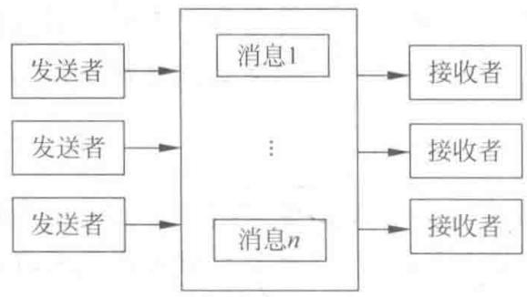
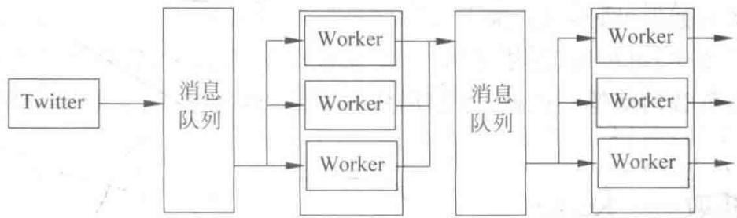
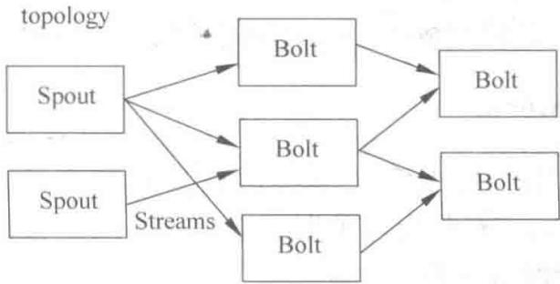
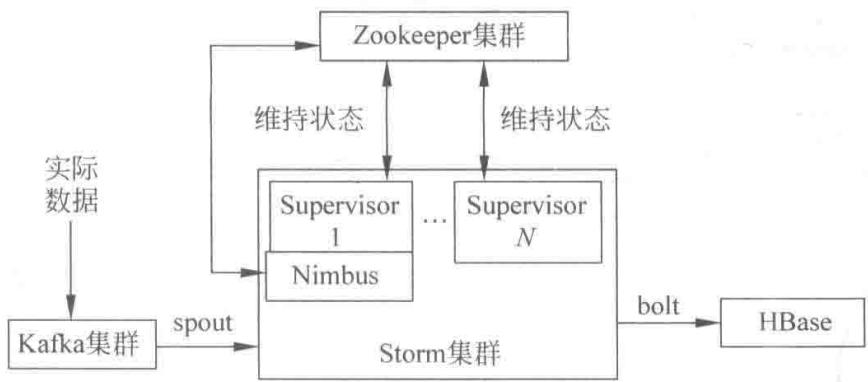

# 第1章 分布式实时计算系统

> 从分布式概念出发，理解实时处理为何离不开 Storm

<!--
同学们，欢迎来到《大数据实时计算与应用》的第一章。大家可能已经用过很多 app，也听说过“实时推荐”“实时风控”这些词，但有没有想过：一条用户在手机上的点击，是怎么在几秒钟内被系统抓住、计算、并反馈结果的？它显然不能在单击点发生后，再交给一个集中式的大服务器慢慢算。这一章我们不讲某个具体工具，而是先把底层逻辑理清楚：什么是分布式，分布式计算之间靠什么通信，以及一个实时处理系统到底由哪些部分构成。这条主线看清了，后面几章学习 Kafka、HBase、Storm 时，就不会是记几个孤立的组件名。

[Sources]
- 吴斌，《大数据实时计算与应用》第 1.2.2 节。
-->

---
class: compact
---

## 打个比方：消息队列就像邮局

**没有邮局（直接寄）**：你得知道对方地址，亲自把信送到对方手上。对方不在家，你就得等着；对方搬家了，你也得跟着改。

**有邮局（消息队列）**：

- 你只要把信（消息）**投进邮筒（队列）**，就可以去干别的事了，不用等对方
- 对方什么时候有空，来邮局<strong>取信（消费）</strong>即可
- 你根本**不需要认识对方**，也不用管对方在不在、搬没搬家——这就是**松耦合**

<!--
"消息队列"这个名字很抽象，用邮局来比喻就好懂多了。没有邮局时，你必须把东西直接交给对方，对方不在就尴尬；有了邮局，你只管把东西放进去就走人，对方什么时候有空什么时候来取。你们俩互不认识、互不依赖，谁出问题了也不牵连对方。这就是上一页说的"松耦合"。记住这个比喻，后面讲 Kafka 时你会反复看到这个思想——它就是一个更先进、能容纳海量消息的"超级邮局"。

[Sources]
- 吴斌，《大数据实时计算与应用》第 1.2.2 节。
-->

---
class: compact
---

## 本章目录

1. **1.1 分布式的概念**：分布式系统、分布式计算
2. **1.2 分布式通信**：通信基础、消息队列、Storm 计算模型
3. **1.3 分布式实时计算系统架构**：Kafka、Storm、HBase
4. **1.4 系统架构**：一条完整的实时处理链路

<!--
同学们请看屏幕，这就是第一章的四张路线图。1.1 我们先搞清楚“分布式”到底指什么，以及它和传统集中式计算的区别；1.2 进入分布式系统最头疼的问题——节点之间怎么通信，我们会用消息队列和 Storm 计算模型做一个对比；1.3 把视野拉升到整个实时处理系统，看数据从哪里获取、在哪里计算、又落到哪里存储；最后在 1.4 把这几张拼图拼成一条完整的链路。带着这个地图，我们从最底层“分布式的概念”讲起。

[Sources]
- 吴斌，《大数据实时计算与应用》第 1 章，章节结构。
-->

---
class: compact
---

## 先理解：一台机器 vs 一群机器

<strong>单机（集中式）</strong>就像一个人干所有活：

- 一个人**能力强**，但**再强也有上限**；累坏了、生病了，活就停了
- 想干更多，只能换更强的人（升级服务器），代价高且终究有天花板

<strong>分布式（一群机器）</strong>就像一群人分工协作：

- 把一个大活**拆成一小块一小块**，分给很多人一起干，大家**同时开工**
- 一个人出问题，其他人还能接着干（容错）
- 前提是：大家得**互通消息**（网络），否则各干各的、无法合并

<!--
很多同学听到"分布式"三个字就觉得高深。其实把它想成"一个人干活"和"一群人干活"的区别就清楚了。一个人能力强但有体力上限，想再快只能换更强的人；一群人虽然每个人普通，但可以分工、可以同时干、还可以互相补位。这里最核心的是两点：一是"拆开干"，二是"干完要合起来"，而合起来的前提就是大家能互通消息。记住这个比喻，后面所有讲分布式的地方你都能对上号。

[Sources]
- 吴斌，《大数据实时计算与应用》第 1 章，章前基础。
-->

---
layout: section
class: compact
---

## 1.1 分布式的概念

<ol class="outline">
  <li class="current">分布式系统与分布式计算</li>
  <li>分布式通信</li>
  <li>分布式实时计算系统架构</li>
</ol>

<!--
我们在进入 1.1 之前先问自己一个问题：为什么今天几乎所有大系统都自称“分布式”？答案其实很朴素——单个机器再强，也有物理上限。这一节我们从互联网的分散式模型讲起，一步步看清楚分布式系统和分布式计算的区别：前者是关于“系统怎么组织”，后者是关于“任务怎么被拆开算”。

[Sources]
- 吴斌，《大数据实时计算与应用》第 1.1 节。
-->

---
class: compact
---

## 从集中式到分布式

- **集中式计算**：由一台性能强大的服务器处理大量计算任务
  - 建造和维护成本极高
  - 存在明显的性能瓶颈
- **分布式系统**：把需要海量计算的问题拆成小块，分配给不同节点处理，最后合并结果
  - 前提：网络把大量分离且互联的节点连起来

<!--
我们先看概念起点。传统做法是集中式：买一台超级计算机，把任务都塞给它。但问题是，机器的性能有物理天花板，而且这种机器造价高、维护贵。于是人们换了一条路——不去造更强的单机，而是把问题拆成小块，分散给很多台普通机器去算，这也就是分布式。注意，分布式能成立，是因为靠网络把大量节点连在一起。所以“分布式”这个概念，是在网络这个大前提下才谈得上的。

[Sources]
- 吴斌，《大数据实时计算与应用》第 1.1.1 节。
-->

---
class: compact
---

## 1.1.1 分布式系统

- 分布式系统 = 将海量计算任务拆分为许多小块，分配给系统中不同的计算节点处理
- 节点之间通过**多种方式**进行数据通信与协调，**网络消息**是常用手段
- 最后把分开计算的结果合并，得到最终结果

<!--
同学们注意，我这里强调“多种方式”四个字。分布式系统不是一台机器，而是一群节点组成的整体；它们之间要协同，就必须有一套通信和协调机制，其中网络消息是最常用的一种。整句话的关键在于：先拆分，再分配，最后合并。记住这个三步，你就抓住了分布式系统与后面所有组件共同遵守的底层逻辑。

[Sources]
- 吴斌，《大数据实时计算与应用》第 1.1.1 节。
-->

---
class: compact
---

## 1.1.2 分布式计算

1. 把复杂庞大的计算任务**适当划分**为若干小任务
2. 将小任务分配到不同计算节点，每个节点只需完成自己的任务
3. 节点并行处理，充分利用 CPU 资源
4. 汇总各节点计算结果，得到最终结果

**÷** 一个难点：节点之间如何高效通信

<!--
如果说分布式系统描述的是“结构”，那分布式计算描述的则是“动作”。它强调的是把大任务拆开、并行算、再合并。拆得好不好，直接决定了效率：拆得越相互独立，每个节点越能自己跑。真正让工程师头疼的是通信——因为绝大多数时候节点没法完全互不相干，它们往往需要拿到别人的中间结果。

[Sources]
- 吴斌，《大数据实时计算与应用》第 1.1.2 节。
-->

---
class: compact
---

## 分布式计算的通信难点

节点之间通常需要互相通信（如获取对方计算结果），两种常见方案：

1. **消息队列**：把节点之间的依赖，变成节点之间的消息传递
2. **分布式存储系统**：把节点执行结果暂存到数据库，其他节点等待或从中读取

> 只要符合实际需求，两种方式都可行。

<!--
这里给出两条解决“节点间要通信”的典型思路。第一条是把“我依赖你的结果”这种硬绑定，软化成“我给你发条消息”，节点之间解耦；第二条是干脆把结果写进共享数据库，谁需要谁来取。它们没有绝对优劣，取决于你的业务场景。但我们可以先记住这一点——无论哪条路，通信问题本质上都是把节点间的“直接依赖”转化为“可传递的数据”。

[Sources]
- 吴斌，《大数据实时计算与应用》第 1.1.2 节。
-->

---
layout: section
class: compact
---

## 1.2 分布式通信

<ol class="outline">
  <li>分布式通信基础</li>
  <li class="current">消息队列</li>
  <li>Storm 计算模型</li>
</ol>

<!--
理解了分布式的概念，接下来进入 1.2，这是本章的重头戏——节点之间到底怎么通信。我们会从最底层的“帧同步”讲起，理解可靠传输为什么难；然后看消息队列这种松耦合模型；最后引出本章的落点——Storm 计算模型，及其如何解决了消息队列模型的痛点。

[Sources]
- 吴斌，《大数据实时计算与应用》第 1.2 节。
-->

---
class: compact
---

## 分布式通信基础：可靠传输为何难

- 原始物理链路只由传输介质和设备组成
- 数据传输时可能因外界原因**丢失或变化**
- 无法直接保证相邻节点间可靠传输

**÷** 需要在数据链路层把数据划分为一个个分组——**帧**

<!--
我们先踩一个底层的事实：两节点之间的物理链路是很“脆弱”的，信号在介质上传输，随时可能因为干扰、衰减而丢失或改变。所以你不能指望直接在这条链路上发数据就能被原样收到。工程上怎么解决？把数据按组切分成“帧”，这是数据链路层的基本传输单位。把数据切帧，至少让传输有了边界和校验的抓手。

[Sources]
- 吴斌，《大数据实时计算与应用》第 1.1 节（分布式通信基础）。
-->

---
class: compact
---

## 帧同步问题

接收节点需要识别帧的**起始与结束位置**，常见方法：

- 字节计数法
- 字符填充的首尾定界法
- **比特填充的首尾定界法**
- **违法编码法**（IEEE 802 标准采用）

<!--
把数据切成帧之后，马上出现一个新问题：接收端怎么知道一帧从哪开始、到哪结束？这就是“帧同步”。四种方法里，字节计数和定界符比较直观；而目前用得最多的是“比特填充”和“违法编码”。它们的思想其实一致——用一组特殊的标记来框住帧，同时想办法保证数据内容里不会碰巧出现这个标记，从而不会造成误判。

[Sources]
- 吴斌，《大数据实时计算与应用》第 1.1 节（分布式通信基础）。
-->

---
class: compact
---

## 两种常用的帧同步方法

**比特填充的首尾定界法**：在帧首尾插入固定比特位界定边界；帧内数据避免出现该比特模式（通过填入额外比特位）

**违法编码法**：依赖特定的比特编码，如曼彻斯特编码将 1 编码为“高—低”，0 编码为“低—高”；“高—高”和“低—低”为非法电平对，可作为帧分界符

<!--
这两个方法稍微展开讲一点。比特填充法，就是规定一串特殊位当作边界记号，同时游戏规则要求：数据里如果恰好要出现这串记号，就额外塞一位把它岔开。违法编码法则更巧妙，它利用某些编码里“本来不该出现”的电平组合，比如曼彻斯特编码里“高高”和“低低”是违法的，那么我就用这种违法组合来当边界。两者都是“用特殊标记定界，并保证数据不干扰标记”。

[Sources]
- 吴斌，《大数据实时计算与应用》第 1.1 节（分布式通信基础）。
-->

---
class: compact
---

## 1.2.2 消息队列：松耦合的通信模型

{fit="contain" position="center" max-height="40vh"}

- **读图**：左＝发送者，右＝接收者，中间＝消息队列容器
- 发送方**不直接**交给接收方，而是**先投进队列**；接收方**主动来取**消息
- 执行后向队列投递**回执**；双方因此**互不依赖**（松耦合）

<!--
**[看图]** 大家先看这张图，它把消息队列的模型画得很清楚。左边是一群发送者，右边是一群接收者，中间是一个消息队列容器。注意一个关键点：发送方并没有把消息“直接”塞到接收方手里，而是先投递到队列里；接收方是“主动”从队列里取消息的。这就形成了一个解耦结构——发送方和接收方之间不再存在强绑定。

[Sources]
- 吴斌，《大数据实时计算与应用》第 1.2.2 节。
-->

---
class: compact
---

## 消息队列：松耦合与适用性

- 发送方与接收方是**松耦合**关系：消息经队列中转投送
- 接收方主动从队列获取消息，执行服务后向队列投递“回执”
- 可扩展到任意范围，也常作为实现 **RPC** 的技术
- 常由独立的消息队列服务器或集群负责转发，专注消息的快速投送

<!--
**[核心]** 同学们可以再想想“松耦合”带来的好处。因为发送方不关心接收方是谁、在不在线，所以系统可以平滑扩缩容，某一边坏了也不影响另一边。而且消息队列不只能做消息中转，它还能成为实现 RPC 的底层技术，适用面非常广。最后补充一点：当消息队列真正用于网络通信时，往往会单独部署一台或一组服务器专门做转发，让它们专心把消息快速送出去，业务服务则专心做业务。

[Sources]
- 吴斌，《大数据实时计算与应用》第 1.2.2 节。
-->

---
class: compact
---

## 1.2.3 Storm 计算模型：从队列 + Worker 说起

{fit="contain" position="center" max-height="40vh"}

- **读图**：左＝Twitter → **消息队列** → 一组 **Worker**；处理不完就再写新队列、开新 Worker，链路越拉越长（这就是"队列 + Worker"朴素模型）

<!--
**[切入]** 现在我们把焦点转到 1.2.3，这是本章的关键转折。Storm 最初做的，就是“消息队列 + 工作线程”这套朴素模型：用程序从 Twitter 抓消息，写进队列，再用一组 Worker 进程从队列读取并处理。大家看这张图，正因为一个 Worker 往往处理不完，就又要写进新队列、再开新 Worker——链路被拉得很长。

[Sources]
- 吴斌，《大数据实时计算与应用》第 1.2.3 节。
-->

---
class: compact
---

## 队列 + Worker 模型的痛点

- 大量时间花在保证**消息队列和 Worker 的可用性**上
- 大部分逻辑集中在“从哪个发送者获取、如何序列化/反序列化”这些细节
- 开发者的精力被消息管线占用，而非业务逻辑

<!--
**[核心]** 这种模型最大的问题，是它把工程师的注意力放错了地方。大家看，搞这套系统，你一半以上的精力要用来盯队列稳不稳定、Worker 有没有挂；写代码时还要反复处理从哪取、怎么序列化。可这些都不是业务本身——真正的业务是那一步“计算”。Storm 团队很快意识到这是种“反常”现象，于是开始构思一种新模型：让开发者只关心业务逻辑，把消息的传递和保障交给框架。

[Sources]
- 吴斌，《大数据实时计算与应用》第 1.2.3 节。
-->

---
class: compact
---

## Storm 计算模型

{fit="contain" position="center" max-height="40vh"}

- **读图**：左＝**Spout**（消息源），经 **Stream（流）** 连到多个 **Bolt**，Bolt 间可继续串联
- Spout 读数据、发 tuple；Bolt 过滤/聚合/查库并继续下传；整张图就是一个 **topology**

<!--
**[看图]** 答案就是这张 Storm 计算模型图。相比前面一层套一层的队列，这里变成了两类角色：Spout 和 Bolt，它们之间用一个个流（Stream）连接。Spout 是消息源，负责从外部数据源不断读取数据并发射元组；Bolt 是处理器，负责过滤、聚合、查库等等，而且可以一级一级往下接。整张图的拓扑，就是一个有向图。

[Sources]
- 吴斌，《大数据实时计算与应用》第 1.2.3 节。
-->

---
class: compact
---

## Topology：不会结束的计算任务

- 一个实时应用的计算任务被打包作为 **topology** 发布（类似 Hadoop 的 MapReduce）
- 区别：MapReduce 任务执行完后**会结束**；Storm 的 topology 一旦提交，**永远不会结束**，除非停止任务
- **Streams**：无限制的 tuple（元组）序列，是 Storm 的核心抽象
- **Spout**：消息源，从外部数据源（Message Queue、RDBMS、NoSQL、Realtime Log）不间断读取并发射 tuple
- **Bolt**：消息处理者，执行过滤、聚合、查询数据库等操作，可逐级处理

<!--
**[核心]** 这里有两点最值得记。第一，topology 一旦提交就不会结束，所以 Storm 处理的是一条“永远流动”的流，而不是有始有终的批任务——这正对上了实时处理的诉求。第二，核心抽象是 Stream，也就是无限制的 tuple 序列；Spout 负责不断把 data 灌进来，Bolt 负责一级级地算。你不再需要维护队列，只需要把 Spout 和 Bolt 连成图，Storm 替你把消息如何流动、如何保证处理好。

[Sources]
- 吴斌，《大数据实时计算与应用》第 1.2.3 节。
-->

---
class: compact
---

## 串一串：我们走到哪了

到这里，我们已经明白了三个递进的问题：

1. **为什么要分布式** → 单机再强也有物理上限，把任务拆开分散给一群机器
2. **分布式难在哪** → 机器之间要互相通信，靠消息队列这种"邮局"来松耦合地传消息
3. **传统"队列 + Worker"够不够** → 不够。因为它把精力耗在维护队列上，而不是业务；于是 Storm 计算模型（Spout→流→Bolt）应运而生

**下一步**：把"数据从哪来 → 在哪算 → 存到哪"拼成一张完整的实时处理系统图。

<!--
我们用三句话把前面串起来。第一句：为什么要分布式——因为单机有天花板。第二句：分布式难在哪——难在机器之间要通信，所以有消息队列。第三句也是最关键的：光有队列还不行，因为把精力都耗在维护队列上了，于是就有了 Storm 这种把业务逻辑放在首位的计算模型。你看，这三步不是零散的知识，而是一条"遇到问题—解决问题"的因果链。带着这条链，我们进入下一节，看一个真正的实时系统由哪几块组成。

[Sources]
- 吴斌，《大数据实时计算与应用》第 1 章，串讲。
-->

---
layout: section
class: compact
---

## 1.3 分布式实时计算系统架构

<ol class="outline">
  <li class="current">数据获取——Kafka</li>
  <li>数据处理——Storm</li>
  <li>数据存储——HBase</li>
</ol>

<!--
看完 1.2，我们已经明白：实时处理底子应该是 Storm 这样的流式框架。但一个真实系统不能只有计算，还要有数据从哪来、算完往哪放。1.3 我们把整条链路打开，分三块看：获取用 Kafka，处理用 Storm，存储用 HBase。先看数据入口——Kafka。

[Sources]
- 吴斌，《大数据实时计算与应用》第 1.3 节。
-->

---
class: compact
---

## 实时计算系统的设计目标

- **低延迟、高性能**：满足实时业务
- **分布式、可扩展、容错**
- 保证消息**不丢失**、**严格有序**、**分发均衡**（负载均衡）

<!--
在介绍三类组件前，先明确目标。一个实时计算系统，第一个要过的是“延迟”这一关——实时推荐的反馈必须快；同时它还要能扛住数据洪峰，要能横向扩展、能容错。而在这背后，还有几个隐藏的硬指标：消息不能因为系统崩溃而丢，消息的顺序不能乱，消息要公平地分到各台机器上，避免有的机器忙死、有的闲着。

[Sources]
- 吴斌，《大数据实时计算与应用》第 1.3 节。
-->

---
class: compact
---

## 1.3.1 数据获取——Kafka

高吞吐量的分布式发布订阅消息系统，特性：

1. 通过磁盘数据结构提供**消息持久化**，即使 TB 级以上也能长时间稳定存储
2. **高吞吐**：普通机器硬件也能支撑 10⁵ req/s 的消息
3. 可通过 Kafka Cluster 和 Consumer Cluster 对消息进行 **Partition（分区）**
4. 处理网页浏览、搜索、用户行为等流动数据，常通过**日志聚合**方案解决实时问题

<!--
**[核心]** 数据入口我们选 Kafka，因为它有几个非常契合的标签：高吞吐、可持久化、可分区。高吞吐意味着它能接住海量点击流；持久化意味着消息即使暂时来不及处理，也不会立刻丢；分区意味着既能横向扩展，又能让消息均衡地分布。它最初就是为了处理像“用户浏览、搜索行为”这类海量流动数据而生的。

[Sources]
- 吴斌，《大数据实时计算与应用》第 1.3.1 节。
-->

---
class: compact
---

## 1.3.2 数据处理——Storm

面对实时推荐、用户行为分析等实时性要求高的业务，离线计算的 MapReduce 显得捉襟见肘；Twitter 推出开源分布式容错实时计算系统 **Storm**，填补实时流计算空缺。

主要特点：

1. **简单编程模型**（同 MapReduce 之于批处理）
2. **多种编程语言**（默认 Clojure、Java、Ruby、Python）
3. **容错性**（管理进程与节点故障）
4. **水平扩展**（多线程、进程、服务器并行）
5. **可靠消息处理**（每条消息至少完整处理一次，失败则重试）
6. **快速**（底层使用 ZMQ 作为消息队列）
7. **本地模式**（完全模拟集群，便于开发与单元测试）

<!--
**[核心]** 为什么偏偏是 Storm 来做实时处理？看这七条特性就清楚了：它编程模型简单、支持多种语言、能容错、能横向扩展、还能保证每条消息至少被完整处理一次。尤其“本地模式”这一条，让人可以在自己电脑上完整模拟整个集群来开发和测试，学习成本一下降下来。可以说，这些特性共同回应了刚才说的实时系统设计目标。

[Sources]
- 吴斌，《大数据实时计算与应用》第 1.3.2 节。
-->

---
class: compact
---

## Storm 集群的工作方式

- 集群由一个**主节点**和多个**工作节点**组成
- 主节点运行 **Nimbus** 守护进程：分配代码、布置任务、故障检测
- 每个工作节点运行 **Supervisor** 守护进程：监听、开始/终止工作进程
- Nimbus 与 Supervisor **可快速失败**、且**无状态**，因此十分健壮
- 两者协调工作由 **Zookeeper** 完成

<!--
**[看图]** Storm 集群怎么运转？用一句话概括：一个 Nimbus 管全局，一堆 Supervisor 管干活。Nimbus 在主人节点上负责把代码和任务分下去，还负责发现故障；Supervisor 跑在每台工作节点上，负责实际地启动和终止工作进程。这里很重要的一点是，Nimbus 和 Supervisor 都能“快速失败”，而且是无状态的——也就是说它们挂了也不会丢失一身状态，可以随时重启。而它们之间的协调，交给 Zookeeper 这个专门的协调服务，这为后面第 5 章讲 Zookeeper 埋下了伏笔。

[Sources]
- 吴斌，《大数据实时计算与应用》第 1.3.2 节。
-->

---
class: compact
---

## 1.3.3 数据存储——HBase

- HBase 是分布式、**面向列**的开源数据库
- 源于 Fay Chang 的 Google 论文《Bigtable：一个结构化数据的分布式存储系统》
- 类似 Bigtable 利用 GFS 提供分布式存储，HBase 在 **Hadoop** 上提供类似 Bigtable 的能力
- 是 Apache Hadoop 项目的子项目
- 适合**非结构化数据**存储；采用**列模式**而非传统的行模式

<!--
**[核心]** 算完的数据得有个归宿，这里选 HBase。它最大的特点有两个：一是面向列存储，适合横向扩展和海量数据的随机读写；二是适合非结构化数据。HBase 的思路来自 Google 的 Bigtable 论文，相当于把 Bigtable 的能力搬到了 Hadoop 生态里。你可以把它理解成：一个能存海量、按列组织的分布式数据库，正好承接 Storm 算出来的结果。

[Sources]
- 吴斌，《大数据实时计算与应用》第 1.3.3 节。
-->

---
layout: section
class: compact
---

## 1.4 系统架构

<ol class="outline">
  <li class="current">以 Storm 为核心，辅以 HBase、Kafka</li>
  <li>完整的实时处理链路</li>
</ol>

<!--
前面三块单独都讲清楚了，现在 1.4 把它们拼起来，看一条真正能跑通的实时处理系统长什么样。这也是本章要给读者的那张“总图”。

[Sources]
- 吴斌，《大数据实时计算与应用》第 1.4 节。
-->

---
class: compact
---

## 分布式实时处理系统

{fit="contain" position="center" max-height="46vh"}

- **读图**（从左往右）：**Kafka**（数据源）→ Spout → **Storm 集群** → **HBase**（存储）
- 中间 **Zookeeper** 协调 Storm 状态；一句话：**Kafka 进、Storm 算、HBase 存**

<!--
**[看图]** 这就是本书采用的系统架构总图，节奏是从左往右。最左边 Kafka 集群负责数据获取，作为数据源；数据被 Spout 消费进 Storm 集群，Storm 里的 Nimbus 和 Supervisors 之间靠 Zookeeper 集群维持状态；Storm 做完整 Bolt 处理后，结果落到右侧的 HBase。整条链路：Kafka 进、Storm 算、HBase 存。

[Sources]
- 吴斌，《大数据实时计算与应用》第 1.4 节。
-->

---
class: compact
---

## 完整的处理流程

1. **Kafka** 生产数据，作为 Storm 的源头 spout 被消费
2. **Storm** 进行数据实时处理
3. **Zookeeper 集群**协调 Storm 集群中 Nimbus 与 Supervisors 的状态
4. Storm 经过 Bolt 处理后，将数据结果保存到 **HBase**

<!--
**[核心]** 同学们把这四步连起来念一遍，就是一条完整的实时处理链路：数据从 Kafka 源源不断地产生并进入流；Storm 把它实时算掉，期间 Zookeeper 负责让整个集群保持协调一致；算完的结果落到 HBase 做持久化。理解了这条链路，你也就理解了这本书后半部分为什么要逐个去讲 Kafka、Zookeeper、HBase、Storm——它们各司其职，缺一不可。

[Sources]
- 吴斌，《大数据实时计算与应用》第 1.4 节。
-->

---
class: compact
---

## 想一想（自检）

**问题 1**：现在你要统计一个热门网页每一秒钟被访问了多少次，你会选"一台超级计算机"还是"一群普通机器"？为什么？

> 提示：访问量是海量、实时变化的；机器还要能扛住访问高峰。

**问题 2**：Storm 用 Spout 和 Bolt 代替了"消息队列 + Worker"，最本质的一点区别是什么？

> 提示：想一想两类模型各自的"精力花在哪"。

<!--
这两个问题就是检查这一章你有没有真的听懂，而不是背概念。第一题问的是"为什么分布式"——答案是量太大、又要实时，一台机器扛不住，得一群人分着干，而且能扛住高峰、坏一台不影响整体。第二题问的是 Storm 和旧模型的区别——本质是"精力用在业务上还是用在维护管道上"，Storm 把消息传递交给框架，让开发者专心写业务逻辑。如果你能自己说出这两点，而不是照抄屏幕，说明你真的理解了。

[Sources]
- 吴斌，《大数据实时计算与应用》第 1 章，自检。
-->

---
class: compact
---

## 本章小结

1. 分布式系统是**拆分—分配—合并**；分布式计算是并行利用多节点算力
2. 分布式通信的难点在于可靠传输与节点协作：**消息队列**（松耦合）与 **Storm 计算模型**（Spout→流→Bolt）对比
3. 分布式实时处理系统的完整链路：**Kafka 获取 → Storm 处理 → HBase 存储**，由 Zookeeper 协调
4. Storm 的 **topology 永不结束**，契合实时流式处理的本质

<!--
**[过渡]** 我们用这条因果链把第一章收束起来：先有分布式的思想，才有了分布式系统；系统要协同，就引出通信难题；传统消息队列的“队列+Worker”模式把精力耗在了管道维护上，于是 Storm 计算模型应运而生；再把数据获取、处理、存储三块拼起来，就成了今天随处可见的实时处理系统。到下一章，我们就把这条链路的第一个环节——Kafka——拆开细讲。

[Sources]
- 吴斌，《大数据实时计算与应用》第 1 章，本章小结。
-->
