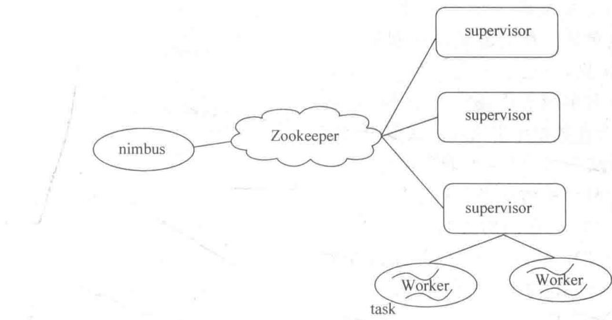
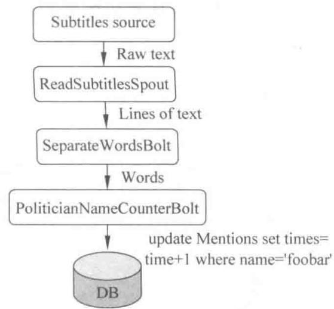
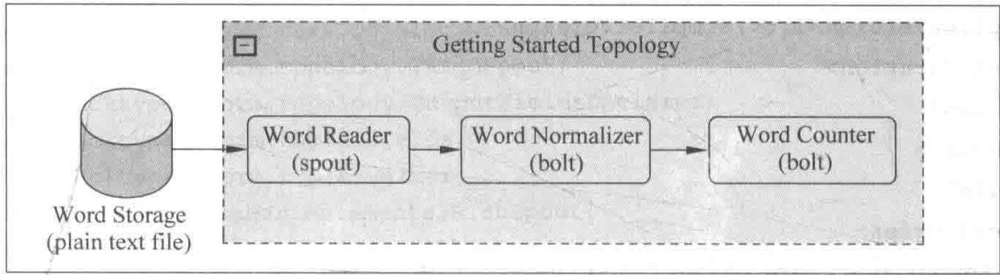
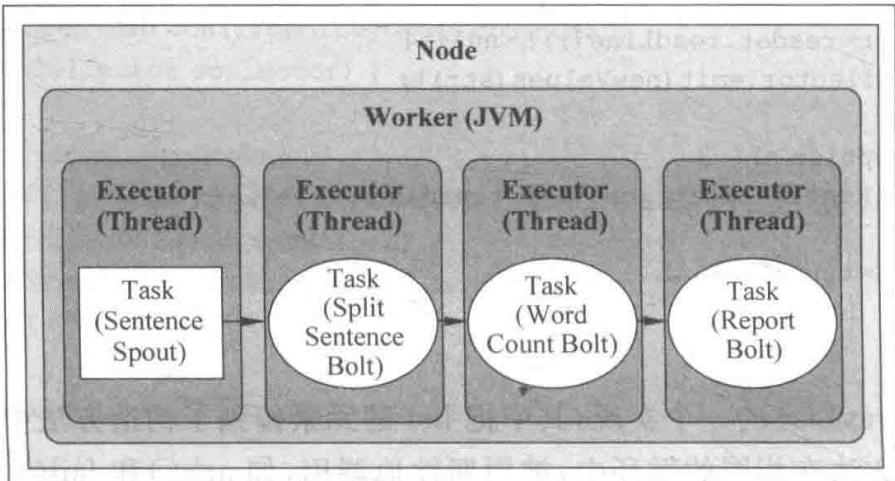
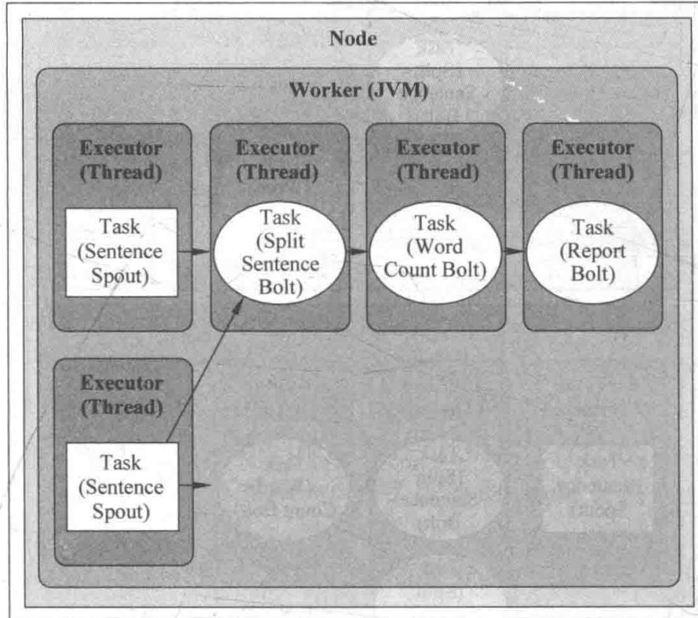
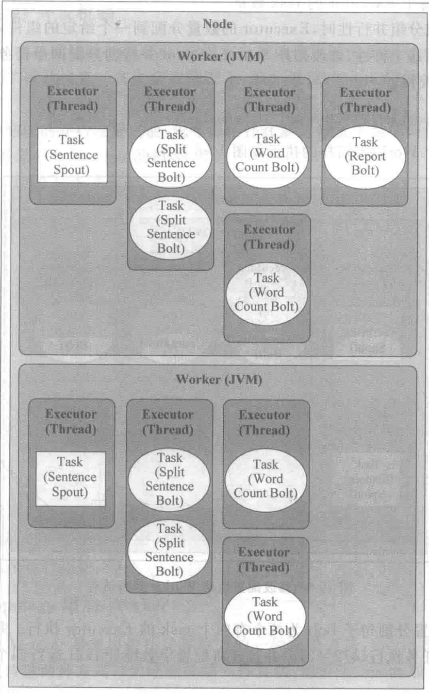
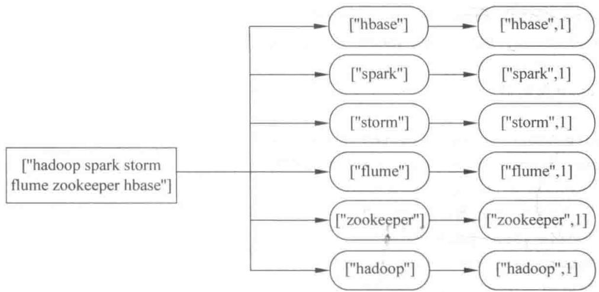
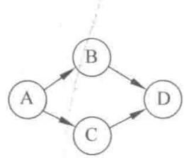
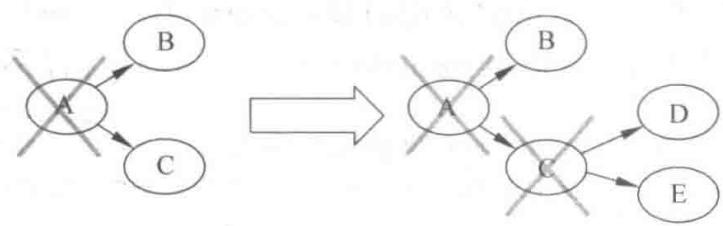

# 第10章 初识 Storm

> 实时计算的主引擎：从单词计数到消息可靠性

<!--
同学们，从这一章开始，我们终于回到全书的核心——Storm。前面我们用 Kafka 获取数据、用 HBase 存储结果，中间缺的那个"实时计算引擎"，就是 Storm。你可能已经体验过 Hadoop 处理离线数据，但实时场景下它是力不从心的。Storm 正是为解决"实时流式计算"而生的开源分布式系统。这一章我们会用一个经典的"单词计数"程序，把 Storm 的特性、并发机制、数据流分组和消息可靠性这些核心概念，完整地串起来。学完它，你就摸清了实时计算引擎的底细。

[Sources]
- 吴斌，《大数据实时计算与应用》，清华大学出版社，第 10 章。
-->

---
class: compact
---

## 本章目录

1. **10.1 什么是 Storm**：能力、特性、分布式结构
2. **10.2 构建 topology**：基本概念、本地/远程模式、单词计数
3. **10.3 并发机制**：Worker、Executor、Task
4. **10.4 数据流分组**：七种内置分组
5. **10.5 消息的可靠处理**：消息树、锚定、acker

<!--
同学们请看本章五大部分。10.1 认识 Storm 到底是什么、强在哪；10.2 我们用单词计数跑通第一个 topology；10.3 深入它的并发模型；10.4 理解消息怎么分发给不同的任务；10.5 是 Storm 最精华的部分——它如何保证消息不丢。这条线层层递进，把 Storm 的骨架搭起来。

[Sources]
- 吴斌，《大数据实时计算与应用》第 10 章，章节结构。
-->

---
layout: section
class: compact
---

## 10.1 什么是 Storm

<ol class="outline">
  <li class="current">Storm 能做什么</li>
  <li>Storm 的特性</li>
  <li>分布式计算结构</li>
</ol>

<!--
我们先用一句话定位 Storm：一个开源的分布式实时计算系统。对比 Hadoop——Hadoop 处理的是 HDFS 上的静态数据，走磁盘中间交换，适合离线分析；而实时数据流是源源不断、刻不容缓的，这正好是 Storm 的战场。

[Sources]
- 吴斌，《大数据实时计算与应用》第 10.1 节。
-->

---
class: compact
---

## Storm 能做什么

- **Hadoop 的局限**：处理 HDFS 上的数据，以磁盘为中间交换介质，适合离线分析；面对**实时数据流**力有未逮
- **Storm**：开源分布式实时计算系统，简单、可靠地处理大量数据流
- **使用场景**：实时分析、在线机器学习、持续计算、分布式 RPC、ETL 等
- **优势**：支持水平扩展、高容错，保证每个消息都得到处理，处理速度快（小集群每节点每秒数百万条消息），部署运维便捷，可用任意编程语言开发

<!--
**[核心]** 先把它跟 Hadoop 对照起来，定位就清楚了。Hadoop 是批处理，数据躺在 HDFS 上，慢慢算；Storm 是流处理，数据源源不断流过来，必须实时算。所以它们不是竞争关系，而是互补——这正是前面第 1 章说的"离线用 MapReduce，实时用 Storm"。Storm 的亮点在于：水平扩展、高容错、保证每条消息都被处理、速度快，而且支持任何语言。要补充的是，Storm 后来也常被 Flink 等更现代的框架替代，但它的核心思想——Spout/Bolt、topology、消息可靠性——是所有流式计算引擎的共同根基，学懂它，其他都触类旁通。

[Sources]
- 吴斌，《大数据实时计算与应用》第 10.1 节。
-->

---
class: compact
---

## Storm 的特性（1）：编程模型简单、高可靠

- **编程模型简单**：像 MapReduce 提供 map/reduce 原语一样，Storm 为实时计算提供简单原语，大幅降低并行实时处理开发复杂度
  - topology 中三个实体：**工作进程**、**线程**、**任务**；每个线程执行多个任务；Spout/Bolt 作为一个或多个任务执行；计算在多个线程、进程、服务器间并行 → 支持水平扩展
- **高可靠性**：保证 Spout 发出的每条消息都被**完全处理**；Spout 的消息可能衍生出一棵"**消息树**"，只有当整棵树都被处理完才算完全处理；否则超时重发
  - 为省内存，Storm 用**异或**方式跟踪整棵树（而非逐个跟踪）——对所有 tuple 的唯一 ID 异或，结果为 0 即完成
  - 代价：每发一条消息同步发一个 ack/fail，消耗带宽；对可靠性要求不高时可通过不同 emit 接口关闭

<!--
**[核心]** 特性一先讲两点。编程模型简单，指的是 Storm 给了一套像 map/reduce 一样的原语，让你把精力放在业务逻辑上。可靠性则很关键：Storm 保证一条消息衍生出的整棵处理树都被算完，才算这条消息成功。这个"消息树"是理解 Storm 可靠性的核心概念。而它跟踪消息树的技巧很妙——不逐个跟踪，而是对所有消息 ID 做异或，结果为 0 就说明整棵树都完成了。这样无论树多大，内存占用都极小。当然，可靠性是拿带宽换的，不关心时可以关掉。

[Sources]
- 吴斌，《大数据实时计算与应用》第 10.1 节。
-->

---
class: compact
---

## Storm 的特性（2）：容错、多语言、本地模式、高效

- **高容错**：处理中抛异常时，Storm 重新安排出问题的处理单元；保证处理单元永远运行（除非显式杀掉）；中间状态的恢复需应用自行处理
- **支持多语言**：通过**多语言协议**，spout/bolt 用标准输入输出传递消息（单行文本或 json）；用 ShellBolt、ShellSpout、ShellProcess 实现（经 Java ProcessBuilder 执行脚本）；代价是每个 tuple 都做 json 编解码，吞吐受影响
- **支持本地模式**：在单个 JVM 里模拟整个 Storm 集群，开发和测试非常方便
- **高效**：底层用 **ZeroMQ** 作为消息队列，保证消息快速处理

<!--
**[核心]** 再看四个特性。容错是指某个处理单元挂了或抛异常，Storm 会自动重排、保证它一直运行，但如果你在里面存了中间状态，得自己想办法恢复——这提醒我们 Bolt 最好做成无状态的。多语言通过一个协议让非 Java 语言也能参与，代价是 json 编解码拖慢吞吐。本地模式是最友好的，一个 JVM 就能模拟集群，开发测试都不用真集群。高效则得益于底层 ZeroMQ。这几个特性合起来，就是 Storm 敢宣称"简单、可靠、快速"的底气。

[Sources]
- 吴斌，《大数据实时计算与应用》第 10.1 节。
-->

---
class: compact
---

## Storm 的特性（3）：运维简单、图形化监控

- **运维和部署简单**：计算任务以拓扑为基本单位；只需按实际配置逻辑节点的并发数，无需关心部署到哪台机器；提交一个 jar 包即全自动部署，停止拓扑也只需一条命令
- **支持动态增加节点**：新节点自动注册到集群；但已运行的任务不会自动负载均衡
- **图形化监控**：图形界面可监控每个拓扑的信息，包括各处理单元的状态和处理消息数量

<!--
**[核心]** 最后两个特性偏运维。Storm 的运维特别省心：你只关心逻辑上有多少个并发、而不关心它落在哪台物理机，提交 jar 包就自动部署，一条命令就能停。它支持动态加节点，新节点会自动注册进来，但要提醒一句——已运行的任务不会因此自动重新负载均衡，所以加节点后可能需要手动调整。另外它有图形化界面，能直观看到每个处理单元的状态和消息处理量，这对监控和排障非常有价值。到这里，Storm 的整体形象就立起来了。

[Sources]
- 吴斌，《大数据实时计算与应用》第 10.1 节。
-->

---
class: compact
---

## 10.1.3 分布式计算结构

{fit="contain" position="center" max-height="48vh"}

<!--
**[看图]** 这张图是 Storm 集群的骨架。最上面是主节点 Nimbus，它负责资源分配和任务调度；中间是 Zookeeper，负责协调；下面是一个个 Supervisor，它们接受 Nimbus 分配的任务，启动和停止自己管辖的 Worker 进程；每个 Worker 是一个运行具体组件逻辑的进程，里面跑着多个 Task。下面我们把这个层级拆开看。

[Sources]
- 吴斌，《大数据实时计算与应用》第 10.1 节。
-->

---
class: compact
---

## 从 Nimbus 到 task

- **nimbus**：负责资源分配和任务调度
- **supervisor**：接受 nimbus 分配的任务，启动/停止自己管理的 worker 进程
- **Worker**：运行具体处理组件逻辑的进程
- **task**：Worker 中每一个 Spout/Bolt 的线程称为一个 task；同一个 Spout/Bolt 的 task 可能共享一个物理线程，该线程称为 **executor**
- **Spout/Bolt 编程模型**：消息流是 Storm 对数据的基本抽象；Spout 是消息生产者，从异构数据源读取并发射；Bolt 接收并完成具体处理逻辑，可串联多个 Bolt 实现整体逻辑

<!--
**[核心]** 这个层级从上到下的记忆点是：Nimbus 发号施令，Supervisor 执行管理，Worker 跑进程，Task 是真正干活的最小单元。这里要特别区分 task 和 executor：task 是逻辑上的 Spout/Bolt 实例，executor 是物理线程，多个 task 可以共享一个 executor。至于 Spout/Bolt 模型，前面几章你已经很熟了——Spout 进数据，Bolt 算数据，多个 Bolt 串联。整张图看一眼就明白：这就是一个分布式、可调度的消息流处理流水线。

[Sources]
- 吴斌，《大数据实时计算与应用》第 10.1 节。
-->

---
layout: section
class: compact
---

## 10.2 构建 topology

<ol class="outline">
  <li class="current">基本概念</li>
  <li>本地模式与远程模式</li>
  <li>单词计数示例</li>
</ol>

<!--
了解了架构，我们动手构建一个 topology。这一节我们用最经典的"单词计数"作为流式计算界的 Hello World，把 topology 的构建过程走一遍。

[Sources]
- 吴斌，《大数据实时计算与应用》第 10.2 节。
-->

---
class: compact
---

## topology：Spout 和 Bolt 的连接

- Storm 输入流由 **Spout** 负责，数据传给 **Bolt** 处理（持久化或继续传递）
- Spout、Bolt 及其连接组合成一个 **topology**；定义并行度即可**无限扩展**

{fit="contain" position="center" max-height="40vh"}

<!--
**[看图]** 用一个例子理解 topology。假设我们想知道电视播音员的名字是否被重复提及。字幕就是数据输入流，一个 Spout 从文件或套接字读取输入；文本行交给第一个 Bolt 切分成单词；单词流传到第二个 Bolt，与政治家名单比对，每匹配一次就在数据库里给该名字计数加一；想看结果直接查数据库。把这些 Spout、Bolt 和它们的连线放一起，就是一个 topology。看这张图，数据从左到右流经 Spout、切割 Bolt、计数 Bolt，最后落库。清晰吧。

[Sources]
- 吴斌，《大数据实时计算与应用》第 10.2 节。
-->

---
class: compact
---

## 运行模式：本地 vs 远程

- **本地模式**：topology 运行在本地机器**单个 JVM** 中；用于开发、测试、调试；可调参数、观察不同配置下的效果；需下载 Storm 开发依赖包；与集群运行类似，但要保证组件**线程安全**（远程部署时它们可能在不同 JVM/机器，无共享内存）
- **远程模式**：提交 topology 到 Storm 集群（常在不同机器上）；不显示调试信息，即**生产模式**；可在单台开发机建集群预先验证

<!--
**[核心]** 学习 Storm 有两个模式，先分清它们的定位。本地模式是在一个 JVM 里模拟整个集群，这是开发调试的神器——调参数、看效果都极方便，我们本章也用本地模式。但要提醒：本地模式组件共享同一 JVM，而你真正部署时会分散到不同机器、不同 JVM，没有共享内存，所以**线程安全**这个意识要早建立，否则本地跑得欢、上集群就出岔子。远程模式就是真实的生产环境。记住：本地调试、远程生产、中间用单机集群做过渡验证。

[Sources]
- 吴斌，《大数据实时计算与应用》第 10.2 节。
-->

---
class: compact
---

## 单词计数：数据的流向

用 Spout 读取单词，第一个 Bolt 标准化单词，第二个 Bolt 为单词计数：

{fit="contain" position="center" max-height="46vh"}

<!--
**[看图]** 我们看这个单词计数 topology 的数据流。左边 Spout 是 WordReader，它读文件，把每一行作为一个值发射出去；中间第一个 Bolt 是 WordNormalizer，负责把单词标准化（比如转小写、去标点）；右边是 WordCounter，真正做计数。看图里从左往右：文件流进 Spout，再进 Normalizer，最后进 Counter。这个三层结构——读、处理、计数——就是流式处理最经典的套路，改一改就能做 Twitter 话题趋势这种实时统计。

[Sources]
- 吴斌，《大数据实时计算与应用》第 10.2 节。
-->

---
class: compact
---

## WordReader Spout：读数据

```java
public class WordReader implements IRichSpout {
    private SpoutOutputCollector collector;
    private FileReader fileReader;
    private boolean completed = false;

    @Override
    public void open(Map conf, TopologyContext context,
                     SpoutOutputCollector collector) {      // 第1个被调用的方法
        this.context = context;
        this.fileReader = new FileReader(conf.get("wordsFile").toString());
        this.collector = collector;
    }
    @Override
    public void nextTuple() {                               // 循环调用，发射数据
        if (completed) { Thread.sleep(1000); return; }      // 完成后休眠，让出线程
        BufferedReader reader = new BufferedReader(fileReader);
        String str;
        try {
            while ((str = reader.readLine()) != null)
                this.collector.emit(new Values(str));        // 每行发射一个值
        } catch (Exception e) { throw new RuntimeException("Error reading tuple", e); }
        finally { completed = true; }
    }
    @Override
    public void declareOutputFields(OutputFieldsDeclarer declarer) {
        declarer.declare(new Fields("line"));                // 声明输出的字段名
    }
    ...
}
```

<!--
**[看代码]** Spout 有三个核心方法。open 是第一个被调用的，用来初始化——这里它拿到了配置里的 wordsFile 路径、建好文件读取器，还保存了 collector（这是发射数据的关键）。nextTuple 是核心，被框架不断地循环调用：它逐行读文件，每读一行就 emit 一个新值发射出去；读完置 completed，下次调用就休眠让出线程。declareOutputFields 声明输出的字段名，这里是"line"。注意 emit 的参数 new Values(str)——Values 就是一个值列表，代表一个 tuple。三个方法组合起来，就是一个最简单的数据源 Spout。

[Sources]
- 吴斌，《大数据实时计算与应用》第 10.2 节。
-->

---
layout: section
class: compact
---

## 10.3 Storm 并发机制

<ol class="outline">
  <li class="current">四个并行组件</li>
  <li>增加 Worker</li>
  <li>配置 Executor 与 task</li>
</ol>

<!--
流式计算的一大卖点就是横向扩展。而扩展的粒度，就藏在 Storm 的分层并行模型里。这一节我们把四个并行组件搞清楚：Nodes、Workers、Executors、Tasks，看看怎么通过配置把它们放大。

[Sources]
- 吴斌，《大数据实时计算与应用》第 10.3 节。
-->

---
class: compact
---

## 四个并行组件

1. **Nodes（服务器）**：配置为参与执行的机器，包含一个或多个节点
2. **Workers（JVM 虚拟机）**：在一个节点上运行的独立 JVM 进程；每个节点可配一或多个
3. **Executors（线程）**：Worker JVM 内的 Java 线程；多个任务可分配给一个 Executor；默认一个任务配一个 Executor
4. **Tasks（Spout/Bolt 实例）**：真正执行 nextTuple() / execute() 的实例

- 计算在**多线程、进程、服务器**间并行 → 水平扩展

<!--
**[核心]** 这四级从大到小：Node 是物理机，Worker 是机器上的 JVM 进程，Executor 是 JVM 里的线程，Task 是真正跑逻辑的 Spout/Bolt 实例。记住一个默认规则：**一个 task 默认对应一个 executor**。要扩大并行度，就放大这几级的数量。理解这个层级，你就能明白为什么"调并发"能提速——因为你在把同一个逻辑任务复制成很多份，分散到更多线程、更多进程、更多机器上同时跑。这正是流式处理源源不断吃进数据还不掉队的原因。

[Sources]
- 吴斌，《大数据实时计算与应用》第 10.3 节。
-->

---
class: compact
---

## 默认执行情况

{fit="contain" position="center" max-height="46vh"}

<!--
**[看图]** 假设一台 Node、一个 Worker 拓扑，且默认一个任务一个 Executor，执行情况就像这张图：一个 Node 里一个 Worker(JVM)，里面几个 Executor(线程)，每个 Executor 对应一个 Task。此时并行度只有线程级别——虽然跑起来了，但一台机器、一个 JVM 显然远没榨干硬件潜力。那怎么提升？往下看，加 Worker 和 Executor。

[Sources]
- 吴斌，《大数据实时计算与应用》第 10.3 节。
-->

---
class: compact
---

## 增加 Worker

- 分配额外 Worker 是提升计算能力的简单方式；可用 **API** 或**纯粹配置**两种方式
- 不改动 Spout/Bolt 本身，它们可复用，只需调用 `Config.setNumWorkers()`

```java
Config config = new Config();
config.setNumWorkers(2);    // 为拓扑分配两个 Worker
```

- 增加 Worker 只是第一步；为了有效利用资源，还需调整 Executor 数量与每个 Executor 的 task 数量

<!--
**[核心]** 加并行度最简单的一招就是加 Worker。之前那个 Config 对象（submitTopology 时传入）现在派上用场了——调 setNumWorkers(2) 就行。但要注意，光加 Worker 还不够：你雇了更多工人，也得给他们分恰当的任务，否则是资源浪费。所以下一步还要调 Executor 数和每个 Executor 的 task 数。这三个旋钮（Worker、Executor、Task）配合起来，才是完整的并行度调节。

[Sources]
- 吴斌，《大数据实时计算与应用》第 10.3 节。
-->

---
class: compact
---

## 配置 Executor 和 task

默认一个组件一个 task、一个 task 一个 Executor；可用并行 API 修改：

```java
// SentenceSpout 分配 2 个 task，每个 task 自己的 Executor 线程
builder.setSpout(SENTENCE_SPOUT_ID, spout, 2);

// 分割句子 Bolt：2 个 Executor（共 4 个 task，即每个 Executor 2 个 task）
builder.setBolt(SPLIT_BOLT_ID, splitBolt, 2).setNumTasks(4)
       .shuffleGrouping(SENTENCE_SPOUT_ID);
// 计数 Bolt：4 个 task，每个有自己的执行线程，按 word 字段分组
builder.setBolt(COUNT_BOLT_ID, countBolt, 4)
       .fieldsGrouping(SPLIT_BOLT_ID, new Fields("word"));
```

<!--
**[看代码]** 这里的 setSpout/setBolt 的并发参数值得掰开看。`setSpout(id, spout, 2)` 第三个参数 2 表示给 SentenceSpout 配 2 个执行线程，也就是 2 个 Executor、每个 Executor 默认一个 task。`setBolt(id, bolt, 2).setNumTasks(4)` 就灵活了：2 个 Executor 但总共有 4 个 task，所以每个 Executor 要跑 2 个 task（4/2=2）。计数 Bolt 用 4，配 fieldsGrouping 按 word 分组。关键理解：**setSpout/setBolt 的第二个并发参数是 Executor 数，setNumTasks 是总的 task 数**，两者结合就能算出每个 Executor 承担几个 task。

[Sources]
- 吴斌，《大数据实时计算与应用》第 10.3 节。
-->

---
class: compact
---

## 修改配置后的执行流程（一）：Spout 加并发

{fit="contain" position="center" max-height="48vh"}

<!--
**[看图]** 先看第一步：只把 SentenceSpout 配成 2 个 Executor 后的样子。在这个 Node 的一个 Worker 里，Spout 现在有了两个线程。这是并行度的第一步提升——把最上游的数据源先并行起来，让它能更快地把句子喂给下游。注意看，这里 Worker 还是一个，但内部的执行线程已经变多了。

[Sources]
- 吴斌，《大数据实时计算与应用》第 10.3 节。
-->

---
class: compact
---

## 修改配置后的执行流程（二）：全链路加并发

{fit="contain" position="center" max-height="48vh"}

<!--
**[看图]** 再看第二步：进一步把分割 Bolt 配成"2 个 Executor、4 个 task"（每个 Executor 跑 2 个 task），计数 Bolt 配成 4 个线程，而且用了两个 Worker。你能直观看到：从一两个线程，扩展成了一堆线程分摊任务。这就是"改配置就扩容"——逻辑不变，只是把同样的逻辑复制成更多份并行跑。这也解释了为什么说 Storm 支持无限的水平扩展。

[Sources]
- 吴斌，《大数据实时计算与应用》第 10.3 节。
-->

---
class: compact
---

## 一个重要的提醒

- Spout 无限发数据，直到 topology 被 kill，实际数量取决于机器速度与并发进程
- **增加 Worker 数量并不影响本地模式的 topology**——本地模式总是在单个 JVM 进程内运行，因此只有 task 和 Executor 的并行设置才有效
- 本地模式只是**近似**集群行为，适合正式生产前的开发测试

<!--
**[核心]** 这里有个容易踩的坑要强调：**本地模式下加 Worker 是无效的**！因为本地模式永远只在一个 JVM 里跑，Worker 这个概念在本地模式里不生效。你在本地想调并行度，只能调 Executor 和 Task 这两层。这也是本地模式的一个局限——它只是模拟集群的近似行为。所以，本地调好逻辑，真正验证并发效果必须上真正的集群，或在单机构建集群来测。这个认知很重要，能帮你少走很多弯路。

[Sources]
- 吴斌，《大数据实时计算与应用》第 10.3 节。
-->

---
layout: section
class: compact
---

## 10.4 数据流分组的理解

<ol class="outline">
  <li class="current">数据流分组的作用</li>
  <li>七种内置分组方式</li>
  <li>分组错误导致的 bug</li>
</ol>

<!--
看前面例子时你可能疑惑：为什么 ReportBolt 不调并发度？答案是没意义。这就要理解"数据流分组"。分组决定了 tuple 如何分发给不同 Bolt 的 task。这一节我们把它彻底讲清楚。

[Sources]
- 吴斌，《大数据实时计算与应用》第 10.4 节。
-->

---
class: compact
---

## 数据流分组的作用

- 数据流分组定义了一个数据流中的 **tuple 如何分发给 topology 中不同 Bolt 的 task**
- 在并发版本的单词计数里，SplitSentenceBolt 有 4 个 task；分组决定了一个 tuple 会派到哪个 task

**七种内置分组方式（1~4）：**

1. **Shuffle grouping（随机分组）**：随机分发 tuple，各 task 收到数量相同
2. **Fields grouping（按字段分组）**：按指定字段值分组；同字段值的 tuple 路由到同一 task，是保序与聚合的关键
3. **All grouping（全复制分组）**：把 tuple 复制分发给所有 Bolt task（适合广播）
4. **Global grouping（全局分组）**：所有 tuple 路由到唯一一个 task（最小 task ID）；设并发度无意义，且易成热点

<!--
**[带读]** 前四种最常用。随机分组就是均匀撒，最简单；按字段分组是按某个字段的值来定去哪个 task，这是保序和聚合的关键，比如相同单词必须去同一个 task，否则计数就乱了；全复制是每个 task 都发一份，适合广播；全局分组全去一个 task，能用但会成热点。

[Sources]
- 吴斌，《大数据实时计算与应用》第 10.4 节。
-->

---
class: compact
---

## 七种内置分组方式（5~7）

- 5. **None grouping（不分组）**：功能同随机分组，为将来预留
- 6. **Direct grouping（指向型分组）**：由数据源调用 `emitDirect()` 指定接收组件，仅用于指向型数据流
- 7. **Local or shuffle grouping（本地或随机分组）**：优先分发给同一 Worker 内的 task，可减少网络传输
- 真正业务里最常用的是 **Fields grouping** 与 **Shuffle grouping**；还可实现自定义分组

<!--
**[带读]** 剩下三种。None 临时占位，功能同随机；指向型由源自己指定接收组件；本地或随机则优先同机、省网络。真正业务里最常用的是按字段分组和随机分组。除了内置，还能通过实现 CustomStreamGrouping 接口来自定义分组规则。

[Sources]
- 吴斌，《大数据实时计算与应用》第 10.4 节。
-->

---
class: compact
---

## 分组错误会导致计数错误

- 若把计数 Bolt 的分组从**按字段（word）**改成**随机 (shuffle)**：
  - 不同 task 各自维护自己的 word 计数，而同一个"dog"可能被分到不同 task
  - 结果：**同一个单词被拆到多个 task 分别计数**，总数被低估/错乱
- **结论**：有状态（计数类）Bolt 必须配合 Fields grouping 才能保证正确性
- 教训：**要在不同的并发度配置下测试 topology**；并尽量避免把状态存 Bolt 中，可定期快照到持久化存储

<!--
**[核心]** 这一页用一个 bug 讲清分组的重要性。如果把计数 Bolt 的 fieldsGrouping 改成 shuffleGrouping，会发生什么？想想看，一个单词"dog"被随机分到不同 task，每个 task 各自持有自己的计数器，结果同一个"dog"被拆散在各处，统计总数就错了。反观正确做法——按 word 字段分组，所有"dog"都进同一个 task，计数才准确。这个例子告诉我们两条铁律：**有状态的组件必须按状态字段分组**；**并发度变了，行为可能就变了，务必在不同并发度下测试**。同时也警醒我们，Bolt 里的本地状态很脆弱，最好定期快照到数据库。

[Sources]
- 吴斌，《大数据实时计算与应用》第 10.4 节。
-->

---
layout: section
class: compact
---

## 10.5 消息的可靠处理

<ol class="outline">
  <li class="current">消息树与生命周期</li>
  <li>锚定（anchoring）</li>
  <li>acker 与可靠性的实现</li>
</ol>

<!--
这就是 Storm 最精华的部分——它怎么保证消息不丢。核心概念是"消息树"：Spout 发一条消息，会衍生出一棵由许多 tuple 组成的树。只有当整棵树都处理完，才算这条消息成功。我们来看 Storm 是怎么跟踪这棵树的。

[Sources]
- 吴斌，《大数据实时计算与应用》第 10.5 节。
-->

---
class: compact
---

## 消息树

以单词计数为例，句子 tuple 会衍生出单词 tuple、计数 tuple 等，构成一棵**消息树**——整棵都处理完才算成功；超时则整条失败（`TOPOLOGY_MESSAGE_TIMEOUT_SECS`，默认 30s）。

{fit="contain" position="center" max-height="40vh"}

<!--
**[看图]** 这张图就是消息树的直观展示。最左边是 Spout 派发的一个句子 tuple"my dog has fleas"；往右，它被切分成四个单词 tuple；再往后每个单词又衍生出对应的计数。这种层层派生，就形成了一棵以 Spout tuple 为根的"树"。可靠性的定义就基于这棵树：整棵树都处理完，才算成功；任一环节超时或失败，整条消息重新处理。默认超时 30 秒，可以调 TOPOLOGY_MESSAGE_TIMEOUT_SECS。理解了这个树形模型，后面锚定和 acker 才讲得通。

[Sources]
- 吴斌，《大数据实时计算与应用》第 10.5 节。
-->

---
class: compact
---

## tuple 的生命周期

- Storm 调用 Spout 的 `nextTuple()` 请求数据；Spout 用 `open()` 提供的 collector 发射 tuple，并附一个 **消息 id（msgId）** 用于后续识别
- 使用可靠性机制有两点必须做：
  1. 在 tuple 树中创建新节点（新 tuple）时**通知 Storm**（锚定）
  2. 每个 tuple 处理结束时**向 Storm 发出通知**（ack）
- 据此 Storm 才判断树何时处理完，并调用 **ack** 或 **fail**

**Spout 侧**：发送 tuple 时带 msgId；成功则 `ack` 从缓存移除，超时或异常则 `fail` 重试（可限制最大重试次数）。

<!--
**[核心]** tuple 的生命周期里，Spout 是有"责任人"意识的一方。它发消息时带上一个 msgId，这个 id 是这条消息的身份凭证。真正让可靠性跑起来的是两点：一，每次派生出新 tuple，都要通过**锚定**告诉 Storm 这棵树又长了新叶子；二，每个 tuple 处理完，要主动 ack 告诉 Storm。两头都通知到位，Storm 才能判断整棵树什么时候算完。而 Spout 自己也要做好记账——发出去的存起来，收到 ack 就删掉，收到 fail 或有重试上限就重新发。这就是"发送、确认、补偿"的消息闭环。

[Sources]
- 吴斌，《大数据实时计算与应用》第 10.5 节。
-->

---
class: compact
---

## 锚定（anchoring）

- **锚定**：把新 tuple 与输入 tuple 关联，从而挂到消息树上——`emit(input, new Values(word))` 第一个参数即锚定
- **非锚定**：`emit(new Values(word))` 不带输入 tuple；**多锚定**可把树变成**有向无环图（DAG）**，用于重联、聚合

{fit="contain" position="center" max-height="26vh"}

<!--
**[看代码]** 锚定是可靠性机制里最需要动手做对的一步。看 emit 的两种写法：带第一个参数 input 的，是把新单词 tuple 挂到输入句子的消息树上——这叫**锚定**，这样下游失败会回溯让根节点重新处理；不带 input 的，就是**非锚定**，下游失败跟源头无关。多数情况下你要锚定，除非确实不关心下游。更进阶的是多锚定：一个输出 tuple 可以同时挂在多个输入 tuple 上，比如把两路流 join 到一起，见右边的 DAG 图——这时候消息树就不再是严格的一棵树，而是一个有向无环图，任一分支失败都可能触发多个根的重新处理。

[Sources]
- 吴斌，《大数据实时计算与应用》第 10.5 节。
-->

---
class: compact
---

## 应答引起的树变化

{fit="contain" position="center" max-height="28vh"}

- 每个 tuple 处理完要 `ack`；`BasicBolt` 可自动锚定与应答
- 每个待处理 tuple 必须显式 `ack`/`fail`，否则内存跟踪会**溢出**；聚合类 Bolt 需延迟应答

<!--
**[看图]** 这张图展示了"应答引起的树变化"。看左边到右边：C 这个 tuple 处理完要 ack 了，而它派生出的 D 和 E 还在处理。注意关键点：**C 被应答移除时，D、E 已经被加入树中**，所以整棵树不会因为 C 的移除而提前结束。这正好体现了"锚定 + 应答"配合的妙处——新的叶子上树、旧的枝干移除，树的生命周期被正确维护。同时记住实践要点：每个 tuple 都必须 ack/fail，否则跟踪它的内存会爆；而聚合类 Bolt 需要攒一批再应答，就要自己管理，不能图省事用 BasicBolt。

[Sources]
- 吴斌，《大数据实时计算与应用》第 10.5 节。
-->

---
class: compact
---

## acker：可靠性的实现

- topology 中有特殊任务 **acker** 负责跟踪每个 Spout tuple 的 DAG；DAG 结束则通知 Spout 应答
- **哈希匹配**：每个 tuple 含 Spout tuple id，据此知道与哪个 acker 通信；aker 观察树结束也知道向哪个 Spout task 发消息
- **突破性技术**：acker 不直接跟踪每个 tuple（会爆内存），而是用**异或**策略，对每个 Spout tuple 只占约 **20 字节**
  - 存储 <Spout id, (task id, **ack val**)>；ack val = 所有被创建/应答的 tuple id 的**异或结果**
  - **ack val 为 0 即表示树处理完成**；出错概率极低（每秒一万次应答，约 5000 万年才错一次）

<!--
**[核心]** 这是整个 Storm 最精妙的设计。acker 是专门记账的消息树跟踪器。它记的不是整棵树，而是一个**异或值**：把这棵树里所有出现的 tuple id 不断做异或，一旦结果为 0，就说明每个 tuple 都被创建又被应答了——树就完成了。为什么用异或这么天才？因为异或有一个特性：同一个数异或两次会抵消。所以"创建时异或进去、应答时再异或进去"，一个 id 出则进、进则出，等于 0 就恰好对齐。这样无论消息树多大，acker 对每条 Spout 消息只占 20 字节，内存开销恒定。这就是 Storm 可靠性"低成本又准确"的秘诀。

[Sources]
- 吴斌，《大数据实时计算与应用》第 10.5 节。
-->

---
class: compact
---

## 三种失败情形

1. **处理任务的线程挂掉**：tuple 未被 ack → 根 Spout tuple 超时后重新处理
2. **acker 任务挂掉**：它跟踪的所有 Spout tuple 因超时被重新处理
3. **Spout 任务挂掉**：由数据源负责重新处理（如 Kafka、RabbitMQ 等队列会在客户端断连时把消息放回队列）

**总结**：Storm 的可靠性机制完全具备**分布式、可伸缩、容错**的特征。

<!--
**[核心]** 可靠性不是纸面承诺，我们把几种真实故障过一遍。第一种，处理 tuple 的线程挂了，导致 tuple 没法 ack，于是它所属的根 Spout tuple 超时重发——这是最常见的情况。第二种，acker 自己挂了，那它管理的一批 Spout tuple 全部因超时被重发。第三种，连 Spout 任务都挂了，这时要依赖它的数据源——像 Kafka、RabbitMQ 这些队列，会在客户端断连时把那批"还没消费完"的消息重新放回队列。三种情形都覆盖到，说明 Storm 的可靠性是自洽、完整的——只要源头还有数据，消息就能被重新处理。这就是"至少一次"处理语义的完整闭环。

[Sources]
- 吴斌，《大数据实时计算与应用》第 10.5 节。
-->

---
class: compact
---

## 调整可靠性：三种关闭方式

- acker 是轻量级的，通常不需要很多；可用 Storm UI 监控（id 为 `__acker`），发现问题就加
- 不关心可靠性时，**关闭跟踪可提升性能**：不跟踪消息树，传输的消息减半，也省下游 id 与带宽。三种方法：
  1. `Config.TOPOLOGY_ACKERS` 设为 0：Spout 发射后立即 ack，不再跟踪消息树
  2. Spout 发射时省略 **msgId**：关闭对 Spout tuple 的跟踪
  3. 发送**非锚定** tuple：下游失败不触发重处理（注意上游仍要 ack，否则会被反复重发）

<!--
**[核心]** 可靠性不是免费的，当你的业务能容忍少量消息丢失（比如日志统计），完全可以为了性能关掉它。三种关闭方式由浅入深：把 acker 数设 0，等于完全不跟踪；Spout 发射时不带 msgId，Storm 就不盯这条；发射非锚定 tuple，下游失败也不会连坐上游。但第三种有个坑——如果你上游仍开着可靠性，那么 Bolt 必须在 execute 开头就 ack 输入，否则上游会以为消息没送达而反复重发。**性能与可靠本就是一对 tradeoff**，Storm 给了你选择权，你要按业务需要来单选。

[Sources]
- 吴斌，《大数据实时计算与应用》第 10.5 节。
-->

---
class: compact
---

## 本章小结

1. **Storm 定位**：实时流式计算引擎；相比 Hadoop 的离线批处理，用 Spout/Bolt 模型处理源源不断的数据流
2. **并发模型**：Node → Worker → Executor → Task 四级；通过配置 Worker/Executor/Task 实现水平扩展
3. **数据流分组**：决定 tuple 去哪个 task；**有状态组件必须用 Fields grouping**，否则计数会错
4. **可靠性**：消息树 + 锚定 + ack/fail + acker（异或跟踪）核心价值；"至少一次"处理语义；可按需关闭换性能

<!--
**[过渡]** 我们用一句话把第十章收束：Storm 用 Spout/Bolt 和 topology 搭出流式计算流水线，用 Node→Worker→Executor→Task 做到水平扩展，用数据流分组保证并发下结果正确，用消息树+acker 的异或跟踪做到"至少一次"的消息可靠性。这四个概念，就是流式计算的四梁八柱。你掌握了它，再看 Flink、Spark Streaming 都会有似曾相识的感觉。下一章，我们把这些跑在本地的东西，搬到真正的集群上。

[Sources]
- 吴斌，《大数据实时计算与应用》第 10 章，本章小结。
-->
