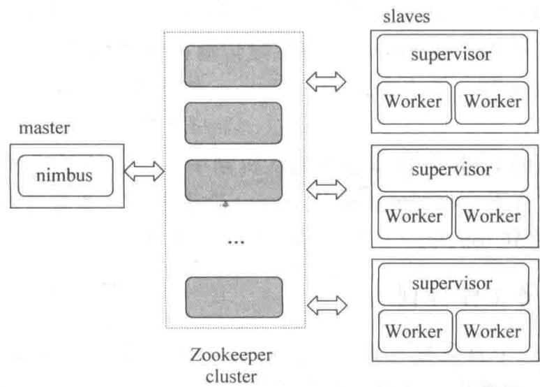
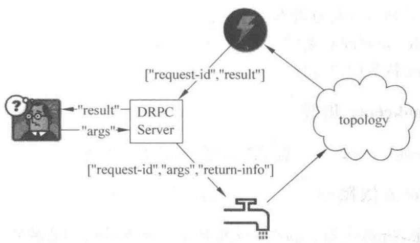

# 第11章 配置 Storm 集群

> 把本地跑通的 topology 搬上真正的集群

<!--
上一章我们用本地模式把 Storm 的机制都跑通了，但本地模式终究只在单个 JVM 里模拟。要真正感受 Storm 的威力，就必须把它部署到集群上。这一章我们解决两件事：第一，理解 Storm 集群的框架——nimbus、supervisor、Zookeeper、DRPC、UI 各自扮演什么角色；第二，动手在 Linux 上把一个真实的 Storm 集群搭起来，并把 topology 提交上去运行。学完这章，你就能从"会写 topology"升级到"会部署和维护集群"。

[Sources]
- 吴斌，《大数据实时计算与应用》，清华大学出版社，第 11 章。
-->

---
class: compact
---

## 本章目录

1. **11.1 Storm 集群框架介绍**：nimbus、supervisor、DRPC、UI
2. **11.2 在 Linux 上安装 Storm**：依赖库、配置、启动后台进程
3. **11.3 将 topology 提交到集群上**：提交与停止

<!--
同学们请看本章三步。11.1 先把集群的角色分工理清楚，这决定了你后面配置的时候各进程要在哪台机器上跑；11.2 是动手环节，从装依赖库到改配置、启动进程，一步步来；11.3 非常简单，就两条命令——提交和停止 topology。这条线走完，你就拥有一个可用的 Storm 集群了。

[Sources]
- 吴斌，《大数据实时计算与应用》第 11 章，章节结构。
-->

---
layout: section
class: compact
---

## 11.1 Storm 集群框架介绍

<ol class="outline">
  <li class="current">主从结构与角色</li>
  <li>nimbus / supervisor</li>
  <li>DRPC 与 UI</li>
</ol>

<!--
先建立整体认知。Storm 集群遵循主从结构，由一个主节点 nimbus 和一个或多个工作节点 supervisor 组成，外加一个 Zookeeper 负责协调。我们把它拆开，逐个角色讲清楚。

[Sources]
- 吴斌，《大数据实时计算与应用》第 11.1 节。
-->

---
class: compact
---

## 打个比方：Storm 集群就像一个"建筑工地"

- **nimbus（总工头）**：一个人坐镇指挥部，负责**派活、监工、谁出问题就重新调度**
- **supervisor（各班组长）**：每个工地（工作节点）有一个班组长，听总工头安排，**组织手下的工人干活**
- **Worker（工人）**：真正**动手干活**的进程
- **Zookeeper（工程协调处）**：记录"谁在岗、谁缺勤"，帮大家互通信息

**关键点**：总工头（nimbus）**不亲自干活**——所以就算总工头暂时不在，只要各班组长和工人还在干，工程照常进行；但总工头不在时万一有班组出事，就没人重新调度了。

<!--
配置一个 Storm 集群，先把它想成一个建筑工地。nimbus 是总工头，坐镇指挥部，负责派活、监工、出问题重新调度；supervisor 是各班组长，分布在每个工地，听总工头安排、组织手下工人干活；Worker 就是真正动手的工人；而 Zookeeper 是工程协调处，记录谁在岗谁缺勤。这里最值得记住的一点是：总工头 nimbus 自己不干活，只负责调度。所以万一总工头临时不在，只要各班组长和工人还在照常干，工程就继续；但要是这时候某个班组出事，没人重新调度，就会出乱子。这个比喻让你对"nimbus 不作单点故障"有直观理解。

[Sources]
- 吴斌，《大数据实时计算与应用》第 11.1 节，基础。
-->

---
class: compact
---

## Storm 集群框架

{fit="contain" position="center" max-height="46vh"}

- **主/从结构**，主节点由**配置静态指定**（非动态选举）；由 **nimbus + supervisor** 组成，外配一个 **Zookeeper** 集群协调

<!--
**[看图]** 这张图把 Storm 集群的三大块画出来了。左边 master 是 nimbus，它是主脑；中间是 Zookeeper 集群，作为协调层；右边是多个 slaves，每个 slave 是一个 supervisor，里面又跑着若干 Worker。三块通过箭头互相联系：nimbus 和 supervisor 之间靠 Zookeeper 协调。另外注意一点：Storm 的主节点是**静态配置指定的**，不像 Zookeeper 那样动态选举。这三个进程其实可以共住一台机器，所以你也可以在一台机器上搭一个"单节点伪集群"用来学习。

[Sources]
- 吴斌，《大数据实时计算与应用》第 11.1 节。
-->

---
class: compact
---

## nimbus：管理、协调、监控

- **职责**：管理、协调、监控集群上运行的 topology（发布、任务指派、失败后重新指派）
- **发布流程**：把打包成 jar 的 topology 和配置提交到 nimbus；nimbus 把 jar 分发到足够的 supervisor；随后指派 task（Bolt/Spout 实例）并指示 supervisor 生成足够的 Worker
- **状态记录**：记录所有 supervisor 状态及分配的 task；发现 supervisor 未上报心跳或不可达，则将它的 task 重新分配给其他 supervisor

<!--
**[核心]** nimbus 是集群的"大脑"，但它是个特殊的大脑——它只负责管理，不碰数据。具体说：你提交的 topology jar 先到 nimbus，它把 jar 分到相应的 supervisor，再派 task、指示生成 Worker。它还盯着每台 supervisor 的状态，谁掉线了就把谁的任务转给别人。这里有个极重要的点要强调：**nimbus 不作为单点故障**，因为它不参与数据处理。如果 nimbus 在 topology 运行中停了，只要 supervisor 和 Worker 还健康，topology 照常跑。当然，若 nimbus 停止期间恰好有 supervisor 也挂了，就没人重新指派任务了，处理会中断。所以 nimbus 的设计哲学是"丢了不影响正在跑的活，但丢了就没法调度新活"。

[Sources]
- 吴斌，《大数据实时计算与应用》第 11.1 节。
-->

---
class: compact
---

## supervisor：等待任务、监控 Worker

- **职责**：等待 nimbus 分配任务，生成并监控 Workers（JVM 进程）执行任务
- supervisor 和 Worker 都运行在**不同的 JVM 进程**上
- 若 supervisor 拉起的 Worker 因错误或强制结束而**异常退出**，supervisor 会**尝试重新生成**新的 Worker 进程
- **容错衔接**：当某个 Worker 甚至整个 supervisor 故障时，传输到故障节点的 tuples 将收不到应答确认，Spout 因超时而重新发射原始 tuple，如此循环直到 topology 恢复——这就是锚定与应答机制的高明之处

<!--
**[核心]** supervisor 是每台工作节点上的"监工"，它等 nimbus 派活，然后拉起并监控 Worker。它的容错很直接：Worker 挂了，supervisor 重新拉一个。那如果连 supervisor 或整台机器都挂了呢？答案回到上一章的锚定和应答机制——发到故障节点的 tuple 没法被 ack，Spout 等超时就会重发。这个过程会自动循环，直到集群从故障恢复。你看，Storm 的可靠性保障和它的容错模型是**天然咬合**的：上层的消息重试，正好互补下层节点的宕机。这就是为什么说 Storm "保证消息至少处理一次"。

[Sources]
- 吴斌，《大数据实时计算与应用》第 11.1 节。
-->

---
class: compact
---

## DRPC 服务工作机制

- 把 Storm 的分布式计算能力应用到**"请求—响应"范式**；topology 用 **DRPCSpout** 接收调用、算完由 **ReturnResults** Bolt 凭唯一 id 送回结果

{fit="contain" position="center" max-height="34vh"}

- **读图**：客户端 → **DRPC Server**（带唯一 id）→ topology 的 **DRPCSpout** → 计算 → **ReturnResults** 送回并唤醒客户端

<!--
**[看图]** 这张图展示 DRPC（分布式 RPC）的完整闭环。左边客户端发请求给 DRPC Server，请求里带函数名和参数；中间是 topology，它通过 DRPCSpout 接住这些调用，每个调用带唯一 id；算完后再由 ReturnResults Bolt 把结果送回 DRPC Server；最后由服务器凭这个唯一 id 唤醒等待中的客户端。你可能会疑惑：topology 是异步、长时间运行的，跟"请求-响应"的同步范式怎么协调？答案是 DRPC 服务器充当了桥梁——把同步的客户端请求，转化为流式计算里的一个个带 id 的调用，算完再配回去。这样分布式计算也被"伪装"成了普通的远程函数调用。

[Sources]
- 吴斌，《大数据实时计算与应用》第 11.1 节。
-->

---
class: compact
---

## Storm UI

- 可选功能：基于 Web 的 GUI，用于监控 Storm 集群、对运行的 topology 做一定管理
- 提供已发布 topology 的统计信息
- **只报告**由 nimbus 的 Thrift API 获取的信息，**不影响** topology 其他功能；可随时开关，**完全无状态**
- 可用配置做一些简单管理：开启、停止、暂停、重新均衡负载 topology

<!--
**[核心]** Storm UI 是运维的"仪表盘"，但记住它是**可选、且完全无状态**的。它不直接干预数据处理，只读取 nimbus 提供的统计信息，所以你可以放心地随开随关，不会影响任何 topology。它最实用的价值是让你看到每个 topology 的运行状态和统计，还能通过它做开启、停止、暂停、重新均衡负载这些简单管理。需要提醒的是，UI 必须和 nimbus 部署在同一台机器上，否则无法正常工作。

[Sources]
- 吴斌，《大数据实时计算与应用》第 11.1 节。
-->

---
layout: section
class: compact
---

## 11.2 在 Linux 上安装 Storm

<ol class="outline">
  <li class="current">搭建 Zookeeper 与依赖库</li>
  <li>下载与配置 storm.yaml</li>
  <li>启动后台进程</li>
</ol>

<!--
角色理解清楚了，我们动手装。流程依次是：搭建 Zookeeper、安装依赖库、下载解压、改 storm.yaml、启动进程。我们按这个顺序走。

[Sources]
- 吴斌，《大数据实时计算与应用》第 11.2 节。
-->

---
class: compact
---

## 安装 Storm 依赖库

需要在 Nimbus 和 supervisor 机器上安装：

1. **ZeroMQ 2.1.7**（勿用 2.1.10，其严重 bug 会致集群异常；个别 2.1.7 遇到 IllegalArgumentException 则降为 2.1.4）
2. **JZMQ**
3. **Java 6**
4. **Python 2.6.6**
5. **Unzip**

```shell
# ZeroMQ
wget http://download.zeromq.org/zeromq-2.1.7.tar.gz
tar -xzf zeromq-2.1.7.tar.gz && cd zeromq-2.1.7
./configure && make && sudo make install

# JZMQ
git clone https://github.com/nathanmarz/jzmq.git && cd jzmq
./autogen.sh && ./configure && make && sudo make install
```

<!--
**[核心]** 依赖这块其实就一个原则：**版本要对**。ZeroMQ 必须 2.1.7，因为 2.1.10 有严重 bug 会让集群出奇怪问题，甚至个别情况 2.1.7 也要降到 2.1.4。JZMQ 是 ZeroMQ 的 Java 绑定，两者配合才有那个底层高效消息队列。另外还需要 Java 6、Python 2.6.6（Storm 的脚本依赖它）和 Unzip。这些都装好后，消息队列这一层就绪了。这些是早期 Storm 的依赖，现在虽然框架更新了，但当年这套"ZeroMQ + JZMQ"正是 Storm 高性能的底层来源。

[Sources]
- 吴斌，《大数据实时计算与应用》第 11.2 节。
-->

---
class: compact
---

## storm.yaml 必需配置项

1. **storm.zookeeper.servers**：Storm 使用的 Zookeeper 集群地址，非默认端口需加 storm.zookeeper.port
2. **storm.local.dir**：Nimbus/Supervisor 存储少量状态（jars、confs等）的本地目录，需预先创建并给足权限
3. **java.library.path**：本地库（ZeroMQ、JZMQ）加载路径，默认已含 /usr/local/lib，一般无需配置
4. **nimbus.host**：Nimbus 机器地址，各 supervisor 据此下载 topology 的 jars、confs
5. **supervisor.slots.ports**：每节点可运行的 Worker 数量与端口；默认 4 个，分别在 6700/6701/6702/6703

<!--
**[带读]** 配置 storm.yaml 时，必须项就这几个，逐个看它们的作用。zookeeper.servers 告诉 Storm 协调层在哪；local.dir 是各进程存 jar、配置的临时目录，要先建好给足权限；java.library.path 一般不用动（默认就指向 ZeroMQ/JZMQ 的安装位置）；nimbus.host 最关键——它让每台 supervisor 知道去哪下载任务包；supervisor.slots.ports 决定一台机器能跑几个 Worker，每个 Worker 占一个端口，默认 4 个（6700-6703）。理解每条配置对应哪个进程，你配置时就不会含糊。

[Sources]
- 吴斌，《大数据实时计算与应用》第 11.2 节。
-->

---
class: compact
---

## 启动 Storm 后台进程

Storm 是**快速失败（fail-fast）**系统，可随时停止、重启后正确恢复，故不在进程内保存状态；即使 Nimbus 或 supervisor 重启，运行中的 topologies 不受影响。

```bash
# 主控节点：启动 nimbus（后台运行）
bin/storm nimbus > /dev/null 2>&1 &
# 各工作节点：启动 supervisor（后台运行）
bin/storm supervisor > /dev/null 2>&1 &
# 主控节点：启动 UI（后台运行）
bin/storm ui > /dev/null 2>&1 &
```

- 启动后通过 `http://{nimbus host}:8080` 查看 Worker 资源、topologies 状态

<!--
**[核心]** 启动其实很简单，三条命令：nimbus 在主控节点、supervisor 在工作节点、ui 也在主控节点，都加 & 放后台。有个要点是 Storm 之所以敢快速失败、随时重启，是因为它**不在进程里保存状态**——状态都在 Zookeeper 里，所以进程重启后能正确恢复，不影响正在跑的 topology。等三个进程都起来，就可以在浏览器访问 8080 端口看集群状态了。注意 UI 必须和 nimbus 同机，且日志会生成在安装目录的 logs/ 下，方便排障。

[Sources]
- 吴斌，《大数据实时计算与应用》第 11.2 节。
-->

---
layout: section
class: compact
---

## 11.3 将 topology 提交到集群上

<ol class="outline">
  <li class="current">提交与停止</li>
</ol>

<!--
集群搭好了，最后就是把 topology 跑上去。这里只有两条命令：提交和停止。

[Sources]
- 吴斌，《大数据实时计算与应用》第 11.3 节。
-->

---
class: compact
---

## 提交与停止 topology

**启动（提交）topology：**

```bash
storm jar allmycode.jar org.me.MyTopology arg1 arg2 arg3
```

- `allmycode.jar`：包含 topology 实现代码的 jar 包
- `org.me.MyTopology`：main 方法为 topology 入口
- `arg1/arg2/arg3`：MyTopology 执行时需传入的参数

**停止 topology：**

```bash
storm kill {toponame}
```

- `{toponame}`：提交时指定的 topology 任务名称

<!--
**[核心]** 提交 topology 就一条命令：storm jar 后面跟你的 jar 包、主类名和参数。Storm 会把这个 jar 交给 nimbus，由它分发到各 supervisor 执行。停止也是同理，一条 storm kill 加 topology 的名字。你会发现，整个部署过程如此简单——只要这两条命令，这正是 Storm "运维简单" 特性的体现。到这里，你已经能把自己的 topology 真正跑在集群上了，从本地模拟到生产部署的这条路，算是完整走通了。

[Sources]
- 吴斌，《大数据实时计算与应用》第 11.3 节。
-->

---
class: compact
---

## 想一想（自检）

**问题 1**：配置 `storm.yaml` 时，`nimbus.host` 和 `storm.zookeeper.servers` 各自是给谁用的？

> 提示：一个告诉"去哪交任务"，一个告诉"去哪登记"。

**问题 2**：为什么 Storm 允许"快速失败"（进程挂了重启也不影响正在跑的 topology）？

> 提示：想想 nimbus/supervisor 的状态保存在哪里。

<!--
这两个问题考你对配置文件的理解和"无状态"设计。第一题：**nimbus.host** 是给各 supervisor 用的，告诉它们"nimbus 在哪"，好去下载 topology 的 jar 和配置；**storm.zookeeper.servers** 是告诉集群"Zookeeper 在哪"，用来登记和协调。二者角色不同。第二题：因为 Storm 的 nimbus 和 supervisor **不在进程内保存状态**，状态都存在 Zookeeper 里，所以进程挂了、重启后能从 Zookeeper 恢复、正确接着干——这就叫"快速失败 + 无状态"。答出这两点，你就真理解集群配置和容错设计了。

[Sources]
- 吴斌，《大数据实时计算与应用》第 11 章，自检。
-->

---
class: compact
---

## 本章小结

1. **集群框架**：nimbus（管理/调度）+ supervisor（执行/监控 Worker）+ Zookeeper（协调）；nimbus 不作单点故障
2. **可靠性衔接**：supervisor 宕机时靠锚定 + 应答的超时重发机制恢复
3. **DRPC**：把同步的"请求-响应"转化为流式计算；UI 为可选、无状态监控工具
4. **部署**：装依赖、配 storm.yaml（五要素）、启动三进程，用 `storm jar` / `storm kill` 管理 topology

<!--
**[过渡]** 我们收一下第十一章。部署 Storm 的底层逻辑是：nimbus 管调度但不碰数据、supervisor 干活并监控、Zookeeper 居中协调；topology 挂了靠消息重试兜底；而这一切都通过"装依赖、配 yaml、启进程、提交 jar 包"这几步落地。你走上这一步，就已经具备了把流式计算推上生产的能力。到这里，Storm 的基础已经打牢，下一章我们向上走一层，看 Storm 之上的高阶抽象——Trident。

[Sources]
- 吴斌，《大数据实时计算与应用》第 11 章，本章小结。
-->
