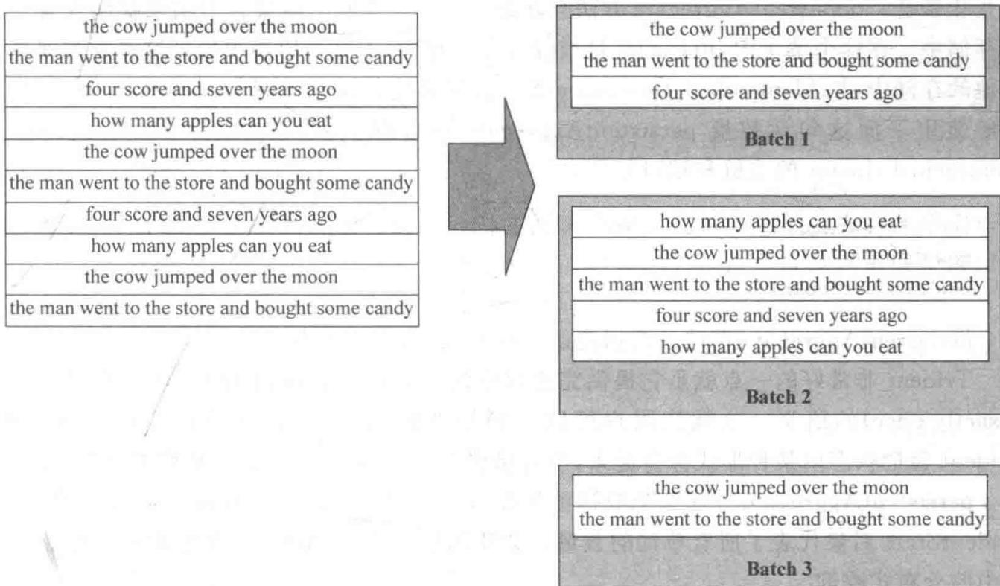
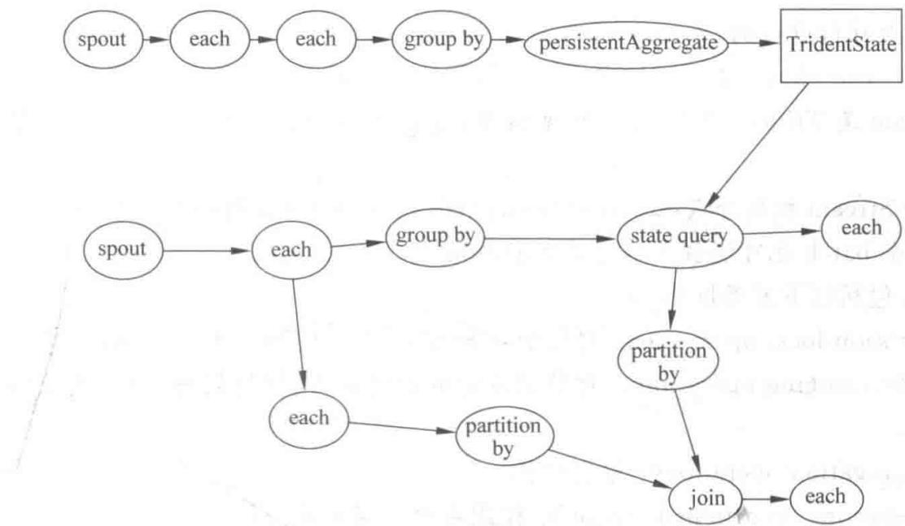
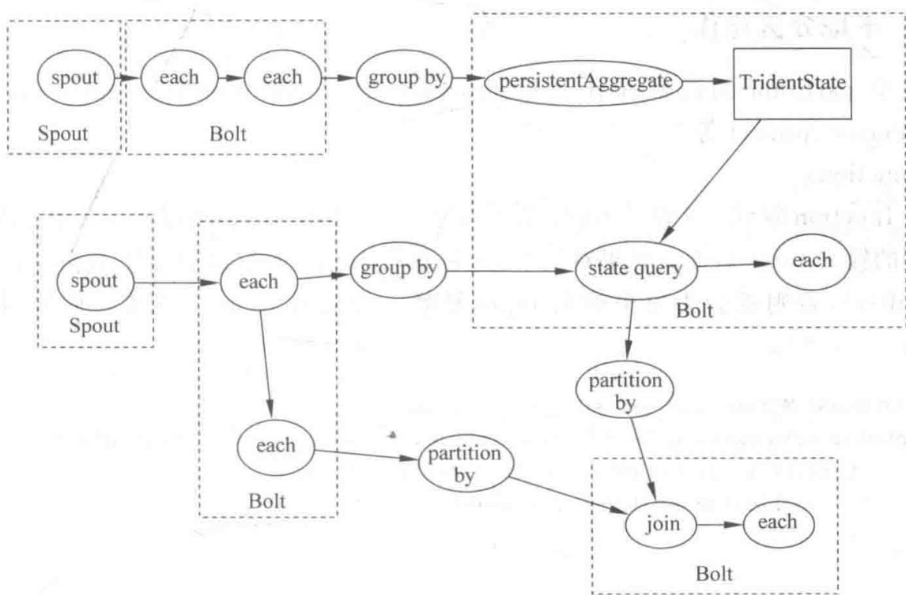
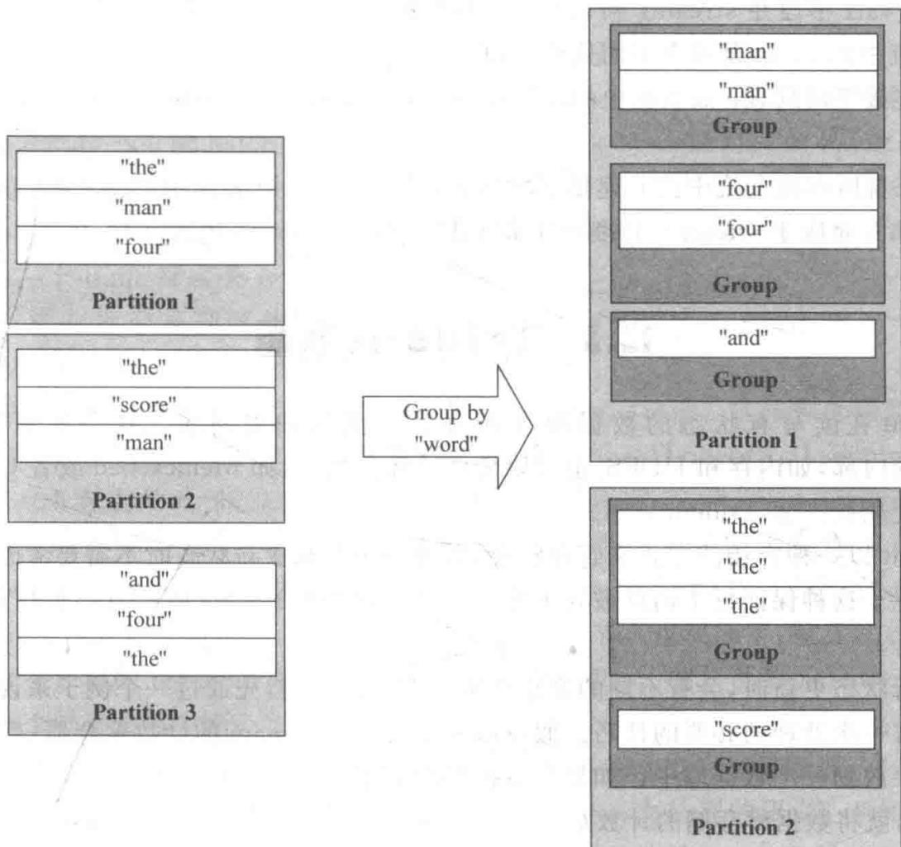
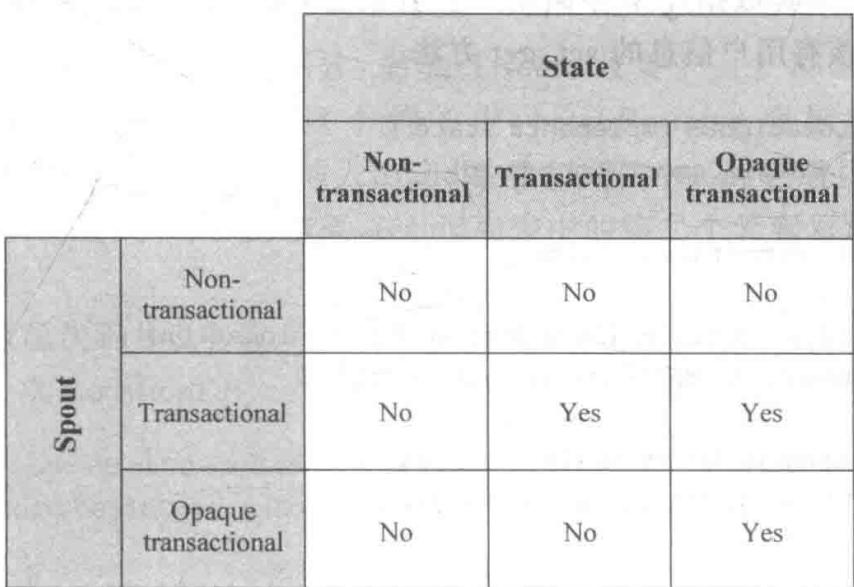

# 第12章 Trident 和 Trident-ML

> 在 Storm 之上的一层高阶抽象：批处理式 API + 精确一次语义

<!--
学完前两章，你已经能写、能部署 Storm topology 了。但你可能发现，用原始 Storm API 写一个"每个单词计数并行且不丢不重"的程序，要处理很多锚定、应答、状态恢复的细节。这一章我们就向上走一层，看 Storm 之上的高阶抽象——Trident。它可以理解成"流式版本的 Pig/Cascading"：让你用类似批处理的 API 去描述流式计算，同时自动帮你处理掉状态、容错、精确一次这些难题。最后我们还会看基于它的 Trident-ML，一个实时在线机器学习库。学好这章，你会体会到什么叫"优雅地做流式计算"。

[Sources]
- 吴斌，《大数据实时计算与应用》，清华大学出版社，第 12 章。
-->

---
class: compact
---

## 本章目录

1. **12.1 Trident topology**：综述、Reach 例、字段与元组、状态、执行
2. **12.2 Trident 接口**：五类操作
3. **12.3 Trident 状态**：事务语义、MapState
4. **12.4 Trident-ML**：实时在线机器学习库

<!--
同学们请看本章四大板块。12.1 先用单词计数和 Reach 两个例子建立直观；12.2 系统介绍 Trident 的五类操作；12.3 深入它最核心的价值——状态管理与"精确一次"语义；12.4 看它如何支撑机器学习。这条线下来，你会理解 Trident 究竟给 Storm 加了什么。

[Sources]
- 吴斌，《大数据实时计算与应用》第 12 章，章节结构。
-->

---
layout: section
class: compact
---

## 12.1 Trident topology

<ol class="outline">
  <li class="current">Trident 综述与单词计数</li>
  <li>Reach 例</li>
  <li>字段、元组、状态与执行</li>
</ol>

<!--
我们先建立直观。Trident 是 Storm 之上的高阶抽象，它以实时计算为目标，提供高吞吐、低延迟分布式查询和有状态流式处理。它就像是流式的 Pig/Cascading——用熟悉的批处理概念去思考和描述流处理。我们从单词计数这个例子切入。

[Sources]
- 吴斌，《大数据实时计算与应用》第 12.1 节。
-->

---
class: compact
---

## 先理解：为什么还需要"更高一层的抽象"

上一章我们用原始 Storm 写程序，会发现要操心很多"琐碎又容易错"的事：

- 每条消息都要**手动锚定、手动 ack/fail**，否则会丢或重
- 想做"每个单词计数且不丢不重"，得**自己管理状态、处理重试**
- 代码写起来**繁琐、易错**

**Trident 帮你把这些打包**：它让你**像写 SQL / Pig 那样**描述"我要算什么"

- 你只关心：分组、聚合、过滤、连接（业务逻辑）
- **状态管理、容错、精确一次**这些麻烦事，由 Trident **自动搞定**

**比喻**：原始 Storm 像"手动拧螺丝"，Trident 像"用电动工具"——活更轻松，结果还更可靠。

<!--
为什么原始 Storm 已经很好了，还要有 Trident？因为你自己写 Storm 时，会发现大量精力花在"跟框架打交道"上：每条消息要手动锚定、手动应答，否则会丢或重；想做精确一次的计数，得自己管理状态、处理重试。这些很容易出错。Trident 的价值就是"把这些打包起来"——它让你像写 SQL 或 Pig 一样，直接描述"我要把单词分组、计数、过滤"，而状态、容错、精确一次这些麻烦事全自动搞定。打个比方：原始 Storm 像手动拧螺丝，Trident 就像用电动工具，活更轻松、结果还更稳。

[Sources]
- 吴斌，《大数据实时计算与应用》第 12 章，基础。
-->

---
class: compact
---

## Trident 综述

- 以**实时计算**为目标的高阶抽象：高吞吐（每秒百万级消息）+ 低延迟分布式查询 + 有状态流式处理
- 类似 **Pig / Cascading** 这类高级批处理工具，提供 joins、aggregations、grouping、functions、filters
- 提供专门原语，在数据库或其他存储上做**有状态的递增式处理**
- 提供<strong>一致性</strong>与<strong>有且仅有一次（exactly-once）</strong>语义，使编写 topology 更轻松

<!--
**[核心]** Trident 的定位一句话概括：把"流式处理"用"批处理的思维方式"来表达。你写的是一个个的流操作——group、join、aggregate、filter——就像写 Pig 脚本。但它背后的执行是实时的。最值钱的是它能给你 exactly-once（精确一次）语义：每条消息保证被处理且只处理一次，而不用你自己去折腾锚定、事务这些细节。这意味着，Trident 把最头疼的可靠性问题，封装成了一个开箱即用的特性。

[Sources]
- 吴斌，《大数据实时计算与应用》第 12.1 节。
-->

---
class: compact
---

## 单词计数：第一部分（计算）

```java
TridentTopology topology = new TridentTopology();
TridentState wordCounts = topology.newStream("spout1", spout)
    .each(new Fields("sentence"), new Split(), new Fields("word"))
    .groupBy(new Fields("word"))
    .persistentAggregate(new MemoryMapState.Factory(), new Count(), new Fields("count"))
    .parallelismHint(6);
```

- `newStream("spout1", spout)`：从输入源读数，spout1 是 Zookeeper 中的 znode 节点名
- `Split`：按空格把句子拆成单词 tuple
- `groupBy("word")`：按单词分组
- `persistentAggregate(Count)`：把聚合结果持久化存到 state（可换成 Memcached、Cassandra 等）

<!--
**[看代码]** 看这段 Trident 代码的"流水式"写法，非常像 SQL 或 Pig：newStream 从数据源创建流；each 把句子按空格拆成单词；groupBy 按单词分组；persistentAggregate 带上 Count 聚合器把计数持久化。关键是最后一行 persistentAggregate 返回一个 **TridentState** 对象——它代表"当前所有单词的数量"这个状态，后面查询要用它。如果想把结果存到 Memcached，只要把 MemoryMapState.Factory() 换成 MemcachedState.transactional(...) 即可。整个计算逻辑，几行就描述完了。

[Sources]
- 吴斌，《大数据实时计算与应用》第 12.1 节。
-->

---
class: compact
---

## Trident 以 batch 处理

Trident 把输入 stream 转换成 **batch** 处理（每批数千到数百万 tuple），从而复用成熟的批处理语义（groupby、join、aggregation）。

{fit="contain" position="center" max-height="40vh"}

- **读图**：原始句子流被拆成若干 **Batch**（Batch 1/2/3…），每批是一个 tuple 集合

<!--
**[看图]** 这张图解释了 Trident 的一项核心设计：**按 batch 处理**。看左边，原始的句子流其实就是一句句的文本；Trident 把它们拆成若干小批。图中右下方的 Batch 1、Batch 2、Batch 3 就是这样一批批的 tuple。为什么按批？因为这样就能复用成熟的批处理语义（groupby、join、aggregation），还能把一批的读、写攒起来批量执行，大幅提升性能。可以说，batch 是把"流"驯化成"可批处理"的桥梁。

[Sources]
- 吴斌，《大数据实时计算与应用》第 12.1 节。
-->

---
class: compact
---

## 单词计数：第二部分（分布式查询）

```java
DRPCClient client = new DRPCClient("drpc.server.location", 3772);
System.out.println(client.execute("words", "cat dog the man"));
// 打印 JSON 编码的结果，例如："[[5078]]"
```

```scala
topology.newDRPCStream("words")
  .each(new Fields("args"), new Split(), new Fields("word"))
  .groupBy(new Fields("word"))
  .stateQuery(wordCounts, new Fields("word"), new MapGet(), new Fields("count"))
  .each(new Fields("count"), new FilterNull())
  .aggregate(new Fields("count"), new Sum(), new Fields("sum"));
```

- 每个 DRPC 请求被当作**只有一个 tuple 的 batch**；`args` 字段保存客户端参数
- `stateQuery` 在前面创建的 TridentState 上查询每个单词的个数；`FilterNull` 过滤未出现过的单词；`Sum` 汇总

<!--
**[看代码]** topology 的第二部分是查询。客户端用 client.execute 调 "words" 这个查询函数，传一个单词列表。后端这段 newDRPCStream("words") 与前面计算部分照应：接收请求（只含一个 tuple 的 batch）、按空格拆词、groupBy、然后用 **stateQuery** 去查第一步生成的 wordCounts 状态、MapGet 取出每个单词的计数、FilterNull 滤掉没出现过的词、最后 Sum 加总。整个查询，客户端看起来就是一个普通 RPC，但背后是在整个集群并行跑的。这就是"低延迟分布式查询"。

[Sources]
- 吴斌，《大数据实时计算与应用》第 12.1 节。
-->

---
class: compact
---

## Trident 的性能优化

- **批量读写**：stateQuery 和 persistentAggregate 会自动批量处理——batch 中有 20 次更新，只需一次读一次写，而非 20 次
- **局部聚合**：聚合器先在每个 partition 局部聚合，再汇总到全局——思想和 MapReduce 的 **combiner** 一致

<!--
**[核心]** Trident 为什么快？两个智能优化。第一，读写在 batch 层面合并——比如本批要对状态做 20 次更新，Trident 不会傻傻地访问 20 次数据库，而是攒起来一次读一次写。第二，聚合有"局部聚合"机制——它在每个分区先算好各自的数，再把各分区的部分结果汇总；这就像 MapReduce 的 combiner，把传输量先压小一轮，再干后面的活。这两点说明 Trident 不是简单地把流切块，而是在切块的同时把效率也优化到了极致。

[Sources]
- 吴斌，《大数据实时计算与应用》第 12.1 节。
-->

---
class: compact
---

## Reach：一个 DRPC 例子

Reach 值 = 给定 URL 对应页面的推文能送达的用户数。计算它需要：取转发过该推文的所有人 → 找他们的粉丝 → 去重 → 计数。整个过程数据量极大，得靠集群并行。

```txt
topology.newDRPCStream("reach")
  .stateQuery(urlToTweeters, ..., new Fields("tweeters"))
  .each(..., new ExpandList(), new Fields("tweeter"))
  .shuffle()
  .stateQuery(tweetersToFollowers, ..., new Fields("followers"))
  .parallelismHint(200)                       // 最耗资源的环节，给最大并行度
  .each(..., new ExpandList(), new Fields("follower"))
  .groupBy(new Fields("follower"))
  .aggregate(new One(), new Fields("one"))    // 每分组输出一个 1
  .parallelismHint(20)
  .aggregate(new Count(), new Fields("reach"));  // 把所有 1 累加，得到去重粉丝数
```

- 用 `newStaticState` 表示外部数据库，`ExpandList` 把列表展开成多个 tuple，`shuffle` 均匀分配任务，`One` 聚合器对每组发一个 1 以便去重后计数

<!--
**[核心]** Reach 这个例子展示了 Trident 做复杂分布式计算的优雅。逻辑上它就是"查转发者→展开→查粉丝→展开→去重→计数"几步，但在单机要数千次数据库调用、上千万 tuple。用 Trident，每个步骤一行代码。它有两个亮点值得注意：一是 `stateQuery(urlToTweeters)` 直接拿外部 map 当状态查询；二是在最耗资源的"查粉丝"环节，用 shuffle + parallelismHint(200) 把任务甩到大量 worker 并行。最后的去重计数也很妙——按 follower 分组后用 One 聚合器给每组发一个 1，再用 Count 把这些 1 加总，就是去重后的粉丝数。一步步都非常清晰。

[Sources]
- 吴斌，《大数据实时计算与应用》第 12.1 节。
-->

---
class: compact
---

## 字段与元组

- 数据模型是 **TridentTuple**；tuple 在操作序列中增量生成
- **each(输入字段, 过滤器/函数, 输出字段)**：
  - 过滤器如 `each(new Fields("y"), new MyFilter())`——只把 y 字段传给过滤器
  - 函数如 `each(new Fields("x","y"), new AddAndMultiply(), new Fields("added","multiplied"))`——输出字段追加到输入之后
- **stream.aggregate(...)** 用聚合输出替换输入的 tuple；group 后 aggregate 输出含分组字段 + 聚合字段

<!--
**[核心]** Trident 的数据模型很灵活。关键概念是：一个操作只接收它声明的输入字段子集，输出字段则追加到 tuple 后面。你既可以做过滤（过滤器决定留不留），也可以做变换（函数发射新值），还可以做聚合（把一个 batch 压成一个值）。特别值得注意 each 的字段机制——它只把需要的字段传给函数，这在性能上非常高效，因为减少了不必要的字段传输。理解"字段子集传入、输出追加"这个模型，你就掌握了 Trident 数据流的组装方式。

[Sources]
- 吴斌，《大数据实时计算与应用》第 12.1 节。
-->

---
class: compact
---

## 状态：如何做到 exactly-once

- **问题**：流计算时节点可能死掉，batch 需要重放；但你不知道之前的更新是否已提交
- **Trident 的两条原则**：
  1. 每个 batch 被赋予唯一 **transaction id（txid）**；batch 重试时 txid 不变
  2. 状态更新**严格按 batch 顺序**进行（batch 3 必须等 batch 2 更新成功）
- **做法**：把 **txid 和 value 作为原子值**存进数据库；更新时比较存储的 txid 与当前 txid——相同则跳过，不同则更新

<!--
**[核心]** 这一页是 Trident 的灵魂——它凭什么敢承诺"精确一次"。关键在于它把账记清楚了：每个 batch 有个不变的事务 id txid；状态更新严格按 batch 顺序。存状态时，你把"值"和"这个值对应的 txid"一起原子地存进去。当要更新某值，先看数据库里的 txid 和当前 batch 的 txid——如果一样，说明这批已经被算过了，直接跳过；不一样才更新。这样即便某个 batch 被重放，你也因为有 txid 这个"记忆"而不会重复累计。而这一切逻辑都被封装在 State 抽象里，你根本不用手动写。这就是"精确一次"的实现诀窍。

[Sources]
- 吴斌，《大数据实时计算与应用》第 12.1 节。
-->

---
class: compact
---

## Trident topology 的执行

Trident topology 会被编译成尽可能高效的 Storm topology：**只有需要重新分配（repartition）时**才通过网络发送 tuple（如 groupby 或 shuffle）。

{fit="contain" position="center" max-height="40vh"}

- **读图**：逻辑上的 Trident 流——spout → each → groupBy → persistentAggregate → stateQuery → sum，像一张抽象数据流图

<!--
**[看图]** 先看第一张：逻辑上的 Trident topology——spout、each、groupBy、persistentAggregate、stateQuery、sum 等等，像一个高度抽象的数据流图。它描述的是"要算什么"，而不关心底层怎么并行。

[Sources]
- 吴斌，《大数据实时计算与应用》第 12.1 节。
-->

---
class: compact
---

## Trident 编译成 Storm topology

{fit="contain" position="center" max-height="40vh"}

- **读图**：逻辑节点被展开成具体 **Spout/Bolt** 组合；只有**需要重排数据**处（grouping/partition）才走网络，其余在本地流水线完成

<!--
**[看图]** 再看第二张：它编译成底层 Storm topology 后的样子——每个逻辑节点被展开成具体的 Spout/Bolt 组合。关键点在于：图里那些**需要跨节点重排数据**的地方（grouping、partition）才产生网络传输，其余都在本地流水线里完成。所以 Trident 看起来是高度抽象的批处理 API，跑起来却是高效的分布式执行。

[Sources]
- 吴斌，《大数据实时计算与应用》第 12.1 节。
-->

---
layout: section
class: compact
---

## 12.2 Trident 接口

<ol class="outline">
  <li class="current">五类操作</li>
  <li>本地分区操作</li>
  <li>重新分区、聚合、分组、合并连接</li>
</ol>

<!--
这一节系统性地过一遍 Trident 的接口。Stream 是核心数据模型，被当作一系列 batch 处理，并划分成多个 partition；操作在每个 partition 上并行。Trident 的操作可以归为五类。

[Sources]
- 吴斌，《大数据实时计算与应用》第 12.2 节。
-->

---
class: compact
---

## Trident 的五类操作

1. **Partition-local operations**：对每个 partition 的局部操作，**不产生网络传输**（function、filter、partitionAggregate、stateQuery、partitionPersist、project）
2. **Repartitioning operations**：对流重新划分（只改划分、不改内容），**产生网络传输**（shuffle、broadcast、partitionBy、global、batchGlobal、partition）
3. **Aggregation operations**：聚合操作（aggregate、persistentAggregate）
4. **Operations on grouped streams**：作用在分组流上的操作
5. **Merge、Join 操作**：合并与连接

<!--
**[核心]** 把 Trident 的操作记成五类，你就能快速判断一个操作是"本地算"还是"要跨节点"。第一类 Partition-local 是最常见的——每个分区自己算，不搬家，所以最快。第二类 Repartition 正好相反，它把数据重新划分到别的分区，必然会走网络。区分这两类的意义在于：**网络传输是流式计算的昂贵开销**，能用本地操作就不用全局操作。后三类则是聚合、分组流操作和合并连接。有了这个分类框架，你设计 topology 时就能自然地向着"少搬家"的方向优化。

[Sources]
- 吴斌，《大数据实时计算与应用》第 12.2 节。
-->

---
class: compact
---

## functions 与 filters

- **function**：收一个输入 tuple，可输出 0 或多个 tuple，输出字段**追加**到输入之后；没输出则该 tuple 被过滤
- **filter**：决定是否保留 tuple

```java
// MyFunction：根据第一个字段的值，输出那么多个值
public class MyFunction extends BaseFunction {
    public void execute(TridentTuple tuple, TridentCollector collector) {
        for (int i = 0; i < tuple.getInteger(0); i++)
            collector.emit(new Values(i));
    }
}
// mystream 数据 [1,2,3],[4,1,6],[3,0,8],执行 each(b -> MyFunction -> d)
// 输出 [1,2,3,0],[1,2,3,1],[4,1,6,0]
```

<!--
**[看代码]** function 和 filter 是流处理最基础的变换单元。function 是"一变多"：收一个 tuple，可以发射 0 个或多个，多出来的字段追加在后面。看 MyFunction，它按第一个字段的值循环发射 0 到 n-1，所以 [1,2,3]（b=2）会变成两个 tuple、[4,1,6]（b=1）变成一个、而 [3,0,8]（b=0）什么都不会发——这就等于把那一行过滤了。注意这个设计巧妙处：function 天然包含了 filter 的能力。而 filter 则是单纯决定留不留。两者都作用于每个 partition 内部，很高效。

[Sources]
- 吴斌，《大数据实时计算与应用》第 12.2 节。
-->

---
class: compact
---

## partitionAggregate 与聚合器

- **partitionAggregate**：对每个 partition 执行聚合，输出 tuple **替换**输入 tuple（不同于 function 的追加）
- 定义聚合器有三种接口：
  - **CombinerAggregator**：`init(tuple)`、`combine(v1,v2)`、`zero()`；只输出一个单字段 tuple；配合 aggregate 可自动做局部聚合
  - **ReducerAggregator**：`init()`、`reduce(curr, tuple)`；迭代生成单值输出
  - **Aggregator**：`init(batchId, collector)`、`aggregate(state, tuple, collector)`、`complete(state, collector)`；可输出任意数量、多字段的 tuple

```java
// CombinerAggregator 版 Count
public class Count implements CombinerAggregator<Long> {
    public Long init(TridentTuple tuple) { return 1L; }
    public Long combine(Long v1, Long v2) { return v1 + v2; }
    public Long zero() { return 0L; }
}
```

<!--
**[核心]** 聚合是把很多 tuple 缩成一个，而 partitionAggregate 是"每个分区各自缩"。这里要记住三种聚合器接口的取舍。CombinerAggregator 最简单也最推荐——它能在每个分区先局部聚合再合并，就像 MapReduce 的 combiner；ReducerAggregator 是逐个迭代归并；Aggregator 最通用，能输出多个 tuple，但没法自动局部优化。看 Count 的 Combiner 实现：init 返回 1（每个 tuple 贡献 1）、combine 把两个数相加、zero 给空批返回 0。记住，能用 CombinerAggregator 就用它，因为性能最好。

[Sources]
- 吴斌，《大数据实时计算与应用》第 12.2 节。
-->

---
class: compact
---

## 重新分区（Repartition）操作

- **shuffle**：随机均匀分发 tuple 到目标 partition
- **broadcast**：每个 tuple 复制到所有目标 partition（DRPC 中常用于每个 partition 上做 stateQuery）
- **partitionBy**：按指定字段的 hash 值 mod 分区数选择分区，保证同字段值的 tuple 进同一分区
- **global**：所有 tuple 送到同一个 partition
- **batchGlobal**：同一 batch 的 tuple 一定进同一分区
- **partition**：接受自定义分区函数

<!--
**[带读]** Repartition 是"搬家"操作，解决"数据怎么分布到各个分区"的问题，它们不改变内容、只改变分布。挑最常用的讲：shuffle 是"均匀撒"，最简单；**partitionBy 是最重要的**——它按某个字段的哈希值决定分区，从而保证相同字段值的 tuple 一定进同一个分区，这是后面做 groupBy 和保证结果正确的基础；broadcast 是"复制"，每个分区都来一份，DRPC 查询场景常用；global 全去一个分区（会成热点）；batchGlobal 保证同一批在一个分区；partition 让你自己写规则。理解每种分区的语义，你才能正确设计数据该怎么流动。

[Sources]
- 吴斌，《大数据实时计算与应用》第 12.2 节。
-->

---
class: compact
---

## 群聚与流分组操作

- 下图：分区里的 tuple 先**按字段值（如 z）partitionBy 分区、再在分区内分组**；groupBy 后聚合结果按分字段为 key 存 MapState；aggregate 则做全局聚合

{fit="contain" position="center" max-height="36vh"}

<!--
**[看图]** 这张图讲 groupBy 的过程。看左边的分区，每个 partition 里放着一批 tuple，都有 x、y、z 字段；经过 groupBy 后，数据按字段值（比如 z）重新组织，同一 z 值的 tuple 被归到同一个 partition 的同一个 group 里。其实就是"先按值分区，再在分区内分组"。groupBy 之后你通常要做什么？聚合——但注意，在分组流上聚合，是**每个 group 各自聚合**，而不是整个 batch 一起。比如按单词分组，每个单词一个 group，各自计数。这样，流式计算的"分组计数"就水到渠成了。

[Sources]
- 吴斌，《大数据实时计算与应用》第 12.2 节。
-->

---
class: compact
---

## 合并与连接

- **merge**：把多个流合并成一个流：`topology.merge(stream1, stream2, stream3)`；新流字段沿用 stream1 的字段
- **join**：类似 SQL 的连接：

```java
topology.join(stream1, new Fields("key"),
              stream2, new Fields("x"),
              new Fields("key", "a", "b", "c"));
```

- 连接字段为 key 和 x；输出字段 = 连接字段 + 各输入流的非连接字段（按输入顺序），a/b 对应 stream1 的 val1/val2，c 对应 stream2 的 val1

<!--
**[核心]** 最后两类操作是"多流汇合"。merge 最简单，就是把几个流合并成一个，字段沿用第一个流的。join 则复杂，类似 SQL 的 join，得指定连接字段。看代码：它把 stream1 的 key 和 stream2 的 x 作为连接键，然后输出所有字段。由于两个输入流可能有重名字段（比如都有 val1），所以必须显式指定输出流的所有字段名——这是 Trident 的一个安全约束。join 是流式计算里很有用但也很重的一类操作，它在数据重排、状态维护上开销不小，用的时候要权衡。

[Sources]
- 吴斌，《大数据实时计算与应用》第 12.2 节。
-->

---
layout: section
class: compact
---

## 12.3 Trident 状态

<ol class="outline">
  <li class="current">三种 Spout 与 State</li>
  <li>State 接口与 MapState</li>
  <li>执行与 Trident-ML</li>
</ol>

<!--
Trident 最硬核的部分是它处理状态与容错的方式。这一节我们讲清楚"三种 Spout 配合三种 State"怎么组合出 exactly-once，以及 State 接口本身。

[Sources]
- 吴斌，《大数据实时计算与应用》第 12.3 节。
-->

---
class: compact
---

## 三种 Spout 的容错特性

- **transactional spout**：相同 txid 的 batch 一定相同（batch 内容不变）；各 batch 无交集；每个 tuple 属于且仅属于一个 batch
- **opaque transactional spout**：不能保证同 txid 的 batch 内容一致；每个 tuple 只在**一个 batch 中成功处理**，但失败后可能在另一个 batch 成功；对源节点丢失（如 Kafka 节点宕掉）更鲁棒
- **non-transactional spout**：不保证 batch 规则；最多处理一次或至少一次；**无法实现 exactly-once**

<!--
**[核心]** 理解三种 Spout，关键看它们对"batch 内容"的保证。transactional spout 最严格：同一个 txid 的 batch 重放时内容一模一样、batch 间无交集。代价是它脆弱——如果重放 batch 时某个数据源节点（比如 Kafka 节点）挂了，就凑不出"完全一样"的那批了，处理会被卡死。于是出现了 opaque transactional spout：它不承诺 batch 内容一致，只承诺"每个 tuple 只在一个 batch 中成功处理"，这样就算源节点没了也能继续。non-transactional 则直接放弃这些保证，自然也就谈不上 exactly-once。三者的差异，本质是"严格但脆弱"和"灵活但鲁棒"的权衡。

[Sources]
- 吴斌，《大数据实时计算与应用》第 12.3 节。
-->

---
class: compact
---

## Spout 与 State 的组合

{fit="contain" position="center" max-height="46vh"}

- **读图**：行＝Spout 三种类型，列＝State 三种类型，单元格 Yes/No 表示能否 **exactly-once**
- 只有"事务级 Spout 配对应 State"（Transactional / Opaque）才行；opaque 容错最强但要**多存一条 prevValue**

<!--
**[看图]** 这张矩阵图把 Spout 和 State 的搭配说得很清楚：行是 Spout 的三种类型，列是 State 的三种类型，单元格里的 Yes/No 表示能否实现 exactly-once。只有两条交叉点亮 Yes：transactional spout + transactional/opaque state，以及 opaque spout + opaque state。想做到精确一次，必须搭配对应的事务级 state。opaque 组合容错最强（能扛源节点丢失），代价是 state 要多存一个 prevValue。左下角的 non-transactional 都标 No。**

[Sources]
- 吴斌，《大数据实时计算与应用》第 12.3 节。
-->

---
class: compact
---

## State 应用接口

Trident 把容错逻辑全封装在 State 里，用户只需简单调用：

```java
public interface State {
    void beginCommit(Long txid);   // State 更新开始
    void commit(Long txid);        // State 更新结束
}
```

自定义 State 还需提供 **StateFactory**；查询用 **QueryFunction**（如 `batchRetrieve` 批量取），更新用 **StateUpdater**（如 `updateState`）：

```java
public class LocationDB implements State {
    public void beginCommit(Long txid) {}
    public void commit(Long txid) {}
    public void setLocationsBulk(List<Long> ids, List<String> locs) { /* 批量写入 */ }
    public List<String> bulkGetLocations(List<Long> ids) { /* 批量读取 */ }
}
```

- 通过 `batchRetrieve`/`bulkGetLocations` 批量访问，减少数据库访问次数

<!--
**[看代码]** 对用户来说，State 接口极其简单——就两个方法 beginCommit 和 commit，Trident 会在状态更新开始和结束时回调，告诉你 txid。真正的逻辑你放在自定义的业务方法里，比如 LocationDB 的 setLocationsBulk 和 bulkGetLocations。这里要特别提醒性能要点：Trident 的批量特性，鼓励你用"批量"方法而不是一条条读。看例子，bulkGetLocations 一次拿一批用户的位置，比逐条查高效得多。这就是 Trident 帮你把容错跟性能都包好的体现——你只写业务，剩下交给它。

[Sources]
- 吴斌，《大数据实时计算与应用》第 12.3 节。
-->

---
class: compact
---

## MapState 与实现

- **persistentAggregate** 是 partitionPersist 之上的一层抽象，知道如何用聚合器更新 State
- 在 **group stream** 上聚合时，State 需实现 **MapState**（key 为分组字段、value 为聚合结果）：

```java
public interface MapState<T> extends State {
    List<T> multiGet(List<List<Object>> keys);
    List<T> multiUpdate(List<List<Object>> keys, List<ValueUpdater> updaters);
    void multiPut(List<List<Object>> keys, List<T> vals);
}
```

- 在**非分组流**上聚合时，State 需实现 **Snapshottable**：`get()`、`update(updater)`、`set(o)`
- 实现 MapState 很容易：只需提供一个 **IBackingMap**（multiGet / multiPut）；Trident 已提供 OpaqueMap、TransactionalMap、NonTransactionalMap 封装好容错逻辑

<!--
**[核心]** 接着往下落，看你到底怎么实现一个能存状态的 MapState。关键在你聚合的流性质不同，State 接口就不同：分组流上用 MapState（因为要按 key 存），非分组流上用 Snapshottable（一个快照值）。而真正写起来极简——只要提供一个 IBackingMap（底层 multiGet/multiPut），剩下的容错逻辑 Trident 都替你封装好了：要让状态支持 opaque 语义就套 OpaqueMap，要 transactional 就套 TransactionalMap，简单不需要容错就用 NonTransactionalMap。也就是说，你写的是"底层存储"，容错是"上层的壳"自动给你加上去的。

[Sources]
- 吴斌，《大数据实时计算与应用》第 12.3 节。
-->

---
layout: section
class: compact
---

## 12.4 Trident-ML

<ol class="outline">
  <li class="current">实时在线机器学习库</li>
  <li>分类、聚类与统计</li>
</ol>

<!--
最后，我们看基于 Trident 的一个应用库——Trident-ML，一个实时在线机器学习库。它把流式计算和机器学习结合起来，让"边到数据边学"成为可能。

[Sources]
- 吴斌，《大数据实时计算与应用》第 12.4 节。
-->

---
class: compact
---

## Trident-ML 概述

- 基于 Storm 的**实时在线机器学习库**，通过可伸缩的在线学习算法创建实时预测特征
- 算法面向**有限内存、有限计算时间**的在线学习场景，但**不适用于分布式计算**
- 支持：线性分类（Perceptron、Passive-Aggressive、Winnow、AROW）、线性回归、聚类（KMeans）、特征缩放（standardization、normalization）、文本特征提取、流统计（mean、variance）、预训练的 Twitter 情绪分类器等

<!--
**[核心]** Trident-ML 的价值在于把"机器学习"接到"实时流"上。它封装了一堆经典在线学习算法，让你用 Trident 的 API 就能做实时分类、聚类、统计。它设计的前提很明确——**局限于内存和计算时间都受限的在线学习**，不做分布式训练。因为模型学习本质是通过状态更新来完成的，而 Storm 又禁止分布式状态更新，所以学习过程不是分布式的；但这不算大瓶颈，因为增量式算法本身够快够简单。这一点要清楚：它能把数据划分、预处理做得分布式，但真正的学习是单点增量式的。

[Sources]
- 吴斌，《大数据实时计算与应用》第 12.4 节。
-->

---
class: compact
---

## 有监督与无监督

- **分类（有监督）**：Perceptron、Winnow、BWinnow、AROW、PA、MultiClassPA；用 `ClassifierUpdater` 从标注实例流学习，用 `ClassifyQuery` 分类未标注实例
- **文本分类**：KLDClassifier 基于 Kullback-Leibler 距离
- **聚类（无监督）**：KMeans；用 `ClusterUpdater`/`ClusterQuery` 更新和查询聚类器

```java
// 用标注实例更新感知器模型，再从 DRPC 流分类
TridentState perceptronModel = topology
    .newStream("nandsamples", new NANDSpout())
    .partitionPersist(new MemoryMapState.Factory(), new Fields("instance"),
        new ClassifierUpdater<Boolean>("perceptron", new PerceptronClassifier()));

topology.newDRPCStream("predict", localDRPC)
    .each(new Fields("args"), new DRPCArgsToInstance(), new Fields("instance"))
    .stateQuery(perceptronModel, new Fields("instance"),
        new ClassifyQuery<Boolean>("perceptron"), new Fields("prediction"));
```

<!--
**[看代码]** 这个例子把"训练"和"预测"一体化了。上半部分起了一个流，用标注实例（NAND 样本）去更新一个感知器模型——通过 partitionPersist + ClassifierUpdater，模型作为 TridentState 被维护。下半部分是一个 DRPC 流，接收预测请求，把参数转成实例，然后用 stateQuery + ClassifyQuery 基于这个模型做分类。整个模型是"在线学习"的——随着标注数据流入，模型不断更新；而预测请求通过 DRPC 实时到达。这展示了流式机器学习的典型模式：**一条流训练模型，另一条流用模型做预测**。

[Sources]
- 吴斌，《大数据实时计算与应用》第 12.4 节。
-->

---
class: compact
---

## 流统计、预处理与预训练

- **流统计**：mean、variance、count 等，存于 StreamStatistics 对象；用 StreamStatisticsUpdater/Query 更新查询；可用固定窗口或滑动窗口（支持概念漂移）`StreamStatistics.adaptive(maxSize)`
- **预处理**：`Normalizer` 把实例缩放到单位尺度；`StandardScaler` 转化为标准正态（零均值、单位方差）
- **预训练分类器**：内置基于 Niek Sanders 语料库子集的 **Twitter 情绪分类器**，用于将推文分为积极/消极
- **Maven 集成**：Trident-ML 发布在 Clojars；在 pom.xml 添加依赖即可

<!--
**[核心]** 除了分类聚类，Trident-ML 还提供流统计和预处理这类实用工具。统计出 mean、variance、count，可以通过滑动窗口适应概念漂移——即数据分布随时间变化时模型能跟上。预处理方面，Normalizer 做缩放、StandardScaler 做标准化，这几乎是一切机器学习的前置步骤。而最省事的是它自带一个预训练的 Twitter 情绪分类器，开箱即用。整体看，Trident-ML 把"实时算 + 实时学"打通了，哪怕算法本身不做分布式学习，但预处理、特征工程这类重活是可以分布式的。这一章到这里，你就把 Storm 最高阶的抽象也掌握了。

[Sources]
- 吴斌，《大数据实时计算与应用》第 12.4 节。
-->

---
class: compact
---

## 想一想（自检）

**问题 1**：Trident 凭什么能做到"每条消息被处理且只被处理一次（exactly-once）"？说出它靠的两个原则。

> 提示：想想"txid"和"批次顺序"。

**问题 2**：想让"相同的单词永远进同一个分区"来聚合，Trident 里应使用哪种重分区操作？

> 提示：回忆按字段哈希分配的那一个。

<!--
这两个问题考查 Trident 的核心。第一题：Trident 做到精确一次，靠两条原则——①每个 **batch 有一个唯一且不变的事务 id（txid）**，重试时 txid 不变；②**状态严格按 batch 顺序更新**。这样在存状态时可比较 txid，相同就跳过、不同才更新，避免重复计算。第二题：要让相同单词进同一个分区，用 **partitionBy**（按指定字段的哈希值 mod 分区数分配），这样相同字段值的 tuple 一定进同一分区，是后续 groupBy 聚合的前提。答出这两点，你就抓住了 Trident"可靠又高效"的精髓。

[Sources]
- 吴斌，《大数据实时计算与应用》第 12 章，自检。
-->

---
class: compact
---

## 本章小结

1. **Trident**：流式版 Pig/Cascading；按 batch 处理 + 批处理 API；自动批量读写与局部聚合优化
2. **五类操作**：本地分区、重分区、聚合、分组流、合并连接；区分"本地 vs 搬家"是优化关键
3. **状态与 exactly-once**：三种 Spout × 三种 State 的组合决定能否精确一次；txid + 顺序更新是核心
4. **Trident-ML**：基于 Storm 的实时在线机器学习库，分类/聚类/统计/预处理/预训练，但不做分布式学习并

<!--
**[过渡]** 我们把第十二章收束。Trident 的核心价值在于：用批处理的思维写流计算，把最难的"状态与精确一次"封装成开箱即用的能力，同时又通过批量读写和局部聚合把性能榨干。它能做到 these，前提是搞清三种 Spout 和三种 State 的搭配——这是它的容错地图。可以说，学懂 Trident，你的流式计算能力就从"能用"上了"优雅活用"。下一章，我们把视线拉回一个具体而实用的开发组件——DRPC 模式。

[Sources]
- 吴斌，《大数据实时计算与应用》第 12 章，本章小结。
-->
