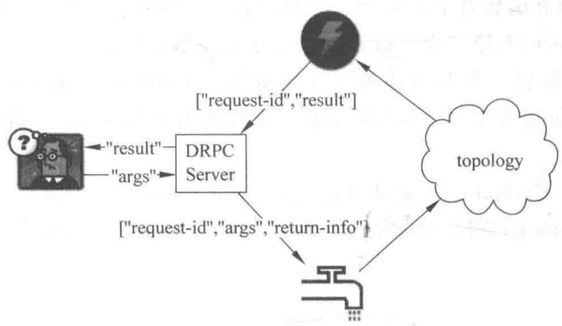

# 第13章 DRPC 模式

> 用 Storm 的实时计算能力，并行化"请求—响应"式的任务

<!--
前面我们讲的所有 Storm 应用，基本上都是"数据源源不断流进来、处理、流出"这种异步、长运行的模式。但现实中还有一种常见需求：客户端发一个请求，同步地等待结果——就像调用一次普通函数。Storm 能不能也支撑这种"请求—响应"范式？答案就是 DRPC（Distributed RPC）。这一章我们看 DRPC 是怎么被"拼"出来的，LinearDRPCTopologyBuilder 怎么把繁琐的部分自动化，以及本地、远程两种模式和 reach 这样一个真实案例。

[Sources]
- 吴斌，《大数据实时计算与应用》，清华大学出版社，第 13 章。
-->

---
class: compact
---

## 本章目录

1. **13.1 DRPC 概述**：工作流程
2. **13.2 DRPC 自动化组件**：LinearDRPCTopologyBuilder
3. **13.3 本地模式 DRPC**
4. **13.4 远程模式 DRPC**
5. **13.5 一个更复杂的例子**：reach 计算

<!--
同学们请看本章五步。13.1 先把 DRPC 的原理讲清楚；13.2 看看怎么少写代码——LinearDRPCTopologyBuilder；13.3 和 13.4 分别是本地、远程两种运行方式；13.5 用一个真实复杂的例子——计算 Twitter URL 的 reach 值，来收尾。

[Sources]
- 吴斌，《大数据实时计算与应用》第 13 章，章节结构。
-->

---
layout: section
class: compact
---

## 13.1 DRPC 概述

<ol class="outline">
  <li class="current">DRPC 的定义与工作流程</li>
</ol>

<!--
先搞清楚 DRPC 的定位。它不是 Storm 独有特性，而是用 Storm 的 stream/spout/bolt/topology 这几个原语，组合出来的一种模式（pattern）。引入它，主要是为了用 Storm 的实时计算能力去并行化那些 CPU 密集型任务。

[Sources]
- 吴斌，《大数据实时计算与应用》第 13.1 节。
-->

---
class: compact
---

## DRPC 工作流程

{fit="contain" position="center" max-height="42vh"}

- DRPC 用 Storm 的实时计算能力**并行化 CPU 密集型**的计算任务
- DRPC topology 以**函数参数流**作为输入，把**函数调用的返回值**作为输出流
- 由 **DRPC 服务器**协调：接收 RPC 请求 → 发到 Storm topology → 接收结果 → 发回等待的客户端
- 从客户端视角，调用 DRPC 与普通 RPC **没有任何区别**

<!--
**[看图]** 这张图是 DRPC 的完整闭环，我们顺着走一遍。最左边是客户端，它发送一个请求：要执行的函数名和参数；中间的 DRPC Server 把这些请求包装成带唯一 id 的调用，交给右边的 topology；topology 里的 DRPCSpout 接收这些调用，算出结果后，由 ReturnResults 这个 Bolt 带着唯一 id 返回给 DRPC Server；服务器凭 id 唤醒对应客户端、把结果送回。对客户端来说，它只看到"发起请求、拿到结果"，就像调一个普通函数。这就是分布式 RPC——把重活的分布并行藏在了一次函数调用的表象之下。

[Sources]
- 吴斌，《大数据实时计算与应用》第 13.1 节。
-->

---
class: compact
---

## 客户端调用示例

```java
DRPCClient client = new DRPCClient("drpc-host", 3772);
String result = client.execute("reach", "http://twitter.com");
```

- client 调用 `execute` 时需要两个参数：**函数名**（如 "reach"）与**函数参数**
- 函数名用于在 DRPC 服务器上区分不同的函数；返回结果以字符串形式给出

<!--
**[看代码]** 客户端这边极简：new 一个 DRPCClient，指定 DRPC 服务器的地址和端口（默认 3772），然后 execute 传入函数名和参数就行。你看这个 "reach" 就是要调用的函数名，后面跟参数。返回的是个字符串结果。所以从用法上，DRPC 和普通 RPC 真没区别——这就是它设计的成功之处。所有分布式并行的复杂性，都被隐藏在这个简单的 execute 调用背后了。

[Sources]
- 吴斌，《大数据实时计算与应用》第 13.1 节。
-->

---
layout: section
class: compact
---

## 13.2 DRPC 自动化组件

<ol class="outline">
  <li class="current">LinearDRPCTopologyBuilder</li>
</ol>

<!--
写 DRPC topology 时，很多步骤是重复的：设 Spout、把结果返回给 DRPC 服务器、给 Bolt 提供有限聚合能力。Storm 的 LinearDRPCTopologyBuilder 把这些都自动化了，让你几乎只写业务逻辑。

[Sources]
- 吴斌，《大数据实时计算与应用》第 13.2 节。
-->

---
class: compact
---

## LinearDRPCTopologyBuilder

Storm 自带，把实现 DRPC 的步骤自动化：

1. 设置 Spout
2. 把结果返回给 DRPC 服务器
3. 给 Bolt 提供有限聚合元组 tuples 的能力

```java
public static class ExclaimBolt extends BaseBasicBolt {
    public void execute(Tuple tuple, BasicOutputCollector collector) {
        String input = tuple.getString(1);
        collector.emit(new Values(tuple.getValue(0), input + "!"));   // [id, result]
    }
    public void declareOutputFields(OutputFieldsDeclarer declarer) {
        declarer.declare(new Fields("id", "result"));
    }
}
public static void main(String[] args) {
    LinearDRPCTopologyBuilder builder = new LinearDRPCTopologyBuilder("exclamation");
    builder.addBolt(new ExclaimBolt(), 3);
    // ...
}
```

<!--
**[看代码]** 看这个给输入加"!"的例子，你就知道 LinearDRPCTopologyBuilder 有多省事。新建 builder 时传一个函数名（exclamation）——DRPC 服务器靠它区分不同函数。然后 addBolt 加上你的业务 Bolt 和并发度，剩下连接 DRPC 服务器、取请求、回结果，全部由 builder 自动处理。你只需遵守一个约定：第一个 Bolt 收到的是 [request-id, 参数] 两维 tuple；最后一个 Bolt 要发回 [id, result] 两维 tuple；中间所有 tuple 的第一个字段必须是 request-id。看 ExclaimBolt，它读第二字段、加个"!"，然后发射 [id, result]——业务逻辑一目了然。

[Sources]
- 吴斌，《大数据实时计算与应用》第 13.2 节。
-->

---
layout: section
class: compact
---

## 13.3 本地模式 DRPC

<ol class="outline">
  <li class="current">用 LocalDRPC 测试</li>
</ol>

<!--
和普通 topology 一样，DRPC 也能在本地跑，方便开发和测试。

[Sources]
- 吴斌，《大数据实时计算与应用》第 13.3 节。
-->

---
class: compact
---

## 本地模式运行 DRPC

```java
LocalDRPC drpc = new LocalDRPC();                       // 在进程内模拟 DRPC 服务器
LocalCluster cluster = new LocalCluster();
cluster.submitTopology("drpc-demo", conf, builder.createLocalTopology(drpc));
System.out.println("Results for 'hello':" + drpc.execute("exclamation", "hello"));
cluster.shutdown();
drpc.shutdown();
```

- `LocalDRPC` 在进程内模拟 DRPC 服务器（类似 LocalCluster 模拟 Storm 集群）
- `createLocalTopology(drpc)` 接收 LocalDRPC 对象，因为本地模式 DRPC 不绑定端口，topology 需知道与谁交互
- 启动后直接调用 `drpc.execute(...)` 即可

<!--
**[看代码]** 本地模式测试 DRPC 的思路和 LocalCluster 一脉相承。先建一个 LocalDRPC，它像个微型 DRPC 服务器；再用 LocalCluster 提交 topology，注意这里用 createLocalTopology(drpc) 而不是远程那个——因为本地 DRPC 不绑定实际端口，topology 必须明确告诉它"我要跟这个 LocalDRPC 交互"。启动后，你就直接 drpc.execute 调"exclamation"函数传"hello"，拿到结果打印出来。跑完记得 shutdown。这套流程，就是每个 DRPC 开发者的日常调试循环。

[Sources]
- 吴斌，《大数据实时计算与应用》第 13.3 节。
-->

---
layout: section
class: compact
---

## 13.4 远程模式 DRPC

<ol class="outline">
  <li class="current">真实集群三步骤</li>
</ol>

<!--
在真实集群上跑 DRPC，其实也很简单，就三步。

[Sources]
- 吴斌，《大数据实时计算与应用》第 13.4 节。
-->

---
class: compact
---

## 远程模式三步骤

1. **启动 DRPC 服务器**：`bin/storm drpc`
2. **配置 DRPC 服务器地址**（让 DRPCSpout 知道去哪收调用）——在 storm.yaml 或代码里配置：

```yaml
drpc.servers:
  - "drpc1.foo.com"
  - "drpc2.foo.com"
```

3. **提交 DRPC topology** 到 Storm 集群（与其他 topology 无异）：

```java
StormSubmitter.submitTopology("exclamation-drpc", conf, builder.createRemoteTopology());
```

- 用 `createRemoteTopology()` 创建运行在真实集群上的 DRPC topology

<!--
**[核心]** 远程跑 DRPC 就三步。第一，bin/storm drpc 启动 DRPC 服务器，这个服务器就是那个"协调者"。第二，必须在 storm.yaml 或代码里配好 drpc.servers 地址，因为 topology 里的 DRPCSpout 需要知道去哪接函数调用——不配这个它就成了瞎子。第三，跟提交普通 topology 一样，用 StormSubmitter.submitTopology，只是改用 createRemoteTopology() 创建 topology。对比一下：本地用 LocalDRPC + createLocalTopology，远程用真实服务器 + createRemoteTopology。区别就在"谁来当那个协调的 DRPC 服务器"。

[Sources]
- 吴斌，《大数据实时计算与应用》第 13.4 节。
-->

---
layout: section
class: compact
---

## 13.5 一个更复杂的例子：reach

<ol class="outline">
  <li class="current">用 DRPC 计算 reach 值</li>
</ol>

<!--
最后我们看一个真正需要 Storm 并行计算能力的复杂例子：计算 Twitter 上某个 URL 的 reach 值。这个例子会动用几条 Bolt，串联出一套分布式计算。

[Sources]
- 吴斌，《大数据实时计算与应用》第 13.5 节。
-->

---
class: compact
---

## reach：定义与难点

一个 URL 的 **reach 值** = 该 URL 对应推文能到达的用户数量。计算需要：

1. 获取所有推文中包含该 URL 的人（转发者）
2. 获取这些人的粉丝
3. 把粉丝**去重**
4. 统计去重后的粉丝数（即 reach 值）

- 简单 reach 可能涉及**成千上万次数据库调用**、**千万数量级粉丝**，是在单机上要耗数分钟的 CPU 密集型任务
- 在 Storm 集群上，即使最难的 URL 也只需**几秒**

<!--
**[核心]** reach 为什么适合 Storm？四个步骤看下来，工作量全在一件事上：数据量爆炸。一个热门 URL 可能有成千上万人转发，每人又有成千上万粉丝，展开之后就是千万级。单机做，要几百万次数据库调用、几分钟；而且最后的去重，单机内存也扛不住。这正是 Storm 的用武之地——把"取转发者""取粉丝"这些密集的数据库操作打散到上百个 task 并行去干，去重和计数也拆到多个节点。所以哪怕最难的 URL，也只要几秒钟。这就是"CPU 密集 + 数据海量"的完美用例。

[Sources]
- 吴斌，《大数据实时计算与应用》第 13.5 节。
-->

---
class: compact
---

## reach topology 定义

```java
LinearDRPCTopologyBuilder builder = new LinearDRPCTopologyBuilder("reach");
builder.addBolt(new GetTweeters(), 3);                 // [id, url] -> [id, twitter]
builder.addBolt(new GetFollowers(), 12)
       .shuffleGrouping();                             // [id, twitter] -> [id, follower]
builder.addBolt(new PartialUniquer(), 6)
       .fieldsGrouping(new Fields("id", "follower"));  // 按 follower 去重 -> [id, count]
builder.addBolt(new CountAggregator(), 2)
       .fieldsGrouping(new Fields("id"));              // 汇总 -> reach
```

四步执行：取转发者 → 取粉丝 → 局部去重计数 → 汇总得到 reach。

<!--
**[看代码]** 用 LinearDRPCTopologyBuilder 搭 reach，就是四行 addBolt。第一行 GetTweeters 收 [id,url]，查出转发者，输出 [id,twitter]，一个 url 对应很多 twitter。第二行 GetFollowers 收 [id,twitter]，查粉丝输出 [id,follower]，用 shuffle 分布到 12 个并行度。注意：当有人关注的多人转发了同一条推文时，follower 会重复——这就是第三行要解决的。第三行 PartialUniquer 用 fieldsGrouping 按 follower 分组，把相同的 follower 引到同一 task，天然去重，输出 [id,count]。第四行 CountAggregator 把所有局部数加起来，就是 reach。一步步拆开，逻辑极其清晰。

[Sources]
- 吴斌，《大数据实时计算与应用》第 13.5 节。
-->

---
class: compact
---

## PartialUniquer：去重的关键

```java
public class PartialUniquer extends BaseBatchBolt {
    Set<String> _followers = new HashSet<String>();
    @Override
    public void prepare(Map conf, TopologyContext context,
                        BatchOutputCollector collector, Object id) {
        _collector = collector;  _id = id;
    }
    @Override
    public void execute(Tuple tuple) { _followers.add(tuple.getString(1)); }
    @Override
    public void finishBatch() { _collector.emit(new Values(_id, _followers.size())); }
    @Override
    public void declareOutputFields(OutputFieldsDeclarer declarer) {
        declarer.declare(new Fields("id", "partial-count"));
    }
}
```

- 用 **Set** 特性去重；继承 BaseBatchBolt，对每个 request-id 建一个实例，Storm 会适时清理
- `finishBatch()` 在批内所有 tuple 处理完后调用，只发送一个 [id, 本 task 粉丝数]

<!--
**[看代码]** PartialUniquer 是去重的核心，它巧妙利用了 HashSet 的"元素不重复"特性。execute 里每来一个粉丝 tuple，就 add 进当前的 Set——同一个粉丝被多次 add，Set 里也只有一个。finishBatch 在整批 tuple 处理完时触发，这时候它直接 emit [id, Set 的大小]，也就是本 task 上去重后的粉丝数。它继承 BaseBatchBolt，这是为 DRPC 准备的特殊 Bolt——每个 request-id 对应一个实例，处理完自动清理。最后 CountAggregator 把各 task 的局部 count 一加，就得到全局 reach。这个例子完美展示了：线性 DRPC 的每个阶段，都是可并行、可去重的独立步骤。

[Sources]
- 吴斌，《大数据实时计算与应用》第 13.5 节。
-->

---
class: compact
---

## 本章小结

1. **DRPC**：用 Storm 原语组合出的"请求—响应"模式；DRPC 服务器协调请求分发与结果回送；对客户端透明
2. **LinearDRPCTopologyBuilder**：自动化设置 Spout、回传结果、批次聚合；约定"第一个 Bolt 收 [id, 参数]，最后一个发 [id, result]"
3. **两种运行**：本地用 LocalDRPC + createLocalTopology；远程启动 drpc 服务器并配置地址后提交
4. **reach 案例**：取转发者 → 取粉丝 → 局部去重（Set）→ 全局汇总；体现 DRPC + 并发去重的工程价值

<!--
**[过渡]** 我们把第十三章收束。DRPC 真正解决的是"如何在流式、异步的 Storm 上，优雅地提供同步的远程函数调用"。借助 LinearDRPCTopologyBuilder，你几乎只写业务 Bolt；借助 field grouping 和 Set，你可以并行地去重、聚合。reach 这个例子，把"数据海量 + CPU密集 + 需要去重"的场景，演示得非常透彻。到这里，Storm 的所有核心模式你都掌握了。下一章，我们把这些本领真正用到两个工程实例上——计算网站页面的 PV 和 UV。

[Sources]
- 吴斌，《大数据实时计算与应用》第 13 章，本章小结。
-->
