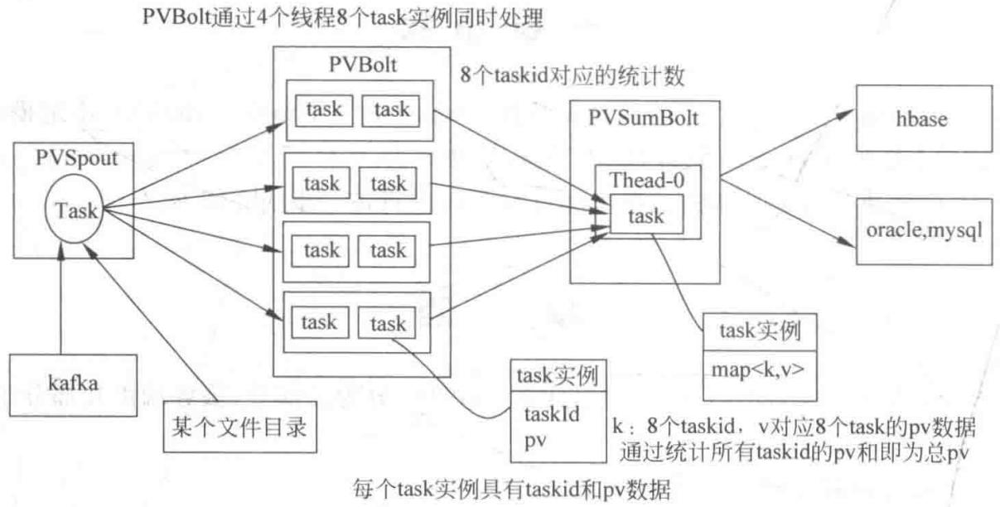

# 第14章 Storm 实战

> 真正把 Storm + Kafka + HBase 串起来：统计网站的 PV 和 UV

<!--
前面十三章我们把 Storm 的概念、并发、可靠性、部署、Trident、DRPC 全讲了一遍，但那些多是示例。这一章我们进入真正的工程实战：用 Storm 配合 Kafka 和 HBase，统计网站的页面浏览量（PV）和用户访问量（UV）。这是流式计算最经典、也最实用的一类应用。你会看到一条完整链路：Kafka 进数据 → Storm 算 → HBase 存结果，以及其中涉及的线程安全、去重、分窗口统计等真实工程问题。学完这章，你就具备了独立搭建一个实时统计系统的能力。

[Sources]
- 吴斌，《大数据实时计算与应用》，清华大学出版社，第 14 章。
-->

---
class: compact
---

## 本章目录

1. **14.1 网站页面浏览量计算（PV）**：背景、体系结构、编码实现、运行
2. **14.2 网站用户访问量计算（UV）**：在 PV 基础上的去重改进

<!--
同学们请看本章两个实战项目。14.1 做 PV——统计网页被浏览的次数，我们会看到完整的链路和编码；14.2 做 UV——统计访问的用户数，它要在 PV 基础上解决一个关键难题：怎么把同一个用户去重。两个项目由简到深，是检验你全书学习的综合大练兵。

[Sources]
- 吴斌，《大数据实时计算与应用》第 14 章，章节结构。
-->

---
layout: section
class: compact
---

## 14.1 网站页面浏览量计算

<ol class="outline">
  <li class="current">背景与体系结构</li>
  <li>Storm 编码实现</li>
  <li>运行 topology</li>
</ol>

<!--
先做 PV。对网站运营者来说，页面浏览量是必须的指标——无论改进网页质量还是定战略部署，它都是依据。我们看它的背景、架构和实现。

[Sources]
- 吴斌，《大数据实时计算与应用》第 14.1 节。
-->

---
class: compact
---

## 先理解：PV 是什么，UV 又是什么

这是本章要算的两个最常用指标，先分清：

**PV（Page View，页面浏览量）**：

- 一个页面**被打开了多少次**（同一个用户开 10 次就算 10 次）
- 例子：一条新闻被点开 5000 次 → PV=5000

**UV（Unique Visitor，独立访客数）**：

- 有多少个**不同的用户**来访（同一个用户来 10 次，也只算 1 个人）
- 例子：5000 次访问其实只来自 800 个不同的人 → UV=800

**一句话对比**：PV 数"次数"，UV 数"人数"。所以 **UV 比 PV 难**——因为它要**去重**（把同一个用户的多次访问合并成一个人）。

<!--
动手做之前，先把两个名词分清楚，这是全章的地基。PV 是页面浏览量——它数的是"被打开了多少次"，同一个用户点开 10 次就算 10 次，所以数字往往很大。UV 是独立访客数——它数的是"有多少个不同的人"，同一个用户来 10 次也只算 1 个人，所以要把重复的人合并掉。一句话：**PV 数次数，UV 数人数**。正因为 UV 需要对海量用户去重，它比 PV 难做得多，这也是本章第二个项目真正的挑战所在。带着这个区别去读后面代码，你会更有方向。

[Sources]
- 吴斌，《大数据实时计算与应用》第 14 章，基础。
-->

---
class: compact
---

## 背景与要点

- 网站页面浏览量统计必不可少，对网页质量改进、公司战略部署均有参考价值
- 用 Storm 统计 PV 需考虑两点：①**性能问题**；②**线程安全问题**
- 日志 = 网站服务器上所有事件的记录（如用户访问时间、访问 URL）
- 大型网站访问量巨大，分析访问日志必须用**大数据技术**——这正是 Kafka + Storm + HBase 的组合舞台

<!--
**[核心]** PV 统计听着简单，但放在大型网站上就复杂了。第一是性能：访问日志量巨大，一条条处理根本跟不上；第二是线程安全：Storm 的 Bolt 往往并发多线程执行，多线程同时更新同一个计数，一不小心就会出错。这两点正是这章要反复强调的工程主题。而点题的地方在于：**京东**这个量级的访问日志，必须靠 Kafka 缓冲、Storm 并行计算、HBase 持久化这样一套分布式组合，才扛得住。这就是我们整个项目要落地的东西。

[Sources]
- 吴斌，《大数据实时计算与应用》第 14.1 节。
-->

---
class: compact
---

## 体系结构

{fit="contain" position="center" max-height="48vh"}

- 流程：**Kafka**（数据源）→ **PVSpout** → **PVBolt**（分 task 统计）→ **PVSumBolt**（汇总）→ **HBase / mysql**

<!--
**[看图]** 这张图是 PV 项目的完整框架。看左边，Kafka 作为数据源提供访问日志；Spout 从里面读数据。中间是核心计算：PVBolt 开了多个 task（比如图中标注的 task1、task2、task3），各自并行地统计自己那块数据；然后 PVSumBolt 再把所有 task 的局部统计汇总起来。右边是存储层，汇总结果写到 HBase 或 MySQL。注意图中多处标注着"每个 task 统计 xx"，精确地告诉我们：并行度是怎么分片的、又在哪汇合。整条链路：Kafka 进、Storm 并行算、HBase 存，正是全书的总架构落地。

[Sources]
- 吴斌，《大数据实时计算与应用》第 14.1 节。
-->

---
class: compact
---

## 构建 topology

```java
TopologyBuilder builder = new TopologyBuilder();
String brokerZkStr = "172.19.176.49:2181,...,172.19.176.53:2181/kafka";
ZkHosts zkHosts = new ZkHosts(brokerZkStr);
String topic = "flow_normalized_json";
String id = UUID.randomUUID().toString();
SpoutConfig spoutconf = new SpoutConfig(zkHosts, topic, "/kafka", id);

builder.setSpout(SPOUT_ID, new KafkaSpout(spoutconf), 1);   // 1 个 Spout
builder.setBolt(PVBOLT_ID, new PVBolt(), 4).shuffleGrouping(SPOUT_ID);   // 4 个 task
builder.setBolt(PVSUMBOLT_ID, new PVSumBolt(), 1).shuffleGrouping(PVBOLT_ID); // 1 个汇总

// 调整各环节缓冲区大小以提升吞吐
conf.put(Config.TOPOLOGY_RECEIVER_BUFFER_SIZE, 8);
conf.put(Config.TOPOLOGY_TRANSFER_BUFFER_SIZE, 32);
conf.put(Config.TOPOLOGY_EXECUTOR_RECEIVE_BUFFER_SIZE, 16384);
conf.put(Config.TOPOLOGY_EXECUTOR_SEND_BUFFER_SIZE, 16384);
```

- 用 **KafkaSpout** 从 Kafka 的 `flow_normalized_json` topic 读日志
- 提交时若带命令行参数则提交到集群，否则用 LocalCluster 本地运行

<!--
**[看代码]** 看 PV topology 的骨架。数据源用 KafkaSpout，通过 ZkHosts 和 SpoutConfig 告诉它去哪读、读哪个 topic——注意 topic 是 flow_normalized_json，这是预先归一化好的日志流。然后三个组件的并行度很有讲究：Spout 只有 1 个；PVBolt 开了 4 个 task 并行统计，用 shuffleGrouping 均匀分数据；PVSumBolt 只有 1 个，负责把所有 task 的局部计数加总。为什么 PVSumBolt 只开 1 个？因为汇总操作必须保证全局正确，多开反而会乱。最后那段 Buffer 配置是为了调吞吐。这个"多点并行、单点汇总"的模式，是 Storm 统计类应用的标准写法。

[Sources]
- 吴斌，《大数据实时计算与应用》第 14.1 节。
-->

---
class: compact
---

## 编写 Bolt（PVSumBolt）

```java
public class PVSumBolt extends BaseRichBolt {
    private OutputCollector collector;
    private long pv;          // 本分钟内累计 PV
    private long last;        // 上一个分钟标识
    public void prepare(Map map, TopologyContext ctx, OutputCollector oc) {
        this.collector = oc;
        this.last = System.currentTimeMillis() / (1000 * 60);   // 当前分钟
    }
    public void execute(Tuple tuple) {
        String bid = tuple.getStringByField("bid");
        if (StringUtils.isNotBlank(bid)) { pv++; }              // 有效 bid 才计数
        if (System.currentTimeMillis() / (1000 * 60) != last) { // 跨分钟了
            last = System.currentTimeMillis() / (1000 * 60);
            HBaseDAO.put("storm", Long.toString(last), "info", "pv", Long.toString(pv));
            pv = 0;                                             // 重置
        } else { /* 还在同一分钟，继续累计 */ }
        this.collector.ack(tuple);
    }
}
```

- 按**分钟窗口**统计：每个分钟结束时，把当前 pv 写入 HBase 表 `storm`，然后清零

<!--
**[看代码]** 这是 PVSumBolt，它用了一个很聪明的"分钟窗口"策略。看 execute：每来一个 tuple，如果 bid 非空就把 pv++。关键在下面——它用 `currentTimeMillis()/60000` 算出当前是第几分钟，拿它和 last 比：如果变了，说明跨进新的一分钟了，这时候就把这一分钟的累计 pv 写进 HBase 表、然后清零重新计；如果没变，就只在内存里累加。这样一个 Bolt、一个 long 变量，就实现了按分钟分桶的页面浏览量统计。注意每次处理完它都 ack——配合前面讲的可靠性机制。这个例子把"时间窗口 + 内存累计 + 落库"讲得很实在。

[Sources]
- 吴斌，《大数据实时计算与应用》第 14.1 节。
-->

---
class: compact
---

## HBase 操作：HBaseDAO

```java
public class HBaseDAO {
    private static HBaseUtils hBaseUtils = new HBaseUtils("172.22.96.56", 2181, "/hbase");
    public static void put(String tablename, String row, String columnFamily,
                           String column, String data) {
        HTable table = hBaseUtils.getTable(tablename);
        Put put = new Put(Bytes.toBytes(row));
        put.addColumn(Bytes.toBytes(columnFamily), Bytes.toBytes(column), Bytes.toBytes(data));
        try { table.put(put); table.close(); } catch (IOException e) { LOG.error(e.getMessage(), e); }
    }
    public static Result get(String tablename, String row) throws Exception {
        HTable table = hBaseUtils.getTable(tablename);
        Result result = table.get(new Get(Bytes.toBytes(row)));
        table.close(); return result;
    }
    public static ResultScanner scan(String tablename) {
        return hBaseUtils.getTable(tablename).getScanner(new Scan());
    }
    public static ResultScanner containKeys(String tablename, String rowkey) {
        Scan scan = new Scan();
        Filter filter = new RowFilter(CompareFilter.CompareOp.EQUAL, ...);
        scan.setFilter(filter);
        return hBaseUtils.getTable(tablename).getScanner(scan);
    }
}
```

<!--
**[看代码]** HBaseDAO 是项目访问 HBase 的统一入口。它封装了几个最常用的操作：put 写入（把 pv 值写进指定表的某个列）、get 按行键读、scan 整表扫、containKeys 用过滤器按行键查。这些正好呼应前面第 7 到第 9 章学的 HBase 操作——put 构造 put 实例、get 按行读、Scan + RowFilter 做条件查询。当 PVSumBolt 要落库时，调的就是这里的 put("storm", 分钟, "info", "pv", 值)。HBaseUtils 则是底层连接管理，负责从 Zookeeper、端口、根目录去建立和复用 HBase 连接。这样数据层就和计算层解耦了。

[Sources]
- 吴斌，《大数据实时计算与应用》第 14.1 节。
-->

---
class: compact
---

## 运行 topology

- 打包为含依赖的 jar（maven-assembly-plugin 的 jar-with-dependencies），提交到集群：

```bash
storm jar ./wkj/bdp.jar com.storm.PVTopology pv-topology
```

- 结果：在 HBase 表 `storm` 中，每行是一个分钟，`pv` 列是该分钟的页面浏览数

<!--
**[核心]** 运行 PV 项目，就是把打的 fat jar 用 storm jar 提交。这里的 pom.xml 用 assembly 插件打了一个包含全部依赖的包——这点特别重要，因为 Storm 集群的节点本身没有你项目依赖的 jar，不打成 fat jar 会跑不起来。提交时第二个参数是主类 com.storm.PVTopology，最后是 topology 名。跑起来后，结果就源源不断地写进 HBase 的 storm 表：一行一个分钟，pv 列记录该分钟的浏览量。这样一个"大数据量 + 实时 + 落库"的 PV 统计系统就完成了。而这只是第一步，下一节的 UV 才是真正有挑战的。

[Sources]
- 吴斌，《大数据实时计算与应用》第 14.1 节。
-->

---
layout: section
class: compact
---

## 14.2 网站用户访问量计算

<ol class="outline">
  <li class="current">背景：从 PV 到 UV</li>
  <li>Storm 代码实现与运行</li>
</ol>

<!--
接下来做 UV——用户访问量。它和 PV 最大的不同，在于要去重：同一个用户访问很多次页面，UV 只算一次。这是个典型的"海量数据去重计数"问题，比 PV 难得多。

[Sources]
- 吴斌，《大数据实时计算与应用》第 14.2 节。
-->

---
class: compact
---

## UV：在 PV 上的去重改进

- 在 14.1 基础上改进，让最终结果中**每个用户只输出一次**访问记录，从而得到用户访问量（UV）
- 核心难点：**海量用户去重计数**
- **UVBolt 的策略**：
  1. 用**内存 Map** 记录本分钟内见过的 bid（用户标识），并用 `RotatingMap` 轮换控制内存
  2. 新来的 bid 查**内存 Map**，没见过的再查 **HBase**（跨窗口的历史）
  3. 只有真正第一次出现的 bid 才 `uv++`；同时把该 bid 的当前时间写回 HBase
  4. 到分钟切换时，把累计 uv 写入 HBase 并清零

<!--
**[核心]** UV 的去重思路，是把"这一分钟见过谁"这张表放在内存里，用 RotatingMap 控制只保留最近几批，避免内存爆炸。当用户来了，先查内存里的 map——见过就不用管；没见过的，再查 HBase 里的历史记录，确认这个用户是不是"本分钟第一次访问"。是，才 uv++。因为 HBase 存了所有用户最近访问的时间，所以即便内存存不下所有用户，也能靠它判断"这个人是不是新的"。这就是"内存 + HBase 双层判重"的策略，专门应对海量用户的场景。

[Sources]
- 吴斌，《大数据实时计算与应用》第 14.2 节。
-->

---
class: compact
---

## UVBolt 的判重逻辑

```java
public void execute(Tuple input) {
    String bid = input.getStringByField("bid");
    long ts = input.getLongByField("ts");
    if (StringUtils.isNotBlank(bid)) {
        if (map.containsKey(bid)) {                    // 本批见过
            // 若时间已跨分钟则 uv++
        } else if (map_tmp.containsKey(bid)) {         // 上一批见过
            // 同上判断
        } else {                                       // 内存中没见过
            Result rs = HBaseDAO.get("storm_bid", bid);  // 查历史
            if (rs == null) uv++;                       // 从未出现过 => 新用户
            else { /* 读 HBase 里的上次时间，若跨分钟则 uv++ */ }
        }
        HBaseDAO.put("storm_bid", bid, "info", "time", Long.toString(ts));  // 回写
    }
    this.collector.ack(input);
    // 若跨分钟：把 uv 写库并清零
}
```

- 双 Map（`map` / `map_tmp`）+ `RotatingMap` 控制内存；结合 HBase 历史判重

<!--
**[看代码]** UVBolt 的判重逻辑细分三档。第一档：bid 在当前 map 里，说明最近刚见过，可能不算新。第二档：在 map_tmp 里，说明上一批见过——用 RotatingMap 轮换，让老数据逐步淘汰。第三档：内存里都没有，这时才去查 HBase 的 storm_bid 表——如果查不到 result，说明这个用户史上第一次出现，uv++；如果能查到，就看它上次的时间戳，若跨了分钟边界才视为新的。最后，无论哪种情况，都要把当前时间回写 HBase，并 ack。这套"内存兜近期、HBase 兜全量"的设计，是海量去重计数的典型解法。

[Sources]
- 吴斌，《大数据实时计算与应用》第 14.2 节。
-->

---
class: compact
---

## 运行 UV topology

```java
builder.setSpout(SPOUT_ID, new KafkaSpout(spoutconf), 1);
builder.setBolt(PVBOLT_ID, new PVBolt(), 16).shuffleGrouping(SPOUT_ID);
builder.setBolt(UVBOLT_ID, new UVBolt(), 1).shuffleGrouping(PVBOLT_ID);
Config conf = new Config();
conf.setMaxSpoutPending(1000);   // 限制 Spout 未确认消息数
conf.setStatsSampleRate(1.0);
conf.setNumAckers(3);            // 3 个 acker 保证可靠性
```

```bash
storm jar ./wkj/bdp.jar com.storm.UVTopology uv-topology
```

- 结果在 HBase 表 `storm` 中，`uv` 列记录每分钟的独立用户数

<!--
**[看代码]** UV 的 topology 和 PV 类似，但有几处不同值得注意。PVBolt 从 4 提到 16 个并发，因为预处理量更大。UVBolt 只有 1 个——因为去重计数必须在单点串行才能保证正确，这点和 PVSumBolt 一样，是统计类拓扑的铁律。配置上多了三样：setMaxSpoutPending(1000) 限制 Spout 未确认的消息数，防止积压过多；setNumAckers(3) 设了 3 个 acker，因为 UV 判重失败会重算，可靠性要求更高。最后提交后，HBase 的 uv 列就记录每分钟的独立用户数。到这里，PV、UV 两个实战项目就全部完成。

[Sources]
- 吴斌，《大数据实时计算与应用》第 14.2 节。
-->

---
class: compact
---

## 想一想（自检）

**问题 1**：PV 和 UV 各自统计的是什么？为什么 UV 更难做？

> 提示：一个数"次数"，一个数"人数"。

**问题 2**：做 UV 去重时，为什么"内存 Map + HBase"要搭配起来用，只用一个不行吗？

> 提示：想想海量用户，内存装得下吗？只看 HBase 又会不会太慢？

<!--
这两题是整章的总结。第一题：PV 数的是"页面被打开的次数"（同一个人开 10 次算 10 次）；UV 数的是"不同的人"（同一个人来 10 次只算 1 个）。所以 UV 必须做**去重**，在几千万甚至上亿的访问里识别"哪些是同一个用户"，难度大得多。第二题：**内存 Map 快但装不下所有用户**，只靠内存会因为放不下而漏算；**HBase 能装下全部、但逐个查太慢**。所以两者搭配——内存记"近期见过的"，免得快慢失衡；HBase 记"历史全量"，保证不漏判。这就是"内存兜近期、HBase 兜全量"的双层判重。能说清这两点，说明你真的掌握了这一章的精髓。

[Sources]
- 吴斌，《大数据实时计算与应用》第 14 章，自检。
-->

---
class: compact
---

## 本章小结

1. **PV（页面浏览量）**：Kafka → Storm 并行统计 → HBase 落库；"多点并行 + 单点汇总 + 分钟窗口"
2. **UV（用户访问量）**：在 PV 基础上加"内存 + HBase 双层判重"解决海量去重
3. **工程要点**：Bolt 并发只在无状态/可分片处理时开大；需要全局正确的汇总/去重环节必须单点串行
4. **完整链路**：Kafka 获取 → Storm 实时处理 → HBase 存储，整本书的架构在此全部落地

<!--
**[过渡]** 我们把第十四章、也是全书收束起来。PV 用"多点并行、单点汇总、按分钟开窗"解决了大流量统计；UV 进一步用"内存兜近期、HBase 兜全量"的双层判重，解决了海量用户去重。你回头看，这两个项目正是把整本书串成了一条线：Kafka 是入口，Storm 是引擎，HBase 是归宿，Zookeeper 是协调，而你用并发、分组、可靠性这些知识把它们粘合起来。从第一章的分布式实时计算系统总览，到此刻一个能跑的实时统计系统——这条链路，你已经完整走通了。

[Sources]
- 吴斌，《大数据实时计算与应用》第 14 章，本章小结。
-->
