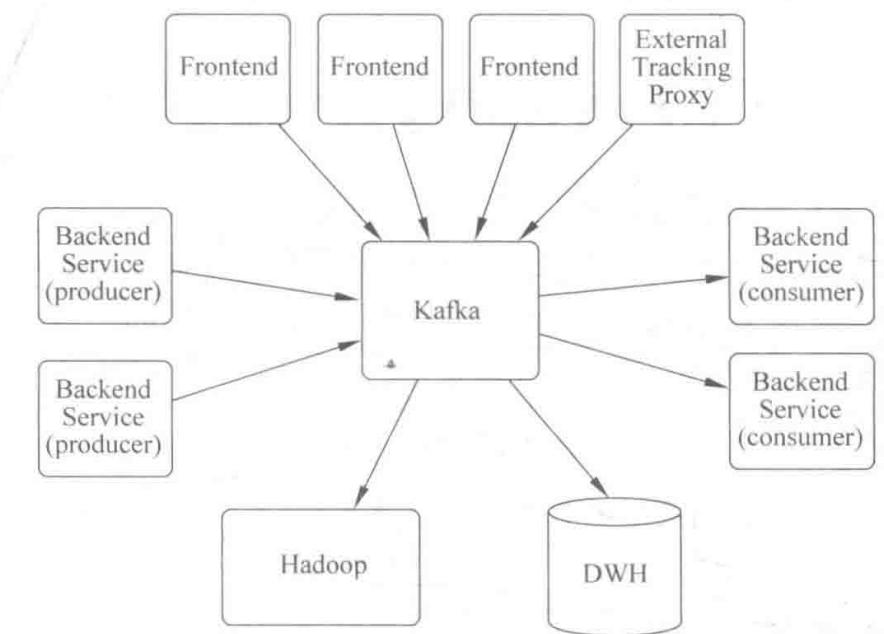
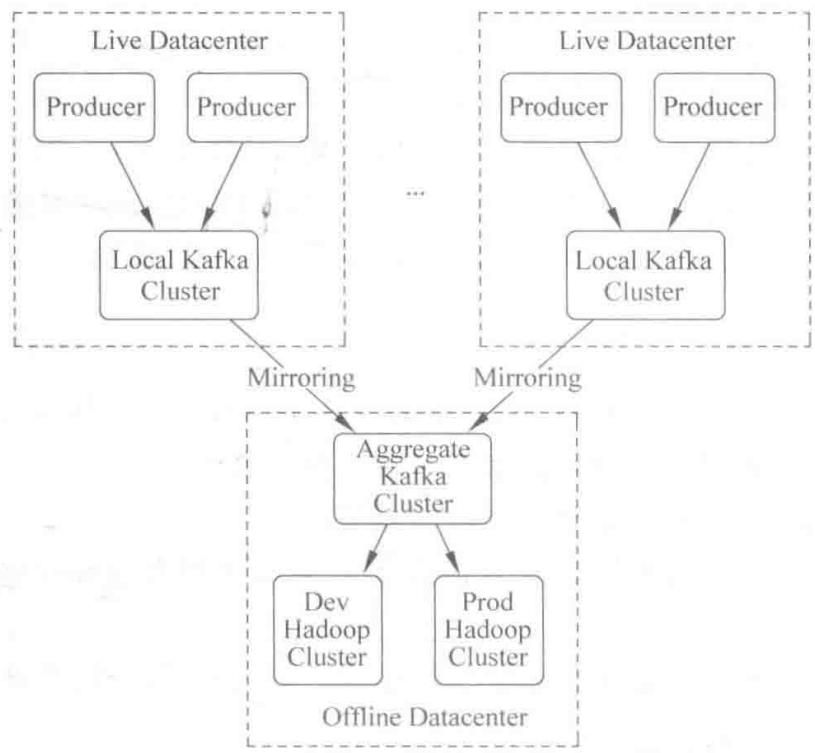
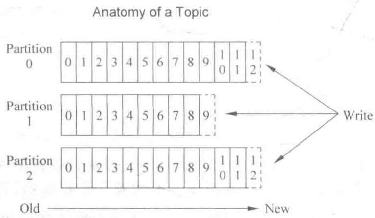
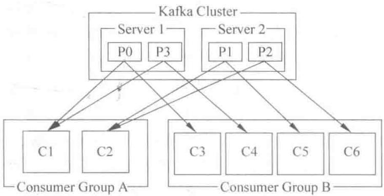

# 第2章 初识 Kafka

> 数据获取环节的主角——高吞吐的分布式消息系统

<!--
上一章我们把实时处理系统的链路画出来了，第一条就是数据获取。而从这一章开始，我们正式认识获取环节的主角——Kafka。很多同学可能听过 Kafka 的名字，但未必清楚它到底解决什么问题。它的定位很明确：一个高吞吐量、分布式、可持久化的消息系统。这一章我们不写代码，先把 Kafka 是拿来做什么的、它有哪些特性、它的 Topic 和分区怎么组织，给完整地讲清楚。理解这一层，下一章动手搭建环境、写程序才有地基。

[Sources]
- 吴斌，《大数据实时计算与应用》，清华大学出版社，第 2 章。
-->

---
class: compact
---

## 本章目录

1. **2.1 什么是 Kafka**：概述、使用场景、基本特性、性能、总结、在 LinkedIn 的应用
2. **2.2 Topics 和 logs**：Topic、分区、offset、持久化与分区作用
3. **2.3 分布式——consumers 和 producers**：副本、队列/订阅模式、顺序性

<!--
同学们请看本章路线。2.1 一上来先解决“Kafka 是什么、为什么它和传统消息系统不一样”这个大问题，我们会从它的出身、适用场景、核心特性讲到性能与设计决策；2.2 进入它最关键的抽象——Topic 和日志分区，了解消息到底是怎么存放、怎么被定位的；2.3 再往下沉，看生产者和消费者这套分布式模型。这三节层层递进，把 Kafka 的骨架搭起来。

[Sources]
- 吴斌，《大数据实时计算与应用》第 2 章，章节结构。
-->

---
layout: section
class: compact
---

## 2.1 什么是 Kafka

<ol class="outline">
  <li class="current">概述与两种定位</li>
  <li>使用场景</li>
  <li>基本特性</li>
  <li>性能与设计决策</li>
  <li>在 LinkedIn 的应用</li>
</ol>

<!--
我们从 2.1 的整体定位开始。Kafka 不是在真空中设计的，理解它，可以对比两类传统系统：企业集成用的 MQ，和面向海量公众服务的消息管道。看清楚这两种定位的差别，你就明白 Kafka 为什么被设计成现在这样。

[Sources]
- 吴斌，《大数据实时计算与应用》第 2.1 节。
-->

---
class: compact
---

## 先理解：生产者、消费者、消息

- **消息（message）**：就是一段要传递的数据，比如"用户 A 点了一个按钮""一条日志"
- **生产者（producer）**：负责**发出**消息的一方
- **消费者（consumer）**：负责**接收并处理**消息的一方
- 中间需要一个"**中转站**"来承接——否则生产者只能把消息直接塞给消费者，两者就绑死了

```
  生产者  ──消息──▶  中转站  ──消息──▶  消费者
  (producer)        (Kafka)          (consumer)
```

<!--
这一章的主角是 Kafka，但理解它之前，先认识三个最基本的概念：消息、生产者、消费者。消息就是要传递的那一段数据；生产者是"抛出"消息的人；消费者是"接住并处理"消息的人。关键是中间那个"中转站"——它让生产者和消费者不必直接认识。你可以回想上一章的"邮局"比喻：生产者是寄信人，消费者是收信人，Kafka 就是那个邮局。把这三个词记住，后面所有 Kafka 术语都不难。

[Sources]
- 吴斌，《大数据实时计算与应用》第 2.1 节，基础。
-->

---
class: compact
---

## 2.1.1 Kafka 概述

- 高吞吐的分布式消息系统
- 最初由 **LinkedIn** 开发，用作其活动流（activity stream）和运营数据处理管道（pipeline）的基础
- 目前被多家公司用作多种类型的数据管道（data pipeline）和消息系统
- 现在是 **Apache** 项目之一，由 Apache 托管

<!--
先记住一句话：Kafka 诞生于 LinkedIn，最初就是为了处理活动流这种大规模数据管道。它后来被捐赠给 Apache，成为无数公司的数据管道底座。它的自我定位是“高吞吐的分布式消息系统”，这里的“分布式”和“高吞吐”是关键，后面你在看它的每一项特性时，都可以对照着这两个词来理解。

[Sources]
- 吴斌，《大数据实时计算与应用》第 2.1.1 节。
-->

---
class: compact easy-table-sm
---

## 两种定位：企业集成 vs 大规模服务

| 维度 | 企业集成 MQ | 大规模服务（SaaS，如 Facebook/Google/LinkedIn） |
| --- | --- | --- |
| 业务特点 | 需求变化频繁、需高度灵活可定制 | 业务流程相对稳定、复杂度较低 |
| 数据规模 | 不大，几台或简单集群即可 | 极大，需几十上百台服务器 |
| 主要诉求 | 可定制性强，XML 配置/插件开发 | **强扩展性 + 高性能** |
| 设计取舍 | 不重视扩展性与性能 | 通过**降低复杂度**换性能与扩展性 |

<!--
同学们看这张对比表，这是理解 Kafka 的钥匙。企业集成类 MQ，面向的是财务、仓管这些系统，它们由不同厂家做、改不了，而且需求总在变，所以要能高度定制。但代价是它们普遍不重视扩展性和性能。而 Kafka 面向的是另一类——像 Facebook、Google 这种面向公众的超大规模服务，数据量不是几台服务器能扛住的，业务又相对稳定，所以它不需要那么强的可定制性，反而需要极致的扩展性和性能。Kafka 的选择就是：宁可降低复杂度，也要把吞吐和扩展性做上去。

[Sources]
- 吴斌，《大数据实时计算与应用》第 2.1.1 节。
-->

---
class: compact
---

## 2.1.2 使用场景

1. **消息处理**：替代传统消息系统；吞吐、分区、复制、负载均衡、容错更优
2. **网页动态跟踪**：构建用户活动跟踪系统的管道（发布订阅方式）
3. **运营数据监控**：作为监控系统运营的数据管道
4. **日志聚合**：将不同系统、平台的日志聚合到一处集中处理
5. **流处理**：对原始数据聚合、富化、转化、包装成新数据，再发布为消息供后续使用

<!--
知道了定位，再看它能干什么，这五个场景很实在。第一个是当消息系统用，替代传统 MQ；第二个是追踪用户行为，这是它最初的用途；第三个是监控运营数据；第四个是日志聚合，把散落在各地的日志收拢起来；第五个是流处理，把原始数据加工成新数据再发布出去。你会发现，第五个场景其实就衔接了下一章要讲的 Storm——Kafka 把流喂给处理引擎。所以它在整条链路里扮演的是“数据入口+中转”的角色。

[Sources]
- 吴斌，《大数据实时计算与应用》第 2.1.2 节。
-->

---
class: compact
---

## 2.1.3 基本特性（1）：可靠性

- **目标**：从 producer（数据生产者）到 consumer（数据使用者）可靠地传送和分发
- 传统 MQ：通过 broker 与 consumer 间的 **ack（确认）机制**实现，并在 broker 保存分发状态
- Kafka 做法：**由 consumer 自己保存状态**，不需要确认
  - consumer 负担更重，但更灵活——任何原因需重新处理时，可再次从 broker 获取
- 注：Kafka 也支持 ack 机制；producer 提供**异步发送**，将消息先放入内存即返回，后台批量发送（内存中停留时有丢失风险，需评估）

<!--
**[核心]** 可靠性这块，Kafka 和传统 MQ 的思路很不一样。传统做法靠 broker 和 consumer 之间互相确认，broker 保存消息分发的状态。而 Kafka 把状态交给了 consumer 自己，不要确认。这样做的好处是更灵活：consumer 想回退重放，随时可以再来，因为 broker 里数据还在。当然有得必有失，consumer 要自己负责记录读到哪了。这里有个小提醒：Kafka 的 producer 支持异步发送，消息先进内存就返回，后台再批量发出去，所以这段时间内存里的消息有可能丢——用的时候要评估清楚。

[Sources]
- 吴斌，《大数据实时计算与应用》第 2.1.3 节。
-->

---
class: compact
---

## 2.1.3 基本特性（2）：高可用、扩展性、负载均衡

- **高可用性**：把 Log 文件复制到其他 topic 的分隔点（可看作 Server）；某个 Server 失败时自动 **failover** 到复制的 Server，消息不丢失
- **扩展性**：用 **Zookeeper** 实现动态集群扩展，无需改客户端配置；broker 在 Zookeeper 注册并维护元数据，客户端注册 watcher 及时感知变化，自动负载均衡
- **负载均衡**：分 producer 和 consumer 两个层面
  - producer：连接池 + **partition** 决定发送到哪个 broker；分区机制由应用实现，要考虑顺序问题（仅同分区保证有序）
  - consumer：除当前 broker 情况外，还要考虑其他 consumer，才能决定从哪个 partition 读取

<!--
**[核心]** 这三条特性其实可以归到一个词：分布式。高可用靠的是把日志复制到别的节点，一台挂掉还能自动切到副本。扩展性靠的是 Zookeeper 来协调，加机器减机器，客户端都不用改配置，broker 会自动注册、客户端自动感知。而负载均衡最关键的是“分区”这个概念：producer 靠分区把消息分散到不同 broker；consumer 则要综合考虑后选择从哪个分区读取。注意一个前提——只有同一个分区内的消息才保证顺序。分区这个机制，我们马上在 2.2 详细展开。

[Sources]
- 吴斌，《大数据实时计算与应用》第 2.1.3 节。
-->

---
class: compact
---

## 2.1.4 性能

- 使用磁盘文件保存消息，采用类似 **WAL（Write Ahead Log）** 的机制做**顺序读写**，再定时批量写入磁盘
- 消息读取基本是**顺序**的，符合 MQ 顺序读取、追加写的特性
- 通过**批量消息传输**减少网络传输
- 使用 Java 的**发送文件 + 零复制（zero-copy）**机制，减少从读文件到发送过程中的内存复制与内核/用户态切换
- 性能测试显示基本达到 **I/O 的复杂度**

<!--
**[核心]** 性能是 Kafka 的重中之重，而它听起来反直觉——用磁盘，为什么还快？关键在于“顺序读写”。我们平时觉得磁盘慢，那是随机读写；而 Kafka 像写日志一样，把消息一个个追加到文件末尾，顺序读、顺序写，这正好绕开了随机读写的短板。再加上批量传输和零复制，把网络层和拷贝层的开销也省下来了。所以它的性能可以逼近 I/O 的极限。这一点是它区别于一般 MQ 的显著优势。

[Sources]
- 吴斌，《大数据实时计算与应用》第 2.1.4 节。
-->

---
class: compact
---

## 2.1.5 总结：Kafka 的几个设计决策

1. 把**持久化消息**作为通常的使用情况考虑
2. 系统设计的主要约束是**吞吐量**，而不是功能
3. 将“数据是否被使用”的状态信息作为 **consumer 的一部分**保存，而不是保存在服务器上
4. 是一种**显式的分布式系统**：producer、broker、consumer 分散于多台机器上

<!--
**[核心]** 这四个决策，基本概括了 Kafka 的“设计哲学”。第一条和第四条说，它默认消息要持久化、默认系统就是分布式的；第二条说，它把吞吐放在功能之上，宁可功能简单，也要快；第三条说，把消费状态交给 consumer，让它更灵活。把这四点连起来：一个以吞吐为先、显式分布式、默认持久化、把状态放到客户端的消息系统——这就是 Kafka。

[Sources]
- 吴斌，《大数据实时计算与应用》第 2.1.5 节。
-->

---
class: compact
---

## 2.1.6 Kafka 在 LinkedIn 中的应用

{fit="contain" position="center" max-height="44vh"}

- **读图**：众多**前端入口 + 后端服务**都把数据汇聚到中间的 **Kafka**
- Kafka 再同时喂给**在线服务**与**离线 Hadoop/数据仓库**——既是统一管道，也是缓冲区

<!--
**[看图]** 我们把理论落到一个真实的例子：LinkedIn。大家看这张拓扑图，几乎所有前端入口和业务后端都把数据汇聚到中间那个 Kafka 上，Kafka 再同时喂给右侧的在线服务和离线的 Hadoop、数据仓库。一个单独的 Kafka 集群，处理来自各种来源的活动数据，同时为在线和离线消费者提供一条统一的数据管道，本身也是一个缓冲区。

[Sources]
- 吴斌，《大数据实时计算与应用》第 2.1.6 节。
-->

---
class: compact
---

## 多数据中心拓扑

{fit="contain" position="center" max-height="44vh"}

- **读图**：上面两个 **Live Datacenter** 各有自己的 Kafka 集群，**互不直接通信**
- 下面 **Aggregate Kafka** 通过**镜像（mirroring）**扮演源集群 consumers，把多个机房数据聚到一处，再喂给离线 Hadoop

<!--
**[看图]** 那么问题来了：一家公司往往不止一个数据中心，Kafka 要不要跨机房？Kafka 的做法是让一个集群不横跨多个数据中心，而是通过**镜像（mirroring）**把数据同步过去。大家看这张图，上面的两个“Live Datacenter”各自有自己的 Kafka 集群，它们之间并不直接通信；下面那个“Aggregate Kafka”集群，通过镜像扮演源集群 consumers 的角色，把多个数据中心的数据集中到一个地方，再喂给离线 Hadoop。这样一个集群就能聚合多个机房的数据。

[Sources]
- 吴斌，《大数据实时计算与应用》第 2.1.6 节。
-->

---
class: compact
---

## 打个比方：Topic 就像"报刊的分类"

**分类（Topic）**：Kafka 里有成千上万条消息，怎么区分？给它们**分类**，一类就叫一个 **Topic**。

- 好比一家书店有"财经类""小说类""少儿类"——每种读物进不同的分类架
- 生产者把"用户点击"的消息放进"点击"Topic，把"订单"放进"订单"Topic

**分区（partition）**：一个 Topic 的数据太多，一本"小说"放不下、也看不过来，就**分成几册**（分区）。

- 想象一本特别厚的书被分成上、中、下三册，放在不同的架子上
- 谁要看某一册，就去那个架子——**不同的分册可以同时被不同的人读**（并行）

<!--
Topic 这个词很多同学记不住，但只要想成"报刊分类"就明白了。Kafka 里的消息千千万万，不可能混在一堆，所以按类别分成一个个 Topic——就像书店按财经、小说、少儿分类。而一个 Topic 内部的数据往往又多到"一册装不下"，于是又切成几个分区——就像一本厚书分成上中下三册。为什么要分册？因为这样不同的人可以同时读不同的册子，处理就快了。记住"分类是 Topic，分册是分区"，这一页你就抓住了 Kafka 数据组织的核心。

[Sources]
- 吴斌，《大数据实时计算与应用》第 2.2 节，基础。
-->

---
class: compact
---

## 2.2 Topics 和 logs：从抽象说起

{fit="contain" position="center" max-height="40vh"}

- **Topic**＝不同消息的类别 / 信息流，producer 把不同分类发到不同 Topic
- **读图**：一个 Topic 被切成多个 **Partition**，分区内消息**有序且只追加**、各有唯一 **offset**；箭头 **Old→New** 表示只往尾部写
- 分区是**扩容**与**并行消费**的基础

<!--
**[切入]** 现在进入 2.2，讲 Kafka 最核心的高层抽象——Topic。Topic 你可以理解成“消息的分类标签”。比如“用户点击”是一类，“订单”是另一类，生产者的消息按类别发进不同 Topic。但真正重要的是每个 Topic 背后的组织方式：它不是一个独立的文件，而是一条被分区的日志。我们看这张图。

[Sources]
- 吴斌，《大数据实时计算与应用》第 2.2 节。
-->

---
class: compact
---

## 分区（partition）与 offset

- 每个 partition 中的消息序列**有序且不可更改**，分区只能**在尾部追加**消息
- 同一分区中的每条消息都有一个唯一的数字标识——**offset**
- 每条消息由若干字节构成

<!--
**[看图]** 看这张 “Anatomy of a Topic”，一个 Topic 被横向切成了几个 Partition，从 0 到 2。注意两个关键点：第一，每个分区内部的消息是有序的、只追加不修改；第二，每条消息都有一个唯一的 offset，就像给书架上的书编号。offset 的作用，就是让你能精确定位到分区里的某一条消息。分区是 Kafka 做并发和负载均衡的基石，这一点务必记住。

[Sources]
- 吴斌，《大数据实时计算与应用》第 2.2 节。
-->

---
class: compact
---

## 持久化与 offset 的控制权

- Kafka 集群保存**所有已发布消息**，无论是否被消费；保存时间**可配置**
  - 例：保存时间设为两天，则两天内可消费；之后被抛弃以释放空间
- 每个消费者需要保存的元数据只有**一个 offset**（记录当前 consume 的位置）
- **offset 完全由 consumer 控制**：可线性递增，也可重新设回旧值重新消费
- 因此 **consumer 可以很廉价地来去**：不影响集群和其他 consumer，可用命令行工具追踪任何 Topic 内容

<!--
**[核心]** 这里有两个很值得讲透的点。第一，Kafka 默认长期保存消息，保留多久由配置决定——这意味着消费者哪怕“迟到”了，也能回过头来消费，这就是为什么它能高效持久地存大量数据。第二，也是更关键的：offset 不是被系统锁死的，而是完全握在 consumer 手里。consumer 想从头看、想看中间、想倒退重放，都可以。正因为这样，consumer 才能像“来来去去”的自由人——它不影响别人，也可以随时用命令行工具观察别的 Topic。

[Sources]
- 吴斌，《大数据实时计算与应用》第 2.2 节。
-->

---
class: compact
---

## 分区存在的原因

1. **突破单机规模**：多个分区共存使日志规模可超过单个 Server 尺寸
   - 同一 Topic 的同一 partition 只能存在一台 Server 上
   - 同一 Topic 可包含很多 partition，理论上可无限扩数据
2. **作为数据并行处理的单位**：以 partition 为单位（而非 bit）
   - 可由多个 consumer 使用不同 partition，或多个 consumer 用同一 partition（因 offset 由 consumer 控制）

<!--
**[核心]** 那为什么要分区？两个原因。一是为了做大：一个 Topic 的数据量可能远超一台机器，分区可以铺到多台服务器上，理论上加机器就能加分区、就能存更多。二是为了并行：分区是并行处理的基本单位，多个 consumer 可以各吃一个分区，就算抢同一个分区，也因为有 offset 机制而能各管各的。可以说，分区既是扩容的手段，也是并行的载体。

[Sources]
- 吴斌，《大数据实时计算与应用》第 2.2 节。
-->

---
layout: section
class: compact
---

## 2.3 分布式——consumers 和 producers

<ol class="outline">
  <li class="current">副本与 leader/follower</li>
  <li>发布模式：队列 vs 发布订阅</li>
  <li>并发下的有序性</li>
</ol>

<!--
最后一个板块，我们把视角拉到分布式层面，看 Kafka 的生产者和消费者是怎么协同的。这里面有几个很具体的机制：副本、leader/follower、两种发布模式，以及最让人头疼的并发与顺序问题。

[Sources]
- 吴斌，《大数据实时计算与应用》第 2.3 节。
-->

---
class: compact
---

## 副本与 leader / follower

- 每个分区在若干服务上都有**副本**，副本数量可配置
- 每个分区由**一个 leader**（处理读写）和**零或多个 followers**（复制 leader）组成
- leader 离线时，一个 followers 自动成为 leader
- 每个服务同时扮演两种角色：作为部分分区的 leader，同时作为其他分区的 followers → **较好的负载均衡**
- 副本使 Kafka 具备**容错能力**

<!--
**[核心]** 这一页讲的是 Kafka 怎么用“副本”换来容错。每个分区都有若干个副本，分布在不同的服务器上，其中一个是 leader，负责真正的读写；其余是 follower，默默地把 leader 的数据复制过来。如果 leader 宕机，某个 follower 就自动顶上。这里有个设计很精妙：一台服务器不是只当 leader 或只当 follower，而是“这个区间的 leader，另一个区间的 follower”，这样负载就被摊平了。副本的意义，就在于机器挂了，数据还在、服务还能继续。

[Sources]
- 吴斌，《大数据实时计算与应用》第 2.3 节。
-->

---
class: compact
---

## 发布模式：队列 vs 发布—订阅

- **队列模式（queuing）**：多个 consumers 同时从服务端读消息，每条消息只被其中一个 consumer 读到 → 负载均衡
- **发布—订阅模式（publish-subscribe）**：消息被广播到所有 consumer
- **consumer 组**：consumers 加入同一组，共同竞争一个 Topic，消息分发给组内的一个成员
  - 所有 consumer 在同一组 → 传统队列模式（负载均衡）
  - 所有 consumer 在不同组 → 发布—订阅模式（全部广播）
  - 更常见：每个 Topic 有若干 consumer 组，每个组是逻辑上的“订阅者”，组内由若干 consumer 组成以增强容错与稳定

<!--
**[核心]** 这里解释了一个很关键的概念——consumer 组。它其实把队列和发布订阅统一起来了。如果所有消费者在一个组里，那就是“队列”：消息大家抢着吃，一条只给一个人，起到负载均衡作用。如果消费者分别在不同组里，那就是“发布订阅”：每个组都能收到全量消息。而最常见的形态是：一个 Topic 对应多个组，每个组是一个逻辑订阅者，组内再放多个消费者来容错。这一下就把两种模式打通了。

[Sources]
- 吴斌，《大数据实时计算与应用》第 2.3 节。
-->

---
class: compact
---

## 一个具体的集群例子

{fit="contain" position="center" max-height="44vh"}

- **读图**：两台机器、4 个分区（P0–P3）；Server1 管 P0/P3，Server2 管 P1/P2
- Consumer 组 A（2 个）、组 B（4 个）；**每个分区只分给所属组里的一个消费者** → 分区内可**有序**消费

<!--
**[看图]** 我们来读一张具体的图：两台机器组成的集群，有 4 个分区 P0 到 P3，两个 consumer 组——A 组有 2 个消费者，B 组有 4 个。看箭头，P0 和 P3 落在 Server1 上，P1、P2 落在 Server2 上；而每个分区，从消费角度看，只把这个分区分配给它所属组里的某一个消费者。这样就保证了：同一个分区不会被同组多个消费者抢着读，也就能有序地消费。

[Sources]
- 吴斌，《大数据实时计算与应用》第 2.3 节。
-->

---
class: compact
---

## 并发与有序的矛盾

- 传统队列：服务器按序保存消息，但按序发布、**异步分发**，消息到达时可能已乱序
- 为避免故障，常采用“**专用 consumer**”——只允许一个消费者消费 → 牺牲并发性
- **Kafka 的做法**：利用分区，在多个 consumer 组并发下提供较好的有序性与负载均衡
  - 每个分区只分发给一个 consumer 组 → 该组内只有一个 consumer 消费它，从而**顺序消费**
  - 多个分区仍可在组间负载均衡
  - **关键约束：consumer 组数量不能多于分区数**

<!--
**[核心]** 这是本章最容易让人困惑的点，我把它讲透彻。传统 MQ 想保序，就只能让一个消费者独占，结果就是没并发；想并发，消息就被打乱。Kafka 用分区破解了这个死结：把每个分区固定分配给某个消费者，让一个分区永远只被组里一个消费者读，于是这个分区内部就是有序的；而多个分区之间又可以并行。代价就是一个组的消费者数量不能超过分区数。也就是说：**顺序由分区保证，并行靠分区实现**——这是 Kafka 优于传统 MQ 的关键。

[Sources]
- 吴斌，《大数据实时计算与应用》第 2.3 节。
-->

---
class: compact
---

## 顺序性的边界

- Kafka **只保证一个分区之内**消息的有序性，不同分区之间**无法保证**
- 这已满足大部分应用需求
- 若要求 Topic 内所有消息有序，只能让该 Topic **只有一个分区**（也就只有一个 consumer 消费它）

<!--
**[过渡]** 最后我们得把顺序性这句话说严谨：Kafka 的有序，是“分区内有序”，不是“整个 Topic 有序”。大多数场景，我们把消息按某种 key 打进同一分区，就能让相关消息保序。但如果你要求整个 Topic 全局有序，唯一的办法就是只开一个分区——代价是吞吐和并发都降下来了。这个取舍，需要你在真实业务里去权衡。到这里，第二章就把 Kafka 的数据模型讲完了，下一章我们动手把环境搭起来。

[Sources]
- 吴斌，《大数据实时计算与应用》第 2.3 节。
-->

---
class: compact
---

## 想一想（自检）

**问题 1**：一家外卖平台，想让"同一个用户的下单消息永远按时间顺序处理"，它应该怎么设计 Topic 的分区？

> 提示：想一想"分区内有序"和"按 key 分区"这两点。

**问题 2**：如果这个平台有 4 个分区，却配了 6 个消费者在同一个组里，会发生什么？为什么？

> 提示：回忆"consumer 组数不能超过分区数"。

<!--
这两个问题考的是你有没有真正理解"分区"和"consumer 组"。第一题：要让同一个用户的消息有序，就得让"同一个用户"永远进**同一个分区**——也就是按用户 id（key）来分区（partitionBy）。第二题：4 个分区却配 6 个消费者，那多出来的 2 个消费者会**空闲**，因为每个分区同一时间只分配给组内的一个消费者，消费者数超出了分区数就没活可干，白白浪费。能想明白这两点，你对 Kafka 的核心模型就真的懂了，而不仅仅是背了概念。

[Sources]
- 吴斌，《大数据实时计算与应用》第 2 章，自检。
-->

---
class: compact
---

## 本章小结

1. Kafka 是**高吞吐、分布式、可持久化**的消息系统，以吞吐为先、显式分布式、状态归 consumer
2. **Topic** 是消息分类，内部靠**分区 + offset** 组织；分区既扩容又并行
3. **副本 + leader/follower** 提供容错；**consumer 组**统一了队列与发布订阅两种模式
4. **分区内有序、分区间无序**；consumer 组数不能超过分区数

<!--
**[过渡]** 我们把第二章的骨架收一下：Kafka 通过 Topic 给消息分类，靠分区让数据既能横向铺开、又能并行消费；副本和 leader/follower 保证了机器挂掉也不丢数据；consumer 组的概念则把“队列”和“发布订阅”统一了起来。你记住一个核心结论就够了——**顺序由分区保证，并行靠分区实现，消费者组不能超过分区数**。有了这个认知，我们就可以进入下一章，真正把 Kafka 跑起来。

[Sources]
- 吴斌，《大数据实时计算与应用》第 2 章，本章小结。
-->
