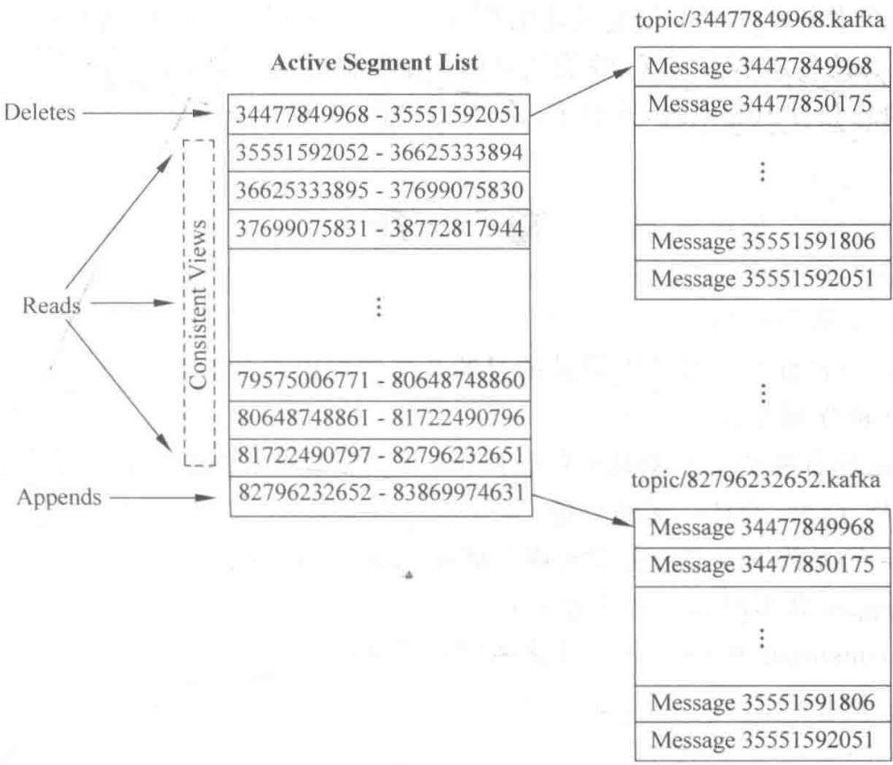

# 第4章 Kafka 消息传送

> 消息如何在 producer、broker、consumer 之间可靠、高效地流动

<!--
上一章我们亲手把 Kafka 跑通了，但“能用”不等于“用得好”。这一章我们要钻进 Kafka 的传送机制：消息在生产者、broker、消费者之间到底怎么流转才既可靠又高效？这里有很多教科书里讲得含糊、但实际工程里必须想清楚的问题——比如一条消息会不会丢、会不会重复？为什么 Kafka 用磁盘却飞快？副本之间怎么保持同步、master 挂了谁顶上？这一章内容比较硬核，但我们一个一个拆开讲，你听完会对 Kafka 的理解上升一个层次。

[Sources]
- 吴斌，《大数据实时计算与应用》，清华大学出版社，第 4 章。
-->

---
class: compact
---

## 本章目录

1. **4.1 消息传输的事务定义**：最多一次、最少一次、精确一次
2. **4.2 性能优化**：消息集、零复制、端到端压缩
3. **4.3 生产者和消费者**：发送方式、pull/push、状态跟踪
4. **4.4 主从同步**：副本、ISR、Leader 选举
5. **4.5 客户端 API**：producer API 与 consumer API
6. **4.6 消息和日志**：消息格式、日志分段、读写与校验

<!--
同学们请看，这一章信息量很大，六节层层递进。4.1 先定基调——消息传输的“一致性”到底是哪一档；4.2 讲 Kafka 靠什么做到高性能；4.3 回到生产者与消费者的具体行为；4.4 是分布式系统最考验功力的副本同步与故障处理；4.5 给出实际可用的 API；4.6 落到最底层——消息和日志文件到底长什么样。我们按这条线走。

[Sources]
- 吴斌，《大数据实时计算与应用》第 4 章，章节结构。
-->

---
class: compact
---

## 先理解：消息"会不会丢、会不会重"

这一章解决一个很实际的问题：一条消息从生产者出发，能不能**安全、不多不少**地到消费者手里？要说清它，先把三种"生死状态"分清楚：

| 级别 | 含义 | 通俗理解 |
| --- | --- | --- |
| **最多一次** | 最多送一次，但可能**一次都没送到** | 可能漏件 |
| **最少一次** | 一定送到，但可能**送多次** | 可能重复 |
| **精确一次** | 不丢也不重，正好一次 | 最理想，最难 |

**为什么"精确一次"这么难？** 因为中间任何一步出错（网络断、机器挂、处理一半），系统都很难判断"这条到底算不算处理过了"。

<!--
在开始前，我们先把它想成一个"快递"问题。你寄一个包裹，最怕两种结果：丢了，或寄了两份。系统里对应的就是"丢消息"和"重复消息"。上表给了三种级别：最多一次（可能漏）、最少一次（可能重复）、精确一次（不丢不重）。你直觉会选"精确一次"，但它真的很难——因为快递在中途可能翻车，你很难搞清楚"这个包裹到底送没送到"。这一章就是在讲 Kafka 用什么机制尽量做到不丢、以及怎么在"不丢"和"不重"之间做取舍。

[Sources]
- 吴斌，《大数据实时计算与应用》第 4 章，基础。
-->

---
layout: section
class: compact
---

## 4.1 消息传输的事务定义

<ol class="outline">
  <li class="current">三种一致性级别</li>
  <li>committed 与 producer 崩溃</li>
  <li>consumer 崩溃与精确一次</li>
</ol>

<!--
我们从最核心的问题切入：消息从 producer 到 consumer，到底能做到怎样的“不丢不重”？这其实是一个明确的级别问题，先把它定义清楚，后面的一切才有讨论的依据。

[Sources]
- 吴斌，《大数据实时计算与应用》第 4.1 节。
-->

---
class: compact
---

## 数据传输的三种级别

- **最多一次（At most once）**：消息不会被重复发送，最多被传输一次，但**有可能一次都不传输**
- **最少一次（At least once）**：消息不会被漏发送，最少被传输一次，但**有可能被重复传输**
- **精确一次（Exactly once）**：不丢也不重，每条消息被传输且仅传输一次——这是大家期望的目标

<!--
先把这三个定义咬准。“最多一次”听起来安全，但它允许消息“因为出错而压根没到”；“最少一次”保证消息一定到，但可能多到几次；“精确一次”才是最理想的状态。核心难点在于：分布式环境下，你很难同时避免“丢”和“重”。记住这一点，后面所有的机制设计，都是在三者之间做权衡。

[Sources]
- 吴斌，《大数据实时计算与应用》第 4.1 节。
-->

---
class: compact
---

## committed：Kafka 保数据的底线

- 大多数消息系统声称支持“精确一次”，但文档里常隐去了失败场景
- Kafka 引入 **committed** 概念：消息一旦被提交，只要写入分区的副本 broker 是**活动的**，数据就不会丢失
- 局限：producer 发布时发生网络错误，无法确定发生在提交之前还是之后——当前版本还没完全解决，未来版本在改进
- 不是所有场景都要“精确一次”，Kafka 允许 producer **灵活指定级别**：
  - 必须等待消息被提交的通知
  - 完全异步发送、不等待任何通知
  - 只等待 leader 声明拿到消息（followers 不必）

<!--
**[核心]** Kafka 如何在不丢和不重之间给出承诺？它的答案是——只要消息被 committed 了，且写它的那个分区所在的副本 broker 还活着，数据就丢不了。这就把“不丢”建立在了副本活性之上。同时它也很诚实：producer 在网络错误时无法判断提交发生在错误前还是后，这个问题仍未完美解决。所以 Kafka 不强迫所有人用最高级别，而是让 producer 自己选：等提交确认、完全异步、或只等 leader 确认，三种粒度按需取。

---
### 🎙️ 演讲者详细补充：从发明者视角看 Committed 机制与网络不确定性

#### 1. 发明者视角的 Committed 哲学：
- **定义**：一条消息当且仅当被该分区动态集合 **ISR（In-Sync Replicas）中的所有存活副本** 全部追加进本地日志时，才被判定为 Committed。
- **高水位游标（HW，High Watermark）**：Kafka 不需要为每条消息打状态标记，Committed 状态在物理上对应一个单调递增的 64 位整数指针 HW。凡 Offset < HW 的消息均已提交。
- **读隔离性**：Consumer 永远只能读取到 Offset < HW 的 Committed 消息，绝不会读到仅写入 Leader 但未同步的脏数据，从而杜绝了 Leader 切换时的幻读或数据倒流。

#### 2. “网络错误无法判断提交发生在错误前还是后”到底是什么意思？
网络通信是双向往返，Producer 抛出网络超时报错时，存在两种完全相反的底层现实（两军问题）：
- **情况 A（发生在提交前）**：Producer 发送的数据包在半路丢包，Broker 从未见过这条消息，**消息未提交**。如果 Producer 不重试，数据就永久丢失了。
- **情况 B（发生在提交后）**：消息已顺利到达 Broker、落盘并同步进 ISR（已 Committed），但 Broker 返回给 Producer 的 ACK 确认包在半路丢了。如果 Producer 以为失败并触发重试，就会写入两条一模一样的消息，**导致数据重复**。
- **后期解决方案**：Kafka 在 0.11+ 引入了幂等性（Idempotence），给每个 Producer 分配全局唯一 PID，并为发送批次附带单调递增 Sequence Number。即使情况 B 发生重试，Broker 识别到相同的 PID + Sequence 也会自动去重并补发 ACK，彻底消除了该不确定性。

[Sources]
- 吴斌，《大数据实时计算与应用》第 4.1 节。
-->

---
class: compact
---

## consumer 崩溃与两种选择

所有副本有相同日志和 offset，由 consumer 自己维护消费到的 offset；若 consumer 崩溃，新 consumer 需从合适 offset 继续。两种顺序：

- **先记录 offset，再处理消息**：可能在存 offset 后、处理前崩溃 → 旧 offset 起继续 → **部分消息永远不会被处理**（最多一次）
- **先处理消息，最后记录 offset**：可能在记录 offset 前崩溃 → 新 consumer **重复消费**部分消息（最少一次）

<!--
**[核心]** 现在站到 consumer 这边。它要自己记“读到哪了”，可一旦崩溃，新来的 consumer 该从哪接？这就产生了一个顺序抉择。如果你先记 offset 再处理，那么在“记完但还没处理”时崩溃，就会导致那几条消息被跳过——这是“最多一次”的代价；如果你先处理、后记 offset，处理完但还没记账就崩溃，下个 consumer 就会把已处理过的消息重做一遍——这是“最少一次”的代价。没有完美的单步方案。

[Sources]
- 吴斌，《大数据实时计算与应用》第 4.1 节。
-->

---
class: compact
---

## 如何做到“精确一次”

- **两阶段提交**：保存 offset 后提交一次，消息处理成功后再提交一次
- **更简单做法**：把消息 offset 和处理后的结果保存在一起
  - 例：Hadoop ETL 处理消息时，将处理结果与 offset 同时写入 HDFS → **消息和 offset 同时被处理**，天然一致

<!--
**[核心]** 那“精确一次”怎么实现？书上给了两条思路。一条是两阶段提交，分两次把 offset 提交，第一次在保存后、第二次在处理成功后。但更聪明的做法是：把 offset 和“处理结果”打包在一起写。什么叫打包？比如你用 Hadoop ETL 处理消息，处理完的结果和这条消息的 offset 一起落到 HDFS 里。这样一来，offset 和它对应的处理结果要么同时在、要么同时不在，就不会出现“算了但没记账”或“记了账却没算”的错位，一致性自然就保证了。

---
### 🎙️ 演讲者详细补充：Kafka 2PC（两阶段提交）底层运转机制与架构时序

#### 1. 为什么流处理跨节点需要 2PC？
在“读取输入 Topic ➔ 实时计算 ➔ 写入输出 Topic ➔ 提交消费 Offset”链路中，写输出消息与提交 offset 属于跨分区操作。若无事务协调，中间崩溃必将导致“重复写入”或“消息丢失”。Kafka 借助 **Transaction Coordinator（事务协调者，运行在 Broker 内部）** 和 **`__transaction_state` 内部主题** 落地了 2PC。

#### 2. 2PC 在 Kafka 中的时序图与生命周期：
```text
Producer (客户端)            Transaction Coordinator           __transaction_state      Target Topic (目标数据分区)
       │                                │                              │                       │
       │── 1. 开启事务 (BeginTx) ──────> │                              │                       │
       │── 2. 发送计算数据与消费Offset ───────────────────────────────────────────────────────> │ (写入本地日志,
       │                                │                              │                       │  标记为未决消息)
       │── 3. commitTransaction() ────> │                              │                       │
       │    【阶段一：Prepare 阶段】     │── 4. 写入 PREPARE_COMMIT ───>│                       │
       │                                │      (决议持久化落盘)         │                       │
       │                                │                                                      │
       │    【阶段二：Commit 阶段】      │── 5. 发送 Commit Marker 控制标记 ────────────────────> │ (写入 Commit Marker,
       │                                │                                                      │  LSO推进, 数据对下游可见)
       │                                │── 6. 写入 COMPLETE_COMMIT ──>│                       │
       │<── 7. 返回提交成功 ─────────────│                                                      │
```

#### 3. 关键执行细节解析：
- **阶段一（Prepare 阶段）**：
  - 数据消息在执行期间就已经写入了目标 Broker 的物理磁盘，但被标记为“事务未决”。配置为 `read_committed` 的下游消费者因 **LSO（Last Stable Offset）** 水位限制，无法读取这批消息。
  - Producer 发起 commit 后，Coordinator 在 `__transaction_state` 写入 `PREPARE_COMMIT`。**一旦此记录落盘，整个事务在逻辑上就判定为必定成功**（即使 Coordinator 瞬间崩溃重启，也会继续走完流程）。
- **阶段二（Commit 阶段）**：
  - Coordinator 向所有目标数据分区发送 **Commit Marker（提交控制标记）**。
  - 分区 Broker 写入 Marker，向前推进 LSO 水位，数据瞬间对下游 `read_committed` 消费者全量可见。
  - 最终 Coordinator 将事务状态标记为 `COMPLETE_COMMIT`，事务闭环。
- **异常回滚**：若 Prepare 前超时或失败，Coordinator 会向各分区广播 **Abort Marker**，下游消费者读到后在内存中直接丢弃未决数据。
- **架构升华**：Kafka 2PC 没有传统关系型数据库的长事务死锁问题，它利用**只追加写入（Append-only Log）**与控制标记位点（Marker），以极高的吞吐量换取了分布式端到端的精确一次保证。

[Sources]
- 吴斌，《大数据实时计算与应用》第 4.1 节。
-->

---
layout: section
class: compact
---

## 4.2 性能优化

<ol class="outline">
  <li class="current">消息集（message set）</li>
  <li>零复制（zero-copy）</li>
  <li>端到端压缩</li>
</ol>

<!--
接下来看 Kafka 的另一张王牌——性能。之前说过它用磁盘还很快，秘诀就在这一节。我们介绍三个优化：消息集、零复制、端到端压缩。它们分别对治了 I/O 碎片、字节复制和网络带宽这三类瓶颈。

[Sources]
- 吴斌，《大数据实时计算与应用》第 4.2 节。
-->

---
class: compact
---

## 性能瓶颈：琐碎 I/O 与字节复制

- 主要使用场景是处理网站活动日志，吞吐量极大，每个页面产生多次写
- 读方面：假设每条消息只被消费一次，读的量也很大，尽量使读更轻量
- 线性读写下影响性能的因素主要有两个：
  1. **太多琐碎的 I/O 操作**
  2. **太多的字节复制**
- 这两类问题可能发生在客户端与服务端之间，也可能发生在服务端内部的持久化过程

<!--
**[核心]** 先明确要解决的敌人。Kafka 面对的是海量日志，读写频率极高。在“线性读写”的前提下，拖慢它的其实不是磁盘本身的吞吐，而是两类开销：一是琐碎 I/O——比如一条消息一次写，次数太多；二是字节复制——数据在内存和内核之间反复 copy。这两个问题可能出现在客户端和服务端之间，也可能出现在服务端持久化的内部。接下来三个优化，就是分别针对它们的。

[Sources]
- 吴斌，《大数据实时计算与应用》第 4.2 节。
-->

---
class: compact
---

## 消息集（message set）

- 将消息组织到一起，作为**处理的单位**
- producer 把消息集**一块**发送给服务端，而非一条条发
- 服务端把消息集**一次性**追加到日志文件 → 减少琐碎 I/O
- consumer 也可以一次请求一个消息集
- 使用**标准二进制消息格式**，可在 producer、broker、consumer 之间共享而无需改动 → 减少字节复制

<!--
**[核心]** 第一个优化是“消息集”。灵感很朴素：不要一次处理一条消息，而是一次处理一批。producer 把一堆消息打包成一个消息集发出去，broker 收到后整个追加进日志，consumer 也可以一次性拉一个消息集。这样 I/O 操作的次数就从“消息数”降到“消息组数”，琐碎的 I/O 就没了。同时，消息集用统一的二进制格式表示，大家在 producer、broker、consumer 之间传的是同一种结构，就不需要来回转换、复制字节了。

[Sources]
- 吴斌，《大数据实时计算与应用》第 4.2 节。
-->

---
class: compact
---

## 零复制（zero-copy）

传统的文件→Socket 数据流向有 4 次复制、2 次系统调用：

1. 数据从文件复制到**内核页缓存**
2. 应用程序从页缓存复制到**内存缓存**
3. 应用程序把数据写入**内核 Socket 缓存**
4. 操作系统从 Socket 缓存复制到**网卡缓存**发送到网络

**sendfile()** 直接把数据从页缓存发到网卡缓存，避免重复复制。

<!--
**[核心]** 第二个优化是零复制，这一页重点看“低效在哪”。把文件发给 socket，传统路径竟然要走四步拷贝：磁盘→内核页缓存，再→用户内存，再→内核 socket 缓存，再→网卡。每一步都是内存拷贝，还要来回切换内核/用户态。而 Linux 的 sendfile() 函数可以直接把数据从页缓存绕到网卡缓存，跳过中间那些拷贝。对 Kafka 这种高频消息服务来说，省下的就是巨大的 CPU 和内存开销。

[Sources]
- 吴斌，《大数据实时计算与应用》第 4.2 节。
-->

---
class: compact
---

## 零复制在多消费者场景的优势

- 数据仅被复制到**页缓存一次**，而不是每次消费都重复复制
- 消息以近乎**网络带宽**的速率发送出去
- 磁盘层面几乎看不出读操作——数据都直接从页缓存发到网络

<!--
**[核心]** 零复制还有一个特别珍贵的额外好处：一对多场景。如果一条消息要被很多消费者读，传统做法是每个消费者都从磁盘读一遍，磁盘就被反复读了。但 Kafka 把数据先放进页缓存，多个消费者都从同一份页缓存里取，只需在页缓存里放一次。结果就是，你甚至感觉不到磁盘在“读”，所有读都从内存缓存直达网络，吞吐自然拔高。

[Sources]
- 吴斌，《大数据实时计算与应用》第 4.2 节。
-->

---
class: compact
---

## 端到端压缩

- 有时候瓶颈不是 CPU 或硬盘，而是**网络带宽**（数据中心间传数据尤甚）
- 各自压缩消息 → 压缩率低；把大量文件**压缩在一起**才能达到最好效果
- Kafka 采用**端到端压缩**：借助消息集，客户端消息一起压缩后发送，以压缩格式写日志、再以压缩格式发给 consumer
- **从 producer 发出到 consumer 收到全程都是压缩的**，只有在 consumer 使用时才解压

<!--
**[核心]** 第三个优化针对网络带宽。大家可能以为瓶颈总在 CPU 或磁盘，但跨机房传输时，卡住你的往往是带宽。单条消息单独压缩，压缩率很不起眼；把一大批消息合起来压，才有好的压缩比。Kafka 的做法是端到端压缩：因为正好有“消息集”，就整批压缩，压缩了发出去、压缩着写日志、压缩着传给消费者，直到消费者真正要用才解压。于是中间所有传输的都是压缩后的数据，带宽被大幅省下来。

[Sources]
- 吴斌，《大数据实时计算与应用》第 4.2 节。
-->

---
layout: section
class: compact
---

## 4.3 生产者和消费者

<ol class="outline">
  <li class="current">producer 的消息发送</li>
  <li>consumer：pull 还是 push</li>
  <li>消费状态跟踪</li>
</ol>

<!--
这一节我们把焦点放回到两个主角：producer 和 consumer。看它们各自怎么工作，其中有一个贯穿全书的设计决策——Kafka 到底用 pull 还是 push，这一节会给出明确答案。

[Sources]
- 吴斌，《大数据实时计算与应用》第 4.3 节。
-->

---
class: compact
---

## producer 的消息发送

- producer **直接把数据发送到该 Topic 目标分区的 Leader**，无需在多个节点间分发
- 所有 Kafka 节点会及时告知：哪些节点是活动的、目标分区的 leader 在哪 → producer 直达目的地
- **分区控制**：可用负载均衡随机选择，或用分区函数（partition function）
  - 指定分区 key，将消息 hash 到不同分区（也可覆盖自定义实现）
  - 例：key 用 user id，则同一用户的消息发到同一分区，consumer 可有目的地消费

<!--
**[核心]** 生产者发送消息有个关键点——它不经过任何中间人，而是直接找到目标分区的 leader。为什么能直达？因为每个节点都会告诉它“谁活着、谁是 leader”。这样消息就一步到位。怎么决定发到哪个分区？要么随机负载均衡，要么用分区函数。最常见的是用某个 key 做 hash，比如用用户 id，这样同一个用户的所有消息都会进同一个分区，消费时也能目标明确。这个“按 key 分区”的技巧，是后续保证相关消息有序的常用手段。

[Sources]
- 吴斌，《大数据实时计算与应用》第 4.3 节。
-->

---
class: compact
---

## 批量发送

- 异步发送模式允许**批量发送**：先缓存消息，再一次请求批量发送
- 可配置触发策略：缓存达到某数量就发（如 100 条），或缓存固定时间就发（如每 5s）
- 大大减少服务端的 I/O 次数
- **代价**：缓存发生在 producer 端，producer 崩溃时这批消息丢失
- 0.8.1 异步模式尚不支持发送失败回调；后续版本可能增加

<!--
**[核心]** 生产者还有一手“批量发送”。它先把消息攒在内存里，攒够了一定数量或一定时间，再一次性发出去。这样一次请求带一批消息，服务端的 I/O 次数就断崖式下降。但天下没有免费的午餐：既然缓存放在 producer 端，一旦 producer 在这期间崩溃，这批没发出去的消息就丢了。而且早期版本异步模式不支持发送失败的回调，就没法在出错时补救。所以批量与可靠性之间也要权衡。

[Sources]
- 吴斌，《大数据实时计算与应用》第 4.3 节。
-->

---
class: compact
---

## consumer：pull 还是 push？

- producer **推送**消息到 broker，consumer 从 broker **拉取**消息——这是传统设计
- push 模式（如 Scribe、Flume）：由 broker 决定推送速率，难以兼顾不同消费速率的 consumer；broker 推得太快，consumer 可能崩溃
- 最终 Kafka 选择 **pull 模式**：
  - consumer 可自主决定批量拉取的数量和节奏
  - 缺点：没有消息时 consumer 会不断轮询；用参数让 consumer 阻塞直到新消息到达即可

<!--
**[核心]** 这是 Kafka 一个著名的设计抉择。很多系统用 push，即 broker 把消息硬推到消费者，但问题是 broker 并不知道消费者吃得多快，推快了会把它压垮。Kafka 选了 pull——消费者自己来拉，拉多少、什么时候拉，由它根据自己能力决定，这就舒服多了。当然 pull 也有毛病：没消息时消费者会空转轮询。Kafka 的解法是提供一个参数，让消费者在没有新消息时阻塞等待，而不是空转。这样一个看似简单的“拉”字，背后是对背压和速率匹配的深思熟虑。

[Sources]
- 吴斌，《大数据实时计算与应用》第 4.3 节。
-->

---
class: compact
---

## 消费状态跟踪：broker 标记 vs Kafka 的 offset

- 多数消息系统在 broker 端维护“已消费”记录：分发后即标记，消费后立即删除以省空间
- 问题：一旦 consumer 处理失败（程序崩溃），消息已判“已消费” → 消息丢失；用“已发送/已消费成功”两态又需锁、需维护大量状态

**Kafka 的做法：**

- Topic 分为若干分区，每个分区同一时间只被一个 consumer 消费
- 每个分区已被消费的位置就是一个**简单的整数 offset** → 标记消费状态只需一个整数

<!--
**[核心]** 现在我们看 Kafka 怎么巧妙地“记账”。传统消息系统在 broker 端记一条消息被谁消费了：发出去就标已消费，甚至立即删掉以省空间，结果 consumer 一崩溃消息就丢了。改成两态（已发送/已消费成功）又得加锁、维护海量状态，非常麻烦。Kafka 的妙招在于：把消费位置简化为一个整数 offset。因为一个分区同一时刻只有一个消费者在消费，那“消费到哪了”只需要记一个数字。状态标记瞬间变得极其简单。

[Sources]
- 吴斌，《大数据实时计算与应用》第 4.3 节。
-->

---
class: compact
---

## offset 带来的两个好处

1. **可以回退重放**：consumer 可以把 offset 调回过去的值，重新消费历史消息
   - 例：发现解析数据的程序有 bug，修好后重新解析一遍
2. **支撑离线批量加载**：consumer 每隔一段时间把数据批量加载到 Hadoop、数据仓库
   - Hadoop 按 broker/Topic/分区拆分加载任务，失败重启后从上次位置继续即可

<!--
**[核心]** “消费位置只用一个 offset”这个设计，带来两个很值钱的副产品。第一，offset 是自由的，消费者可以把它往回拨，重新消费历史——这在传统消息系统里近乎不可能。比如你发现解析数据的代码有 bug，改完把它回滚重跑一遍就行了。第二，它方便离线加载：像 Hadoop 这种离线引擎，可以按 broker、topic、分区把加载任务拆开，哪个任务失败了就从它上次停下的 offset 重新加载，天然安全。这就是 Kafka 能同时支撑在线与离线的原因之一。

[Sources]
- 吴斌，《大数据实时计算与应用》第 4.3 节。
-->

---
class: compact
---

## 打个比方：副本就像重要文件多存几份

**没有副本**：你只有一份重要文件，放在一台电脑上。电脑坏了，文件就没了。

**有副本**：同样内容抄了几份，放在不同的电脑上：

- 一台坏了，还有别的能用（**容错**）
- 其中**一台是"正本"（leader）**：平时读写都找它
- 其他是<strong>"复印件"（followers）</strong>：正本一变，它们赶紧抄过来保持一致

**ISR（in-sync replicas）= 抄得最快、跟得最紧的那批复印件**：

- 只有抄得及时、没掉队的复印件才算"可靠"
- 正本挂了，就从这批"可靠的复印件"里挑一个当新正本，保证不丢

<!--
"副本"这个概念很多同学觉得抽象，但其实就是"重要文件多存几份"。你不可能只把文件放在一台电脑上，万一坏了就全没了。于是多存几份在不同的电脑，一台坏了还有别的可以用，这就是容错。但多份里要有个"正本"（leader）负责日常读写，其他"复印件"（follower）跟着正本同步。这里最关键的是 ISR——它专门指那些"抄得快、没掉队"的靠谱复印件。因为只有跟得紧的副本才真正保存了最新数据，所以正本一旦挂了，就从这批"靠谱复印件"里挑一个顶上，数据才不会丢。记住这个比方，后面 ISR、Leader 选举就都好懂了。

[Sources]
- 吴斌，《大数据实时计算与应用》第 4.4 节，基础。
-->

---
layout: section
class: compact
---

## 4.4 主从同步

<ol class="outline">
  <li class="current">副本与 in-sync 定义</li>
  <li>committed 与 ISR</li>
  <li>Leader 选举与故障</li>
</ol>

<!--
这一节进入分布式系统的硬核区：副本主从同步。前面说过副本能容错，但副本之间怎么保持一致、leader 挂了谁来顶，这里面水很深。我们一层层剖开。

[Sources]
- 吴斌，《大数据实时计算与应用》第 4.4 节。
-->

---
class: compact
---

## 副本：基本机制

- 每个分区的副本数可配置；Kafka 自动在每个副本上备份数据，节点损坏时数据仍可用
- 每个分区有**一个 Leader**（处理所有读写）和**零或多个 Followers**
- 分区数量通常远多于 broker 数量，各分区 Leader **均匀分布**在 brokers 中
- Followers 像普通 consumer 一样从 Leader 拉取消息，保存在自己的日志中，日志与 Leader 一致

<!--
**[核心]** 副本机制回顾一下：一个分区的数据被复制到多台 broker，其中一台是 leader 负责读写，其余是 follower 默默复制。有两点很聪明：一是分区数远远多于机器数，所以每台机器都既当某些分区的 leader、又当另一些分区的 follower，负载自然均衡；二是 follower 客户端也像一个普通 consumer，从 leader 那里拉数据存到自己日志里。leader 与 follower 的日志内容、顺序完全一致。

[Sources]
- 吴斌，《大数据实时计算与应用》第 4.4 节。
-->

---
class: compact
---

## 什么是“活着”？——in sync

- 仅“活着”不够，Kafka 用更准确的词——**in sync（同步中）**，节点需满足两个条件：
  1. 能维护与 Zookeeper 的连接（Zookeeper 通过心跳检查）
  2. 若是 Follower，必须能**及时同步 Leader 的写操作**（延时不能太久）
- Leader 追踪所有“同步中”节点；节点 down、卡住或延时太久即被移除
- 判定参数：`replica.lag.max.messages`（延时多少算“太久”）、`replica.lag.time.max.ms`（多少算“卡住”）

<!--
**[核心]** 这里有个概念要纠正，回答“一个副本算不算活”。很多系统简单地说节点 alive 或 failed，但 Kafka 认为这不够精确，因为一个节点连接正常，也可能复制严重滞后。所以它用“in sync”（同步中）来定义。一个节点要算同步中，既要跟 Zookeeper 保持心跳，follower 还要能及时跟得上 leader 的写入。所谓“太慢”“太久”，由 replica.lag.max.messages 和 replica.lag.time.max.ms 这两个参数来划定。跟不上，就会被 leader 从同步集合里踢出去。

[Sources]
- 吴斌，《大数据实时计算与应用》第 4.4 节。
-->

---
class: compact
---

## committed 与 ISR

- 只有消息被**所有副本**加入日志后才叫 **committed**；只有 committed 消息才会发给 consumer
- 是否等提交通知由 `request.required.acks` 决定
- Kafka 动态维护一个**同步副本集合（ISR，in-sync replicas）**
  - 任何消息必须被 ISR 中**每个节点**追加到日志，才算提交
  - **ISR 中任何一个节点随时可被选为 Leader**
  - ISR 在 Zookeeper 中维护；ISR 有 f+1 个节点时，可容忍 f 个节点 down 而不丢消息
  - 成员动态：被淘汰节点重新同步后可重新加入

<!--
**[核心]** 这一页是主从同步的灵魂。Kafka 定义了一个很关键的概念——ISR，同步副本集合。一件消息要被称为“已提交”，必须被 ISR 里每一个节点都写进日志。为什么这样定义？因为这样一来，ISR 里的任何一个节点都持有这条已提交消息，也就随时能被选为新 leader，保证不丢。ISR 里有 f+1 个节点，就允许最多 f 个失效而不丢消息。节点被踢出去也没关系，重新同步回来还能再次加入 ISR。这套机制，就是 Kafka 可靠性的根基。

[Sources]
- 吴斌，《大数据实时计算与应用》第 4.4 节。
-->

---
class: compact
---

## Leader 选举：不用多数投票

- Leader down 后，需在 Followers 中选高质量者；被提交消息必须能被新 Leader 提供
- 多数分布式系统用**多数投票法则**选 Leader；Kafka **不采用**
- Kafka 依赖 **ISR**：选 Leader 时只需在 ISR 中选，因为 ISR 内节点与 Leader 高度一致

<!--
**[核心]** 那么 leader 挂了怎么选新的？很多分布式系统用“多数投票”，即少数服从多数来定。但 Kafka 偏偏不用这套。它的底气来自 ISR：既然 ISR 内的节点都和原 leader 保持了高度一致，那么我只是从 ISR 里挑一个当新 leader，就能保证它一定持有所有已提交的消息。这样选举不仅正确，而且**非常快**——不用去问整个集群多数派的态度，直接在 ISR 这个小圈子里挑。正是这种设计，契合了 Kafka 对实时性和低空窗期的要求。

[Sources]
- 吴斌，《大数据实时计算与应用》第 4.4 节。
-->

---
class: compact
---

## 最坏情况：所有副本都 down

- Kafka“不丢数据”的承诺，基于**至少一个节点存活**；全部 down 则无法保证
- 实际应对有两种选择（可用性与一致性之间的权衡）：
  1. 等待 **ISR** 中的节点恢复并担任 Leader —— 更安全，但若 ISR 节点活不起来，集群无法恢复
  2. 选择**所有节点中第一个恢复的**作为 Leader —— 能恢复，但其数据可能未完全同步，与真实数据有出入
- Kafka 目前选择**第二种**（未来版本可配置）——这类困境几乎每个分布式数据系统都会遇到

<!--
**[核心]** 最后说最坏情况：所有副本全挂了，这是对可靠性的终极拷问。Kafka 保证不丢，前提是至少有一个节点活着；全都 down 就无能为力了。此时退而求其次，在“安全”和“能恢复”之间两难：等 ISR 里的节点回来，最安全，可万一 ISR 节点永远死透了，集群就彻底凉了；选第一个死而复生的节点，能马上恢复，但它可能落后、数据不全，跟真实值有出入。Kafka 目前选的是保可用性，未来让配置去定。记住：这类“可用性 vs 一致性”的困境，不是 Kafka 独有，而是分布式系统的宿命。

[Sources]
- 吴斌，《大数据实时计算与应用》第 4.4 节。
-->

---
class: compact
---

## controller：批量管理分区主从关系

- 一个 Kafka 集群管理成千上万个 Topic 分区；尽量让分区**均匀分布**到所有节点、主从关系均衡
- Kafka 选取一个节点作为 **controller（控制器）**
  - 发现某节点 down 时，由它负责在**所有受影响分区**的节点中批量选新 Leader
  - 使 Kafka 能**批量、高效**地管理各分区的主从关系
  - controller 自身 down 时，活着的节点中一个会被切换为新的 controller

<!--
**[核心]** 前面讲的都是“一个分区”的主从切换，但真实集群里分区成千上万，不可能一个个处理。Kafka 引入 controller 来统辖：它发现某台机器挂了，就一口气把受影响的**所有分区**的新 leader 都选好。——这样切换既批量化又高效。整个集群的 leader 分布也会尽量均衡，让每台机器都承担相当比例。而 controller 自己挂了也不用慌，其他活着的节点会自动推举一个新的。这套机制保证了故障处理不再是逐分区地慢吞吞操作。

[Sources]
- 吴斌，《大数据实时计算与应用》第 4.4 节。
-->

---
layout: section
class: compact
---

## 4.5 客户端 API

<ol class="outline">
  <li class="current">producer API</li>
  <li>consumer API（低级 / 高级）</li>
</ol>

<!--
了解了核心机制，我们落到能用的 API 上。生产者 API 和消费者 API 各是什么摸样，侧重点在哪里。这部分以理解为主，不用死记签名。

[Sources]
- 吴斌，《大数据实时计算与应用》第 4.5 节。
-->

---
class: compact
---

## producer API

- 有两种实现：`kafka.producer.SyncProducer` 和 `kafka.producer.async.AsyncProducer`（实现同一接口）
- 接口核心：`send()` 发单条、批量 `send()`、`close()`
- 主要能力：
  1. **异步批量发送**：`producer.type=async`，本地缓存后后台线程批量发，可自定义 handler
  2. **自定义 Encoder**：实现 `Encoder<T>` 接口序列化消息（默认 DefaultEncoder）
  3. **Zookeeper 自动感知 broker**；也可用 `broker.list` 指定静态 broker 列表（随机发，失败即失败）
  4. **分区函数 `Partitioner<T>`**：`partition(key, numPartitions)`，默认 `hash(key) % numPartitions`，key 为 null 时随机

<!--
**[核心]** 生产者 API 主要有两类，但都实现同一个接口。我们要记住它的四个能力：一是异步批量发送，靠 producer.type=async ，本地攒一批再批量发；二是能自定义序列化器；三是既能靠 Zookeeper 自动感知 broker，也能硬编码 broker 列表；四是最重要的分区函数 Partitioner，它接收 key 和分区数，返回分区 id，默认就是 hash(key) 对分区数取模。也就是说，你想让哪些消息进同一个分区，就靠这个函数来控制。

[Sources]
- 吴斌，《大数据实时计算与应用》第 4.5 节。
-->

---
class: compact
---

## consumer API：低级与高级

- **低级 API（SimpleConsumer）**：与指定 broker 保持连接，接收完消息关闭；**无状态**，每次读都带 offset
  - `fetch()`、`multifetch()`、`getOffsetsBefore()`（按时间取 offset）
- **高级 API**：隐藏连接细节，无需关心服务端架构；自己维护消费状态；可用白名单、黑名单或正则订阅 Topic

<!--
**[核心]** 消费者 API 分两级，用途完全不同。低级 API（SimpleConsumer）是“无状态”的，每次读消息都必须自己带上 offset，适合对消费状态有特殊要求的场景，比如 Hadoop 这种离线消费者——它想完全掌控读到哪。高级 API 则把连接的复杂性都包掉了，你不需要知道服务端怎么组织的，还能用白名单、黑名单、正则去灵活订阅某个 Topic。多数业务开发用高级 API 就足够了。

[Sources]
- 吴斌，《大数据实时计算与应用》第 4.5 节。
-->

---
class: compact
---

## 高级 API 的流与线程

- 围绕 `KafkaStream` 迭代器展开：每个流是多个分区、多个 broker 汇聚的消息集合
- **每个流由一个线程处理**，创建时可用参数指定流的数量
- 每个分区的消息只会流向一个流（保证有序）
- 每次调用 `createMessageStreams` 都会把 consumer 注册到 Topic，调整与 broker 的负载均衡；`createMessageStreamByFilter` 支持感知新出现的符合过滤器的 Topic

<!--
**[核心]** 高级 API 用起来要理解“流”这个概念。所谓一个 KafkaStream，是很多分区、很多 broker 的数据汇聚成的一条流；每调创建一个流，就对应一个处理线程。注意约束：每个分区的消息只会流进一个流里，这样才保证分区内有序。当你调用 createMessageStreams 时，consumer 就注册到这个 topic 上，同时触发了和 broker 之间的负载均衡调整。这套 API 设计得比较方便开发者做并行消费。

[Sources]
- 吴斌，《大数据实时计算与应用》第 4.5 节。
-->

---
layout: section
class: compact
---

## 4.6 消息和日志

<ol class="outline">
  <li class="current">消息格式</li>
  <li>日志分段（segment）</li>
  <li>读写、删除与校验</li>
</ol>

<!--
最后我们深入到最底层：一条消息、一个日志文件，在磁盘上到底是什么字节？理解这一层，前面的“顺序读写”“零复制”“消息集”才真正落地。

[Sources]
- 吴斌，《大数据实时计算与应用》第 4.6 节。
-->

---
class: compact easy-table-sm
---

## 消息的二进制格式

消息由一个固定长度头部和一个可变长度字节数组组成，头部包含版本号和 CRC32 校验码：

- **版本 0**：1 字节 magic 标记 + 4 字节 CRC32 校验码 + N-5 字节信息
- **版本 1**：1 字节 magic 标记 + 1 字节参数（标注是否压缩、解码类型等）+ 4 字节 CRC32 + N-6 字节信息

存储格式：

| 字段 | 长度 |
| --- | --- |
| 消息长度 | 4B（value = 1 + 4 + n） |
| 版本号 | 1B |
| CRC 校验码 | 4B |
| 具体消息 | nB |

<!--
**[核心]** 先看一条消息的二进制长相。它由一个固定头部加一个可变长字节数组构成。头部里最关键的是版本号和 CRC32 校验码。版本 0 是 magic 加 CRC；版本 1 多了个字节，用来标注是否压缩、解压类型等附加信息。无论哪个版本，格式统一由同一个接口维护，所以消息可以在 producer、broker、consumer 之间**无缝传递**，不需要反复转换——这就印证了前面“消息集格式统一”的说法。

[Sources]
- 吴斌，《大数据实时计算与应用》第 4.6 节。
-->

---
class: compact
---

## 日志分段（segment）

一个 Topic 的日志按分区目录组织（如 `my_topic_0`），目录里是"4 字节长度 + N 字节消息"的日志实体。

{fit="contain" position="center" max-height="40vh"}

- **读图**：左侧 Active Segment List 逐段列出覆盖的 **offset 范围**，并标注 **Delete / Read / Append**；右侧每段文件存若干消息

<!--
**[看图]** 这一页配合图 4-1 看图。一个 Topic 的日志是按分区目录组织的，比如 my_topic_0、my_topic_1。每个目录里是一系列“日志实体”，每个实体是长度前缀加消息。图中左侧是一个 Active Segment List，列出了每个段文件覆盖的 offset 范围（比如 3662222303 ~ 353536704）；旁边标注着 Delete、Read、Append 三个操作。右侧每个段文件里存放若干条消息。也就是说，整个日志被切成一段一段的 segment 文件，每段记录了自己覆盖的 offset 区间。

[Sources]
- 吴斌，《大数据实时计算与应用》第 4.6 节。
-->

---
class: compact
---

## segment 文件的命名

- 每条消息可由一个 **64 位整数 offset** 标注，表示其在分区消息流中的起始位置
- 每个日志文件的名字 = 该文件第一条日志的 offset
  - 第一个日志文件名为 `00000000000.kafka`
  - 相邻两个文件名的差值 = 配置中指定的日志文件最大容量

<!--
**[核心]** 你可能好奇段文件怎么命名。规则很简单：一个段文件的名字，就是它里面第一条消息的 offset。所以初始段叫 00000000000.kafka。相邻两个文件名的差值，刚好等于配置里规定的单个日志文件最大容量。这样一个文件的名字本身就成了它的“起始标识”，读取时靠文件名就能快速定位到包含某个 offset 的段。

[Sources]
- 吴斌，《大数据实时计算与应用》第 4.6 节。
-->

---
class: compact
---

## 写操作与刷新参数

- 写操作不断追加到最后一个日志末尾；当日志达到指定大小，产生新文件
- 两个刷新参数保证持久性：
  - 一个规定**消息数量**，达到该值强制刷新到硬盘
  - 一个规定**时间间隔**，到点强制刷新
- 系统崩溃时只丢失**一定数量或一段时间**的消息

<!--
**[核心]** 写很单纯：一直往最后一个段文件末尾追加，满了就新建一个段。但为了数据不丢，Kafka 设了“强制刷盘”的闸门——一个是按条数，攒够多少条强制写盘；一个是按时间，到时间点强制写盘。这样做的效果是：万一系统崩溃，你最多丢掉“还没到阈值的那一小批”，即一定数量或一定时间内的消息，而不会大范围丢。这是用可控的损失换吞吐。

[Sources]
- 吴斌，《大数据实时计算与应用》第 4.6 节。
-->

---
class: compact
---

## 读操作与定位

- 读操作需要两个参数：**64 位 offset** 和**最大读取量**
- 最大读取量一般比单条消息大；若个别消息特别大、超过读取量，读操作会**不断重试并把读取量翻倍**，直到读到完整消息
- 可配置单条消息最大值（超限服务器拒绝），也可给客户端设置尝试读取上限避免无限重试
- **定位**：先定位日志文件，再把“全分区 offset”换算成“段内 offset”，从该处读取；定位由**二分查找**完成（内存中为每个文件维护 offset 范围）

<!--
**[核心]** 读操作给两个东西就行了：一个 offset 和一个最大读取量。有个边界情况值得注意——如果某条消息比最大读取量还大，读不完整，Kafka 会重试并把读取量翻倍，直到拿全一条消息。所以它既允许你配置单条消息的最大值来防特大消息，也给你设读取上限防止无限重试。至于定位，先根据文件名（即段起始 offset）找到所在段，再把全分区的 offset 换算成段内的相对 offset，然后二分查找定位。因为内存里缓存了每个文件的 offset 范围，定位非常快。

[Sources]
- 吴斌，《大数据实时计算与应用》第 4.6 节。
-->

---
class: compact
---

## 日志删除策略与安全

- 删除策略可定制：按时间（删除 N 天前）或按大小（保留最后 N GB）
- 为避免删除阻塞读，采用 **copy-on-write 式实现**：删除时，读操作的二分查找在**静态快照副本**上进行（类似 Java 的 CopyOnWriteArrayList）
- 日志矫正线程循环检查最新段文件，确认每条消息合法：文件大小/最大 offset 不超限、CRC32 与实体一致；不合法的 offset 到下一个合法 offset 之间的内容被移除
- 需处理的两种情况：崩溃导致部分数据块未写入；写入了空白数据块（inode 更新与数据写入顺序未保证导致）——CRC 可检出并移除

<!--
**[核心]** 最后讲日志的清理与校验。删除策略可以是按时间或按大小，但关键的是删除时不阻塞读操作——它采用 copy-on-write，让读的二分查找在静态快照上进行，类似 Java 的 CopyOnWriteArrayList，保证删的时候读也在跑。另外日志矫正线程会定期校验每个段：文件大小、最大 offset、以及每条消息的 CRC32 是否匹配。为何会有“空白数据块”？因为操作系统更新 inode（记录文件大小）和真正写数据的顺序无法保证，可能在更新完大小、还没写完数据时崩溃，就留下空洞。好在这类坏块都能被 CRC 校验出来并移除。这一个细节，足以体现 Kafka 对数据完整性的认真。

[Sources]
- 吴斌，《大数据实时计算与应用》第 4.6 节。
-->

---
class: compact
---

## 想一想（自检）

**问题 1**：为什么 Kafka 用"磁盘"反而很快？请说出两个关键设计。

> 提示：想想它读写的方向和二进制格式。

**问题 2**：ISR 里有 3 个节点，最多允许几个节点挂掉还不丢消息？为什么？

> 提示：回忆"ISR 有 f+1 个节点，可容忍 f 个 down"。

<!--
这两个问题聚焦本章最核心的两块。第一题考性能：Kafka 快，是因为它**顺序读写**（像记日志一样往文件末尾追加，绕开随机读写的短板），加上**消息集批量传输、零复制**减少内存拷贝和 I/O。第二题考可靠性：ISR 里有 3 个节点，意味着 f+1=3、f=2，所以能容忍 2 个节点挂掉还不丢消息——因为只要 ISR 里还有 1 个活着的节点就保存了所有已提交数据。如果你能答出这两点，说明这一章的"快"和"稳"你都抓住了。

[Sources]
- 吴斌，《大数据实时计算与应用》第 4 章，自检。
-->

---
class: compact
---

## 本章小结

1. **一致性级别**：最多一次、最少一次、精确一次；Kafka 用 **committed + 副本活性** 提供可靠承诺
2. **性能**：消息集（批量）、零复制（sendfile）、端到端压缩，分别化解琐碎 I/O、字节复制与带宽压力
3. **主从同步**：**ISR** 定义同步集合；在 ISR 中快速选 Leader，用 **controller** 批量管理分区主从
4. **日志**：按分区目录组织成段文件，offset 定段、CRC 校验，顺序读写 + 二进制消息集格式是高效的基础

<!--
**[过渡]** 我们用一条线把第四章串起来。Kafka 的高性能和可靠性，归结于三件事：一是把消息变成统一的“消息集”，配合二进制格式与零复制、压缩，让高吞吐成为可能；二是用副本 + committed + ISR 这套机制，把“可靠且不太慢”的折中做好；三是在最底层用顺序追加的段日志和 CRC 校验，兜住数据的完整。理解这四个字的核心——**批量、顺序、副本、offset**——你就掌握了 Kafka 消息传送的精髓。下一章，我们把视线转向支撑这一切协调工作的基石：Zookeeper。

[Sources]
- 吴斌，《大数据实时计算与应用》第 4 章，本章小结。
-->
