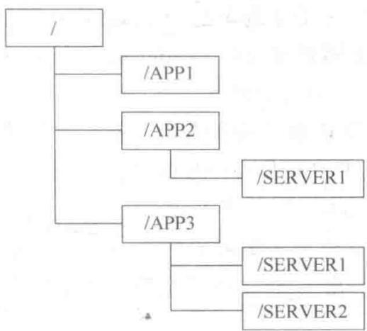
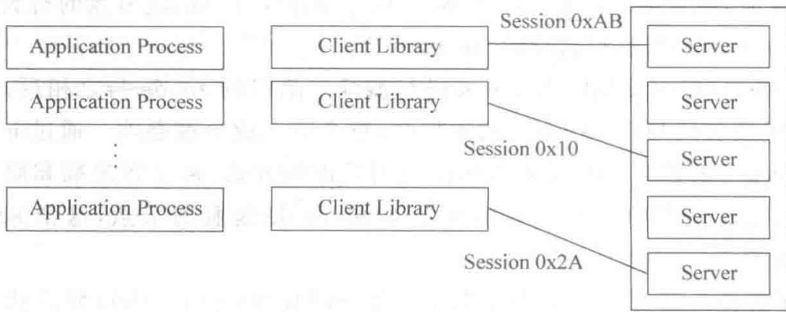
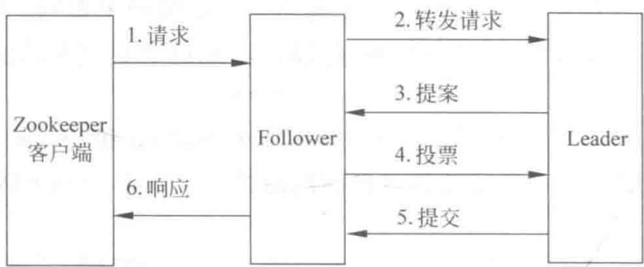

# 第5章 Zookeeper 开发

> 支撑 Kafka 与 Storm 集群协调的基石

<!--
同学们，前面几章我们反复提到 Zookeeper：它让 Storm 的 Nimbus 和 Supervisor 保持协调，让 Kafka 的 broker 自动注册、动态扩展。可以说，没有 Zookeeper，这些分布式集群就是一群群龙无首的机器。那 Zookeeper 到底是什么？它为什么能做协调？这一章我们就彻底把它讲清楚：从它的出身和要解决的分布式协作难题开始，再到它的数据模型、架构、Watch 机制、故障处理，最后教你怎么搭一个 Zookeeper 集群。真正理解了它，你回头看 Kafka、Storm 的设计，就会有豁然开朗的感觉。

[Sources]
- 吴斌，《大数据实时计算与应用》，清华大学出版社，第 5 章。
-->

---
class: compact
---

## 本章目录

1. **5.1 Zookeeper 的来源**：协调系统、分布式协作难点、FLP 与 CAP 定律
2. **5.2 Zookeeper 基础**：数据模型、znode 类型、通知机制、Leader 选举、架构
3. **5.3 Zookeeper 的 API**：会话、管理权、节点注册、任务队列化
4. **5.4 状态变化处理**：监视点（watch）机制
5. **5.5 故障处理**：客户端、Follower、Leader 三类故障
6. **5.6 集群管理**：集群配置与动态 Master 选举

<!--
同学们请看本章的六大板块。5.1 我们回答“为什么需要 Zookeeper”；5.2 了解它的数据模型和架构——它本质是一个类似于文件系统的“分布式小文件存储”；5.3 具体到 API，看它怎么帮我们做协调；5.4 是它最核心的 Watch 机制；5.5 讲它面对各种故障怎么保持稳定；5.6 落到实践——搭集群、做动态 Master 选举。这条线走完，你对分布式协调的认知就成型了。

[Sources]
- 吴斌，《大数据实时计算与应用》第 5 章，章节结构。
-->

---
layout: section
class: compact
---

## 5.1 Zookeeper 的来源

<ol class="outline">
  <li class="current">为什么需要协调</li>
  <li>分布式协作的三大难点</li>
  <li>FLP 与 CAP 定律</li>
</ol>

<!--
我们先解决“为什么需要 Zookeeper”。企业的系统越做越大，唯一可行的解法是把大系统拆成若干小系统，但这同时带来了一个新麻烦：这些子系统之间要互相协作。就像动物园里的动物需要被统一管理一样，分布式子系统也需要一种协调机制。这就是 Zookeeper 的由来。

[Sources]
- 吴斌，《大数据实时计算与应用》第 5.1 节。
-->

---
class: compact
---

## Zookeeper：为分布式应用提供一致性服务

- 拆系统是解决可伸缩性与性能的唯一有效手段，但也带来子系统间协作的复杂度
- Zookeeper 是**开源 Hadoop 子项目**，依据 Google《The Chubby lock service》论文实现，关键是一致性算法
- 提供**高性能协调服务**：配置维护、命名服务、分布式同步、组服务
- 是 Hadoop 集群管理必不可少模块，也应用于 Storm（维护 nimbus/supervisor 状态）、HBase

<!--
**[核心]** 一句话概括 Zookeeper 的定位：一个为分布式应用提供一致性协调服务的软件。它源于 Google 的 Chubby，是 Hadoop 生态的协调底座。它提供的不只是锁，而是一整套协调原语——配置维护、命名服务、分布式同步、组服务。你回想一下前面几章：Storm 靠它维持 nimbus 和 supervisor 的状态，Kafka 靠它做 broker 注册和扩展，HBase 也用它。可以说，它是整个分布式生态的“中枢神经”。

[Sources]
- 吴斌，《大数据实时计算与应用》第 5.1 节。
-->

---
class: compact
---

## 读多写少的设计

Zookeeper 是一种高性能、可扩展的服务，读写速度很快，**读比写更快**；读操作时仍能为旧数据提供服务。

一致性保证：

1. **顺序一致性**：客户端的更新顺序与发送顺序一致
2. **原子性**：更新要么成功，要么失败，无中间态
3. **单系统镜像**：连接任一服务器都看到相同视图
4. **可靠性**：更新一旦应用，在客户端再次更新前不会改变
5. **实时性**：十几秒内，任何系统改变会被客户端看到或侦测到

<!--
**[核心]** Zookeeper 的性能特点很鲜明：读快、写慢，而且读还能读到旧数据。为什么敢这么设计？因为它提供的一致性保证是“顺序一致”“原子”“单系统镜像”“可靠”“实时”。注意这里没有说“强一致到读完必能看到最新值”，而是允许在很短时间（十几秒）内感知变化。这种“以读为主的弱一致、但保证顺序和原子”的取舍，正是它高性能的来源，也是需要你理解的关键设计哲学。

[Sources]
- 吴斌，《大数据实时计算与应用》第 5.1 节。
-->

---
class: compact
---

## 分布式协作的三大难点

1. **缺乏全局时钟**：各节点时钟不同，依赖时序难以协调；需借助集群来区分动作先后
2. **面对故障独立性**：一部节点/模块出问题、另一部正常；必须找到解决办法
3. **处理单点故障（SPoF）**：单点支撑的功能若坏，整个系统受损；应避免单点，或做好备份、自动恢复、缩小影响范围

<!--
**[核心]** 为什么协调这么难？归结为三个老大难。第一是“没有全局时钟”——单机里大家看同一个表，分布式里每个节点都有自己的一块表，谁先谁后说不清。第二是“故障独立性”——分布式系统不会整体全挂，而是这块坏、那块好的，处理起来很麻烦。第三是“单点故障”——某个功能只有一台机器撑着，它一挂整个功能就没了。这三个难点，正是 Zookeeper 要正面回应的。

[Sources]
- 吴斌，《大数据实时计算与应用》第 5.1 节。
-->

---
class: compact
---

## FLP 与 CAP 定律

- **FLP 定律**：在异步通信的分布式系统中，进程崩溃时，所有进程可能无法就一个配置位达成一致
- **CAP 定律**：一致性（Consistency）、可用性（Availability）、分区容错性（Partition-tolerance）三者无法同时满足
- Zookeeper 的设计尽量满足**一致性与可用性**；网络分区时只提供**只读能力**

<!--
**[核心]** 这两个定律告诉我们“别做梦”。FLP 说，在异步环境下只要有进程崩溃，大家就可能永远无法达成一致——这就给分布式一致性判了“理论死刑”。CAP 说，Consistency 一致性、Availability 可用性、Partition-tolerance 分区容错，你只能三选二。Zookeeper 的选择是尽量满足一致性和可用性，而在发生网络分区这种极端情况时，它宁可牺牲可用性、只提供只读。理解这两个定律，你就明白 Zookeeper 的取舍不是随便定的，而是理论约束下的最优解。

[Sources]
- 吴斌，《大数据实时计算与应用》第 5.1 节。
-->

---
layout: section
class: compact
---

## 5.2 Zookeeper 基础

<ol class="outline">
  <li class="current">数据模型与 znode</li>
  <li>通知机制</li>
  <li>Leader 选举与架构</li>
</ol>

<!--
现在进入 Zookeeper 的核心——它的数据模型。这里有个关键设计思想：Zookeeper 不直接给你现成的锁原语，而是给你一个类似文件系统的 API，让你自己拼装出想要的原语。这就是它“以小见大”的巧妙之处。我们先看它到底存了什么、怎么组织。

[Sources]
- 吴斌，《大数据实时计算与应用》第 5.2 节。
-->

---
class: compact
---

## 先理解：Zookeeper 到底存了什么

Zookeeper 表面复杂，其实就一句话：**它像一个"公共公告板 + 文件夹系统"**。

- 它的数据组织很像**电脑里的文件夹**：有一个根目录，下面可以一层层建文件夹和文件（这些节点叫 **znode**）
- 你在**公告板上写东西**，别的机器就能**看到 + 监听**
- 这么设计的好处：大家**共用一块地方**，谁的状态变了，别人立刻知道

**为什么不用普通数据库？** 因为 Zookeeper 要的是"**实时、简单、可靠地协调**"，而不是存海量业务数据。它专门为"让大家步调一致"而生。

<!--
很多同学一看到 Zookeeper 就头大，其实你只要把它想成"一块公共公告板 + 一个文件系统"。它的数据就像电脑文件夹：一层套一层，每个节点叫 znode。你就把节点当成公告板上的一句话、或文件夹里的一个文件。所有机器都能在这块板上写，也能盯着它看，谁变了大家立刻知道。至于为什么不干脆用数据库？因为 Zookeeper 的使命不是存大业务数据，而是"让大家配合默契、步调一致"——它要的是快和可靠，不是存储量大。这样理解，后续的节点、临时节点、监听就都有着落了。

[Sources]
- 吴斌，《大数据实时计算与应用》第 5.2 节，基础。
-->

---
class: compact
---

## 数据模型：类文件系统 + 菜谱

{fit="contain" position="center" max-height="32vh"}

- Zookeeper **不直接给现成原语**，而是给**类文件系统 API** 让你自己实现（叫**菜谱**）；基本单位是 **znode**，组成一棵**层级树**
- **读图**：根 `/` 下挂 `/APP1`、`/APP2`、`/APP3`，`/APP3` 下再挂 `/SERVER1`、`/SERVER2`，每个节点有唯一全路径

<!--
**[看图]** 我们先看数据和它的组织方式。Zookeeper 不给现成的锁，而是给你一个类似文件系统的接口，把“锁”这种原语的实现权交给你——它管这叫“菜谱”。数据的基本单位是 znode，所有 znode 组成一棵层级树。看这张图，根节点下挂着 /APP1、/APP2、/APP3，/APP3 下再挂 /SERVER1、/SERVER2。每个节点都有唯一的路径，比如 /SERVER2 的完整路径是 /APP3/SERVER2。熟悉文件系统的同学会立刻觉得亲切。

[Sources]
- 吴斌，《大数据实时计算与应用》第 5.2 节。
-->

---
class: compact
---

## znode 类型：持久与临时

- 新建 znode 需指定类型，类型决定其行为方式
- **持久节点（persistent）**：只能通过 `delete` 删除
- **临时节点（ephemeral）**：创建它的客户端崩溃或关闭连接时，节点即被删除（`-e` 参数创建）
- 客户端与服务器用**长连接**，通过心跳保持，连接状态即 **session**；临时节点随 session 失效而删除
- 还有一个属性——**有序（sequential）**节点：创建时在路径结尾追加递增计数（`%10d` 格式，如 0000000001），溢出时超过 2³²-1

<!--
**[核心]** znode 的类型决定了它的“寿命”。持久节点要显式删除；临时节点则跟着客户端走——客户端一断，节点自动消失。这个“临时”特性怎么实现的？靠 session。客户端和服务器建立长连接，靠心跳维持，这个连接就是 session；session 一失效，临时节点就没了。正是因为临时节点会随客户端死亡而自动消失，它特别适合用来标记“谁还活着”。另外还有一种有序节点，创建时自动加一个递增的流水号，对做队列、做选举都非常有用。

[Sources]
- 吴斌，《大数据实时计算与应用》第 5.2 节。
-->

---
class: compact
---

## 通知机制：用 Watch 代替轮询

- Zookeeper 以远程方式访问；若每次读都要获取节点内容，代价太大
- 采用**基于通知的机制**：客户端对 znode 设置**监视点（watch）**接收通知
- 监视点是一个**单次触发**操作：触发一个通知，必须重新设置才能接收下一个通知
- 该机制保障客户端以**全局顺序**观察状态变化（传递虽慢但有序）
- **版本号属性**：每个操作都会使节点版本号递增；每个节点维护三个版本号：Version（数据）、Cversion（子节点）、Aversion（ACL）

<!--
**[核心]** 这是 Zookeeper 最精巧的设计之一。轮询太浪费——客户端总不能隔一会儿就来问一次数据变了没。Zookeeper 改成“你告诉我你关心哪个节点，变了我通知你”。这个监视点 watch 是一次性的，被触发一次就失效，想继续得重新设。它牺牲了一点实时性换取全局顺序。另外每个 znode 都有三份版本号——数据的、子节点的、ACL 的，每改一次就加一。版本号的意义在于，它让你能检测“读到的是不是最新”，是做乐观锁判断的基础。

[Sources]
- 吴斌，《大数据实时计算与应用》第 5.2 节。
-->

---
class: compact
---

## 打个比方：Watch 就像"警报铃"，而不是"一直盯"

**为什么不能一直去问？** 如果你每隔一秒就问一次"数据变了吗"，太累也太浪费（这叫**轮询**）。

**Watch（监视点）**就像"设一个警报铃"：

- 你只在**关心的地方**挂一个铃（设置 watch）
- 一旦那里**有变化，铃就响**（触发通知）——你就不用一直盯着了
- **铃响一次就没了**（单次触发）：想继续被提醒，就得**再挂一个铃**

**好处**：省力、及时。**注意**：它不是一直有效，响过要重新设；而且别在同一个地方挂太多铃，否则一响就是一大片（羊群效应）。

<!--
"监视点 watch"这个概念，最好的比喻就是"警报铃"。如果你担心一件事，总不能每秒钟去问一次"好了没"，那太累了。你更聪明的做法是：在那件事上挂一个铃，一旦发生你关心的情况，铃就自动响，你就立刻知道——这比一直盯着省力多了。但要注意，这个铃是"响一下就没"的（单次触发），你下次还想被提醒，就得重新挂一个。另外，别在同一个地方挂太多铃，否则一有变动几十个铃一起响，反而乱套。记住这个比喻，watch 的机制和它的坑你就都明白了。

[Sources]
- 吴斌，《大数据实时计算与应用》第 5.2 节，基础。
-->

---
class: compact
---

## Leader 选举

- Zookeeper 需在所有服务器中选出 **Leader** 管理集群，其余成为 **Follower**；Leader 故障时快速在 Follower 中选新 Leader
- 为避免**从众效应**：每个 Follower 对序号比自己小一号的节点设置 watch
- 只有该 watch 被触发时，Follower 才进行 Leader 选举，一般情况下它将成为下一个 Leader
- 因此每个 Leader 选举几乎只涉及**单个 Follower 的操作**，速度很快

<!--
**[核心]** Zookeeper 自己也要选 Leader，它的策略很聪明。为防“羊群效应”（一群人一起抢），每个 Follower 只盯着“序号比自己小一号”那个节点设 watch。当那个节点死了触发 watch，只有它这一个 Follower 出来竞选，而它就顺理成章成为下一个 Leader。所以每次选举几乎只牵涉单个节点的操作，快得惊人。这种“只盯前一号”的设计，就是 Zookeeper 选举高效、又不会混乱的秘诀。

[Sources]
- 吴斌，《大数据实时计算与应用》第 5.2 节。
-->

---
class: compact
---

## 5.2.2 架构总览

{fit="contain" position="center" max-height="32vh"}

- **独立模式**：单服务器、状态不复制；**仲裁模式**：一组服务器组成 Zookeeper 集合、状态复制并同时响应
- **读图**（上→下）：应用进程 → 客户端库 → 若干 **session** → **Zookeeper 服务器栈**；本质是分布式小文件存储系统

<!--
**[看图]** 我们看 Zookeeper 的架构。它运行在两种模式：独立模式就是单机，没法复制状态，适合测试；仲裁模式才是真正的集群。看右边这张图，最上面是各种应用进程，往下是客户端库，再往下一层层是 session（0x0、0xf 这种会话标识），最后连接到 Zookeeper 服务器栈。它本质上是一个分布式的小文件存储系统——这就是它既能存配置、又能做协调的原因。

[Sources]
- 吴斌，《大数据实时计算与应用》第 5.2 节。
-->

---
class: compact
---

## Zookeeper 在生态中的角色

- **Hadoop**：用 Zookeeper 的事件处理确保整个集群**只有一个 NameNode** 存储配置信息等
- **HBase**：确保整个集群**只有一个 HMaster**，察觉 HRegionServer 联机与宕机，存储访问控制列表
- **雅虎**：用于雅虎消息代理的协调和故障恢复；写操作吞吐约 10,000/s，读操作吞吐要高几倍

<!--
**[核心]** 把 Zookeeper 放回生态看，它的角色非常统一：避免“多个主节点打架”。Hadoop 靠它保证只有一个 NameNode，HBase 靠它保证只有一个 HMaster、并感知 RegionServer 的上下线。这就解释了你前面疑惑的——为什么一个集群只能有一个“主”。至于性能，雅虎用它在消息代理里做协调，写吞吐约每秒一万，读还要高几倍，充分说明它作为协调服务完全扛得住流量。

[Sources]
- 吴斌，《大数据实时计算与应用》第 5.2 节。
-->

---
layout: section
class: compact
---

## 5.3 Zookeeper 的 API

<ol class="outline">
  <li class="current">建立会话</li>
  <li>获取管理权</li>
  <li>节点注册与任务队列化</li>
</ol>

<!--
理解了模型和架构，我们来看怎么用它。Zookeeper 的 API 都围绕一个“句柄”展开，这个句柄代表一次会话。我们依次看：先建立会话，再抢管理权，最后注册节点、任务队列化。

[Sources]
- 吴斌，《大数据实时计算与应用》第 5.3 节。
-->

---
class: compact
---

## 建立会话

- API 围绕 Zookeeper **句柄**构建，每次调用都要传递该句柄（代表一次会话）
- 会话连接被破坏会自动转移到其他 Zookeeper 服务；会话通畅则句柄持续有效
- 构造函数：`ZooKeeper(String connectString, int sessionTimeout, Watcher watcher)`
  - **connectString**：服务端主机名和端口号
  - **sessionTimeout**：会话超时时间（毫秒）
  - **watcher**：接收会话事件的对象，需使用者实现 `Watcher` 接口

```java
public class master implements Watcher {
    ZooKeeper zk;
    String hostPort;
    void startZk() throws IOException {
        zk = new ZooKeeper(hostPort, 15000, this);   // 用 master 构造 Zookeeper 对象
    }
    public void process(WatchedEvent event) {
        System.out.println(event);   // 收到的（会话）事件简单输出
    }
    void stopZk() throws Exception { zk.close(); }
}
```

<!--
**[看代码]** 建立会话就是 new 一个 ZooKeeper 对象。看这个 master 类，startZk 里 `new ZooKeeper(hostPort, 15000, this)`——connectString 是主机端口，15000 是会话超时毫秒数，this 表示用自己当 Watcher 来接收事件。因为 Watcher 是个接口，所以这个类实现它并覆写 process 方法。process 里打印收到的事件。就这么简单，你就创建了一条与 Zookeeper 的会话。

[Sources]
- 吴斌，《大数据实时计算与应用》第 5.3 节。
-->

---
class: compact
---

## 获取管理权（Master 选举）

- 目标：同一时间**只有一个主节点进程处于活动状态**
- 用 Zookeeper 的**群首选举算法**：所有潜在主节点都尝试创建 `/master` 节点，**只允许一个成功**，该进程成为主节点

```java
String serverId = Integer.toHexString(random.nextInt());
void runForMaster() {
    zk.create("/master", serverId.getBytes(), OPEN_ACL_UNSAFE,
              CreateMode.EPHEMERAL, masterCreateCallback, null);
}
```

- 创建 `/master`，数据字段为 serverId；节点类型 **EPHEMERAL（临时）**

<!--
**[看代码]** 我们看怎么用 Zookeeper 抢“主”。最经典的方法就是“抢建同名节点”。runForMaster 调用 create 去创建 /master 这个临时节点，只允许一个进程成功，抢到的就是主节点。关键点在节点类型 CreateMode.EPHEMERAL——临时节点。因为它是临时的，一旦身为主的进程崩溃、会话断开，这个 /master 节点就自动消失，其他等待的进程就能接管。这正是 Zookeeper 用临时节点实现“自动故障转移”的精髓：不用人工干预，主权自动交接。

[Sources]
- 吴斌，《大数据实时计算与应用》第 5.3 节。
-->

---
class: compact
---

## 管理权的异步回调

- 应用常由**异步变化通知**驱动，采用异步方式构建更便捷
- 回调处理 `create` 结果：根据返回码 `rc` 判断：
  - **CONNECTIONLOSS**：连接丢失异常 → 重新 checkMaster()
  - **OK**：该进程成为 Leader
  - **default**：该进程未成为 Leader

```java
static boolean isLeader;
static StringCallback masterCreateCallback = new StringCallback() {
    void processResult(int rc, String path, Object ctx, String name) {
        switch (Code.get(rc)) {
            case CONNECTIONLOSS: checkMaster(); return;
            case OK:            isLeader = true; break;
            default:            isLeader = false;
        }
        System.out.println("The leader is " + (isLeader ? "" : "not ") + "me.");
    }
};
```

<!--
**[看代码]** 因为是异步调用，create 的结果不会直接返回，而是通过回调告诉你。看这个 masterCreateCallback，它在 processResult 里检查返回码：如果结果是 CONNECTIONLOSS，说明连接断了、结果不明，那就重新 checkMaster 再确认；如果 OK，说明这个进程抢到了主权，把 isLeader 置 true；否则就不是主。这种“异步 + 回调 + 连接丢失重查”的模式，是写 Zookeeper 应用时要养成的标准习惯——因为你永远不知道一个请求是不是因为网络断了而不知道结果。

[Sources]
- 吴斌，《大数据实时计算与应用》第 5.3 节。
-->

---
class: compact
---

## 节点注册（Worker）

- 主节点建立后,需要配置从节点配合使用
- 从节点在 `/workers` 下创建临时 znode 节点

```java
void register() {
    zk.create("/workers/worker-" + serverID,
        "Idle".getBytes(),                        // 将节点状态信息存入从节点
        Ids.OPEN_ACL_UNSAFE,
        CreateMode.EPHEMERAL, workerCreateCallback, null);
}
```

- **EPHEMERAL（临时）**：节点随 worker 会话存活；worker 崩溃则节点消失、状态自动更新

<!--
**[看代码]** 有了主，还要有从。这个 worker 类在 register 里，去 /workers 下创建一个叫 worker-xxx 的临时节点，把状态 “Idle” 存进去。妙的是节点类型也是 EPHEMERAL——意味着这个 worker 一旦崩溃、会话断开，它订阅的 znode 就自动消失。这样，Zookeeper 就能实时、自动地反映出“哪些机器还活着”，而不需要人为清理僵尸节点。这正呼应了前面讲的“临时节点随 session 失效而删除”的特性。

[Sources]
- 吴斌，《大数据实时计算与应用》第 5.3 节。
-->

---
class: compact
---

## 任务队列化

- 为 Client 应用程序队列化新任务，方便节点执行
- 采用**有序节点**实现任务队列

```java
String queueCommand(String command) throws KeeperException {
    while (true) {
        try {
            String name = zk.create("/tasks/task-" + serverId,
                command.getBytes(), OPEN_ACL_UNSAFE, CreateMode.SEQUENTIAL);
            return name;
        } catch (NodeExistsException e) {
            throw new Exception(name + " already appears to be running.");
        } catch (ConnectionLossException e) { /* 重试 */ }
    }
}
```

- 用 `CreateMode.SEQUENTIAL` 为任务自动编号，形成天然的 FIFO 队列

<!--
**[看代码]** 任务队列怎么实现？用有序节点。queueCommand 在 /tasks 下创建 task-xxx 节点，注意类型是 SEQUENTIAL——Zookeeper 会为它自动追加一个递增的序号。这样每个任务自带一个全局唯一的、递增的编号，任务就天然排成了 FIFO 队列。读者只要按序读取，就能按提交先后拿到任务。这就是用“有序节点”这个最简 API，拼装出队列语义的典型例子，也是它“不直接给原语、让你自己组”设计思想的体现。

[Sources]
- 吴斌，《大数据实时计算与应用》第 5.3 节。
-->

---
layout: section
class: compact
---

## 5.4 状态变化处理：监视点 watch

<ol class="outline">
  <li class="current">单次触发与设置方式</li>
  <li>代替显式缓存</li>
  <li>羊群效应与可扩展性</li>
</ol>

<!--
这一节我们把 Watch 机制讲透，因为它是 Zookeeper 最关键、也最容易用错的部分。我们看它怎么工作、怎么设置、能带来什么好处、又有哪些坑。

[Sources]
- 吴斌，《大数据实时计算与应用》第 5.4 节。
-->

---
class: compact
---

## 监视点：单次触发器

- 一个 watch = 关联的一个 znode 节点 + 事件类型 组成的**单次触发器**
- 匹配条件的第一个事件触发通知，**最多只触发一次**
- 每个监视点与会话关联；会话过期，等待中的监视点被删除
- 注册时服务端检查 znode 在注册前后是否已变化，若已变则通知，否则在新服务端注册
- **单次触发可能丢失事件**，但影响不大：任何“接收通知与注册新监视点之间”的变化，都可通过读取 Zookeeper 状态获取

<!--
**[核心]** 记住 Watch 的一个硬性特点：它是“一次性”的。每当触发一个通知就失效，想继续监听就得重新设置。你可能担心“那中间漏掉的状态变化怎么办？”Zookeeper 的做法很聪明：它不保证你收到每一次中间变化，但允许你在重新设置后，通过“读一次当前状态”自己补齐。所以 Zookeeper 的保证是“最终你能感知到最新状态”，而不是“每个中间过程都通知你”。理解这一点，你就不会在用它时纠结丢事件了。

[Sources]
- 吴斌，《大数据实时计算与应用》第 5.4 节。
-->

---
class: compact
---

## 如何设置监视点

- 所有读操作——`getData`、`getChildren`、`exists`——都可选择在读取的 znode 上设置监视点
- 前提：实现 `Watcher` 接口并实现 `process(WatchedEvent event)`，其中 WatchedEvent 含会话状态、事件类型、znode 路径
- **两种类型**：
  - **数据监视点**：创建、删除或设置 znode 数据时触发（getData 和 exists 可设置）
  - **子节点监视点**：仅在 znode 子节点创建或删除时触发（仅 getChildren 能设置）
- **重要约束**：一旦设置就无法移除，移除只有两种途径——触发它，或关闭/过期会话

<!--
**[核心]** 设置监视点有三个读操作可以用：getData、getChildren、exists。这里要区分两种监视点。数据监视点，管的是“这个节点本身的数据变没变”，用 getData 或 exists 设；子节点监视点，管的是“这个节点的孩子增删了没”，只有 getChildren 能设。还有个容易踩的坑：监视点设了就撤不下来！想移除只有两条路——要么等它被触发，要么把整个会话关掉。所以在代码里别随手设很多监视点，否则很难清理。

[Sources]
- 吴斌，《大数据实时计算与应用》第 5.4 节。
-->

---
class: compact
---

## 监视点代替显式缓存管理

- 客户端直接访问 Zookeeper 获取数据并不实用；更高效：**本地缓存数据**，需要时直接用
- 一旦数据变化，Zookeeper **通知客户端**，客户端**更新缓存**
- 监视点使客户端在本地缓存一份数据，并在数据变化时接收通知更新——省去反复查询

<!--
**[核心]** Watch 还有一个高级用法——替代显式缓存管理。你想想，如果应用每次都去 Zookeeper 查配置，一方面慢，另一方面是一堆轮询。更聪明的做法是：客户端本地缓存一份数据，并给那个节点设个监视点。数据一变，Zookeeper 通知你，你更新缓存。这样既快，又能实时感知变化。可以说，Watch 机制把“客户端自己管理缓存的一致性”这件事，从痛苦的轮询变成优雅的通知。

[Sources]
- 吴斌，《大数据实时计算与应用》第 5.4 节。
-->

---
class: compact
---

## 监视点的羊群效应

- 变化产生时，Zookeeper 会触发该 znode 相关的**所有**监视点
- 例：10000 个客户端用 `exists` 监视某节点 → 节点创建后发出 10000 个通知 → **通知尖峰**
- 尖峰会带来操作延迟等影响 → 应避免大量客户端在同一节点设监视点，**理想状态是一个节点只设一个监视点**
- **内存消耗**：每设一个监视点，服务端监视点管理器约消耗 **250~300 字节**；监视点过多会耗尽服务器内存

<!--
**[核心]** Watch 用得好很香，用不好会出事——这就是“羊群效应”。假如一万个客户端都监视同一个节点，这个节点一变化，Zookeeper 就要一口气发一万条通知，形成通知尖峰，让提交中的操作被延迟。所以设计时要避免让海量客户端盯同一个节点，理想是一个节点一个监视点。另外别忘了代价：每个监视点在服务端要占约 250~300 字节内存，监视点设得太多，服务器内存会被吃光。这两条，都是写生产代码时必须权衡的。

[Sources]
- 吴斌，《大数据实时计算与应用》第 5.4 节。
-->

---
layout: section
class: compact
---

## 5.5 故障处理

<ol class="outline">
  <li class="current">客户端节点故障</li>
  <li>Follower 节点故障</li>
  <li>Leader 节点故障</li>
</ol>

<!--
Zookeeper 自己也会出故障，我们看它怎么处理。请求从客户端出发，经 Follower 再到 Leader（或反向），任何一个环节出错都可能引发故障。Zookeeper 把故障分成三类：客户端、Follower、Leader。我们逐一分析。

[Sources]
- 吴斌，《大数据实时计算与应用》第 5.5 节。
-->

---
class: compact
---

## 处理流程概览

{fit="contain" position="center" max-height="44vh"}

- **读图**（自左向右）：Zookeeper 客户端 → **Follower** → **Leader**
- 六个阶段：**请求 → 转发 → 搜索 → 提案 → 提交 → 响应**，环环相扣
- Follower 与 Leader 间是**双向箭头**——请求经 Follower 转给 Leader，结果再反推回来

<!--
**[看图]** 这张图展示了 Zookeeper 处理一次客户端写请求的完整流程。看箭头，左边是 Zookeeper 客户端，中间是 Follower，右边是 Leader。从 1. 请求、2. 转发、3. 搜索、4. 提案、5. 提交到 6. 响应，六个阶段环环相扣。特别注意 Follower 和 Leader 之间的双向箭头——请求要经过 Follower 转发给 Leader，Leader 再把结果一步步反馈回来。理解了这条请求链路，后面各环节的故障处理才有的放矢。

[Sources]
- 吴斌，《大数据实时计算与应用》第 5.5 节。
-->

---
class: compact
---

## 客户端节点故障

- Zookeeper 用 **session** 判断客户端是否存活（因此创建实例时要传 sessionTimeout）
- 客户端定期向 Follower 发 **Ping 包**；Leader 向 Follower 发 ping，判断是否有超过半数存活，并收集各 Follower 在服务的客户端
- 据此删除已消失客户端对应的 **ephemeral** 节点
- 若客户端在处理请求时故障，按转发/提案/响应各阶段分别处理：如在转发阶段被发现则丢弃请求包；在提案阶段才发现则提交仍执行，但以 error 操作返回

<!--
**[核心]** Zookeeper 靠 session 和心跳维持你对它是否还活着的判断。客户端定期发 Ping，Follower 汇总后告诉 Leader，谁还活着，谁死了，然后剥离它建的临时节点。而最常见的麻烦是“客户端在处理请求中途挂了”，这会发生在请求链路的不同阶段：如果 Follower 在转发前就发现它死了，就直接丢弃请求包；如果直到提案阶段才发现，那么投票、提交还是会照常跑，只是响应会以 error 形式返回。逐个阶段去兜底，就是分布式系统处理故障的典型思路。

[Sources]
- 吴斌，《大数据实时计算与应用》第 5.5 节。
-->

---
class: compact
---

## Follower 服务器节点故障

- Follower/Observer 故障时，其直连客户端收不到响应，会**丢弃请求并另选一个 Follower/Observer** 重连——对用户透明
- 若 Follower 在**转发阶段之后**故障，Leader 最迟在提案阶段发现；虽收不到该 Follower 投票，但只要**仍有超过半数 Follower 存活**，不影响 Leader 处理
- 单个 Follower 失效很难对集群造成致命影响，系统仍稳定运行

<!--
**[核心]** 单个 Follower 挂了，其实是最不担心的一类。因为客户端会自己重连到别的 Follower，对用户无感。更重要的是，就算某个 Follower 在转发阶段之后死掉，只要整个集群还有超过一半的 Follower 存活，Leader 照样能通过多数派推进提案。所以一句话：单个 Follower 的失效，几乎不会撼动集群的稳定。这就是用“多数派”换来的健壮性。

[Sources]
- 吴斌，《大数据实时计算与应用》第 5.5 节。
-->

---
class: compact
---

## Leader 服务器节点故障

- **Leader 在非响应阶段之前故障**：Follower 转发失败，请求包进入 Follower 的 `pendingSyncs` 集合；Follower 发现 Leader 失效，退出 Follower 角色、关闭相连客户端，随后参加 Leader 选举——选举期间不再接受客户端连接
- **Leader 在响应阶段之前故障**：按上述方法处理 Follower，同时继续执行响应阶段操作

<!--
**[核心]** 最严重的当属 Leader 挂了，一旦 Leader 没了，一切协调都得重新开始。此时每个 Follower 会发现自己转发的请求没成功，就把请求暂存进 pendingSyncs；然后它退出 Follower 身份、踢开客户端，进入 Leader 选举。注意：选举期间它不接受新连接，所以整个集群在这短暂窗口是“暂停服务”的——这正是为什么 Zookeeper 把选举做得那么快（只牵涉单个节点操作）。Leader 故障的挑战，不在于“选不出来”，而在于“选得够快”，把服务空窗压到最短。

[Sources]
- 吴斌，《大数据实时计算与应用》第 5.5 节。
-->

---
layout: section
class: compact
---

## 5.6 Zookeeper 集群管理

<ol class="outline">
  <li class="current">集群配置</li>
  <li>集群管理与动态 Master 选举</li>
</ol>

<!--
最后一个板块，我们把前面的知识落地：怎么搭一个真正的 Zookeeper 集群，以及怎么用它做集群管理和动态 Master 选举。

[Sources]
- 吴斌，《大数据实时计算与应用》第 5.6 节。
-->

---
class: compact
---

## 集群配置要点

- 部署 Server，机器**至少三台及以上**；每个节点建立独立目录，解压安装包，创建 data、dataLog、logs 等文件夹
- 进入 `data` 目录创建 `myid` 文件，写入本机唯一的标记号（如 server1=1、server2=2）
- 在 `conf` 目录创建 `zoo.cfg`：

```ini
tickTime=2000
initLimit=10
syncLimit=5
dataDir=/home/xxx/server1/data
dataLogDir=/home/xxx/server1/dataLog
clientPort=2181
server.1=yyyy:2888:3888
server.2=yyyy:2888:3888
server.3=yyyy:2888:3888
server.4=yyyy:2888:3888
```

- `server.X` 的 X 即各机 `data/myid` 中的数字；每个 Server 都要配齐 `server.1~4`
- 后面两个端口：**第一个**做集群成员信息交换，**第二个**专门用于 Leader 故障时的选举

<!--
**[核心]** 搭集群的关键配置就这几行。注意三个要点。第一，myid 文件里的数字要和 zoo.cfg 里的 server.X 一一对应，它是每台机器在集群中的唯一身份。第二，每个 server.xyz 后面跟两个端口：第一个端口做集群成员之间的信息交换，第二个端口专门在 Leader 挂了时用来选举——这就是为什么每个 Server 是两个端口值。第三，至少要三台机器（多数派法则），这样才允许一台挂掉仍能选出 Leader 并对外服务。

[Sources]
- 吴斌，《大数据实时计算与应用》第 5.6 节。
-->

---
class: compact
---

## 集群管理：哪些机器还活着

- 应用集群需要每台机器都及时知道哪些节点存活，并能自动感知宕机、断链
- 利用**临时节点 + 监视点**实现：
  - 每台机器启动时在 `/APP1SERVERS` 下创建 EPHEMERAL 节点（如 `/APP1SERVERS/SERVER1`）
  - 各节点都 watch 父节点 `/APP1SERVERS`
  - 某机器故障/断连 → 其临时节点消失 → 所有 watch 它的客户端收到通知 → 取得最新节点列表

<!--
**[核心]** 怎么让每台机器都实时掌握“谁活着”？其实用的正是前面学的两个机制——临时节点和监视点。每台机器启动时在 /APP1SERVERS 下创建自己的临时节点；因为临时节点会随断连自动消失，一旦某机器挂掉，它的节点就没了。同时所有机器都 watch 着父节点，一旦子节点列表变化就收到通知、刷新本地列表。于是，整个集群的存活状态就实时、自动地同步给了每台机器，完全不需要人工干预。

[Sources]
- 吴斌，《大数据实时计算与应用》第 5.6 节。
-->

---
class: compact
---

## 动态 Master 选举

- 与集群管理类似，但机器启动时创建的节点类型改为 **EPHEMERAL_SEQUENTIAL**，每个节点自动编号
- 约定**编号最小**的节点为 **Master**
- 当`/APP1SERVERS` 变化时，得到最新服务器列表，大家一致认为最小编号者为 Master
- Master 宕机 → 其 znode 消失 → 新列表被推送 → 各节点重新认定最小编号为 Master
- 如此就实现了**无需人工干预的动态 Master 选举**

<!--
**[核心]** 把集群管理稍微变一下，就能自动选主。区别在于创建节点时用 EPHEMERAL_SEQUENTIAL，让每个节点自动有一个递增编号。然后约定“编号最小的是 Master”。当 Master 挂了，它的临时节点消失，列表更新推送下来，大家一看新的最小编号，就自动承认新主。整个过程无人参与，Master 死了自动选出来新的。这就是一张基于 Zookeeper 的动态选举“菜谱”。它的优雅之处在于：只用了 znode 的有序性和临时性两个特性，就解决了一个这么重要的分布式问题。

[Sources]
- 吴斌，《大数据实时计算与应用》第 5.6 节。
-->

---
class: compact
---

## 想一想（自检）

**问题 1**：我们可以用 Zookeeper 的哪些特性，做到"某台机器一掉线，全集群立刻都知道"？

> 提示：回想"临时节点 + watch"这两个词的配合。

**问题 2**：为什么 Zookeeper 建议"一个节点只设一个监视点"？

> 提示：想想 1 万个客户端监视同一个节点会发生什么。

<!--
这两个问题把本章两个关键机制联手考一考。第一题：靠**临时节点**（机器在线时存在，一掉线就自动消失）+ **watch**（大家盯着这个节点，一变就收到通知）。两者一配合，机器掉线、节点消失、通知广播，一气呵成。第二题：如果 1 万个客户端都 `exists` 监视同一个节点，那么这个节点一变化，就会一次性喷出 1 万条通知，形成"通知尖峰"，拖垮性能——这就是羊群效应。所以理想情况是一个节点只设一个监视点。答出这两条，你对 Zookeeper 的"临时 + 监听"就掌握得很扎实了。

[Sources]
- 吴斌，《大数据实时计算与应用》第 5 章，自检。
-->

---
class: compact
---

## 本章小结

1. Zookeeper 是**分布式一致性协调服务**（源于 Chubby），面对 FLP/CAP 的约束取“一致性 + 可用性”
2. 数据模型是**类文件系统的层级树**，以 **znode** 为基本单位；临时节点随 session 失效、有序节点自动编号
3. **Watch 监视点**代替轮询与显式缓存，但单次触发、有羊群效应和内存开销
4. 用**临时节点 + 监视点**即可搭建集群存活状态感知与**动态 Master 选举**

<!--
**[过渡]** 我们把第五章收尾。Zookeeper 之所以能成为 Kafka、Storm、HBase 的协调中枢，靠的是一套极简却精巧的设计：用一棵类文件系统的树存状态，用临时节点表达“谁活着”，用监视点替代轮询，用有序节点构造队列与选举。你把这四个关键词——**树、临时、监视点、有序**——记在心里，就等于掌握了 Zookeeper 的钥匙。下一章，我们把视线移向那条实时链路的存储终点：HBase。

[Sources]
- 吴斌，《大数据实时计算与应用》第 5 章，本章小结。
-->
