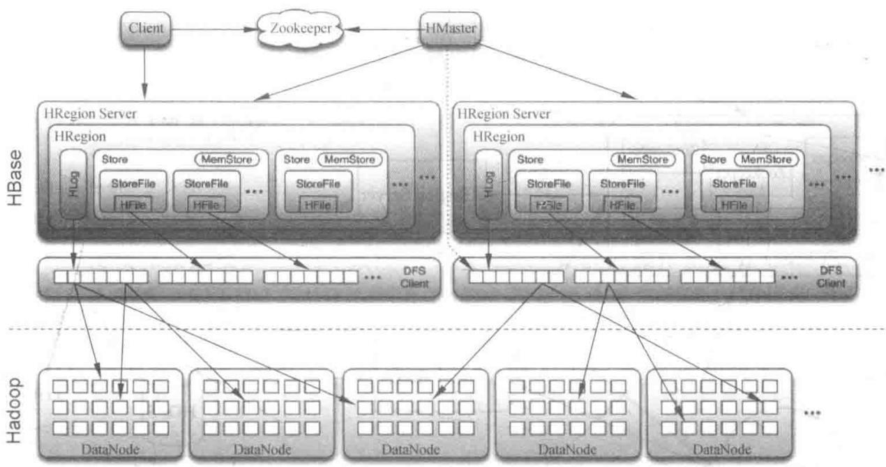
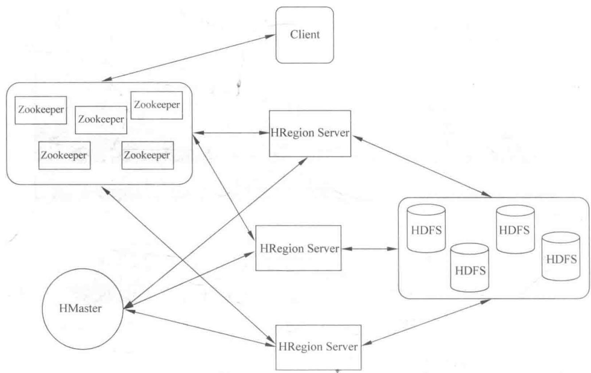

# 第6章 初识 HBase

> 实时处理链路的存储终点，一个面向列的开源数据库

<!--
走到第 6 章，我们实时链路的最后一环——存储——就要登场了。前面几章，Storm 把数据算完，可结果得有个地方放；Kafka 把海量数据灌进来，也得有人接着。这个角色就是 HBase。很多同学接触过关系型数据库，一上来可能会本能地拿 HBase 和 MySQL、Oracle 对比。这一章我们会讲清楚 HBase 为什么而生、它长什么样、怎么读数据，以及怎么把它装起来跑起来。理解了它的架构，你就能明白它凭什么支撑海量数据的随机读写。

[Sources]
- 吴斌，《大数据实时计算与应用》，清华大学出版社，第 6 章。
-->

---
class: compact
---

## 本章目录

1. **6.1 什么是 HBase**：大数据背景、架构与读流程、存储 API
2. **6.2 HBase 部署**：配置安装、运行模式、集群操作

<!--
同学们请看本章两大板块。6.1 先回答“HBase 是什么、为什么需要它”，我们从关系型数据库的局限讲起，再到它的整体架构和一次读取数据的具体流程；6.2 落到实践，讲它的安装配置、三种运行模式和集群怎麼启动管理。这一章以建立整体认知为主，后面第 7 到第 9 章才会深入到具体的读写操作和高阶特性。

[Sources]
- 吴斌，《大数据实时计算与应用》第 6 章，章节结构。
-->

---
layout: section
class: compact
---

## 6.1 什么是 HBase

<ol class="outline">
  <li class="current">大数据背景：RDBMS vs NoSQL</li>
  <li>架构与读流程</li>
  <li>存储 API</li>
</ol>

<!--
我们从“为什么要有 HBase”讲起。数据量到了一定规模，关系型数据库开始吃力，于是诞生了 NoSQL；而 HBase 则是 NoSQL 家族里最经典的一员，它脱胎于 Google 的 BigTable。

[Sources]
- 吴斌，《大数据实时计算与应用》第 6.1 节。
-->

---
class: compact
---

## 6.1.1 大数据的背景：数据在爆炸

- 2015 年产生和复制的数据量超 **2×10¹³ GB**，约为世界所有海滩沙粒总数的 20 倍
- 大型强子对撞机每年积累约 **15PB** 新数据
- 沃尔玛每天通过 6000 多个商店销售超 **2.67 亿件**商品
- 这些数据提醒我们：互联网已进入“**大数据**”时代

<!--
先感受一下“大”到什么程度。2 后面 13 个零的 GB，是全世界海滩沙粒的 20 倍；一个科学仪器一年就能攒 15PB；一家零售巨头每天卖 2.67 亿件商品。这些数字共同指向一个结论：我们面对的数据，规模已经远超传统数据库能从容应对的范围。正是这种压力，催生了新一代的数据存储和处理理念。

[Sources]
- 吴斌，《大数据实时计算与应用》第 6.1.1 节。
-->

---
class: compact
---

## RDBMS 的局限与 NoSQL 的诞生

- RDBMS（关系数据库系统）追求**高度一致性和正确性**，面对超大数据时采取**纵向扩展**（加 CPU/内存/硬盘）——终将遇到瓶颈
- 超大规模查询需要**大范围/全表扫描**，在单台服务器上响应时间远超可接受范围
- RDBMS 的等待和死锁出现频率与并发数平方、事务规模 3~5 次方相关——极其糟糕
- **NoSQL（非关系型数据库系统）** 应运而生：
  - 采用**反范式化数据模型**避免等待、降低锁粒度避免死锁
  - 数据增长无需重新分区迁移，**内嵌水平扩展性**
  - 通过提高扩展性机制应对容错与可用性

<!--
**[核心]** 为什么关系型数据库在大数据面前吃力？三个原因：一是扩容难，只能纵向硬加配置，有物理天花板；二是查询慢，超大查询常要全表扫，一台机器根本扛不住；三是并发死锁严重，等待和死锁频率随并发数平方、事务规模的三次方甚至五次方增长，越到后面越崩。NoSQL 选择反范式化、降低锁粒度、内嵌水平扩展，用一套完全不同的思路解决了这些。简单说：**RDBMS 强在一致性，NoSQL 强在横向扩展与海量吞吐**。

[Sources]
- 吴斌，《大数据实时计算与应用》第 6.1.1 节。
-->

---
class: compact
---

## 从 BigTable 到 HBase

- 2003 年，Google 工程师意识到 RDBMS 在大规模数据处理中的缺点
- 摒弃 RDBMS 特点，增、查、改、删用**简单 API** 实现，再加一个**扫描函数**在大范围/全表上迭代扫描
- 2006 年实现 **BigTable**；经过发展补充完善，成为如今典型的 NoSQL 数据库 **HBase**

<!--
**[核心]** HBase 的源头是 Google 的 BigTable。它的核心思想是：放弃关系数据库的复杂模型和 SQL，改用一套极简单的 API 去增删改查，配合一个能在全表大范围上迭代扫描的函数。2006 年 BigTable 问世，之后被开源社区实现并不断完善，就成了今天的 HBase。可以说，HBase 把 BigTable 的精髓搬到了 Hadoop 生态里，用最简单的接口换取最大的吞吐。

[Sources]
- 吴斌，《大数据实时计算与应用》第 6.1.1 节。
-->

---
class: compact
---

## 6.1.2 HBase 架构

{fit="contain" position="center" max-height="56vh"}

<!--
**[看图]** 我们把 HBase 的架构图完整看一遍。它其实分上下两层。上面是统筹层：一个 Master 管理多个 Region Server；旁边是 Zookeeper。下面是一串 Region Server，每个 Region Server 管理着若干个 Region；Region 内部是 Store（对应一个列簇）和 StoreFile；每个 Region Server 还共享一个 HLog。整体来看，客户端的数据读写请求，最终都落到某个 Region Server 上。下面我们逐个组件看它的职能。

[Sources]
- 吴斌，《大数据实时计算与应用》第 6.1.2 节。
-->

---
class: compact
---

## HBase 各组件功能

- **Client**：访问 HBase 的接口，维护 cache（如 region 位置信息）以加快访问
- **Master**：为 Region Server 分配 region；负责负载均衡；发现失效的 Region Server 并重新分配其 region；管理用户对 table 的增删改查
- **Region Server**：维护 region，处理这些 region 的 I/O 请求；负责切分运行中变得过大的 region
- **Zookeeper**：通过选举保证集群**只有一个 Master**；Master 与 Region Servers 启动时向它注册；存储所有 region 的寻址入口；实时监控 Region Server 上线/下线并通知 Master；存储 HBase 的 schema 与 table 元数据；使 Master 不再是单点故障

<!--
**[核心]** HBase 的角色分工很清晰。Client 是入口，负责发请求、缓存位置；Master 是统筹者，给 Region Server 分 region、做负载均衡、发现问题重新分配，还管表的结构；Region Server 是真正的干活的，每个管一批 region，处理 I/O 并切分过大的 region；Zookeeper 则是"定海神针"，保证只有一个 Master、保存 region 的寻址入口、监控 Region Server 的状态。特别注意，有了 Zookeeper，Master 就不再是单点故障——Master 挂了，新 Master 随即能顶上。

[Sources]
- 吴斌，《大数据实时计算与应用》第 6.1.2 节。
-->

---
class: compact
---

## HBase 读数据的流程

{fit="contain" position="center" max-height="52vh"}

<!--
**[看图]** 这里我们要回答一个关键问题：客户端怎么知道一条数据在哪个 Region Server 上？看这张图，它展示了通过 Zookeeper 定位数据的流程。先从 Zookeeper 查含 ROOT_ 的 region 服务器，再从它查到含 .META. 表的 region 服务器，最后从 .META. 表查到目标数据所在 region 的服务器名。

[Sources]
- 吴斌，《大数据实时计算与应用》第 6.1.2 节。
-->

---
class: compact
---

## 客户端如何定位数据

1. 客户端先联系 **Zookeeper 子集群（quorum）** 查找行键
2. 通过 Zookeeper 获取含有 **ROOT_** 的 region 服务器名
3. 通过该服务器查询含有 **.META.** 表对应的 region 服务器名（含请求的行键信息）
4. 通过查询 **.META.** 服务器获取行键数据所在 region 的服务器名
5. 知道实际位置后，缓存本次查询信息，直接联系管理该数据的 **HRegionServer**

- 系统内部：为每个列簇（每张表可定义若干列簇）创建一个 Store；每个 Store 含一个或多个 **StoreFile**（HFile 的轻量级封装）；每个 Store 有对应 **MemStore**；一个 Region Server 共享一个 **Hlog**

<!--
**[核心]** 这页把定位逻辑串起来。客户端找数据，要经过三次级别的"查户口"：先找 Zookeeper 拿到 ROOT_ 的位置，再拿 .META. 的位置，最后从 .META. 里查到真正的 region 服务器。找到后会缓存下来，下次直接访问，这就是为什么 Client 要维护 cache。再看内部结构：一个 Region Server 按列簇建 Store，Store 存数据在 StoreFile（本质是 HFile），新写入的数据先放内存的 MemStore，最后统一刷成 HFile；而所有写操作共享一个 HLog 来做日志。这套"先内存、后落盘、共享日志"的结构，正是后来第 7、8 章读写操作的基础。

[Sources]
- 吴斌，《大数据实时计算与应用》第 6.1.2 节。
-->

---
class: compact easy-table-sm
---

## 6.1.3 HBase 存储 API

存储 API 提供建表、删表、增删列簇、修改表和列簇元数据等功能：

| 返回值 | 函数 | 描述 |
| --- | --- | --- |
| void | `createTable(HTableDescriptor desc)` | 创建一个新表 |
| void | `deleteTable(byte[] tableName)` | 删除一个已存在的表 |
| void | `addColumn(String tableName, HColumnDescriptor column)` | 向一个已存在的表添加列簇 |
| void | `addFamily(HColumnDescriptor)` | 添加一个列簇 |
| HColumnDescriptor | `removeFamily(byte[] column)` | 移除一个列簇 |
| byte[] | `getName()` | 获取表名 |
| void | `put(Put put)` | 向表中添加值 |

- 更高级特性：单元格的值可当作**计数器**，支持**原子更新**；一个操作内完成读和修改，即便分布式架构也能实现**全局强一致、连续的计数器**

<!--
**[核心]** HBase 的存储 API 相当精简，围绕"表"和"列簇"展开：创建表、删除表、增删列簇、改元数据，落库用 put。它刻意保持接口简单（呼应 BigTable 那套"简单 API + 扫描函数"的思想）。但它还有一个不起眼却很强大的能力：单元格的值可以当计数器用，而且支持原子更新、一次操作完成读+改，即便在分布式架构下也能拿到全局强一致、连续的计数器。这意味着你想做一个绝对不会重复计数的东西，比如全局流水号，可以直接靠 HBase 实现。

[Sources]
- 吴斌，《大数据实时计算与应用》第 6.1.3 节。
-->

---
layout: section
class: compact
---

## 6.2 HBase 部署

<ol class="outline">
  <li class="current">必备条件与配置安装</li>
  <li>运行模式</li>
  <li>集群操作</li>
</ol>

<!--
认识了 HBase 的概念，我们把它装起来。这一节先讲三个必备条件——操作系统、Java、Hadoop 版本，因为它们不匹配会导致通信错误；然后讲核心配置文件，最后看运行模式和怎么启动集群。

[Sources]
- 吴斌，《大数据实时计算与应用》第 6.2 节。
-->

---
class: compact
---

## 必备条件与版本匹配

- **操作系统**：Linux 或类 UNIX（CentOS、Fedora、Debian、Ubuntu、Solaris、RHEL 等）
- **Java**：HBase 需 Java 运行；不同 HBase 版本对不同 JDK 版本支持不同（如 HBase 1.2.x 支持 JDK 8，0.94.x 支持 JDK 6/7）
- **Hadoop**：HBase 与 Hadoop 通过 **RPC 协议** 调用，而 RPC 是版本化的，需双方匹配，细微差异即通信错误——**HBase 只能依赖于特定的 Hadoop 版本**

<!--
**[核心]** 安装前先核对三个条件，尤其是版本匹配。操作系统常规 Linux 即可；Java 要对照表选对 JDK，比如 HBase 1.2.x 只认 JDK 8；Hadoop 更是严格，因为它和 HBase 走的是版本化的 RPC，一旦版本不匹配，通信直接报错。这三个条件都满足，再往下装，否则装了也是白装。

[Sources]
- 吴斌，《大数据实时计算与应用》第 6.1 节（必备条件）。
-->

---
class: compact
---

## hbase-site.xml 关键配置

```xml
<configuration>
  <property>
    <name>hbase.rootdir</name>
    <value>hdfs://main1:9010/hbase</value>
  </property>
  <property>
    <name>hbase.cluster.distributed</name>
    <value>true</value>
  </property>
  <property>
    <name>hbase.zookeeper.quorum</name>
    <value>main1,main2,main3,main4</value>
  </property>
  <property>
    <name>hbase.zookeeper.property.dataDir</name>
    <value>/home/tseg/zookeeper_data/data</value>
  </property>
</configuration>
```

- **hbase.rootdir**：前面部分必须与 Hadoop 的 `fs.default.name` 保持一致；值中填**主机名**（HBase 不识别 IP）
- **hbase.zookeeper.quorum**：节点数**必须为奇数**才能选出 Leader
- **hbase.zookeeper.property.dataDir**：数据存储路径，可自定

<!--
**[核心]** hbase-site.xml 是 HBase 的核心配置，几个参数要留意。hbase.rootdir 指定数据存到哪，它前半段必须和 Hadoop 集群里 core-site.xml 的 fs.default.name 一致，否则找不到 HDFS；而且这里要写主机名，因为 HBase 不认 IP。hbase.zookeeper.quorum 写 Zookeeper 集群的节点，注意**必须为奇数**个——这样才可能选出多数派 Leader。最后一个 dataDir 是 Zookeeper 的数据目录，按需指定。

[Sources]
- 吴斌，《大数据实时计算与应用》第 6.2 节。
-->

---
class: compact
---

## hbase-env.sh 与 regionservers

```shell
export JAVA_HOME=/home/tseg/java/jdk1.7.0_79
export HBASE_HOME=/home/tseg/hbase-1.1.5
export HADOOP_HOME=/home/tseg/hadoop-2.6.0
export PATH=$PATH:/home/tseg/hbase-1.1.5/bin
export HBASE_MANAGES_ZK=true
```

```txt
main1
main2
main3
main4
```

- hbase-env.sh：加环境变量（按实际路径修改）；`HBASE_MANAGES_ZK=true` 表示由 HBase 管理 Zookeeper
- regionservers：加入所有 DataNode 节点的主机名
- 此外：把 Hadoop 的 `hdfs-site.xml` 复制到 HBase 的 conf 下；用 `scp` 把配置好的 HBase 分发到其他节点；Zookeeper 安装参照第 5 章

<!--
**[核心]** hbase-env.sh 里你只要填对几个环境变量路径，并注意 HBASE_MANAGES_ZK 这个开关——设成 true 表示由 HBase 自己管理 Zookeeper，省去手动搭 Zookeeper 的麻烦。regionservers 文件则列出所有要跑 Region Server 的节点主机名。此外还有两条必须做的：把 Hadoop 的 hdfs-site.xml 拷进 HBase conf，让两者共享配置；用 scp 把配好的 HBase 分发到每台节点。Zookeeper 的安装前面第 5 章讲过，这里直接复用。

[Sources]
- 吴斌，《大数据实时计算与应用》第 6.2 节。
-->

---
class: compact
---

## 两种运行模式

- **单机模式**（默认）：一切运行在**单个 Java 进程**中；数据默认存储在 `/tmp`（重启即丢），**不使用 HDFS**，只依赖本地文件系统；Zookeeper 程序与 HBase 程序在同一 JVM
- **分布式模式**：
  - **伪分布式**：所有守护进程运行在**单个节点**；需先启动 Hadoop；`hbase.rootdir` 设为 `hdfs://localhost:9000/hbase`
  - **完全分布式**：进程运行在**物理服务器集群**中；参照前面完全分布式配置步骤

<!--
**[核心]** HBase 有两种运行模式，记住它们的本质区别是"数据存哪里、进程怎么分布"。单机模式最省事，一切在一个进程里，数据存本地 /tmp，重启就没了，只适合体验，因为它根本不碰 HDFS。伪分布式是"一个节点上模拟一个集群"，每种角色都跑但都在同一台机器，需要先启动 Hadoop。完全分布式才是真正的多机集群，效率高但配置复杂。学习建议：先用单机或伪分布式上手，理解了再上集群。

[Sources]
- 吴斌，《大数据实时计算与应用》第 6.2 节。
-->

---
class: compact
---

## 集群操作

- 启动/关闭 **Hadoop**：`bin/start-dfs.sh` / `bin/stop-dfs.sh`；用 `jps` 查看 NameNode、DataNode 是否正常
- 启动/关闭 **HBase**：`bin/start-hbase.sh` / `bin/stop-hbase.sh`；用 `jps` 查看 HMaster、HRegionServer、HQuorumPeer 是否正常
- **命令行管理界面**：输入 `help` 查看所有 shell 命令与选项，可建表、增改数据、删表等
- **Web 页面**：`http://main1:60010/master-status` 查看 region 服务器是否注册到 Master、各 Region Server 状态及历史/当前任务

<!--
**[核心]** 集群跑起来后怎么管？两条命令记忆：Hadoop 用 start/stop-dfs.sh，HBase 用 start/stop-hbase.sh，并用 jps 检查各守护进程是否正常——HBase 要看的三个是 HMaster、HRegionServer、HQuorumPeer。而日常查看用两个界面：命令行 shell 输 help 就能执行各种表操作；Web 页面（默认 60010 端口）则能直观看到 Region Server 是否都注册到了 Master——这一步最能确认集群健康。你能在这页面看到每台 Region Server 的状态和任务，这是运维视角的第一站。

[Sources]
- 吴斌，《大数据实时计算与应用》第 6.2 节。
-->

---
class: compact
---

## 本章小结

1. **HBase 源于 BigTable**，用简单 API + 扫描函数换取海量吞吐；解决 RDBMS 在超大数据下的扩容、全表扫描与并发死锁难题
2. 架构为 **Client / Master / Region Server / Zookeeper** 四层；读数据经 Zookeeper → ROOT_ → .META. 三级定位
3. 部署需匹配**操作系统、Java、Hadoop 版本**；分**单机、伪分布式、完全分布式**三种模式
4. 用启动脚本 + `jps` 检查进程，命令行 shell 与 Web 页面管理集群

<!--
**[过渡]** 我们收一下第六章。HBase 之所以成为实时链路的数据归宿，是因为它用简单的接口、列式存储和三级定位，换来了海量数据下的横向扩展与快速随机读写。你记住三个要点：架构分四层，定位走三级，部署要配版本。有了整体认识，下一章我们就动手用 HBase 做真正的读写操作——put、get、delete，看看数据究竟是怎么增删改查的。

[Sources]
- 吴斌，《大数据实时计算与应用》第 6 章，本章小结。
-->
